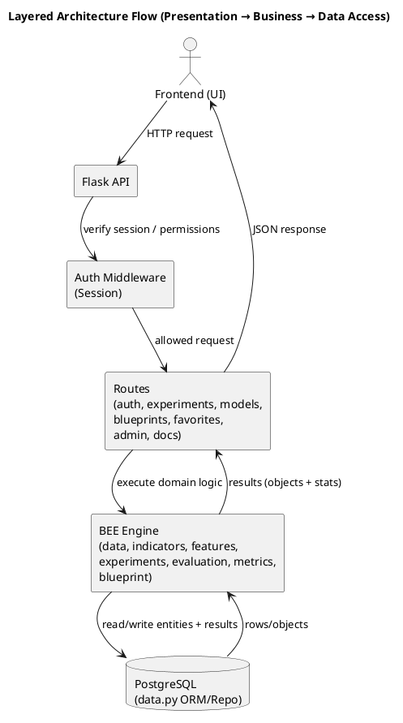
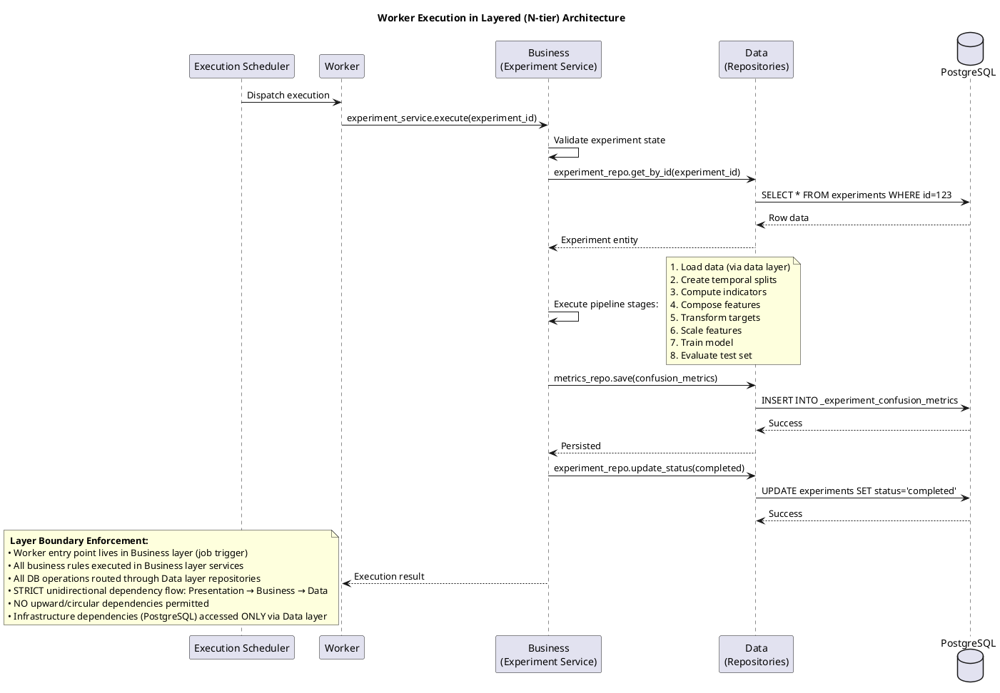
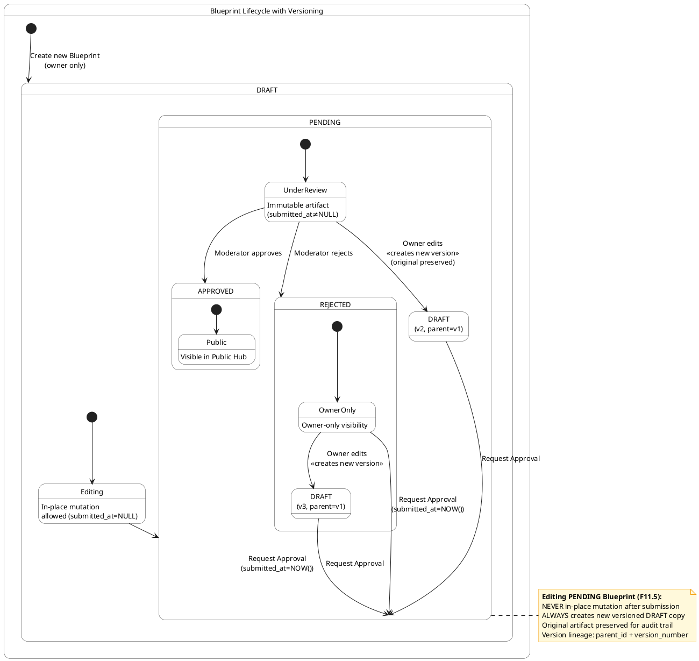
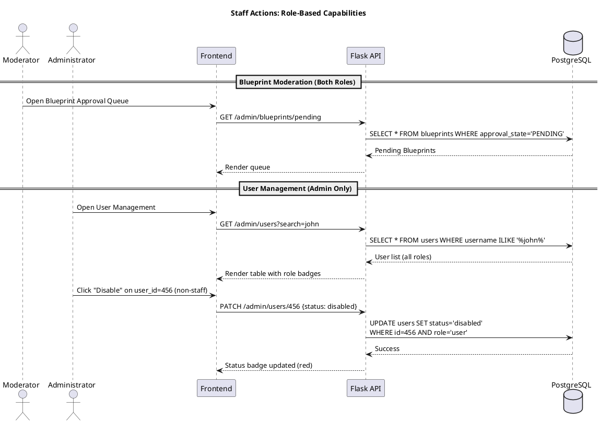
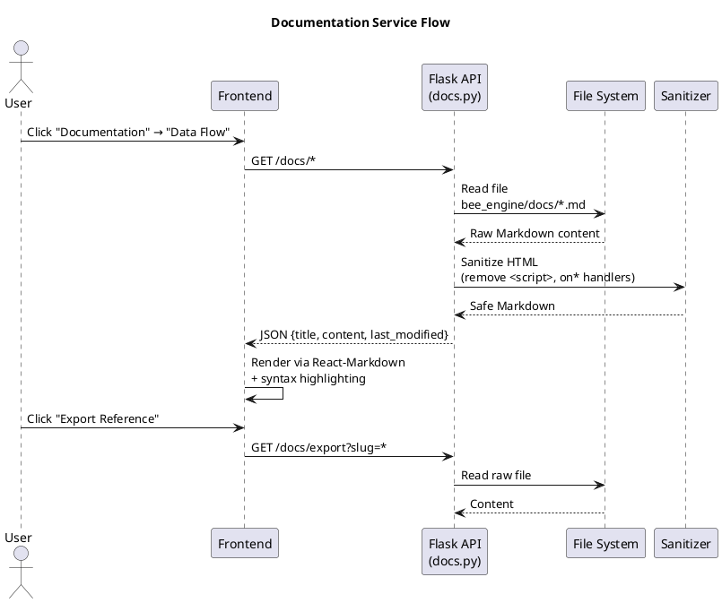
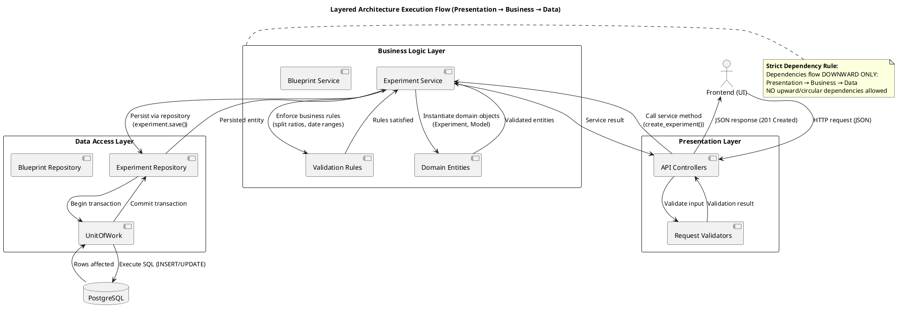
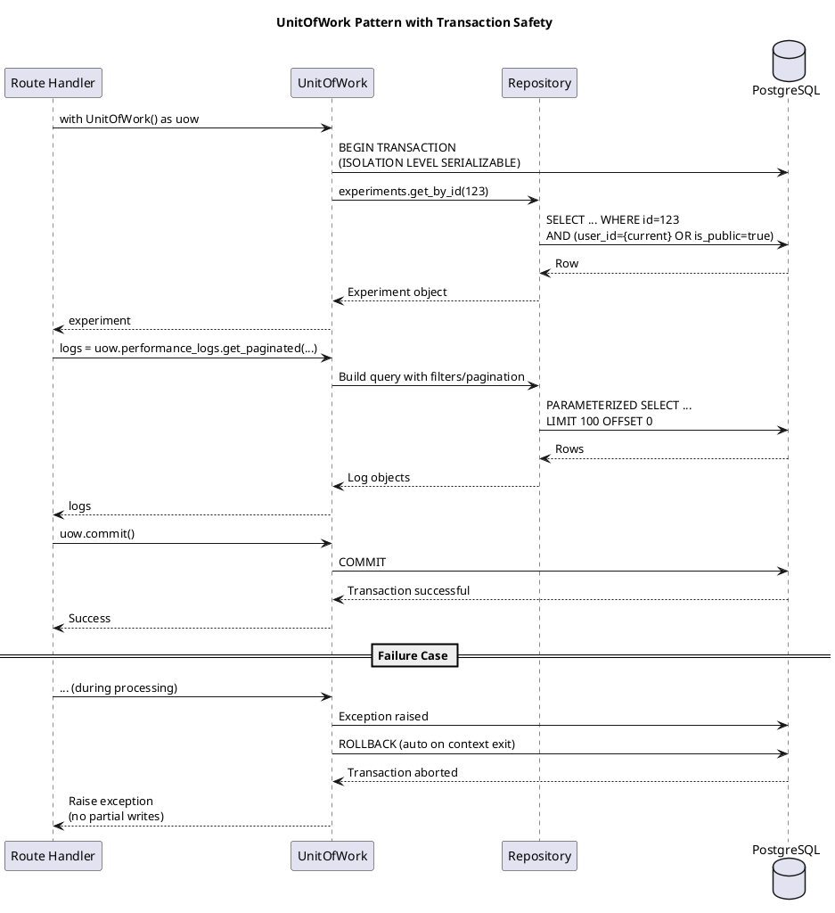

[Copy](https://file+.vscode-resource.vscode-cdn.net/run/media/SSD/MMU%20Stuff/FYP/Loob_Web/se_docs/# "#")

# Bitcoin Experimental Engine (BEE): A Bitcoin-Pair Experimental Framework inspired by Vaquum Limen

## Chapter 0: Project Brainstorm

<-------------------IMPORTANT------------------->
NOTE:
This chapter is only for referencing, it is NOT part of the main FYP chapters.
This chapter is an overall idea that could leads to the end outcome of the FYP report.
None of the chapter form Chapter 1 to Chapter 7 should reference this chapter
Everything in this chapter is a brainstorm, do not leak them to the main chapters in the FYP report
This chapter does not belongs to the FYP report
NO referencing at all between this chapter and chapter1-7
Every technology like Flask and background job tooling shall not be introduced anywhere until chapter 5 when we talk about architecture.

### 0.1 Description

I am working on FYP, focusing on developing a Bitcoin Experimental Engine (BEE) framework for Bitcoin-pair quantitative research with strict parametric control and closed-loop feedback, heavily inspired by Vaquum Limen (https://github.com/Vaquum/Limen). The system is to be implemented using a Layered (N-tier) Architecture (Presentation → Business → Data Access) with a Flask REST API backend and a separate Next.js frontend to maintain clear separation of concerns while minimizing abstraction overhead for this application scope.

Components in Vaquum Limen (Open Sourced):
- UEL (https://github.com/Vaquum/Limen/blob/main/docs/Universal-Experiment-Loop.md#universal-experiment-loop)
- Universal Experiment Loop (UEL) is an integral part of Loop, and takes as its input data and a Single File Decoder (SFD). UEL currently wraps onto itself (i.e. the object uel.run yields) all the folds from Data to Evaluation. In other words, all the following folds are wrapped into one workflow uel.run
- Historical Data (https://github.com/Vaquum/Limen/blob/main/docs/Historical-Data.md)
  - The endpoints available through limen.HistoricalData provide rich and somewhat immediate access to Binance spot and futures data from year 2019 onwards, both kline and trade level data. Kline data is available at 1 minute resolution for both spot and futures, and trade data is available at order and trade level.
  - In BEE v0.2.1 scope, the system standardizes on Binance BTCUSDT spot data and continuously updates the local database at a fixed 1-minute interval.


What BEE has (inspired from Vaquum Limen):
- OOAD concepts applied
- Web UI
- User accounts + role-based access control (Guest/Normal users/Moderator/Admin)
- Landing Page
- Login/Register Page
- Dashboard (show BTCUSDT Spot market TradingView, show stats, recent experiments)
- Experiment Records
- Models Rankings
  - Show top models, can add to favourite
  - Have a new Experiment on top right corner
- New Experiment (equivalent to Experiment + Manifest)
  - Basic Setup
    - Experiment name
    - Description
    - Interval
  - Dataset
    - Start date, end date
    - Data Split (Train/Validation/Test)
  - Select Blueprint
    - Choose from literature Blueprint or custom Blueprint
  - Review
  - Start execution
- New Blueprint
  - Basic
    - Name
    - Description
    - Category (User: Custom, Admin: Literature)
  - Indicators & Features
    - input parameter sets
  - Reference Architecture (from backend Python files)
    - input parameter sets
  - Review
- Public Hub (Browse users, models, experiments, and Blueprint)
- Documentation
- Under My profile icon
  - Profile
  - My Experiments
  - Model Library (Owned, Favourite)
  - Blueprint Library (Owned, Favourite)
- Admin panel, moderator panel

NOTE:
- NEVER say BEE is a platform
- NEVER say BEE is production ready
- BEE is a framework

### 0.2 Proposed Application Flow:

#### 0.2.1 Frontend (WebUI, Nextjs, ShadCN):

**NOTES:**

- **Models Library**: Dedicated interface showing model artifacts (from completed experiments) with tabs for "Owned" and "Favorited" views. Favorited tab shows ONLY models with target_type = MODEL. Users can remove items from favorites using trash icon.
- **Blueprints Library**: Dedicated interface showing Blueprints definitions with tabs for "Owned" and "Favorited" views. Favorited tab shows ONLY Blueprints with target_type = Blueprint. Users can remove items from favorites using trash icon.
- **Public Hub Blueprints tab** shows ONLY APPROVED Blueprints (not user favorites)
- **All successful experiments are publicly visible by default** to authenticated users (no additional visibility flags required)
- **Terminology scope:** References to SFD describe pre-0.2 Vaquum Limen concepts; from BEE v0.2 onward, user-defined pipeline artifacts are called Blueprints.

**<----- Global Navigation ----->**

- I see a top navbar on authenticated pages
- I see navbar links: Dashboard, Models Rankings, Experiments, Public Hub, Documentation
- I see Admin/Moderator link only if the signed-in user is staff (role = moderator/admin)
- **Moderators** see Moderator Tools: Add Normal Users, Blueprint Moderation (approve/reject), Enable/Disable Users (non-staff only)
- **Admins** see Admin Tools: User Management (full CRUD), System Limits & Execution Monitoring (execution concurrency settings + job status monitoring), plus full Blueprint Moderation capabilities
- Clicking Dashboard leads to the dashboard page
- Clicking Models Rankings leads to the model rankings page (sorted by Sharpe ratio by default)
- Clicking Experiments leads to the experiments list
- Clicking Public Hub leads to public discovery interface
- Clicking Documentation leads to the docs list
- I see a profile icon on the navbar
- Clicking the profile icon opens a menu with: Profile, My Experiments, Models Library, Blueprints Library, Logout
- Clicking Profile leads to the profile page showing user status (enabled/disabled badge)
- Clicking My Experiments leads to the experiments page
- Clicking Models Library leads to Models Library page (shows user's owned models + favorited models)
- Clicking Blueprints Library leads to Blueprints Library page (shows user's owned Blueprints + favorited Blueprints)
- Clicking Logout signs out and returns to the login page (destroys server-side session)

**<----- Landing page ----->**

- I see a Login button (leads to login page)
- I see a Get Started button (leads to register page)
- **If I am not authenticated, I can only access the Landing page**
- System displays value proposition with Bitcoin-pair research focus using continuously updated BTCUSDT spot data

**<----- Register page ----->**

- I see Name, Username, Email, Password, and Confirm Password fields
- **Username validation rules (F1.11-F1.13):**
  - Normalized automatically (trimmed + lowercased) before validation
  - Must be 6-12 characters inclusive
  - Lowercase alphanumeric characters only (a-z, 0-9)
  - Must be unique across system
- If username already exists, I see validation error "Username unavailable" and cannot proceed
- If passwords do not match, I see validation error "Passwords do not match"
- Password strength validation enforced server-side
- Clicking Create Account creates account with role="user", status="enabled"
- Password hashed using bcrypt before database insertion
- After successful registration, server creates session in server-side store and sets HttpOnly, Secure, SameSite=Strict cookie
- I am redirected to the dashboard
- I see a Sign In link (leads to login page)

**<----- Login page ----->**

- I see Email and Password fields
- Clicking Sign In authenticates credentials against bcrypt-hashed password
- Account status checked before authentication (disabled accounts rejected)
- If credentials valid and account enabled, server creates session in server-side store with HttpOnly, Secure, SameSite=Strict cookie
- I am redirected to the dashboard
- If credentials invalid or account disabled, I see specific error message
- I see a "Create one" link (leads to register page)

**<----- Dashboard page ----->**

- I see experiment overview cards: total count, running count, completed count
- I see a quick action button "Start New Experiment" (leads to New Experiment wizard)
- I see a recent experiments list (max 5, ordered by creation date descending)
- Clicking a recent experiment leads to its experiment detail page
- All data retrieved with row-level security enforcement

**<----- Experiments page ----->**

- I see a list of my experiments with status badges (pending/running/completed/failed/cancelled)
- I see filter controls by status (pending, running, completed, failed, cancelled)
- Selecting a filter refreshes the list via API call with status parameter
- Clicking an experiment opens the experiment detail page
- I see a "New Experiment" button (primary action)
- Clicking New Experiment opens the New Experiment wizard (6-step flow)

**<----- New Experiment (Wizard) ----->**

**Step 1 (Basics):** Enter experiment name (required) and description (optional)
**Step 2 (Data):**

- Select interval from discrete set {1m, 5m, 15m, 30m, 1h, 2h, 4h, 1d}
- Select date range (BTCUSDT fixed symbol)
- Data source is the local database continuously updated from Binance BTCUSDT spot at fixed 1-minute ingestion interval
- System validates date range against system limits
  **Step 3 (Splits):**
- Configure train/val/test ratios as percentages
- **Validation enforced (F3.7-F3.9):**
  - Splits must sum to exactly 100%
  - Validation split minimum 10%
  - Test split minimum 10%
- UI prevents submission until constraints satisfied
  **Step 4 (Blueprint):**
- Select pre-defined Blueprints with approval_state = DRAFT (owned), PENDING (owned), or APPROVED (public)
- System validates Blueprint accessibility before proceeding
- Blueprint parameter ranges displayed for reference
  **Step 4.5 (Parameter Overrides):**
- System pre-fills ALL parameter ranges from selected Blueprint
- User may provide overrides for THIS EXPERIMENT RUN ONLY:
  - Narrow ranges (e.g., sma_period: [10,20,50] → [20,50])
  - Fix specific values (e.g., sma_period: 20)
  - Define new valid ranges within BEE Engine API constraints (type, min/max bounds)
- **Critical constraint (F3.12):** Overrides apply ONLY to this experiment run; Blueprint definition remains unchanged in library
- Validation against BEE Engine API parameter constraints (not original Blueprint ranges)
- Override summary displayed before submission
  **Step 5 (Review):**
- Configuration summary with all parameters
- Override summary showing original vs. overridden values
- Data source confirmation (BTCUSDT, interval, date range)
**Step 6 (Start):**
- Submit experiment for asynchronous execution after final validation
- Experiment record created with status="pending" when execution submission succeeds

**<----- Experiment Detail page ----->**

- I see experiment configuration summary (name, description, interval, date range, splits)
- I see Blueprint reference with link to Blueprint detail page
- **Status display:**
  - If pending: submission status indicator + cancel button
  - If running: status indicator + cancel button
  - If completed: aggregated performance metrics across all permutations (Sharpe, accuracy, max drawdown, win rate)
- I see model results table showing one row per parameter permutation variant (F3.14)
- I see download buttons for:
  - Experiment metrics (server-side CSV stream from database)
    - Consists of confusion metrics and test set evaluation metrics
- Clicking download buttons triggers server-side CSV streaming (no stored files)

**<----- Models Rankings page ----->**

- I see models ranked by Sharpe ratio (default sort) from successful experiments only
- Only models with status="completed" AND success=true are listed
- I see sortable columns: Sharpe, max drawdown, win rate, accuracy, owner username
- Clicking a model opens its detail view
- In model detail view:
  - I see complete metrics (Sharpe, accuracy, precision, recall, FPR, AUC, max drawdown, win rate)
  - I see full parameter configuration for that permutation
  - I see training configuration (interval, date range, splits)
  - I can favorite the model (toggles star icon)

**<----- Models Library ----->**

- I see tabs for "Owned" and "Favorited" models
- Switching tabs refreshes view without page reload
- Favorited tab shows filter control to segment by target type (MODEL only per F8.2)
- I can remove models from favorites via trash icon (immediate UI update + API call)
- Clicking any model opens its detail view
- Models Library contains ONLY my owned models + my favorited models (no public models unless favorited)

**<----- Blueprints Library ----->**

- I see combined list of my owned Blueprints and favorited Blueprints with visual badges indicating ownership/approval state
- Clicking a Blueprint opens Blueprint detail view showing:
  - Complete pipeline specification (indicators, features, reference architecture)
  - Parameter ranges for all components
  - Approval status badge (DRAFT/PENDING/APPROVED/REJECTED)
  - Owner information
- **Access rules enforced (F11.11-F11.13):**
  - Owner can view/edit DRAFT/REJECTED Blueprints; view PENDING Blueprints
  - Owner can edit PENDING Blueprints (creates a new DRAFT version while preserving the original PENDING artifact)
  - Staff can view PENDING/APPROVED/REJECTED Blueprints (no edit on non-owned)
  - Public can view APPROVED Blueprints only
- If I own the Blueprint and it's in DRAFT/REJECTED state:
  - I see "Edit Blueprint" button (opens Blueprint wizard in edit mode)
  - I see "Request Approval" button (transitions to PENDING state)
- After requesting approval, staff can view it (no edit) until approved or rejected
- Blueprint approval_state values strictly enforced: DRAFT → PENDING → (APPROVED | REJECTED)

**<----- New Blueprint (Wizard) ----->**

**Step 1 (Basics):** Enter Blueprint name (required) and description (optional), click Next
**Step 2 (Indicators):**

- Select atomic indicators (SMA, RSI, MACD, etc.)
- Define parameter ranges for each (e.g., sma_period: [10, 20, 50])
- Validation against indicator parameter constraints
  **Step 3 (Features):**
- Select compound features (Ichimoku Cloud, ATR-SMA, etc.)
- Define parameter ranges for each component (e.g., tenkan_period: [9, 18, 27])
- Validation against feature parameter constraints
  **Step 4 (Reference Model):**
- Select reference architecture (e.g., Logistic Regression Binary)
- Define hyperparameter ranges (e.g., C: [0.1, 1.0, 10.0])
- Validation against architecture parameter constraints
  **Step 5 (Review):**
- Complete pipeline specification preview
- Parameter range summary
- Click "Create" (new Blueprint) or "Update" (existing Blueprint)
- After creation/update, redirected to Blueprint detail page with status=DRAFT

**<----- Blueprint Detail page ----->**

- I see complete pipeline specification including all parameter ranges that will generate exhaustive combinatorial permutations during experiment execution (F3.13)
- I see approval status badge with contextual actions:
  - DRAFT (owned): Edit button, Request Approval button
  - PENDING (owned): View-only (editing transitions to DRAFT), cannot request approval again
  - PENDING (staff): Approve/Reject buttons
  - APPROVED: Visible in Public Hub (no disapproval for simplicity)
  - REJECTED (owned): Edit button (creates new DRAFT version), Request Approval button
- If approved, Blueprint is visible in Public Hub Blueprints tab
- Version lineage displayed (parent Blueprint references for edited versions)

**<----- Public Hub ----->**

- **Access constraint (F13.2):** Only accessible to authenticated users (no anonymous access)
- I see four tabs: Users, Experiments, Models, Blueprints
- **Users tab (F13.3):** Shows enabled users only (status="enabled"); disabled users hidden
- **Experiments tab (F13.4):** Shows successful experiments only (status="completed" AND success=true)
- **Models tab (F13.5):** Shows models from successful experiments only
- **Blueprints tab (F13.6):** Shows APPROVED Blueprints only (approval_state="APPROVED")
- All tabs provide:
  - Search by username functionality
  - Filter by owner username dropdown
  - Click actions to navigate to detail views
- I can favorite models and Blueprints directly from Public Hub views
- Row-level security enforced on all queries (F13.1): WHERE clauses include (owner_id={current_user} OR is_public=true) patterns

**<----- User Profile ----->**

- I see user profile details (name, username, join date)
- I see user status label badge (enabled=green, disabled=red)
- I see successful experiments count and list (status="completed" AND success=true only)
- I see models count from successful experiments
- I see approved Blueprints count and list (approval_state="APPROVED" only)
- Clicking any item opens its detail page
- Profile hidden for disabled users (F13.3)

**<----- Admin Panel ----->**

- Accessible only to users with role="admin" or role="moderator" (role-based access control enforced)
- **Moderator view:**
  - Blueprint Approval tab (PENDING Blueprints only)
  - Add Normal User form
  - User Management table (non-staff users only) with enable/disable toggles
- **Admin view (all moderator capabilities plus):**
  - Full User Management table (all roles) with:
    - Search by username/email
    - Create users (any role)
    - Edit usernames
    - Reset passwords
    - Change roles (user↔moderator↔admin)
    - Remove users permanently
    - Enable/disable any account
  - System Limits tab showing:
    - Database connectivity status indicator
    - Current concurrency limits (experiment jobs)
    - Controls to adjust concurrency limits (admin only)

**<----- Documentation ----->**

- I see a list of documentation entries (scanned from bee_engine/docs/ directory)
- Clicking an entry opens Markdown viewer with sanitized content (HTML/script tags removed)
- I can view data-flow reference document (dynamically generated from BEE Engine module annotations)
- Content served as JSON {title, content, last_modified} for frontend rendering


#### 0.2.2 Backend (BEE Engine, Flask API, PostgreSQL):

**BEE Engine API Structure:**

```
bee_engine/
├── docs/                          # Reference architecture specifications (.md)
├── data/
│   └── historical_data.py         # Market data ingestion (Binance), Polars LazyFrame pipeline
├── indicators/                    # Atomic indicators (SMA, RSI, MACD) - immutable LazyFrame ops
├── features/                      # Compound features (Ichimoku, ATR-SMA) - indicator compositions
├── evaluation/
│   ├── classification_metrics.py  # Per-permutation classification stats
│   └── financial_metrics.py       # Per-permutation financial metrics
├── metrics/                       # Binary/continuous metric calculators
├── strategy/
│   ├── reference_architecture/    # Model implementations (logreg_binary.py)
│   └── strategy_compiler.py       # Strategy template → executable configuration compiler
└── experiments/
    └── experiment_executor.py     # Immutable pipeline executor (data→split→indicators→features→target→scaling→modeling→evaluation)
```

**Flask API Structure (Layered N-tier Architecture):**

The system implements strict N-tier architecture with unidirectional dependencies flowing downward only (Presentation → Business → Data Access).

```
Layered Architecture Implementation:
presentation/    # Presentation Layer (HTTP interface)
├── controllers/      # Request handlers (Flask routes with validation)
│   ├── auth_controller.py
│   ├── experiments_controller.py
│   └── ...
└── api/              # REST API endpoints
    └── endpoints.py

business/        # Business Logic Layer (domain rules & orchestration)
├── services/         # Application services (workflow coordination)
│   ├── experiment_service.py
│   ├── blueprint_service.py
│   └── evaluation_service.py
├── validators/       # Business rule enforcement
│   ├── experiment_validator.py
│   └── ...
└── models/           # Domain entities (pure business objects)
    ├── user.py
    ├── experiment.py
    └── ...

data/            # Data Access Layer (persistence abstraction)
├── repositories/     # Data access objects (CRUD operations)
│   ├── user_repository.py
│   ├── experiment_repository.py
│   ├── blueprint_repository.py
│   └── ...
├── orm/              # SQLAlchemy mappings
│   ├── models.py     # Declarative models
│   └── mappings.py
└── migrations/       # Database schema migrations
```

Note: While repository pattern is used within the Data Access Layer for persistence abstraction, this implementation follows strict Layered (N-tier) architecture—not Hexagonal/Ports & Adapters. Dependencies flow unidirectionally downward (Presentation → Business → Data) with no inversion of control at the domain core. Repositories are infrastructure components owned by the Data layer, not ports defined by the Business layer.

#### 0.2.3 Backend Flow

**<----- End-to-end system overview ----->**



<----- Authentication Flow with Server-Side Sessions (N3.5-N3.7) ----->

- Registration payload validated against strict constraints (6-12 char lowercase alphanum username, password strength)
- Password hashed with bcrypt before PostgreSQL insertion
- Session created in server-side store containing {user_id, role, created_at}
- Session identifier stored in HttpOnly, Secure, SameSite=Strict cookie
- **Session persistence:** Sessions expire after 24 hours of inactivity
- Login validates credentials against bcrypt hash + checks account status=enabled
- Middleware validates session on every protected request:
  1. Extract session_id from cookie
  2. Lookup in session store
  3. Verify user exists AND status=enabled
  4. Attach user context to request object
- Logout destroys session data + clears cookie (max-age=0)

**<----- Experiment Lifecycle with Task Queue ----->**

1. POST `/api/experiments` validates full configuration:
   - Date ranges within system limits
   - Train/val/test splits sum to 100% with min 10% for val/test
   - Blueprint accessibility (owner's DRAFT/PENDING or APPROVED)
   - Parameter overrides satisfy BEE Engine API constraints
2. Experiment record created in DB with status="pending"
3. Execution request dispatched for asynchronous processing
4. Worker executes `experiment_executor.execute(experiment_id)` enforcing strict sequence:
   ```
   data loading → temporal splitting → indicator computation (per-split) → 
   feature composition (per-split) → target transformation (train-fit → val/test-apply) → 
   feature scaling (train-derived params) → model training → test set evaluation
   ```
5. **Permutation generation (F3.13):** Exhaustive combinatorial expansion of all parameter ranges
6. **One model per permutation (F3.14):** Exactly one trained model artifact generated per parameter combination
7. Metrics logged to dedicated tables:
   - `_experiment_confusion_metrics` (classification stats per split)
   - `_experiment_evaluation_results` (Sharpe, drawdown, win rate per split)
8. On completion: status="completed", artifacts persisted
9. **Cancellation support (F9.9-F9.10):**
   - Pending requests: removed from the execution scheduler
   - Running jobs: termination signal sent to worker; running experiment wraps DB writes in transactions and cancellation triggers ROLLBACK to avoid partial artifacts

**<----- Worker Process Architecture ----->**

**Worker Features**:

* Separate process from Flask API (non-blocking)
* Multiple worker instances for horizontal scaling
* Graceful shutdown handling
* Error logging with stack traces
* Resource monitoring (CPU, memory)
* Health check endpoints for monitoring



**<----- Blueprint Governance Flow (blueprints.py) ----->**

- POST `/api/blueprints` → creates record with `approval_state="DRAFT"`, `owner_id=current_user`
- PUT `/api/blueprints/{id}` allowed ONLY IF:
  - User is owner AND
  - Blueprint state = DRAFT/REJECTED OR (PENDING/APPROVED with auto-transition to DRAFT per F11.5)
- POST `/api/blueprints/{id}/request-approval`:
  - Transitions state DRAFT/REJECTED → PENDING only
  - Sets `submitted_at=NOW()`
  - Triggers moderator notification
  - Freezes public visibility until resolution
- Staff actions (moderator/admin):
  - `POST /admin/blueprints/{id}/approve` → APPROVED (visible in Public Hub)
  - `POST /admin/blueprints/{id}/reject` → REJECTED (owner-only visibility)
- **Access control enforced at query level:**
  ```sql
  -- Blueprint visibility query pattern
  SELECT * FROM blueprints 
  WHERE (owner_id = {user_id})  -- Owner sees all states
     OR (approval_state = 'APPROVED')  -- Public sees APPROVED only
     OR (role IN ('moderator','admin') AND approval_state IN ('PENDING','APPROVED','REJECTED'))  -- Staff sees moderation queue
  ```


database PostgreSQL as DB

**<----- Public Hub & Visibility Rules (models.py, blueprints.py, experiments.py) ----->**

All public endpoints enforce:

- Authentication required (no anonymous access)
- Experiments: `WHERE status='completed' AND success=true`
- Models: Derived from public-successful experiments only
- Blueprints: `WHERE approval_state='APPROVED'`
- Users: `WHERE status='enabled'`
- **Critical design point (F13.1):** All successful experiments visible by default to authenticated users—NO additional visibility flags required. Row-level security implemented via JOIN conditions and WHERE clauses only.

**<----- Admin/Moderation Flow ----->**

User Management:

- *Administrator*: Full CRUD on all users (roles: user/moderator/admin), password reset, role changes
- *Moderator*: Create Normal users ONLY; enable/disable **non-staff** accounts (user role) ONLY
**Blueprint Governance**:
- GET `/admin/blueprints/pending` → All `approval_state="PENDING"` (accessible to Moderators/Admins)
- Approval/rejection updates state **System Dashboard**:
- Execution status summary
- DB health check (timeout-bounded SELECT)
- Concurrency settings (Admin-only PATCH)



**<----- Documentation Service (docs.py) ----->**

GET `/api/docs` scans `bee_engine/docs/` directory for `.md` files
Returns metadata: Data-flow reference document dynamically generated from BEE Engine module annotations



**<----- Layered (N-tier) Architecture Implementation ----->**

The system implements strict N-tier architecture with unidirectional dependencies flowing downward only (Presentation → Business → Data Access). All infrastructure dependencies (PostgreSQL, Binance API) are accessed exclusively through the Data Access Layer.



**<----- Database Interaction Pattern (Layered Repository) ----->**
All routes use repository pattern with explicit transaction boundaries in the Data Access Layer:

```python
with Session() as session:  # SQLAlchemy session from Data Layer
    experiment_repo = ExperimentRepository(session)
    experiment = experiment_repo.get_by_id(exp_id)  
    if not experiment.can_view(current_user):  
        raise PermissionDenied  
    logs = experiment_repo.get_paginated_logs(  
        experiment_id=exp_id,  
        page=page,  
        filters=user_filters  
    )  
    session.commit()  # Transaction managed within Data Layer
```

- Connection pooling via SQLAlchemy
- Read replicas used for Public Hub queries
- Critical writes (experiment creation, Blueprint approval) use transaction isolation level=SERIALIZABLE



#### 0.2.4 BEE Engine API

- Strategy: LONG-ONLY, SINGLE-POSITION AT A TIME
- Indicators: Implemented refering TA-Lib library, but in pure polars to avoid conversions.

**<----- Historical Data Pipeline (data/historical_data.py) ----->**

I load market data via `HistoricalData` endpoints returning Polars DataFrames with enriched OHLCV structure
I provide endpoint:

- `get_spot_klines()`: Time-series klines at 1-minute resolution with computed statistics (`mean`, `std`, `median`, `iqr`)
- `_get_data_for_test()`: Internal test endpoint loading pre-downloaded CSV samples (no network calls)
  I source all production data from Binance Market Data (2019+), caching to PostgreSQL on first fetch with composite indexing on `(symbol, interval, timestamp)`
  I maintain performance by preserving Polars LazyFrame format throughout pipeline—conversion to pandas incurs significant overhead especially for second-resolution data

**<----- Indicator Computation (indicators/*.py) ----->**

I provide atomic, single-purpose technical indicators operating on price/volume series:

- `sma.py`: Simple moving average with configurable period
- `ema.py`: Exponential moving average with span parameter
- `rsi.py`, `macd.py`, `atr.py`, `stochastic_oscillator.py`, `bollinger_bands.py` with strict parameter validation
  I enforce immutability: all functions accept `pl.LazyFrame` and return new `pl.LazyFrame` with added columns (never modify inputs)
  I support parameterized execution where manifest supplies values via permutation rounds (`period='roc_period'` → `period=12`)
  I guarantee deterministic output: identical inputs + parameters produce bit-for-bit identical results

**<----- Features Computation (features/*.py) ----->**

I define features as *compound indicators*—combinations of multiple atomic indicators forming higher-order signals:

- `atr_sma.py`: ATR computed using SMA smoothing (vs. Wilder's method) combining true range + moving average
- `ichimoku_cloud.py`: Multi-component trend system combining `tenkan`, `kijun`, `senkou_a`, `senkou_b` spans
- `breakout_features.py`: Comprehensive breakout detection combining price extremes, momentum, and volume regime signals
- `conserved_flux_renormalization.py`: Multi-scale liquidity fingerprinting combining trade flow entropy across 6 nested scales
  I maintain strict separation: indicators = atomic computations; features = composable indicator combinations

**<----- Experiment Manifest (experiments/manifest.py) ----->**

I define declarative experiment configuration through fluent API enforcing universal split-first architecture:

```python
Manifest()  
  .set_data_source(HistoricalData.get_spot_klines,  
                   params={'kline_size': 3600, 'start_date_limit': '2025-01-01'})  
  .set_split_config(7, 1, 2)  # train/val/test ratios (70/10/20)  
  .add_indicator(roc, period='roc_period')          # Atomic indicator  
  .add_indicator(wilder_rsi, period='rsi_period')  
  .add_feature(ichimoku_cloud,                      # Compound feature (multi-indicator)  
               tenkan_period='tenkan_period',  
               kijun_period='kijun_period')  
  .add_feature(close_position)                      # Standalone feature  
  .with_target('quantile_flag')  
    .add_fitted_transform(quantile_flag)  
      .fit_param('_cutoff', compute_quantile_cutoff, col='roc_{roc_period}', q='q')  
      .with_params(col='roc_{roc_period}', cutoff='_cutoff')  
    .add_transform(shift_column_transform, shift='shift', column='target_column')  
    .done()  
  .set_scaler(LogRegScaler)  
  .with_model(logreg_binary)  
```

I enforce strict pipeline ordering: raw data → split → per-split indicator computation → feature composition → target transformation → scaling → modeling
I auto-resolve parameter permutations from Blueprint definition and inject values via signature inspection
I generate environment-aware execution: `BEE_ENV='test'` triggers `_get_data_for_test()`, production uses live Binance sources
I validate all configurations against business rules before execution (date ranges, split ratios, parameter constraints)

**<----- Experiment Execution Pipeline (experiments/experiment_executor.py) ----->**

I orchestrate end-to-end execution via stateless `execute(experiment_id: int)` functionI initialize execution context with fixed random seeds (NumPy, Python stdlib) for reproducibilityI execute pipeline stages with stage tracking:

1. Load manifest + resolve parameter permutation
2. Fetch data via configured source (cache-aware)
3. Create temporal splits (train/val/test) preserving chronological order
4. Compute indicators *per split*
5. Compose features from indicator outputs *per split*
6. Transform targets with fitted parameters (train-only fitting → val/test application)
7. Scale features using training-derived parameters
8. Train model → validate → test → compute metrics
I log stage updates to the database at fixed intervals: `{stage: "feature_composition"}`
   I log granular artifacts to dedicated PostgreSQL tables:

- `_experiment_confusion_metrics`: aggregated classification statistics
- `_experiment_evaluation_results`: Sharpe, max drawdown, win rate from test set evaluation

**<----- Blueprint Compiler & Registry (blueprint/compiler.py, registry.py) ----->**

I transform Blueprint JSON definition (stored in PostgreSQL) directly into executable training pipeline without registry indirection. Reference architectures live in backend Python files under `blueprint/reference_architecture/*.py`.

```python
def execute(experiment_id: int):
    # Stage 1: Data loading (cache-aware Binance fetch)
    data = load_historical_data(config.interval, config.start_date, config.end_date)
  
    # Stage 2: Temporal splitting (chronological order preserved)
    train, val, test = temporal_split(data, config.splits)
  
    # Stage 3: Indicator computation (per-split, immutable LazyFrame operations)
    train_ind = compute_indicators(train, blueprint.indicators)
    val_ind = compute_indicators(val, blueprint.indicators)
    test_ind = compute_indicators(test, blueprint.indicators)
  
    # Stage 4: Feature composition (compound indicators from atomic outputs)
    train_feat = compose_features(train_ind, blueprint.features)
    val_feat = compose_features(val_ind, blueprint.features)
    test_feat = compose_features(test_ind, blueprint.features)
  
    # Stage 5: Target transformation (train-only fitting → val/test application)
    target_transformer = fit_target_transformer(train_feat, blueprint.target)
    train_target = target_transformer.transform(train_feat)
    val_target = target_transformer.transform(val_feat)
    test_target = target_transformer.transform(test_feat)
  
    # Stage 6: Feature scaling (training-derived parameters only)
    scaler = fit_scaler(train_feat)
    train_scaled = scaler.transform(train_feat)
    val_scaled = scaler.transform(val_feat)
    test_scaled = scaler.transform(test_feat)
  
    # Stage 7: Model training → validation → testing
    model = train_model(train_scaled, train_target, blueprint.architecture)
    val_metrics = evaluate(model, val_scaled, val_target)
    test_metrics = evaluate(model, test_scaled, test_target)
  
    # Stage 8: Test set evaluation computing financial metrics
    evaluation_results = evaluate_financial_metrics(
        model, test_scaled, test_target,
        enforce_long_only=True,        # REJECTS short signals entirely
        enforce_single_position=True   # Rejects new long signals while position active
    )
  
    # Log all artifacts to dedicated PostgreSQL tables
    log_to_experiment_confusion_metrics()
    log_to_experiment_evaluation_results()
```

I validate Blueprint integrity during compilation:

* Parameter names/types match reference architecture expectations
* Required fields (architecture, target_type, params) present
* Feature/indicator references resolve to existing BEE Engine modules
  I enforce approval workflow states: DRAFT → PENDING (owner request) → APPROVED/REJECTED (moderator action)
  I serialize trained model artifacts (weights + preprocessing state) for snapshot storage as compressed binary blobs

**<----- Reference Architectures (blueprint/reference_architecture/*.py) ----->**

<----- Reference Architectures (blueprint/reference_architecture/*.py) ----->
I provide self-contained model implementations with explicit parameter contracts:
logreg_binary.py: Logistic regression for up/down classification with probability calibration
Parameters: C (regularization strength), max_iter (convergence iterations)
Input: Feature matrix X (samples × features), binary target y
Output: Probability predictions + decision function scores
**NOTE: Model outputs binary signals (0=flat, 1=long) for LONG-ONLY strategies only**
Future extensions planned: xgboost_regressor.py, ridge_classifier.py
I enforce strict interface contracts: all architectures implement fit(X_train, y_train) and predict_proba(X) methods
**All models produce LONG-ONLY signals (no short positions)**

**<----- Metrics Computation (metrics/*.py) ----->**

`binary_metrics.py`: Computes classification metrics from predictions/probabilities:

```python
binary_metrics(data, preds, probs) → {  
  'recall': 0.721, 'precision': 0.684, 'fpr': 0.215,  
  'auc': 0.792, 'accuracy': 0.703  
}  
```

`continuous_metrics.py`: Computes regression/financial metrics:

```python
continuous_metrics(data, preds) → {  
  'bias': -0.002, 'mae': 0.018, 'rmse': 0.024,  
  'r2': 0.612, 'mape': 1.843  
}  
```

I validate metric inputs (e.g., reject Sharpe calculation with zero volatility)
I guarantee `_preds` key presence in returned dicts for Experiment Execution Pipeline evaluation integration

#### 0.2.5 Tools will be Using

Frontend:

* Next.js 15 (React framework with server-side rendering)
* Shadcn/ui (composable component library)
- (If needed) lightweight charting for metrics tables
* TradingView Lightweight Charts (BTCUSDT price visualization)

Backend - Layered (N-tier) Architecture:

* Flask (Presentation Layer - REST API controllers & views)
* Python 3.11+ (Business Logic Layer - domain services, validators, entities)
* SQLAlchemy (Data Access Layer - ORM mappings & repository patterns)
* Infrastructure Dependencies:
* Flask-Login (Session management middleware)
* Flask-WTF (CSRF protection middleware)
* Background worker runner
* Session store (server-managed)
* Binance Connector (External market data service)
