## Chapter 4: Analysis

### 4.1 Overview

This Chapter translates the requirements defined in Chapter 3 into concrete behavioral and structural models. It captures system interactions through use cases and sequence diagrams, traces workflow progression via activity diagrams, and maps state transitions for key entities like experiments and Blueprints. The analysis establishes foundational object relationships through class diagrams and a normalized ERD, defines precise data attributes in a dictionary, and sketches core interface layouts. All models remain grounded in observable requirements without introducing architectural optimizations or design patterns.

### 4.2 Use Case Analysis

#### 4.2.1 Use Case Diagram

This section models system functionality through actor-goal interactions derived directly from Chapter 3 requirements. The diagram identifies four actor roles with hierarchical privileges and captures primary user goals without introducing architectural abstractions. Relationships reflect shared authentication flows and conditional extensions like parameter overrides during experiment configuration.

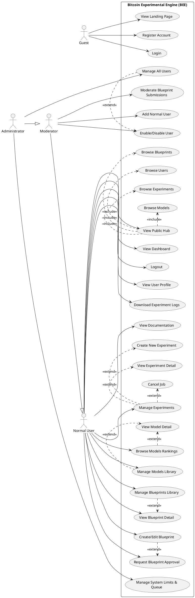
```plantuml
@startuml
left to right direction
skinparam packageStyle rectangle
skinparam wrapWidth 200

actor Guest
actor "Normal User" as User
actor Moderator
actor Administrator as Admin

rectangle "Bitcoin Experimental Engine (BEE)" {

  ' ===== GUEST USE CASES =====
  (View Landing Page)
  (Register Account)
  (Login)

  ' ===== AUTHENTICATED USER USE CASES =====
  (View Dashboard)
  (Logout)
  (View User Profile)
  
  ' ===== EXPERIMENT WORKFLOW =====
  (Manage Experiments)
  (Create New Experiment)
  (View Experiment Detail)
  (Cancel Job)
  
  ' ===== MODEL DISCOVERY =====
  (Browse Models Rankings)
  (View Model Detail)
  (Manage Models Library)
  
  ' ===== BLUEPRINT WORKFLOW =====
  (Manage Blueprints Library) 
  (Create/Edit Blueprint)
  (Request Blueprint Approval)
  (View Blueprint Detail)
  
  ' ===== ANALYSIS & DISCOVERY =====
  (Download Experiment Logs)
  (View Public Hub)
  (Browse Users)
  (Browse Experiments)
  (Browse Models)
  (Browse Blueprints)
  (View Documentation)
  
  ' ===== MODERATOR USE CASES =====
  (Moderate Blueprint Submissions)
  (Add Normal User)
  (Enable/Disable User)
  
  ' ===== ADMIN USE CASES =====
  (Manage All Users)
  (Manage System Limits & Queue)

  ' ===== RELATIONSHIPS =====
  ' Experiment workflow extensions
  (Manage Experiments) .> (Create New Experiment) : <<extend>>
  (Manage Experiments) .> (View Experiment Detail) : <<extend>>
  (Manage Experiments) .> (Cancel Job) : <<extend>>
  
  ' Model discovery extensions
  (Browse Models Rankings) .> (View Model Detail) : <<extend>>
  (Manage Models Library) .> (View Model Detail) : <<extend>>
  
  ' Blueprint workflow extensions
  (Manage Blueprints Library) .> (View Blueprint Detail) : <<extend>>
  (Create/Edit Blueprint) .> (Request Blueprint Approval) : <<extend>>
  
  ' Public Hub inclusions
  (View Public Hub) .> (Browse Users) : <<include>>
  (View Public Hub) .> (Browse Experiments) : <<include>>
  (View Public Hub) .> (Browse Models) : <<include>>
  (View Public Hub) .> (Browse Blueprints) : <<include>>
  
  ' User management extensions
  (Manage All Users) .> (Enable/Disable User) : <<extend>>
}

' ===== ACTOR INHERITANCE =====
Moderator --|> User
Admin --|> Moderator

' ===== ACTOR ASSOCIATIONS =====
Guest --> (View Landing Page)
Guest --> (Register Account)
Guest --> (Login)

User --> (View Dashboard)
User --> (Logout)
User --> (View User Profile)
User --> (Manage Experiments)
User --> (Browse Models Rankings)
User --> (Manage Models Library) 
User --> (Manage Blueprints Library) 
User --> (Create/Edit Blueprint)
User --> (Request Blueprint Approval)
User --> (View Blueprint Detail)
User --> (Download Experiment Logs)
User --> (View Public Hub)
User --> (View Documentation)

Moderator --> (Moderate Blueprint Submissions)
Moderator --> (Add Normal User)
Moderator --> (Enable/Disable User)

Admin --> (Manage All Users)
Admin --> (Manage System Limits & Queue)

@enduml
```

#### 4.2.2 Use Case Specification

This section outlines specifications of the use cases that were found in the use case diagram of the BEE system and consequently transforms the high-level actor-goal interactions into concrete and testable behaviour descriptions.

All specifications follow a standard template consisting of Use Case ID, Name, Actors, Preconditions, Postconditions, Main Flow, Exceptions, and Alternatives hence ensuring a comprehensive coverage of the system behaviour without the possibility of introducing design decisions. These requirements are the basis of further dynamic modelling through sequence, activity and state diagrams without sacrificing strict congruence with the functional requirements stated in Chapter 3.

##### 4.2.2.1 Guest Use Case Specifications

**UC001: View Landing Page**

- Use Case ID: UC001
- Name: View Landing Page
- Actors: Guest
- Preconditions: None
- Postconditions: Landing page is displayed with navigation options to authentication flows
- Main Flow:
  1. Guest accesses the application
  2. System displays the landing page containing:
     - Platform overview and value proposition
     - Login button
     - Get Started button
  3. System restricts access to internal pages for unauthenticated users
- Exceptions: None
- Alternatives: None

**UC002: Register Account**

- Use Case ID: UC002
- Name: Register Account
- Actors: Guest
- Preconditions: Guests are on the registration page and not authenticated
- Postconditions: New user account is created and user is authenticated
- Main Flow:
  1. Guest submits registration form with name, username, email, password, and password confirmation
  2. System validates input data against format and uniqueness constraints
  3. System creates user account with default role and status
  4. System hashes password using a secure one-way algorithm
  5. System creates a server-managed session containing user identity and role
  6. System sets session identifier in a secure, server-managed session cookie
  7. System redirects user to dashboard
- Exceptions:
  - E1: Username already exists. Display validation error
  - E2: Password mismatch. Display validation error
  - E3: Invalid format. Highlight field errors
- Alternatives:
  - A1: Click Sign In link. Navigate to login page

**UC003: Login**

- Use Case ID: UC003
- Name: Login
- Actors: Guest
- Preconditions: Guest is on the login page and not authenticated
- Postconditions: User is authenticated and session is established
- Main Flow:
  1. Guest submits email and password credentials
  2. System verifies account existence and status
  3. System validates credentials against hashed password
  4. System creates a server-managed session containing user identity and role
  5. System sets session identifier in a secure, server-managed session cookie
  6. System redirects user to dashboard
- Exceptions:
  - E1: Invalid credentials. Display authentication error, do not create session
  - E2: Account disabled. Display account status notification
- Alternatives:
  - A1: Click Create one link. Navigate to registration page

---

##### 4.2.2.2 User Use Case Specifications

**UC004: Logout**

- Use Case ID: UC004
- Name: Logout
- Actors: Authenticated User (Normal User, Moderator, Admin)
- Preconditions: User has an active authenticated session with server-managed session data
- Postconditions: Server-side session data is destroyed and user is redirected to landing page
- Main Flow:
  1. User initiates logout action
  2. Client sends POST request to auth logout endpoint
  3. System reads session identifier from the secure session cookie
  4. System destroys server-side session data
  5. System clears authentication cookie
  6. System returns OK response
  7. System redirects user to landing page
- Exceptions: None
- Alternatives: None

**UC005: View Dashboard**

- Use Case ID: UC005
- Name: View Dashboard
- Actors: Authenticated User
- Preconditions: User is authenticated
- Postconditions: Dashboard with personalized overview and navigation is displayed
- Main Flow:
  1. System loads user-specific dashboard content
  2. System displays:
     - Experiment summary statistics
     - Quick action to create new experiment
     - Recent experiments list
  3. System applies role-based interface rendering
- Exceptions: None
- Alternatives: None

**UC006: Manage Experiments**

- Use Case ID: UC006
- Name: Manage Experiments
- Actors: Authenticated User
- Preconditions: User is authenticated
- Postconditions: Experiment management interface is displayed with user's experiments
- Main Flow:
  1. User accesses experiments management page
  2. System displays list of user's experiments with status indicators
  3. System provides filtering options by experiment status
  4. System provides action to create new experiment
- Exceptions: None
- Alternatives:
  - A1: Apply status filter. Refresh experiment list with filtered results

**UC007: Create New Experiment**

- Use Case ID: UC007
- Name: Create New Experiment
- Actors: Authenticated User
- Preconditions: User is authenticated and has access to experiment creation interface
- Postconditions: New experiment record is created and queued for asynchronous execution
- Main Flow:
  1. User initiates new experiment creation
  2. User completes multi-step wizard:
     - Step 1: Enter experiment name and description
     - Step 2: Select data interval and date range from fixed BTCUSDT dataset
     - Step 3: Configure train, validation, test split ratios
     - Step 4: Select Blueprint (Owned or public approved Blueprints only)
     - Step 4.5: Override Blueprint parameter ranges for THIS experiment run only
       - Narrow existing ranges (for example, sma period from 10,20,50 to 20,50)
       - Fix specific values (for example, sma period equals 20)
       - Define new valid ranges within BEE API constraints
       - Critical constraint: Overrides apply ONLY to this experiment; Blueprint definition remains unchanged
     - Step 5: Review configuration summary including override summary
     - Step 6: Submit experiment
  3. System validates configuration against business rules
  4. System creates experiment record with queued status
  5. System enqueues experiment job to asynchronous task queue
  6. System displays confirmation with queue position
- Exceptions:
  - E1: Invalid configuration. Display validation errors
  - E2: Resource limits exceeded. Display system constraint notification
- Alternatives:
  - A1: Cancel during wizard. Return to experiment management page

**UC008: View Experiment Detail**

- Use Case ID: UC008
- Name: View Experiment Detail
- Actors: Authenticated User
- Preconditions: User is authenticated and has access to the experiment
- Postconditions: Experiment details and results are displayed
- Main Flow:
  1. User selects experiment from list
  2. System displays experiment configuration summary
  3. System displays current execution status and progress
  4. For completed experiments, system displays performance metrics and model results
  5. System provides options to download experiment artifacts
- Exceptions: None
- Alternatives:
  - A1: Download metrics. System provides CSV export of experiment data
  - A2: Download logs. System provides CSV export of experiment logs

**UC009: Browse Models Rankings**

- Use Case ID: UC009
- Name: Browse Models Rankings
- Actors: Authenticated User
- Preconditions: User is authenticated
- Postconditions: Ranked list of models from successful experiments is displayed
- Main Flow:
  1. User accesses models rankings page
  2. System displays models sorted by performance metrics
  3. System provides filtering and sorting options
  4. User can select a model to view detailed information
- Exceptions: None
- Alternatives:
  - A1: Apply filters. System refreshes rankings with filtered results
  - A2: Change sort order. System reorders models by selected metric

**UC010: View Model Detail**

- Use Case ID: UC010
- Name: View Model Detail
- Actors: Authenticated User
- Preconditions: User is authenticated and has access to the model
- Postconditions: Detailed model information and metrics are displayed
- Main Flow:
  1. User selects model from rankings or library
  2. System displays model performance metrics
  3. System displays model parameters and configuration
  4. System provides options to favorite the model
- Exceptions: None
- Alternatives:
  - A1: Favorite model. System adds model to user's favorites
  - A2: Download logs. System provides CSV export of experiment logs

**UC011: Manage Models Library**

- Use Case ID: UC011
- Name: Manage Models Library
- Actors: Authenticated User
- Preconditions: User is authenticated
- Postconditions: Models library interface is displayed with user's owned models and favorited models in separate tabs
  Main Flow:
- User accesses models library page
  1. System displays tabs: "Owned" and "Favorited"
  2. User can switch between tabs to view owned models or favorited models
  3. For "Favorited" tab, system displays only models with target_type = MODEL
  4. User can select a model to view detailed information
  5. User can remove models from favorites via trash icon (immediate UI update + API call)
- Exceptions: None
- Alternatives:
  - A1: Click model from library. Navigate to Model Detail page

**UC012: Manage Blueprints Library**

- Use Case ID: UC012
- Name: Manage Blueprints Library
- Actors: Authenticated User
- Preconditions: User is authenticated
- Postconditions: Blueprint library interface is displayed with user's owned Blueprints and favorited Blueprints in separate tabs
- Main Flow:
  - User accesses Blueprints library page
  - System displays tabs: "Owned" and "Favorited"
  - User can switch between tabs to view owned Blueprints or favorited Blueprints
  - For "Favorited" tab, system displays only Blueprints with target_type = Blueprint
  - User can select a Blueprint to view detailed information
  - For owned Blueprints in DRAFT/REJECTED state, user can edit or request approval
  - User can remove Blueprints from favorites via trash icon (immediate UI update + API call)
- Exceptions: None
- Alternatives:
  - A1: Click Blueprint from library. Navigate to Blueprint Detail page

**UC013: Create/Edit Blueprint**

- Use Case ID: UC013
- Name: Create/Edit Blueprint
- Actors: Authenticated User
- Preconditions: User is authenticated and has access to Blueprint creation/editing interface
- Postconditions: New or updated Blueprint record is saved with appropriate versioning
- Main Flow:
  1. User initiates Blueprint creation or selects owned Blueprint for editing
  2. User completes multi-step wizard:
     - Step 1: Enter Blueprint name and description
     - Step 2: Select atomic indicators and define parameter ranges
     - Step 3: Select compound features and define parameter ranges
     - Step 4: Select reference architecture and define hyperparameter ranges
     - Step 5: Review complete pipeline specification
  3. User submits Blueprint configuration
  4. System validates configuration
  5. IF creating NEW Blueprint OR editing DRAFT Blueprint with submitted at equals NULL (never submitted for approval):
     - System saves updates IN PLACE with status equals DRAFT
       ELSE (editing Blueprint with submitted at NOT NULL, previously submitted and immutable):
     - System creates NEW versioned copy with:
       - Parent reference to original Blueprint
       - Sequential version number increment
       - Status equals DRAFT
       - Original artifact anchoring preserved
  6. System redirects to Blueprint detail page
- Exceptions:
  - E1: Invalid configuration. Display validation errors
- Alternatives:
  - A1: Cancel during wizard. Return to Blueprint library page

**UC014: Request Blueprint Approval**

- Use Case ID: UC014
- Name: Request Blueprint Approval
- Actors: Authenticated User (Non-Admin)
- Preconditions: User owns a Blueprint in DRAFT or REJECTED state
- Postconditions: Blueprint status transitions to PENDING and versioning boundary is established
- Main Flow:
  1. User accesses owned Blueprint detail page
  2. User initiates approval request
  3. System validates Blueprint is in DRAFT or REJECTED state AND submitted at equals NULL
  4. System updates Blueprint status to PENDING
  5. System sets submitted at equals NOW timestamp
  6. System displays updated status
  7. System enforces: All future edits to this Blueprint will create NEW versioned copies (never in place mutation)
- Exceptions: None
- Alternatives: None

**UC015: View Blueprint Detail**

- Use Case ID: UC015
- Name: View Blueprint Detail
- Actors: Authenticated User
- Preconditions: User is authenticated and has access to the Blueprint
- Postconditions: Detailed Blueprint specification and status are displayed
- Main Flow:
  1. User selects Blueprint from library or public hub
  2. System displays complete pipeline specification
  3. System displays current approval status
  4. System displays version lineage information:
     - Version number and sequential identifier
     - Parent Blueprint reference (if applicable)
     - Navigation links to related versions
     - Original artifact anchor indicator
  5. For owned Blueprints, system provides edit and approval request options
  6. For approved Blueprints, system indicates public visibility
- Exceptions: None
- Alternatives: None

**UC016: Download Experiment Logs**

- Use Case ID: UC016
- Name: Download Experiment Logs
- Actors: Authenticated User
- Preconditions: User is authenticated and has access to completed experiment
- Postconditions: CSV log export is initiated for the selected experiment
- Main Flow:
  1. User accesses experiment detail page
  2. User selects a completed experiment
  3. User selects log type to download
  4. System generates a CSV export for the selected log type
  5. Browser downloads the CSV file
- Exceptions:
  - E1: No completed experiments. Display empty state
- Alternatives:
  - A1: Cancel download. Remain on experiment detail view

**UC017: View Public Hub**

- Use Case ID: UC017
- Name: View Public Hub
- Actors: Authenticated User
- Preconditions: User is authenticated
- Postconditions: Public hub interface is displayed with discovery tabs
- Main Flow:
  1. User accesses public hub page
  2. System displays tabbed interface with:
     - Users tab
     - Experiments tab
     - Models tab
     - Blueprints tab
  3. User can switch between tabs to browse public content
  4. System provides search and filter capabilities
- Exceptions: None
- Alternatives:
  - A1: Search by username. System filters results by owner
  - A2: Apply filters. System refreshes content with filtered results

**UC018: Browse Users**

- Use Case ID: UC018
- Name: Browse Users
- Actors: Authenticated User
- Preconditions: User is authenticated and accessing public hub users tab
- Postconditions: List of enabled users is displayed
- Main Flow:
  1. System displays list of enabled user accounts
  2. User can select a user to view profile
  3. System provides search functionality for user discovery
- Exceptions: None
- Alternatives:
  - A1: Search users. System filters user list by search criteria

**UC019: Browse Experiments**

- Use Case ID: UC019
- Name: Browse Experiments
- Actors: Authenticated User
- Preconditions: User is authenticated and accessing public hub experiments tab
- Postconditions: List of successful experiments is displayed
- Main Flow:
  1. System displays list of completed successful experiments
  2. User can select an experiment to view details
  3. System provides filtering options by owner or criteria
- Exceptions: None
- Alternatives:
  - A1: Filter by owner. System displays experiments by selected user

**UC020: Browse Models**

- Use Case ID: UC020
- Name: Browse Models
- Actors: Authenticated User
- Preconditions: User is authenticated and accessing public hub models tab
- Postconditions: List of models from successful experiments is displayed
- Main Flow:
  1. System displays list of models from successful experiments
  2. User can select a model to view details
  3. System provides filtering and sorting options
- Exceptions: None
- Alternatives:
  - A1: Filter models. System refreshes model list with filtered results

**UC021: Browse Blueprints**

- Use Case ID: UC021
- Name: Browse Blueprints
- Actors: Authenticated User
- Preconditions: User is authenticated and accessing public hub Blueprints tab
- Postconditions: List of approved Blueprints is displayed
- Main Flow:
  1. System displays list of approved Blueprints
  2. User can select a Blueprint to view details
  3. System provides filtering options by owner or criteria
- Exceptions: None
- Alternatives:
  - A1: Filter by owner. System displays Blueprints by selected user

**UC022: View Documentation**

- Use Case ID: UC022
- Name: View Documentation
- Actors: Authenticated User
- Preconditions: User is authenticated
- Postconditions: Documentation content is displayed
- Main Flow:
  1. User accesses documentation page
  2. System displays list of documentation entries
  3. User selects documentation entry
  4. System renders documentation content in viewer
- Exceptions: None
- Alternatives: None

**UC023: View User Profile**

- Use Case ID: UC023
- Name: View User Profile
- Actors: Authenticated User
- Preconditions: User is authenticated
- Postconditions: User profile details and activity summary are displayed
- Main Flow:
  1. User accesses profile via navbar dropdown or Public Hub
  2. System verifies target user account is ENABLED (status equals enabled)
  3. System displays profile containing:
     - User details (name, username, join date)
     - Status badge (enabled equals green, disabled equals red)
     - Successful experiments count (status equals completed AND success equals true)
     - Models count from successful experiments
     - Approved Blueprints count and list (approval state equals APPROVED)
  4. User can click any item to navigate to its detail page
- Exceptions: None
- Alternatives: None

**UC024: Cancel Job**

- Use Case ID: UC024
- Name: Cancel Job
- Actors: Authenticated User
- Preconditions: User owns a queued or running experiment job
- Postconditions: Job is terminated and status updated to cancelled
- Main Flow:
  1. User views job detail page (experiment)
  2. System displays cancel button IF status IN (queued, running)
  3. User clicks cancel button
  4. System prompts for confirmation
  5. User confirms cancellation
  6. IF job status equals queued:
     - System removes job from asynchronous job queue
     - System updates record status equals cancelled
       ELSE IF job status equals running:
     - System signals job termination
     - Worker performs graceful cleanup of partial artifacts
     - System updates record status equals cancelled
  7. System displays cancellation confirmation
- Exceptions: None
- Alternatives:
  - A1: Cancel confirmation. Return to detail page without action

---

##### 4.2.2.3 Moderator Use Case Specifications

**UC025: Moderate Blueprint Submissions**

- Use Case ID: UC025
- Name: Moderate Blueprint Submissions
- Actors: Moderator, Administrator
- Preconditions: User is authenticated with moderator or administrator role
- Postconditions: Blueprint approval status is updated
- Main Flow:
  1. Staff member accesses Blueprint moderation interface
  2. System displays queue of pending Blueprint submissions
  3. Staff reviews Blueprint specification
  4. Staff selects approval action (approve or reject)
  5. System updates Blueprint status
- Exceptions:
  - E1: Blueprint not in pending state. Display status error notification
- Alternatives:
  - A1: Disapprove approved Blueprint:
    1. Staff selects disapprove action on APPROVED Blueprint
    2. System transitions Blueprint status to REJECTED
    3. System automatically creates new editable DRAFT version:
       - Inherits parent reference to disapproved Blueprint
       - Preserves original artifact anchoring
       - Sets owner visibility for remediation
    4. System removes original Blueprint from Public Hub visibility

**UC026: Add Normal User**

- Use Case ID: UC026
- Name: Add Normal User
- Actors: Moderator, Administrator
- Preconditions: User is authenticated with moderator or administrator role
- Postconditions: New normal user account is created
- Main Flow:
  1. Staff member accesses user management interface
  2. Staff initiates new user creation
  3. Staff enters user details
  4. System validates input data
  5. System creates user account with normal user role
  6. System displays confirmation
- Exceptions:
  - E1: Invalid input. Display validation errors
  - E2: Username already exists. Display uniqueness error
- Alternatives: None

**UC027: Enable/Disable User**

- Use Case ID: UC027
- Name: Enable/Disable User
- Actors: Moderator, Administrator
- Preconditions: User is authenticated with appropriate role and accessing user management
- Postconditions: User account status is updated
- Main Flow:
  1. Staff member accesses user management interface
  2. Staff selects user account
  3. Staff initiates status change action
  4. System validates staff has permission to modify target user
  5. System updates user account status
- Exceptions: None
- Alternatives:
  - A1: Enable disabled account. System updates status to enabled
  - A2: Disable enabled account. System updates status to disabled

---

##### 4.2.2.4 Administrator Use Case Specifications

**UC028: Manage All Users**

- Use Case ID: UC028
- Name: Manage All Users
- Actors: Administrator
- Preconditions: User is authenticated with administrator role
- Postconditions: User management interface is displayed with full user list
- Main Flow:
  1. Administrator accesses user management page
  2. System displays list of all registered users
  3. Administrator can perform user management actions:
     - Create new users
     - Edit user details
     - Reset passwords
     - Modify user roles
     - Remove user accounts
  4. System provides search and filter capabilities
- Exceptions: None
- Alternatives:
  - A1: Search users. System filters user list by search criteria

**UC029: Manage System Limits and Queue**

- Use Case ID: UC029
- Name: Manage System Limits and Queue
- Actors: Administrator
- Preconditions: User is authenticated with administrator role
- Postconditions: System monitoring dashboard is displayed with queue and limits information
- Main Flow:
  1. Administrator accesses system management interface
  2. System displays:
     - Active job queue with execution status
     - System health indicators
     - Database connectivity status
     - Current concurrency limits
  3. Administrator can modify system concurrency settings
  4. System validates and applies configuration changes
- Exceptions: None
- Alternatives:
  - A1: Adjust concurrency limits. System updates job execution parameters
  - A2: Adjust session timeout.

### 4.3 Dynamic Model

This section models system behavior over time by detailing message flows, activity progressions, and state transitions for core workflows. Sequence diagrams capture stepwise interactions between Boundary, Control, and Entity layers for each use case, while activity diagrams summarize end-to-end process logic for experiments, the execution pipeline, and governance workflows. State diagrams then formalize lifecycle transitions for key entities, ensuring consistency with the constraints and invariants defined in Chapter 3.

#### 4.3.1 Sequence Diagrams

##### 4.3.1.1 Guest Sequence Diagrams

**UC001: View Landing Page**

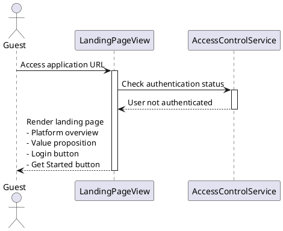
```plantuml
@startuml UC001_View_Landing_Page
actor Guest

participant "LandingPageView" as View
participant "AccessControlService" as AccessControl

Guest -> View: Access application URL
activate View

View -> AccessControl: Check authentication status
activate AccessControl

AccessControl --> View: User not authenticated
deactivate AccessControl

View --> Guest: Render landing page\n- Platform overview\n- Value proposition\n- Login button\n- Get Started button
deactivate View
@enduml
```

**UC002: Register Account**

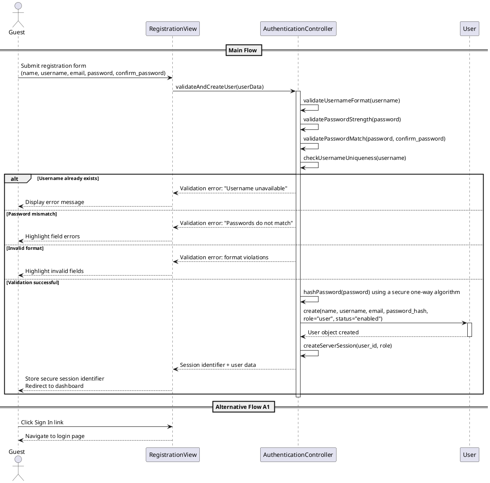
```plantuml
@startuml UC002_Register_Account
actor Guest

participant "RegistrationView" as View
participant "AuthenticationController" as AuthCtrl
participant "User" as UserEntity

== Main Flow ==
Guest -> View: Submit registration form\n(name, username, email, password, confirm_password)
View -> AuthCtrl: validateAndCreateUser(userData)
activate AuthCtrl

AuthCtrl -> AuthCtrl: validateUsernameFormat(username)
AuthCtrl -> AuthCtrl: validatePasswordStrength(password)
AuthCtrl -> AuthCtrl: validatePasswordMatch(password, confirm_password)
AuthCtrl -> AuthCtrl: checkUsernameUniqueness(username)

alt Username already exists
    AuthCtrl --> View: Validation error: "Username unavailable"
    View --> Guest: Display error message
else Password mismatch
    AuthCtrl --> View: Validation error: "Passwords do not match"
    View --> Guest: Highlight field errors
else Invalid format
    AuthCtrl --> View: Validation error: format violations
    View --> Guest: Highlight invalid fields
else Validation successful
    AuthCtrl -> AuthCtrl: hashPassword(password) using a secure one-way algorithm
    AuthCtrl -> UserEntity: create(name, username, email, password_hash,\nrole="user", status="enabled")
    activate UserEntity
    UserEntity --> AuthCtrl: User object created
    deactivate UserEntity
  
    AuthCtrl -> AuthCtrl: createServerSession(user_id, role)
    AuthCtrl --> View: Session identifier + user data
    View --> Guest: Store secure session identifier\nRedirect to dashboard

end

deactivate AuthCtrl

== Alternative Flow A1 ==
Guest -> View: Click Sign In link
View --> Guest: Navigate to login page
@enduml
```

**UC003: Login**

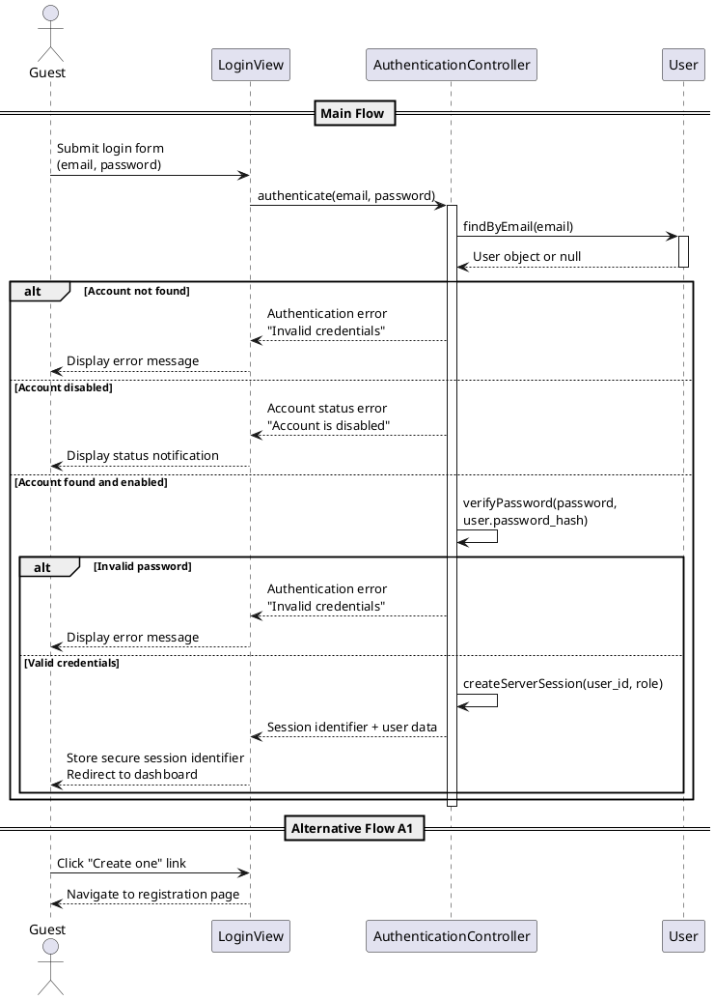
```plantuml
@startuml UC003_Login
actor Guest

participant "LoginView" as View
participant "AuthenticationController" as AuthCtrl
participant "User" as UserEntity

== Main Flow ==
Guest -> View: Submit login form\n(email, password)
View -> AuthCtrl: authenticate(email, password)
activate AuthCtrl

AuthCtrl -> UserEntity: findByEmail(email)
activate UserEntity
UserEntity --> AuthCtrl: User object or null
deactivate UserEntity

alt Account not found
    AuthCtrl --> View: Authentication error\n"Invalid credentials"
    View --> Guest: Display error message
else Account disabled
    AuthCtrl --> View: Account status error\n"Account is disabled"
    View --> Guest: Display status notification
else Account found and enabled
    AuthCtrl -> AuthCtrl: verifyPassword(password,\nuser.password_hash)
  
    alt Invalid password
        AuthCtrl --> View: Authentication error\n"Invalid credentials"
        View --> Guest: Display error message
    else Valid credentials
        AuthCtrl -> AuthCtrl: createServerSession(user_id, role)
              AuthCtrl --> View: Session identifier + user data
            View --> Guest: Store secure session identifier\nRedirect to dashboard
    end
end

deactivate AuthCtrl

== Alternative Flow A1 ==
Guest -> View: Click "Create one" link
View --> Guest: Navigate to registration page
@enduml


```

##### 4.3.1.2 User Sequence Diagrams

**UC004: Logout**

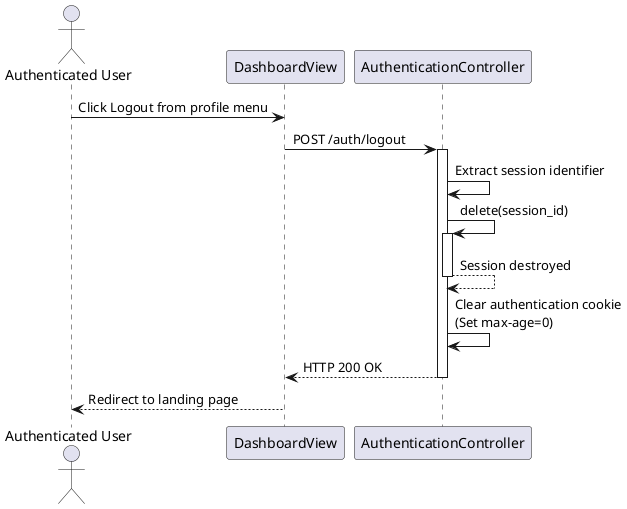
```plantuml
@startuml UC004_Logout
actor "Authenticated User" as User

participant "DashboardView" as View
participant "AuthenticationController" as AuthCtrl

User -> View: Click Logout from profile menu
View -> AuthCtrl: POST /auth/logout
activate AuthCtrl

AuthCtrl -> AuthCtrl: Extract session identifier
AuthCtrl -> AuthCtrl: delete(session_id)
activate AuthCtrl
AuthCtrl --> AuthCtrl: Session destroyed
deactivate AuthCtrl

AuthCtrl -> AuthCtrl: Clear authentication cookie\n(Set max-age=0)
AuthCtrl --> View: HTTP 200 OK
deactivate AuthCtrl

View --> User: Redirect to landing page

@enduml

```

**UC005: View Dashboard**

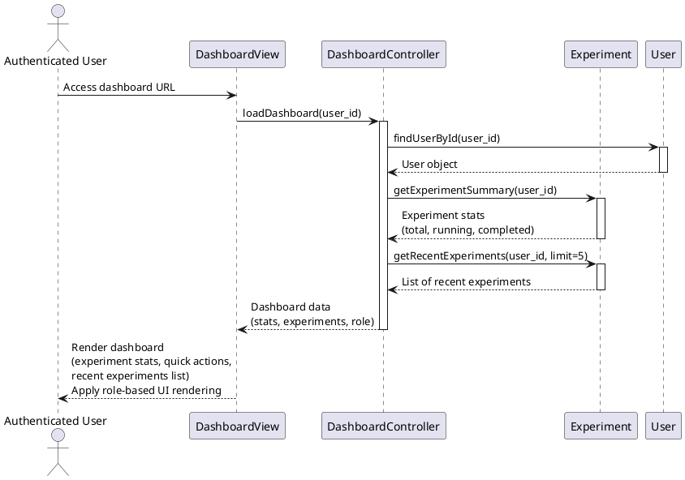
```plantuml
@startuml UC005_View_Dashboard
actor "Authenticated User" as User

participant "DashboardView" as View
participant "DashboardController" as Ctrl
participant "Experiment" as ExpEntity
participant "User" as UserEntity

User -> View: Access dashboard URL
View -> Ctrl: loadDashboard(user_id)
activate Ctrl

Ctrl -> UserEntity: findUserById(user_id)
activate UserEntity
UserEntity --> Ctrl: User object
deactivate UserEntity

Ctrl -> ExpEntity: getExperimentSummary(user_id)
activate ExpEntity
ExpEntity --> Ctrl: Experiment stats\n(total, running, completed)
deactivate ExpEntity

Ctrl -> ExpEntity: getRecentExperiments(user_id, limit=5)
activate ExpEntity
ExpEntity --> Ctrl: List of recent experiments
deactivate ExpEntity

Ctrl --> View: Dashboard data\n(stats, experiments, role)
deactivate Ctrl

View --> User: Render dashboard\n(experiment stats, quick actions,\nrecent experiments list)\nApply role-based UI rendering
@enduml

```

**UC006: Manage Experiments**

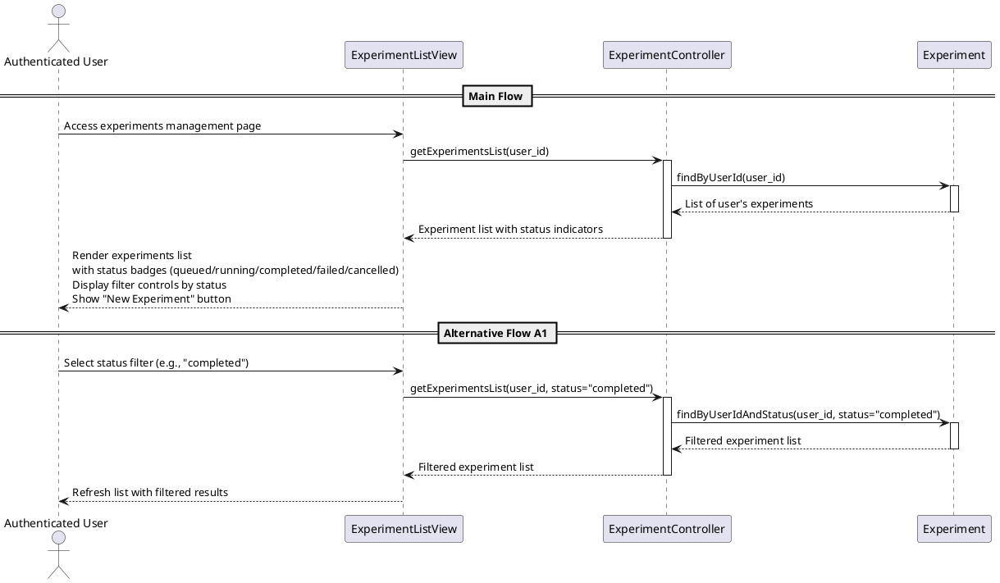
```plantuml
@startuml UC006_Manage_Experiments
actor "Authenticated User" as User

participant "ExperimentListView" as View
participant "ExperimentController" as Ctrl
participant "Experiment" as ExpEntity

== Main Flow ==
User -> View: Access experiments management page
View -> Ctrl: getExperimentsList(user_id)
activate Ctrl

Ctrl -> ExpEntity: findByUserId(user_id)
activate ExpEntity
ExpEntity --> Ctrl: List of user's experiments
deactivate ExpEntity

Ctrl --> View: Experiment list with status indicators
deactivate Ctrl

View --> User: Render experiments list\nwith status badges (queued/running/completed/failed/cancelled)\nDisplay filter controls by status\nShow "New Experiment" button

== Alternative Flow A1 ==
User -> View: Select status filter (e.g., "completed")
View -> Ctrl: getExperimentsList(user_id, status="completed")
activate Ctrl

Ctrl -> ExpEntity: findByUserIdAndStatus(user_id, status="completed")
activate ExpEntity
ExpEntity --> Ctrl: Filtered experiment list
deactivate ExpEntity

Ctrl --> View: Filtered experiment list
deactivate Ctrl

View --> User: Refresh list with filtered results
@enduml

```

**UC007: Create New Experiment**

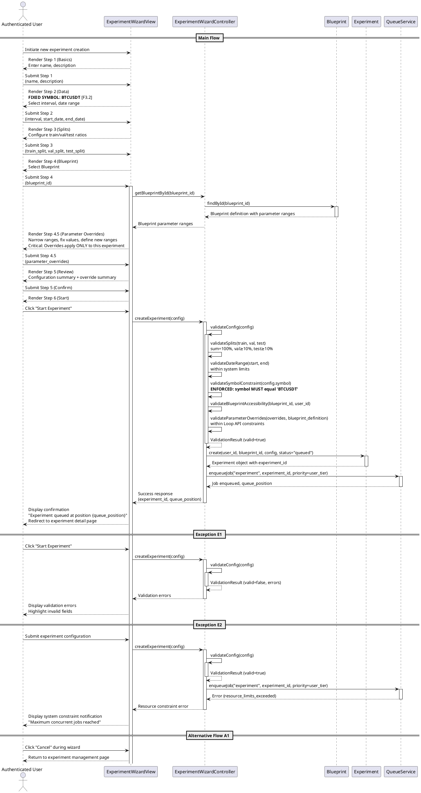
```plantuml
@startuml UC007_Create_New_Experiment
actor "Authenticated User" as User

participant "ExperimentWizardView" as View
participant "ExperimentWizardController" as Ctrl
participant "Blueprint" as BlueprintEntity
participant "Experiment" as ExpEntity
participant "QueueService" as Queue

== Main Flow ==
User -> View: Initiate new experiment creation
View --> User: Render Step 1 (Basics)\nEnter name, description

User -> View: Submit Step 1\n(name, description)
View --> User: Render Step 2 (Data)\n<B>FIXED SYMBOL: BTCUSDT</B> [F3.2]\nSelect interval, date range

User -> View: Submit Step 2\n(interval, start_date, end_date)
View --> User: Render Step 3 (Splits)\nConfigure train/val/test ratios

User -> View: Submit Step 3\n(train_split, val_split, test_split)
View --> User: Render Step 4 (Blueprint)\nSelect Blueprint

User -> View: Submit Step 4\n(blueprint_id)
activate View

View -> Ctrl: getBlueprintById(blueprint_id)
Ctrl -> BlueprintEntity: findById(blueprint_id)
activate BlueprintEntity
BlueprintEntity --> Ctrl: Blueprint definition with parameter ranges
deactivate BlueprintEntity
Ctrl --> View: Blueprint parameter ranges

View --> User: Render Step 4.5 (Parameter Overrides)\nNarrow ranges, fix values, define new ranges\nCritical: Overrides apply ONLY to this experiment

User -> View: Submit Step 4.5\n(parameter_overrides)
View --> User: Render Step 5 (Review)\nConfiguration summary + override summary

User -> View: Submit Step 5 (Confirm)
View --> User: Render Step 6 (Start)

User -> View: Click "Start Experiment"
View -> Ctrl: createExperiment(config)
activate Ctrl

Ctrl -> Ctrl: validateConfig(config)
activate Ctrl
Ctrl -> Ctrl: validateSplits(train, val, test)\nsum=100%, val≥10%, test≥10%
Ctrl -> Ctrl: validateDateRange(start, end)\nwithin system limits
Ctrl -> Ctrl: validateSymbolConstraint(config.symbol)\n<b>ENFORCED: symbol MUST equal 'BTCUSDT'</b>
Ctrl -> Ctrl: validateBlueprintAccessibility(blueprint_id, user_id)
Ctrl -> Ctrl: validateParameterOverrides(overrides, blueprint_definition)\nwithin Loop API constraints
Ctrl --> Ctrl: ValidationResult (valid=true)
deactivate Ctrl

Ctrl -> ExpEntity: create(user_id, blueprint_id, config, status="queued")
activate ExpEntity
ExpEntity --> Ctrl: Experiment object with experiment_id
deactivate ExpEntity

Ctrl -> Queue: enqueueJob("experiment", experiment_id, priority=user_tier)
activate Queue
Queue --> Ctrl: Job enqueued, queue_position
deactivate Queue

Ctrl --> View: Success response\n(experiment_id, queue_position)
deactivate Ctrl

View --> User: Display confirmation\n"Experiment queued at position {queue_position}"\nRedirect to experiment detail page

== Exception E1 ==
User -> View: Click "Start Experiment"
View -> Ctrl: createExperiment(config)
activate Ctrl

Ctrl -> Ctrl: validateConfig(config)
activate Ctrl
Ctrl --> Ctrl: ValidationResult (valid=false, errors)
deactivate Ctrl

Ctrl --> View: Validation errors
deactivate Ctrl

View --> User: Display validation errors\nHighlight invalid fields

== Exception E2 ==
User -> View: Submit experiment configuration
View -> Ctrl: createExperiment(config)
activate Ctrl

Ctrl -> Ctrl: validateConfig(config)
activate Ctrl
Ctrl --> Ctrl: ValidationResult (valid=true)
deactivate Ctrl

Ctrl -> Queue: enqueueJob("experiment", experiment_id, priority=user_tier)
activate Queue
Queue --> Ctrl: Error (resource_limits_exceeded)
deactivate Queue

Ctrl --> View: Resource constraint error
deactivate Ctrl

View --> User: Display system constraint notification\n"Maximum concurrent jobs reached"

== Alternative Flow A1 ==
User -> View: Click "Cancel" during wizard
View --> User: Return to experiment management page
@enduml


```

**UC008: View Experiment Detail**

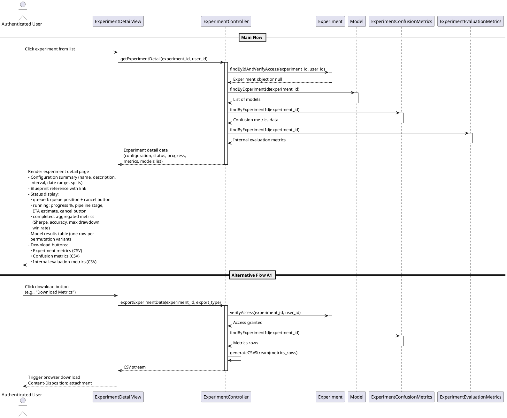
```plantuml
@startuml UC008_View_Experiment_Detail
actor "Authenticated User" as User

participant "ExperimentDetailView" as View
participant "ExperimentController" as Ctrl
participant "Experiment" as ExpEntity
participant "Model" as ModelEntity
participant "ExperimentConfusionMetrics" as ConfMetrics
participant "ExperimentEvaluationMetrics" as EvalMetrics

== Main Flow ==
User -> View: Click experiment from list
View -> Ctrl: getExperimentDetail(experiment_id, user_id)
activate Ctrl

Ctrl -> ExpEntity: findByIdAndVerifyAccess(experiment_id, user_id)
activate ExpEntity
ExpEntity --> Ctrl: Experiment object or null
deactivate ExpEntity

Ctrl -> ModelEntity: findByExperimentId(experiment_id)
activate ModelEntity
ModelEntity --> Ctrl: List of models
deactivate ModelEntity

Ctrl -> ConfMetrics: findByExperimentId(experiment_id)
activate ConfMetrics
ConfMetrics --> Ctrl: Confusion metrics data
deactivate ConfMetrics

Ctrl -> EvalMetrics: findByExperimentId(experiment_id)
activate EvalMetrics
EvalMetrics --> Ctrl: Internal evaluation metrics
deactivate EvalMetrics

Ctrl --> View: Experiment detail data\n(configuration, status, progress,\nmetrics, models list)
deactivate Ctrl

View --> User: Render experiment detail page\n- Configuration summary (name, description,\n  interval, date range, splits)\n- Blueprint reference with link\n- Status display:\n  • queued: queue position + cancel button\n  • running: progress %, pipeline stage,\n    ETA estimate, cancel button\n  • completed: aggregated metrics\n    (Sharpe, accuracy, max drawdown,\n    win rate)\n- Model results table (one row per\n  permutation variant)\n- Download buttons:\n  • Experiment metrics (CSV)\n  • Confusion metrics (CSV)\n  • Internal evaluation metrics (CSV)


== Alternative Flow A1 ==
User -> View: Click download button\n(e.g., "Download Metrics")
View -> Ctrl: exportExperimentData(experiment_id, export_type)
activate Ctrl

Ctrl -> ExpEntity: verifyAccess(experiment_id, user_id)
activate ExpEntity
ExpEntity --> Ctrl: Access granted
deactivate ExpEntity

Ctrl -> ConfMetrics: findByExperimentId(experiment_id)
activate ConfMetrics
ConfMetrics --> Ctrl: Metrics rows
deactivate ConfMetrics

Ctrl -> Ctrl: generateCSVStream(metrics_rows)
Ctrl --> View: CSV stream
deactivate Ctrl

View --> User: Trigger browser download\nContent-Disposition: attachment

@enduml

```

**UC009: Browse Models Rankings**

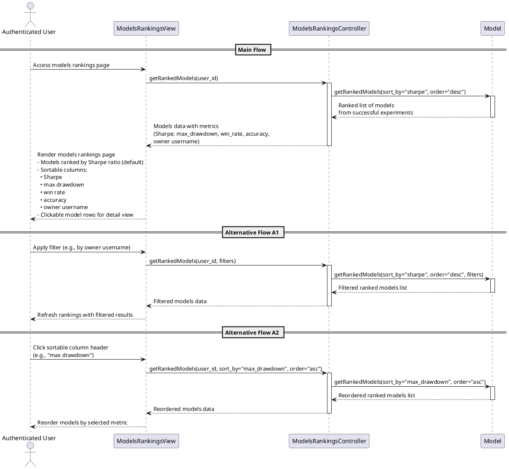
```plantuml
@startuml UC009_Browse_Models_Rankings
actor "Authenticated User" as User

participant "ModelsRankingsView" as View
participant "ModelsRankingsController" as Ctrl
participant "Model" as ModelEntity

== Main Flow ==
User -> View: Access models rankings page
View -> Ctrl: getRankedModels(user_id)
activate Ctrl

Ctrl -> ModelEntity: getRankedModels(sort_by="sharpe", order="desc")
activate ModelEntity
ModelEntity --> Ctrl: Ranked list of models\nfrom successful experiments
deactivate ModelEntity

Ctrl --> View: Models data with metrics\n(Sharpe, max_drawdown, win_rate, accuracy,\nowner username)
deactivate Ctrl

View --> User: Render models rankings page\n- Models ranked by Sharpe ratio (default)\n- Sortable columns:\n  • Sharpe\n  • max drawdown\n  • win rate\n  • accuracy\n  • owner username\n- Clickable model rows for detail view

== Alternative Flow A1 ==
User -> View: Apply filter (e.g., by owner username)
View -> Ctrl: getRankedModels(user_id, filters)
activate Ctrl

Ctrl -> ModelEntity: getRankedModels(sort_by="sharpe", order="desc", filters)
activate ModelEntity
ModelEntity --> Ctrl: Filtered ranked models list
deactivate ModelEntity

Ctrl --> View: Filtered models data
deactivate Ctrl

View --> User: Refresh rankings with filtered results

== Alternative Flow A2 ==
User -> View: Click sortable column header\n(e.g., "max drawdown")
View -> Ctrl: getRankedModels(user_id, sort_by="max_drawdown", order="asc")
activate Ctrl

Ctrl -> ModelEntity: getRankedModels(sort_by="max_drawdown", order="asc")
activate ModelEntity
ModelEntity --> Ctrl: Reordered ranked models list
deactivate ModelEntity

Ctrl --> View: Reordered models data
deactivate Ctrl

View --> User: Reorder models by selected metric
@enduml

```

**UC010: View Model Detail**

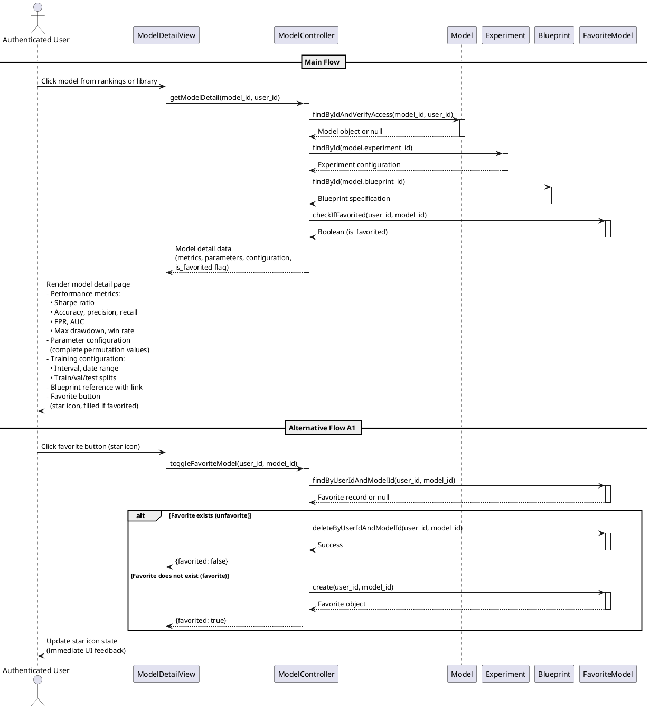
```plantuml
@startuml UC010_View_Model_Detail
actor "Authenticated User" as User

participant "ModelDetailView" as View
participant "ModelController" as Ctrl
participant "Model" as ModelEntity
participant "Experiment" as ExpEntity
participant "Blueprint" as BlueprintEntity
participant "FavoriteModel" as FavEntity

== Main Flow ==
User -> View: Click model from rankings or library
View -> Ctrl: getModelDetail(model_id, user_id)
activate Ctrl

Ctrl -> ModelEntity: findByIdAndVerifyAccess(model_id, user_id)
activate ModelEntity
ModelEntity --> Ctrl: Model object or null
deactivate ModelEntity

Ctrl -> ExpEntity: findById(model.experiment_id)
activate ExpEntity
ExpEntity --> Ctrl: Experiment configuration
deactivate ExpEntity

Ctrl -> BlueprintEntity: findById(model.blueprint_id)
activate BlueprintEntity
BlueprintEntity --> Ctrl: Blueprint specification
deactivate BlueprintEntity

Ctrl -> FavEntity: checkIfFavorited(user_id, model_id)
activate FavEntity
FavEntity --> Ctrl: Boolean (is_favorited)
deactivate FavEntity

Ctrl --> View: Model detail data\n(metrics, parameters, configuration,\nis_favorited flag)
deactivate Ctrl

View --> User: Render model detail page\n- Performance metrics:\n  • Sharpe ratio\n  • Accuracy, precision, recall\n  • FPR, AUC\n  • Max drawdown, win rate\n- Parameter configuration\n  (complete permutation values)\n- Training configuration:\n  • Interval, date range\n  • Train/val/test splits\n- Blueprint reference with link\n- Favorite button\n  (star icon, filled if favorited)

== Alternative Flow A1 ==
User -> View: Click favorite button (star icon)
View -> Ctrl: toggleFavoriteModel(user_id, model_id)
activate Ctrl

Ctrl -> FavEntity: findByUserIdAndModelId(user_id, model_id)
activate FavEntity
FavEntity --> Ctrl: Favorite record or null
deactivate FavEntity

alt Favorite exists (unfavorite)
    Ctrl -> FavEntity: deleteByUserIdAndModelId(user_id, model_id)
    activate FavEntity
    FavEntity --> Ctrl: Success
    deactivate FavEntity
    Ctrl --> View: {favorited: false}
else Favorite does not exist (favorite)
    Ctrl -> FavEntity: create(user_id, model_id)
    activate FavEntity
    FavEntity --> Ctrl: Favorite object
    deactivate FavEntity
    Ctrl --> View: {favorited: true}
end

deactivate Ctrl

View --> User: Update star icon state\n(immediate UI feedback)

@enduml
```

**UC011: Manage Models Library**

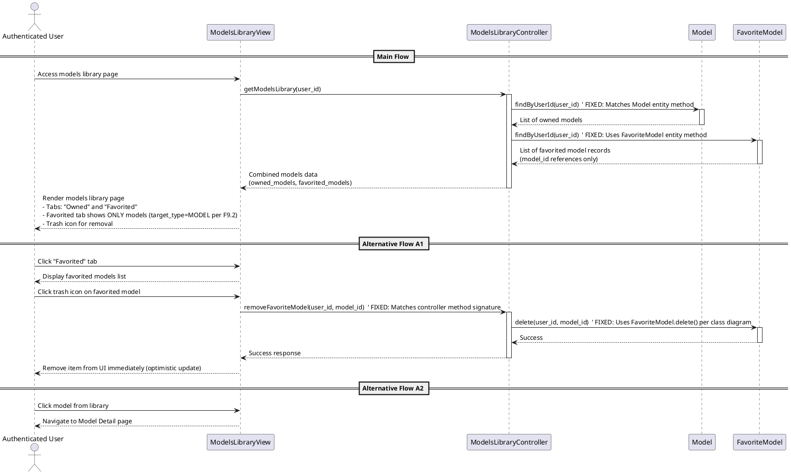
```plantuml
@startuml UC011_Manage_Models_Library
actor "Authenticated User" as User

participant "ModelsLibraryView" as View
participant "ModelsLibraryController" as Ctrl
participant "Model" as ModelEntity
participant "FavoriteModel" as FavModelEntity

== Main Flow ==
User -> View: Access models library page
View -> Ctrl: getModelsLibrary(user_id)
activate Ctrl

Ctrl -> ModelEntity: findByUserId(user_id)  ' FIXED: Matches Model entity method
activate ModelEntity
ModelEntity --> Ctrl: List of owned models
deactivate ModelEntity

Ctrl -> FavModelEntity: findByUserId(user_id)  ' FIXED: Uses FavoriteModel entity method
activate FavModelEntity
FavModelEntity --> Ctrl: List of favorited model records\n(model_id references only)
deactivate FavModelEntity

' Controller resolves model details internally
Ctrl --> View: Combined models data\n(owned_models, favorited_models)
deactivate Ctrl

View --> User: Render models library page\n- Tabs: "Owned" and "Favorited"\n- Favorited tab shows ONLY models (target_type=MODEL per F9.2)\n- Trash icon for removal

== Alternative Flow A1 ==
User -> View: Click "Favorited" tab
View --> User: Display favorited models list

User -> View: Click trash icon on favorited model
View -> Ctrl: removeFavoriteModel(user_id, model_id)  ' FIXED: Matches controller method signature
activate Ctrl

Ctrl -> FavModelEntity: delete(user_id, model_id)  ' FIXED: Uses FavoriteModel.delete() per class diagram
activate FavModelEntity
FavModelEntity --> Ctrl: Success
deactivate FavModelEntity

Ctrl --> View: Success response
deactivate Ctrl

View --> User: Remove item from UI immediately (optimistic update)

== Alternative Flow A2 ==
User -> View: Click model from library
View --> User: Navigate to Model Detail page
@enduml
```

**UC012: Manage Blueprints Library**

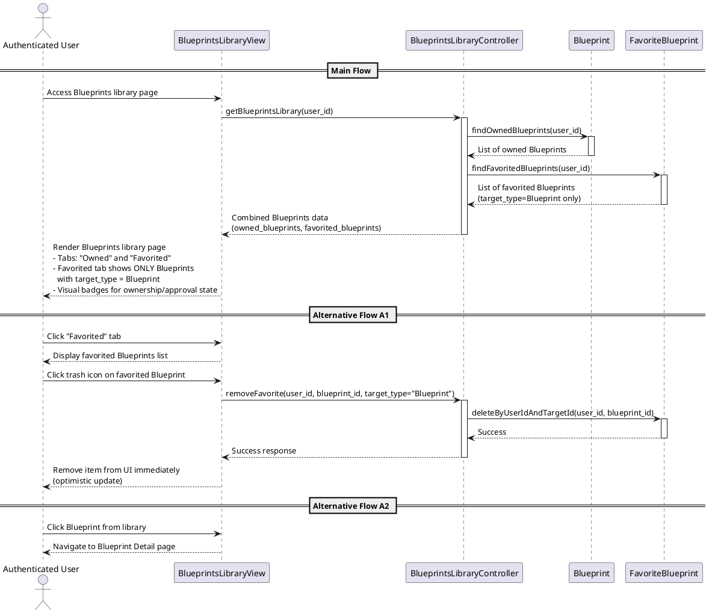
```plantuml
@startuml UC012_Manage_Blueprints_Library
actor "Authenticated User" as User

participant "BlueprintsLibraryView" as View
participant "BlueprintsLibraryController" as Ctrl
participant "Blueprint" as BlueprintEntity
participant "FavoriteBlueprint" as FavEntity

== Main Flow ==
User -> View: Access Blueprints library page
View -> Ctrl: getBlueprintsLibrary(user_id)
activate Ctrl

Ctrl -> BlueprintEntity: findOwnedBlueprints(user_id)
activate BlueprintEntity
BlueprintEntity --> Ctrl: List of owned Blueprints
deactivate BlueprintEntity

Ctrl -> FavEntity: findFavoritedBlueprints(user_id)
activate FavEntity
FavEntity --> Ctrl: List of favorited Blueprints\n(target_type=Blueprint only)
deactivate FavEntity

Ctrl --> View: Combined Blueprints data\n(owned_blueprints, favorited_blueprints)
deactivate Ctrl

View --> User: Render Blueprints library page\n- Tabs: "Owned" and "Favorited"\n- Favorited tab shows ONLY Blueprints\n  with target_type = Blueprint\n- Visual badges for ownership/approval state

== Alternative Flow A1 ==
User -> View: Click "Favorited" tab
View --> User: Display favorited Blueprints list

User -> View: Click trash icon on favorited Blueprint
View -> Ctrl: removeFavorite(user_id, blueprint_id, target_type="Blueprint")
activate Ctrl

Ctrl -> FavEntity: deleteByUserIdAndTargetId(user_id, blueprint_id)
activate FavEntity
FavEntity --> Ctrl: Success
deactivate FavEntity

Ctrl --> View: Success response
deactivate Ctrl

View --> User: Remove item from UI immediately\n(optimistic update)

== Alternative Flow A2 ==
User -> View: Click Blueprint from library
View --> User: Navigate to Blueprint Detail page

@enduml
```

**UC013: Create/Edit Blueprint**

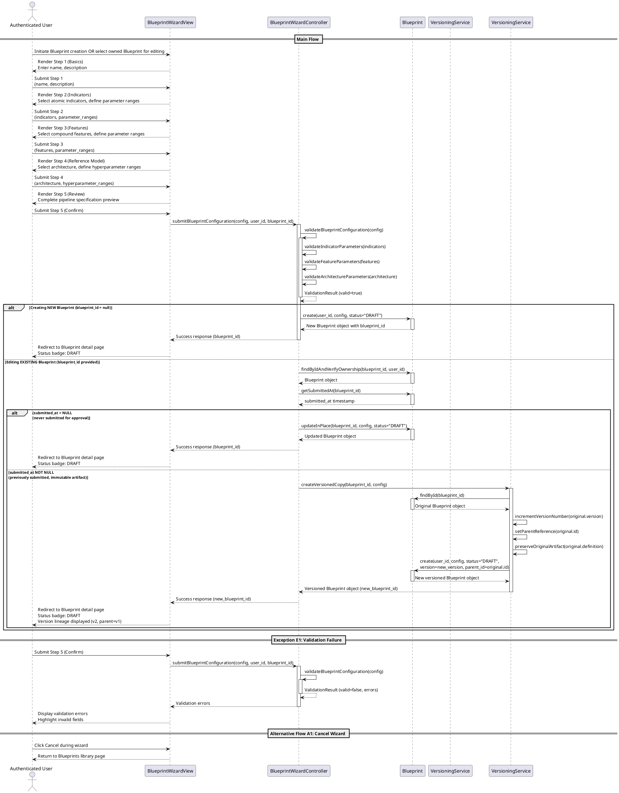
```plantuml
@startuml UC013_Create_Edit_Blueprint
actor "Authenticated User" as User

participant "BlueprintWizardView" as View
participant "BlueprintWizardController" as Ctrl
participant "Blueprint" as BlueprintEntity
participant "VersioningService" as Versioning

== Main Flow ==
User -> View: Initiate Blueprint creation OR select owned Blueprint for editing
View --> User: Render Step 1 (Basics)\nEnter name, description

User -> View: Submit Step 1\n(name, description)
View --> User: Render Step 2 (Indicators)\nSelect atomic indicators, define parameter ranges

User -> View: Submit Step 2\n(indicators, parameter_ranges)
View --> User: Render Step 3 (Features)\nSelect compound features, define parameter ranges

User -> View: Submit Step 3\n(features, parameter_ranges)
View --> User: Render Step 4 (Reference Model)\nSelect architecture, define hyperparameter ranges

User -> View: Submit Step 4\n(architecture, hyperparameter_ranges)
View --> User: Render Step 5 (Review)\nComplete pipeline specification preview

User -> View: Submit Step 5 (Confirm)
View -> Ctrl: submitBlueprintConfiguration(config, user_id, blueprint_id)
activate Ctrl
' CORRECTION: Validation is INTERNAL to controller (no separate validator object)
Ctrl -> Ctrl: validateBlueprintConfiguration(config)
activate Ctrl
Ctrl -> Ctrl: validateIndicatorParameters(indicators)
Ctrl -> Ctrl: validateFeatureParameters(features)
Ctrl -> Ctrl: validateArchitectureParameters(architecture)
Ctrl --> Ctrl: ValidationResult (valid=true)
deactivate Ctrl

alt Creating NEW Blueprint (blueprint_id = null)
    Ctrl -> BlueprintEntity: create(user_id, config, status="DRAFT")
    activate BlueprintEntity
    BlueprintEntity --> Ctrl: New Blueprint object with blueprint_id
    deactivate BlueprintEntity
  
    Ctrl --> View: Success response (blueprint_id)
    deactivate Ctrl
  
    View --> User: Redirect to Blueprint detail page\nStatus badge: DRAFT

else Editing EXISTING Blueprint (blueprint_id provided)
    Ctrl -> BlueprintEntity: findByIdAndVerifyOwnership(blueprint_id, user_id)
    activate BlueprintEntity
    BlueprintEntity --> Ctrl: Blueprint object
    deactivate BlueprintEntity
  
    Ctrl -> BlueprintEntity: getSubmittedAt(blueprint_id)
    activate BlueprintEntity
    BlueprintEntity --> Ctrl: submitted_at timestamp
    deactivate BlueprintEntity
  
    alt submitted_at = NULL\n(never submitted for approval)
        Ctrl -> BlueprintEntity: updateInPlace(blueprint_id, config, status="DRAFT")
        activate BlueprintEntity
        BlueprintEntity --> Ctrl: Updated Blueprint object
        deactivate BlueprintEntity
  
        Ctrl --> View: Success response (blueprint_id)
        deactivate Ctrl
  
        View --> User: Redirect to Blueprint detail page\nStatus badge: DRAFT
  
    else submitted_at NOT NULL\n(previously submitted, immutable artifact)
        Ctrl -> VersioningService: createVersionedCopy(blueprint_id, config)
        activate VersioningService
  
        VersioningService -> BlueprintEntity: findById(blueprint_id)
        activate BlueprintEntity
        BlueprintEntity --> VersioningService: Original Blueprint object
        deactivate BlueprintEntity
  
        VersioningService -> VersioningService: incrementVersionNumber(original.version)
        VersioningService -> VersioningService: setParentReference(original.id)
        VersioningService -> VersioningService: preserveOriginalArtifact(original.definition)
  
        VersioningService -> BlueprintEntity: create(user_id, config, status="DRAFT",\nversion=new_version, parent_id=original.id)
        activate BlueprintEntity
        BlueprintEntity --> VersioningService: New versioned Blueprint object
        deactivate BlueprintEntity
  
        VersioningService --> Ctrl: Versioned Blueprint object (new_blueprint_id)
        deactivate VersioningService
  
        Ctrl --> View: Success response (new_blueprint_id)
        deactivate Ctrl
  
        View --> User: Redirect to Blueprint detail page\nStatus badge: DRAFT\nVersion lineage displayed (v2, parent=v1)
    end
end

== Exception E1: Validation Failure ==
User -> View: Submit Step 5 (Confirm)
View -> Ctrl: submitBlueprintConfiguration(config, user_id, blueprint_id)
activate Ctrl

Ctrl -> Ctrl: validateBlueprintConfiguration(config)
activate Ctrl
Ctrl --> Ctrl: ValidationResult (valid=false, errors)
deactivate Ctrl

Ctrl --> View: Validation errors
deactivate Ctrl

View --> User: Display validation errors\nHighlight invalid fields

== Alternative Flow A1: Cancel Wizard ==
User -> View: Click Cancel during wizard
View --> User: Return to Blueprints library page
@enduml
```

**UC014: Request Blueprint Approval**

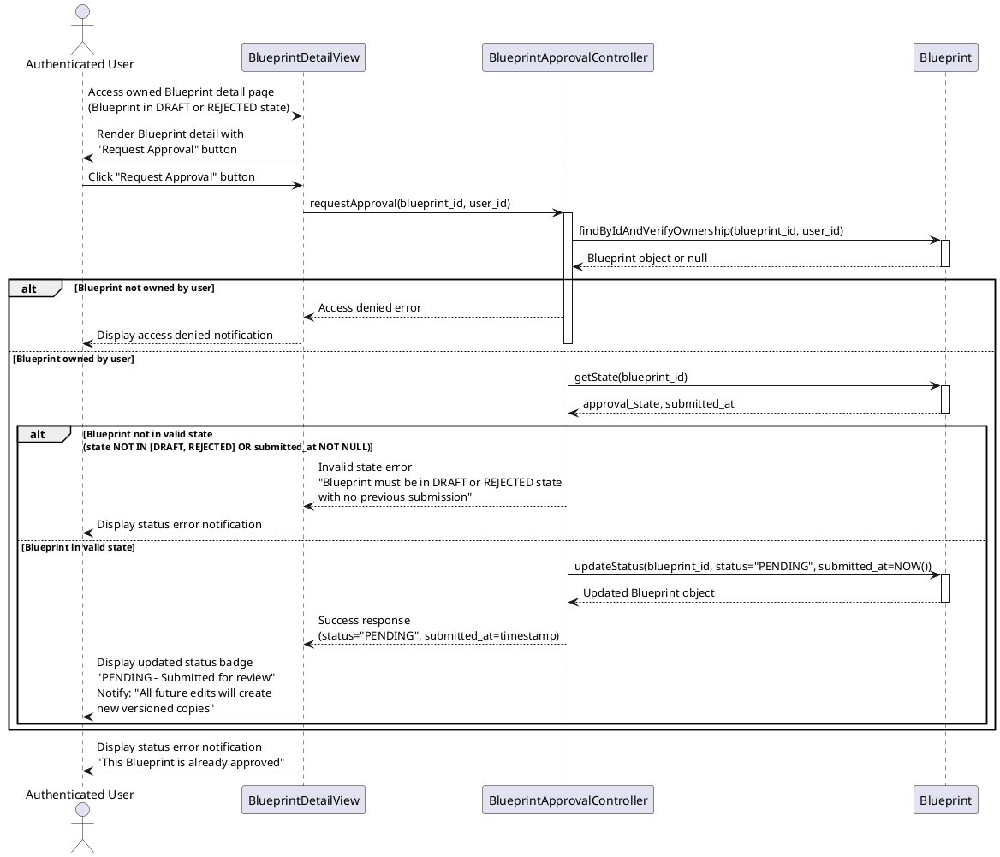
```plantuml
@startuml UC014_Request_Blueprint_Approval
actor "Authenticated User" as User

participant "BlueprintDetailView" as View
participant "BlueprintApprovalController" as Ctrl
participant "Blueprint" as BlueprintEntity

User -> View: Access owned Blueprint detail page\n(Blueprint in DRAFT or REJECTED state)
View --> User: Render Blueprint detail with\n"Request Approval" button

User -> View: Click "Request Approval" button
View -> Ctrl: requestApproval(blueprint_id, user_id)
activate Ctrl

Ctrl -> BlueprintEntity: findByIdAndVerifyOwnership(blueprint_id, user_id)
activate BlueprintEntity
BlueprintEntity --> Ctrl: Blueprint object or null
deactivate BlueprintEntity

alt Blueprint not owned by user
    Ctrl --> View: Access denied error
    View --> User: Display access denied notification
    deactivate Ctrl
else Blueprint owned by user
    Ctrl -> BlueprintEntity: getState(blueprint_id)
    activate BlueprintEntity
    BlueprintEntity --> Ctrl: approval_state, submitted_at
    deactivate BlueprintEntity
  
    alt Blueprint not in valid state\n(state NOT IN [DRAFT, REJECTED] OR submitted_at NOT NULL)
        Ctrl --> View: Invalid state error\n"Blueprint must be in DRAFT or REJECTED state\nwith no previous submission"
        View --> User: Display status error notification
        deactivate Ctrl
    else Blueprint in valid state
        Ctrl -> BlueprintEntity: updateStatus(blueprint_id, status="PENDING", submitted_at=NOW())
        activate BlueprintEntity
        BlueprintEntity --> Ctrl: Updated Blueprint object
        deactivate BlueprintEntity
  
        Ctrl --> View: Success response\n(status="PENDING", submitted_at=timestamp)
        deactivate Ctrl
  
        View --> User: Display updated status badge\n"PENDING - Submitted for review"\nNotify: "All future edits will create\nnew versioned copies"
    end
end

View --> User: Display status error notification\n"This Blueprint is already approved"
@enduml

```

**UC015: View Blueprint Detail**

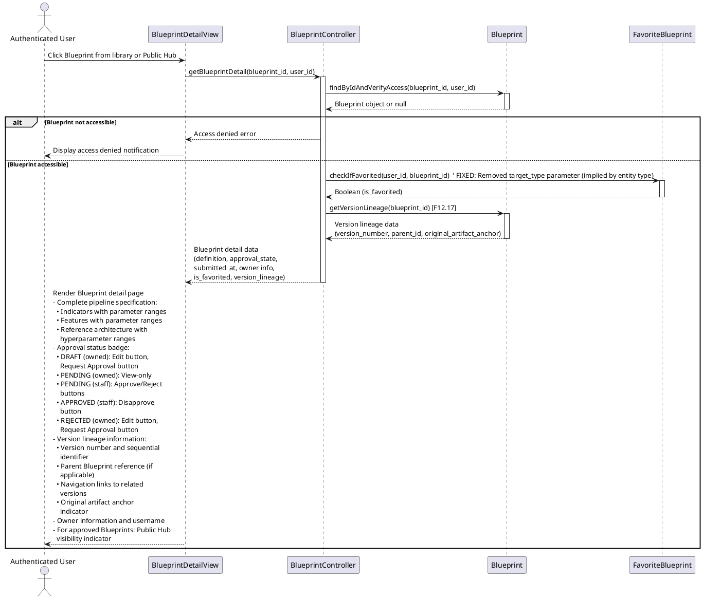
```plantuml
@startuml UC015_View_Blueprint_Detail
actor "Authenticated User" as User

participant "BlueprintDetailView" as View
participant "BlueprintController" as Ctrl
participant "Blueprint" as BlueprintEntity
participant "FavoriteBlueprint" as FavEntity

User -> View: Click Blueprint from library or Public Hub
View -> Ctrl: getBlueprintDetail(blueprint_id, user_id)
activate Ctrl

Ctrl -> BlueprintEntity: findByIdAndVerifyAccess(blueprint_id, user_id)
activate BlueprintEntity
BlueprintEntity --> Ctrl: Blueprint object or null
deactivate BlueprintEntity

alt Blueprint not accessible
    Ctrl --> View: Access denied error
    View --> User: Display access denied notification
else Blueprint accessible
    Ctrl -> FavEntity: checkIfFavorited(user_id, blueprint_id)  ' FIXED: Removed target_type parameter (implied by entity type)
    activate FavEntity
    FavEntity --> Ctrl: Boolean (is_favorited)
    deactivate FavEntity
  
    Ctrl -> BlueprintEntity: getVersionLineage(blueprint_id) [F12.17]
    activate BlueprintEntity
    BlueprintEntity --> Ctrl: Version lineage data\n(version_number, parent_id, original_artifact_anchor)
    deactivate BlueprintEntity
  
    Ctrl --> View: Blueprint detail data\n(definition, approval_state,\nsubmitted_at, owner info,\nis_favorited, version_lineage)
    deactivate Ctrl
  
    View --> User: Render Blueprint detail page\n- Complete pipeline specification:\n  • Indicators with parameter ranges\n  • Features with parameter ranges\n  • Reference architecture with\n    hyperparameter ranges\n- Approval status badge:\n  • DRAFT (owned): Edit button,\n    Request Approval button\n  • PENDING (owned): View-only\n  • PENDING (staff): Approve/Reject\n    buttons\n  • APPROVED (staff): Disapprove\n    button\n  • REJECTED (owned): Edit button,\n    Request Approval button\n- Version lineage information:\n  • Version number and sequential\n    identifier\n  • Parent Blueprint reference (if\n    applicable)\n  • Navigation links to related\n    versions\n  • Original artifact anchor\n    indicator\n- Owner information and username\n- For approved Blueprints: Public Hub\n  visibility indicator
end
@enduml
```

**UC016: Download Experiment Logs**

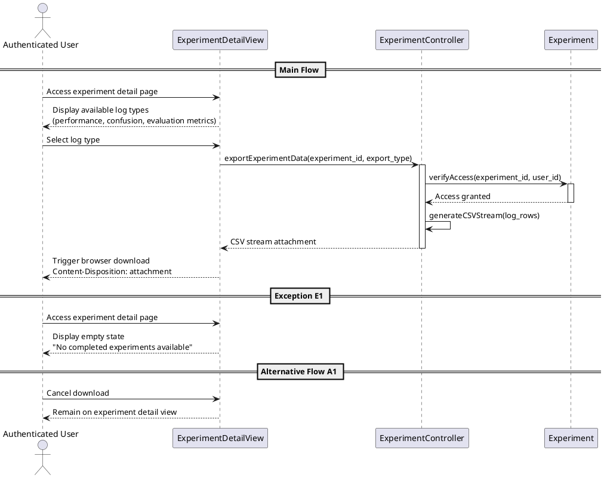
```plantuml
@startuml UC016_Download_Experiment_Logs
actor "Authenticated User" as User

participant "ExperimentDetailView" as View
participant "ExperimentController" as Ctrl
participant "Experiment" as ExpEntity

== Main Flow ==
User -> View: Access experiment detail page
View --> User: Display available log types\n(performance, confusion, evaluation metrics)

User -> View: Select log type
View -> Ctrl: exportExperimentData(experiment_id, export_type)
activate Ctrl

Ctrl -> ExpEntity: verifyAccess(experiment_id, user_id)
activate ExpEntity
ExpEntity --> Ctrl: Access granted
deactivate ExpEntity

Ctrl -> Ctrl: generateCSVStream(log_rows)
Ctrl --> View: CSV stream attachment
deactivate Ctrl

View --> User: Trigger browser download\nContent-Disposition: attachment

== Exception E1 ==
User -> View: Access experiment detail page
View --> User: Display empty state\n"No completed experiments available"

== Alternative Flow A1 ==
User -> View: Cancel download
View --> User: Remain on experiment detail view
@enduml

```

**UC017: View Public Hub**

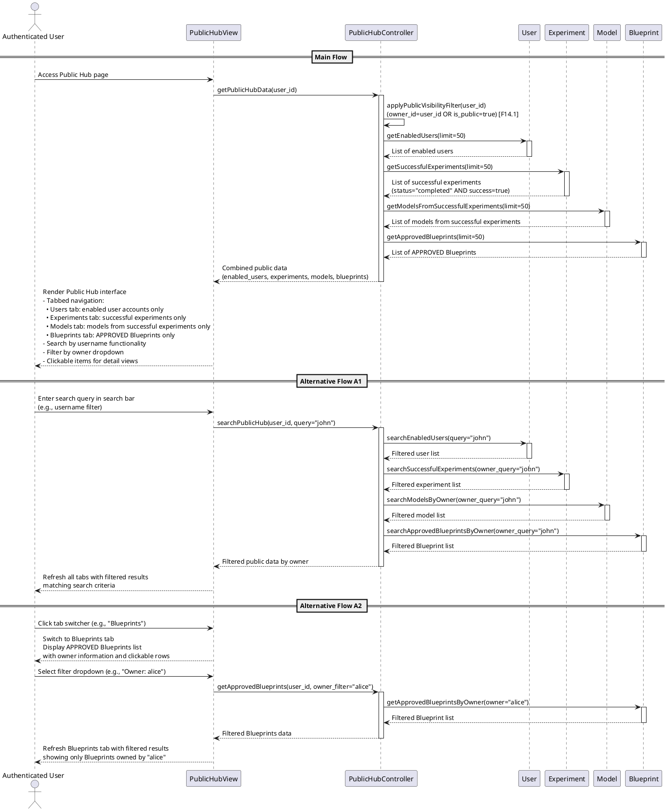
```plantuml
@startuml UC017_View_Public_Hub
actor "Authenticated User" as User

participant "PublicHubView" as View
participant "PublicHubController" as Ctrl
participant "User" as UserRepo
participant "Experiment" as ExpRepo
participant "Model" as ModelRepo
participant "Blueprint" as BlueprintRepo

== Main Flow ==
User -> View: Access Public Hub page
View -> Ctrl: getPublicHubData(user_id)
activate Ctrl

Ctrl -> Ctrl: applyPublicVisibilityFilter(user_id)\n(owner_id=user_id OR is_public=true) [F14.1]
Ctrl -> UserRepo: getEnabledUsers(limit=50)
activate UserRepo
UserRepo --> Ctrl: List of enabled users
deactivate UserRepo

Ctrl -> ExpRepo: getSuccessfulExperiments(limit=50)
activate ExpRepo
ExpRepo --> Ctrl: List of successful experiments\n(status="completed" AND success=true)
deactivate ExpRepo

Ctrl -> ModelRepo: getModelsFromSuccessfulExperiments(limit=50)
activate ModelRepo
ModelRepo --> Ctrl: List of models from successful experiments
deactivate ModelRepo

Ctrl -> BlueprintRepo: getApprovedBlueprints(limit=50)
activate BlueprintRepo
BlueprintRepo --> Ctrl: List of APPROVED Blueprints
deactivate BlueprintRepo

Ctrl --> View: Combined public data\n(enabled_users, experiments, models, blueprints)
deactivate Ctrl

View --> User: Render Public Hub interface\n- Tabbed navigation:\n  • Users tab: enabled user accounts only\n  • Experiments tab: successful experiments only\n  • Models tab: models from successful experiments only\n  • Blueprints tab: APPROVED Blueprints only\n- Search by username functionality\n- Filter by owner dropdown\n- Clickable items for detail views

== Alternative Flow A1 ==
User -> View: Enter search query in search bar\n(e.g., username filter)
View -> Ctrl: searchPublicHub(user_id, query="john")
activate Ctrl

Ctrl -> UserRepo: searchEnabledUsers(query="john")
activate UserRepo
UserRepo --> Ctrl: Filtered user list
deactivate UserRepo

Ctrl -> ExpRepo: searchSuccessfulExperiments(owner_query="john")
activate ExpRepo
ExpRepo --> Ctrl: Filtered experiment list
deactivate ExpRepo

Ctrl -> ModelRepo: searchModelsByOwner(owner_query="john")
activate ModelRepo
ModelRepo --> Ctrl: Filtered model list
deactivate ModelRepo

Ctrl -> BlueprintRepo: searchApprovedBlueprintsByOwner(owner_query="john")
activate BlueprintRepo
BlueprintRepo --> Ctrl: Filtered Blueprint list
deactivate BlueprintRepo

Ctrl --> View: Filtered public data by owner
deactivate Ctrl

View --> User: Refresh all tabs with filtered results\nmatching search criteria

== Alternative Flow A2 ==
User -> View: Click tab switcher (e.g., "Blueprints")
View --> User: Switch to Blueprints tab\nDisplay APPROVED Blueprints list\nwith owner information and clickable rows

User -> View: Select filter dropdown (e.g., "Owner: alice")
View -> Ctrl: getApprovedBlueprints(user_id, owner_filter="alice")
activate Ctrl

Ctrl -> BlueprintRepo: getApprovedBlueprintsByOwner(owner="alice")
activate BlueprintRepo
BlueprintRepo --> Ctrl: Filtered Blueprint list
deactivate BlueprintRepo

Ctrl --> View: Filtered Blueprints data
deactivate Ctrl

View --> User: Refresh Blueprints tab with filtered results\nshowing only Blueprints owned by "alice"
@enduml

```

**UC018: Browse Users**

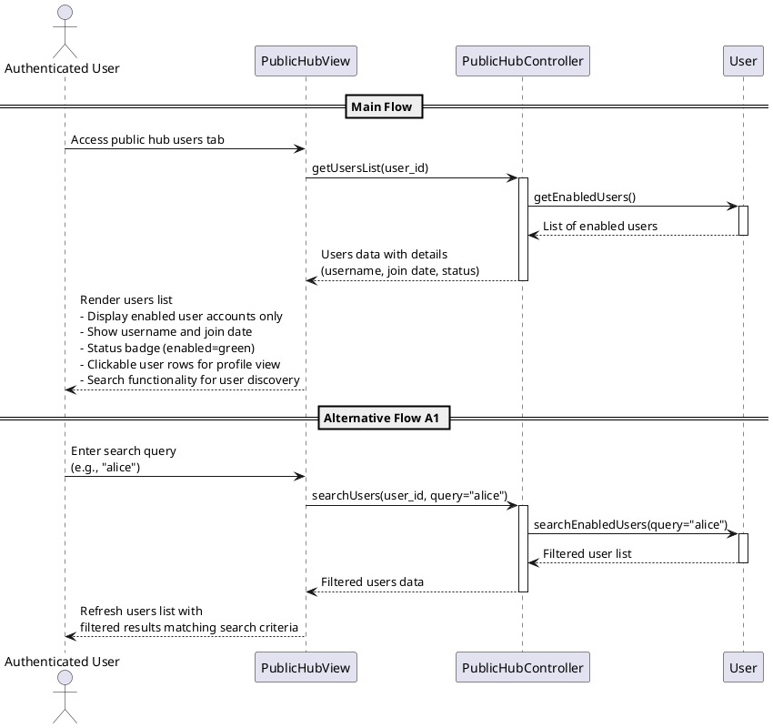
```plantuml
@startuml UC018_Browse_Users
actor "Authenticated User" as ActorUser

participant "PublicHubView" as View
participant "PublicHubController" as Ctrl
participant "User" as UserEntity

== Main Flow ==
ActorUser -> View: Access public hub users tab
View -> Ctrl: getUsersList(user_id)
activate Ctrl

Ctrl -> UserEntity: getEnabledUsers()
activate UserEntity
UserEntity --> Ctrl: List of enabled users
deactivate UserEntity

Ctrl --> View: Users data with details\n(username, join date, status)
deactivate Ctrl

View --> ActorUser: Render users list\n- Display enabled user accounts only\n- Show username and join date\n- Status badge (enabled=green)\n- Clickable user rows for profile view\n- Search functionality for user discovery

== Alternative Flow A1 ==
ActorUser -> View: Enter search query\n(e.g., "alice")
View -> Ctrl: searchUsers(user_id, query="alice")
activate Ctrl

Ctrl -> UserEntity: searchEnabledUsers(query="alice")
activate UserEntity
UserEntity --> Ctrl: Filtered user list
deactivate UserEntity

Ctrl --> View: Filtered users data
deactivate Ctrl

View --> ActorUser: Refresh users list with\nfiltered results matching search criteria
@enduml
```

**UC019: Browse Experiments**

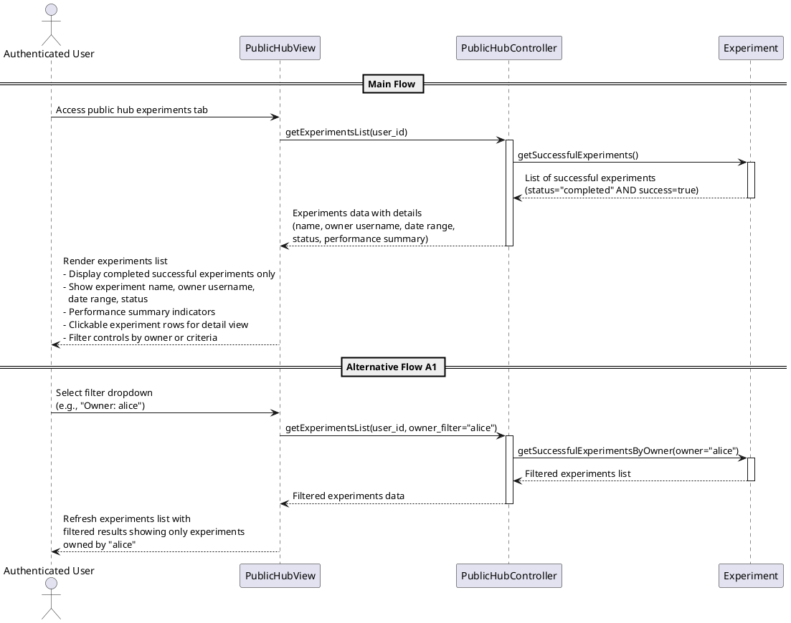
```plantuml
@startuml UC019_Browse_Experiments
actor "Authenticated User" as User

participant "PublicHubView" as View
participant "PublicHubController" as Ctrl
participant "Experiment" as ExpEntity

== Main Flow ==
User -> View: Access public hub experiments tab
View -> Ctrl: getExperimentsList(user_id)
activate Ctrl

Ctrl -> ExpEntity: getSuccessfulExperiments()
activate ExpEntity
ExpEntity --> Ctrl: List of successful experiments\n(status="completed" AND success=true)
deactivate ExpEntity

Ctrl --> View: Experiments data with details\n(name, owner username, date range,\nstatus, performance summary)
deactivate Ctrl

View --> User: Render experiments list\n- Display completed successful experiments only\n- Show experiment name, owner username,\n  date range, status\n- Performance summary indicators\n- Clickable experiment rows for detail view\n- Filter controls by owner or criteria

== Alternative Flow A1 ==
User -> View: Select filter dropdown\n(e.g., "Owner: alice")
View -> Ctrl: getExperimentsList(user_id, owner_filter="alice")
activate Ctrl

Ctrl -> ExpEntity: getSuccessfulExperimentsByOwner(owner="alice")
activate ExpEntity
ExpEntity --> Ctrl: Filtered experiments list
deactivate ExpEntity

Ctrl --> View: Filtered experiments data
deactivate Ctrl

View --> User: Refresh experiments list with\nfiltered results showing only experiments\nowned by "alice"
@enduml
```

**UC020: Browse Models**

```plantuml
@startuml UC020_Browse_Models
actor "Authenticated User" as User

participant "PublicHubView" as View
participant "PublicHubController" as Ctrl
participant "Model" as ModelEntity

== Main Flow ==
User -> View: Access public hub models tab
activate View

View -> Ctrl: getModelsList(user_id)
activate Ctrl

Ctrl -> ModelEntity: getModelsFromSuccessfulExperiments()
activate ModelEntity
ModelEntity --> Ctrl: List of models\n(from status="completed" AND success=true experiments)
deactivate ModelEntity

Ctrl --> View: Models data with details\n(Sharpe, max_drawdown, win_rate, accuracy,\nowner username, experiment reference)
deactivate Ctrl

View --> User: Render models list\n- Display models from successful experiments only\n- Show performance metrics:\n  • Sharpe ratio\n  • max drawdown\n  • win rate\n  • accuracy\n- Show owner username\n- Show experiment reference\n- Clickable model rows for detail view\n- Filter controls by owner or criteria\n- Sortable columns by metrics
deactivate View

== Alternative Flow A1 ==
User -> View: Apply filter\n(e.g., by owner username or metric range)
activate View

View -> Ctrl: getModelsList(user_id, filters)
activate Ctrl

Ctrl -> ModelEntity: getModelsFromSuccessfulExperiments(filters)
activate ModelEntity
ModelEntity --> Ctrl: Filtered models list
deactivate ModelEntity

Ctrl --> View: Filtered models data
deactivate Ctrl

View --> User: Refresh models list with\nfiltered results matching criteria
deactivate View
@enduml
```

**UC021: Browse Blueprints**

```plantuml
@startuml UC021_Browse_Blueprints
actor "Authenticated User" as User

participant "PublicHubView" as View
participant "PublicHubController" as Ctrl
participant "Blueprint" as BlueprintEntity

== Main Flow ==
User -> View: Access public hub Blueprints tab
View -> Ctrl: getBlueprintsList(user_id)
activate Ctrl

Ctrl -> BlueprintEntity: getApprovedBlueprints()
activate BlueprintEntity
BlueprintEntity --> Ctrl: List of APPROVED Blueprints\n(approval_state="APPROVED")
deactivate BlueprintEntity

Ctrl --> View: Blueprints data with details\n(name, owner username, description,\napproval status)
deactivate Ctrl

View --> User: Render Blueprints list\n- Display APPROVED Blueprints only\n- Show Blueprint name, owner username,\n  description\n- Approval status badge (APPROVED=green)\n- Clickable Blueprint rows for detail view\n- Filter controls by owner or criteria

== Alternative Flow A1 ==
User -> View: Select filter dropdown\n(e.g., "Owner: alice")
View -> Ctrl: getBlueprintsList(user_id, owner_filter="alice")
activate Ctrl

Ctrl -> BlueprintEntity: getApprovedBlueprintsByOwner(owner="alice")
activate BlueprintEntity
BlueprintEntity --> Ctrl: Filtered Blueprints list
deactivate BlueprintEntity

Ctrl --> View: Filtered Blueprints data
deactivate Ctrl

View --> User: Refresh Blueprints list with\nfiltered results showing only Blueprints\nowned by "alice"
@enduml
```

**UC022: View Documentation**

```plantuml
@startuml UC022_View_Documentation_Fixed
actor "Authenticated User" as User

participant "DocumentationView" as View
participant "DocumentationController" as Ctrl

User -> View: Access documentation page
View -> Ctrl: getDocumentationList(user_id)
activate Ctrl

Ctrl -> Ctrl: scanDocumentationDirectory()
Ctrl -> Ctrl: List files in loop/docs/*.md
Ctrl -> Ctrl: Extract metadata\n(filename, last_modified)
Ctrl --> View: Documentation entries\n(title, slug, last_modified)
deactivate Ctrl

View --> User: Render documentation list\n- Display available documentation entries\n- Show last modified timestamps\n- Clickable entry rows

User -> View: Click documentation entry\n(e.g., "Data Flow")
View -> Ctrl: getDocumentationContent(slug="data-flow")
activate Ctrl

Ctrl -> Ctrl: loadDocumentationFile(slug="data-flow")
Ctrl -> Ctrl: Read file loop/docs/data-flow.md
Ctrl -> Ctrl: sanitizeContent(raw_markdown)\n(remove <script>, on* handlers)
Ctrl --> View: {title, content, last_modified}
deactivate Ctrl

View --> User: Render documentation viewer\n- Display title and content\n- Render formatted documentation content\n- Apply syntax highlighting\n- Show last modified timestamp

@enduml
```

**UC023: View User Profile**

```plantuml
@startuml UC023_View_User_Profile
actor "Authenticated User" as User

participant "UserProfileView" as View
participant "UserController" as Ctrl
participant "User" as UserEntity
participant "Experiment" as ExpRepo
participant "Model" as ModelRepo
participant "Blueprint" as BlueprintRepo

User -> View: Access profile via navbar dropdown or Public Hub
View -> Ctrl: getUserProfile(target_user_id, current_user_id)
activate Ctrl

Ctrl -> UserEntity: findByIdAndVerifyStatus(target_user_id)
activate UserEntity
UserEntity --> Ctrl: User object or null
deactivate UserEntity

alt Target user account is disabled or not found
    Ctrl --> View: Access denied error
    View --> User: Display access denied notification
else Target user account is enabled
    Ctrl -> ExpRepo: getSuccessfulExperimentsCount(target_user_id)
    activate ExpRepo
    ExpRepo --> Ctrl: Count of successful experiments\n(status="completed" AND success=true)
    deactivate ExpRepo
  
    Ctrl -> ModelRepo: getModelsCountFromSuccessfulExperiments(target_user_id)
    activate ModelRepo
    ModelRepo --> Ctrl: Count of models from successful experiments
    deactivate ModelRepo
  
    Ctrl -> BlueprintRepo: getApprovedBlueprints(target_user_id)
    activate BlueprintRepo
    BlueprintRepo --> Ctrl: List of approved Blueprints\n(approval_state="APPROVED")
    deactivate BlueprintRepo
  
    Ctrl --> View: Profile data\n(user details, status badge,\nexperiments count, models count,\napproved Blueprints list)
    deactivate Ctrl
  
    View --> User: Render user profile page\n- User details:\n  • name\n  • username\n  • join date\n- Status badge (enabled=green)\n- Successful experiments count\n  (status="completed" AND success=true)\n- Models count from successful experiments\n- Approved Blueprints count and list\n  (approval_state="APPROVED")\n- Clickable items for detail navigation
end

@enduml

```

**UC024: Cancel Job**

```plantuml
@startuml UC024_Cancel_Job
actor "Authenticated User" as User

participant "JobDetailView" as View
participant "JobController" as Ctrl
participant "Experiment" as ExpEntity
participant "QueueService" as Queue

== Main Flow ==
User -> View: View experiment detail page
View -> Ctrl: getJobDetail(job_id, user_id, job_type="experiment")
activate Ctrl

Ctrl -> ExpEntity: findByIdAndVerifyOwnership(job_id, user_id)
activate ExpEntity
ExpEntity --> Ctrl: Experiment object
deactivate ExpEntity

Ctrl --> View: Experiment detail with status="queued"
deactivate Ctrl

View --> User: Render detail page with cancel button

User -> View: Click cancel button
View -> View: Show confirmation dialog
View --> User: Confirm cancellation?

User -> View: Confirm cancellation
View -> Ctrl: cancelJob(job_id, user_id, job_type="experiment")
activate Ctrl

Ctrl -> Queue: removeQueuedJob(job_id, job_type="experiment")
activate Queue
Queue --> Ctrl: Job removed from queue
deactivate Queue

Ctrl -> ExpEntity: updateStatus(job_id, status="cancelled")
activate ExpEntity
ExpEntity --> Ctrl: Status updated
deactivate ExpEntity

Ctrl --> View: Success response
deactivate Ctrl

View --> User: Display cancellation confirmation\nStatus badge updated to "cancelled"

== Alternative Flow A1 (Cancel Confirmation) ==
User -> View: Click cancel button in dialog
View --> User: Return to detail page\nwithout action
@enduml
```

##### 4.3.1.3 Moderator Sequence Diagrams

**UC025: Moderate Blueprint Submissions**

```plantuml
@startuml UC025_Moderate_Blueprint_Submissions
actor "Staff (Moderator/Admin)" as Staff

participant "BlueprintModerationView" as View
participant "BlueprintApprovalController" as Ctrl
participant "Blueprint" as BlueprintEntity

== Main Flow (Approve/Reject PENDING Blueprint) ==
Staff -> View: Access Blueprint moderation interface
View -> Ctrl: getPendingBlueprints(staff_id)
activate Ctrl

Ctrl -> BlueprintEntity: findByApprovalState("PENDING")
activate BlueprintEntity
BlueprintEntity --> Ctrl: List of pending Blueprints
deactivate BlueprintEntity

Ctrl --> View: Pending Blueprints queue
deactivate Ctrl

View --> Staff: Render moderation queue\n- Display Blueprint specifications\n- Show owner information\n- Approval actions (Approve/Reject buttons)

Staff -> View: Click Blueprint to review details
View -> Ctrl: getBlueprintDetail(blueprint_id, staff_id)
activate Ctrl

Ctrl -> BlueprintEntity: findByIdAndVerifyAccess(blueprint_id, staff_id)
activate BlueprintEntity
BlueprintEntity --> Ctrl: Blueprint object with definition
deactivate BlueprintEntity

Ctrl --> View: Blueprint detail data
deactivate Ctrl

View --> Staff: Render Blueprint detail page\n- Complete pipeline specification\n- Parameter ranges\n- Owner information\n- Approval state badge (PENDING)\n- Approve button\n- Reject button

Staff -> View: Click "Approve" or "Reject" button
View -> Ctrl: moderateBlueprint(blueprint_id, staff_id, action)
activate Ctrl

Ctrl -> BlueprintEntity: getState(blueprint_id)
activate BlueprintEntity
BlueprintEntity --> Ctrl: approval_state="PENDING"
deactivate BlueprintEntity

alt Blueprint not in pending state (E1)
    Ctrl --> View: Status error\n"Blueprint must be in PENDING state"
    View --> Staff: Display status error notification
    deactivate Ctrl
else Blueprint in pending state
    alt Approve action
        Ctrl -> BlueprintEntity: updateStatus(blueprint_id, status="APPROVED")
        activate BlueprintEntity
        BlueprintEntity --> Ctrl: Updated Blueprint object
        deactivate BlueprintEntity

    else Reject action
        Ctrl -> BlueprintEntity: updateStatus(blueprint_id, status="REJECTED")
        activate BlueprintEntity
        BlueprintEntity --> Ctrl: Updated Blueprint object
        deactivate BlueprintEntity

    end
  
    Ctrl --> View: Success response
    deactivate Ctrl
  
    View --> Staff: Display success notification\nStatus badge updated\nBlueprint removed from moderation queue
end

== Alternative Flow A1 (Disapprove APPROVED Blueprint) ==
Staff -> View: Access Public Hub Blueprints tab\nor Blueprint moderation interface
View -> Ctrl: getApprovedBlueprints(staff_id)
activate Ctrl

Ctrl -> BlueprintEntity: findByApprovalState("APPROVED")
activate BlueprintEntity
BlueprintEntity --> Ctrl: List of approved Blueprints
deactivate BlueprintEntity

Ctrl --> View: Approved Blueprints list
deactivate Ctrl

View --> Staff: Render Blueprints list\nwith "Disapprove" button for staff

Staff -> View: Click "Disapprove" button on APPROVED Blueprint
View -> Ctrl: disapproveBlueprint(blueprint_id, staff_id)
activate Ctrl

Ctrl -> BlueprintEntity: getState(blueprint_id)
activate BlueprintEntity
BlueprintEntity --> Ctrl: approval_state="APPROVED"
deactivate BlueprintEntity

Ctrl -> BlueprintEntity: updateStatus(blueprint_id, status="REJECTED")
activate BlueprintEntity
BlueprintEntity --> Ctrl: Blueprint status updated to REJECTED
deactivate BlueprintEntity

Ctrl -> BlueprintEntity: createNewDraftVersion(blueprint_id, staff_id)
activate BlueprintEntity

BlueprintEntity -> BlueprintEntity: Retrieve original Blueprint definition
BlueprintEntity -> BlueprintEntity: Set parent_id = original_blueprint_id
BlueprintEntity -> BlueprintEntity: Increment version number
BlueprintEntity -> BlueprintEntity: Preserve original artifact anchoring
BlueprintEntity -> BlueprintEntity: Set owner_id = original.owner_id
BlueprintEntity -> BlueprintEntity: Set status = "DRAFT"

BlueprintEntity --> Ctrl: New editable DRAFT version created
deactivate BlueprintEntity

Ctrl --> View: Success response
deactivate Ctrl

View --> Staff: Display success notification\n- Original Blueprint removed from Public Hub\n- New DRAFT version created for owner remediation
@enduml
```

**UC026: Add Normal User**

```plantuml
@startuml UC026_Add_Normal_User_Fixed
actor "Staff (Moderator/Admin)" as Staff

participant "UserManagementView" as View
participant "UserController" as Ctrl
participant "User" as UserEntity

== Main Flow ==
Staff -> View: Access user management interface
View -> Ctrl: getCurrentUser(session_id)
activate Ctrl

Ctrl -> UserEntity: findById(session_user_id)
activate UserEntity
UserEntity --> Ctrl: User object (role, status)
deactivate UserEntity

Ctrl --> View: User data with role
deactivate Ctrl

View --> Staff: Render user management page\n- Display user list\n- Show "Add User" button\n(Role-based rendering)

Staff -> View: Click "Add User" button
View --> Staff: Render add user form\n(Username, Name, Email, Password)

Staff -> View: Submit user creation form\n(username, name, email, password)
View -> Ctrl: createUser(formData, current_user_role)
activate Ctrl

' VALIDATION INTEGRATED INTO USERCONTROLLER (NO SEPARATE VALIDATOR)
Ctrl -> Ctrl: validateUserData(formData)

' Uniqueness check now DIRECTLY from UserController
Ctrl -> UserEntity: findByUsername(username)
activate UserEntity
UserEntity --> Ctrl: null (available)
deactivate UserEntity

Ctrl -> UserEntity: create(name, username, email, password_hash,\nrole="user", status="enabled")
activate UserEntity
UserEntity --> Ctrl: New user object (user_id)
deactivate UserEntity

Ctrl --> View: Success response (user_id, username)
deactivate Ctrl

View --> Staff: Display success notification\n"User {username} created successfully"\nClear form and refresh user list

== Exception E1 (Invalid Format) ==
Staff -> View: Submit form with invalid data
View -> Ctrl: createUser(formData, current_user_role)
activate Ctrl

Ctrl -> Ctrl: validateUserData(formData)
Ctrl --> View: Validation errors\n(e.g., "Username must be 6-12 lowercase alnum")
deactivate Ctrl

View --> Staff: Highlight invalid fields

== Exception E2 (Duplicate Username) ==
Staff -> View: Submit form with duplicate username
View -> Ctrl: createUser(formData, current_user_role)
activate Ctrl

Ctrl -> UserEntity: findByUsername(username)
activate UserEntity
UserEntity --> Ctrl: Existing user record
deactivate UserEntity

Ctrl -> Ctrl: validateUserData(formData)
Ctrl --> View: ValidationResult (error="Username unavailable")
deactivate Ctrl

View --> Staff: Display uniqueness error\n"Username {username} already exists"
@enduml
```

**UC027: Enable/Disable User**

```plantuml
@startuml UC027_Enable_Disable_User
actor "Staff (Moderator/Admin)" as Staff

participant "UserManagementView" as View
participant "UserController" as Ctrl
participant "User" as UserEntity

== Main Flow (Disable User) ==
Staff -> View: Access user management interface
View -> Ctrl: getCurrentUser(session_id)
activate Ctrl

Ctrl -> UserEntity: findById(session_user_id)
activate UserEntity
UserEntity --> Ctrl: Staff user object (role, status)
deactivate UserEntity

Ctrl --> View: Staff data with role
deactivate Ctrl

View --> Staff: Render user management page\n- Display user list with status badges\n- Show enable/disable toggles\n(Role-based rendering: Moderator/Admin view)

Staff -> View: Select user account to disable\n(target_user_id, current_status="enabled")
View -> Ctrl: validateUserModificationPermission(staff_id, target_user_id)
activate Ctrl

Ctrl -> UserEntity: findById(target_user_id)
activate UserEntity
UserEntity --> Ctrl: Target user object (role, status)
deactivate UserEntity

Ctrl -> UserEntity: findById(staff_id)
activate UserEntity
UserEntity --> Ctrl: Staff user object (role)
deactivate UserEntity

Ctrl -> Ctrl: checkPermission(staff_role, target_user_role)

Ctrl -> UserEntity: updateStatus(target_user_id, status="disabled")
activate UserEntity
UserEntity --> Ctrl: Updated user object
deactivate UserEntity

Ctrl --> View: Success response
deactivate Ctrl

View --> Staff: Display success notification\nStatus badge updated to red (disabled)\nUser removed from active listings

== Alternative Flow A1 (Enable User) ==
Staff -> View: Select user account to enable\n(target_user_id, current_status="disabled")
View -> Ctrl: validateUserModificationPermission(staff_id, target_user_id)
activate Ctrl

Ctrl -> UserEntity: findById(target_user_id)
activate UserEntity
UserEntity --> Ctrl: Target user object (role, status)
deactivate UserEntity

Ctrl -> UserEntity: findById(staff_id)
activate UserEntity
UserEntity --> Ctrl: Staff user object (role)
deactivate UserEntity

Ctrl -> Ctrl: checkPermission(staff_role, target_user_role)
Ctrl --> View: Permission granted
deactivate Ctrl

View -> Ctrl: enableUser(target_user_id, staff_id)
activate Ctrl

Ctrl -> UserEntity: updateStatus(target_user_id, status="enabled")
activate UserEntity
UserEntity --> Ctrl: Updated user object
deactivate UserEntity

Ctrl --> View: Success response
deactivate Ctrl

View --> Staff: Display success notification\nStatus badge updated to green (enabled)\nUser visible in Public Hub

== Alternative Flow A2 (Disable User) ==
Staff -> View: Select user account to disable\n(target_user_id, current_status="disabled")
View -> Ctrl: validateUserModificationPermission(staff_id, target_user_id)
activate Ctrl

Ctrl -> UserEntity: findById(target_user_id)
activate UserEntity
UserEntity --> Ctrl: Target user object (role, status)
deactivate UserEntity

Ctrl -> UserEntity: findById(staff_id)
activate UserEntity
UserEntity --> Ctrl: Staff user object (role)
deactivate UserEntity

Ctrl -> Ctrl: checkPermission(staff_role, target_user_role)
Ctrl --> View: Permission granted
deactivate Ctrl

View -> Ctrl: disableUser(target_user_id, staff_id)
activate Ctrl

Ctrl -> UserEntity: updateStatus(target_user_id, status="disabled")
activate UserEntity
UserEntity --> Ctrl: Updated user object
deactivate UserEntity

Ctrl --> View: Success response
deactivate Ctrl

View --> Staff: Display success notification\nStatus badge updated to green (enabled)\nUser visible in Public Hub

@enduml

```

##### 4.3.1.4 Administrator Sequence Diagrams

**UC028: Manage All Users**

```plantuml
@startuml UC028_Manage_All_Users
actor "Administrator" as Admin

participant "UserManagementView" as View
participant "UserController" as Ctrl
participant "User" as UserEntity

== Main Flow ==
Admin -> View: Access user management page
View -> Ctrl: getAllUsers(admin_id, page=1, limit=50)
activate Ctrl

Ctrl -> UserEntity: findById(admin_id)
activate UserEntity
UserEntity --> Ctrl: Admin user object (role="admin")
deactivate UserEntity

Ctrl -> UserEntity: findAllWithPagination(page=1, limit=50)
activate UserEntity
UserEntity --> Ctrl: Paginated user list\n(all roles: user/moderator/admin)
deactivate UserEntity

Ctrl --> View: User management data\n(user list, role badges, status indicators)
deactivate Ctrl

View --> Admin: Render user management interface\n- Table of all registered users\n- Columns: username, name, email, role badge,\n  status badge (enabled/disabled), created_at\n- Role badges color-coded:\n  • user = gray\n  • moderator = yellow\n  • admin = red\n- Status badges:\n  • enabled = green\n  • disabled = red\n- Action buttons per row:\n  • Edit (pencil icon)\n  • Reset password (key icon)\n  • Remove (trash icon)\n- Search bar (username/email)\n- Create New User button (primary action)

== Alternative Flow A1 ==
Admin -> View: Enter search query\n(e.g., "john" or "john@example.com")
View -> Ctrl: searchUsers(admin_id, query="john", page=1, limit=50)
activate Ctrl

Ctrl -> UserEntity: searchByUsernameOrEmail(query="john", page=1, limit=50)
activate UserEntity
UserEntity --> Ctrl: Filtered user list\nmatching search criteria
deactivate UserEntity

Ctrl --> View: Filtered user data
deactivate Ctrl

View --> Admin: Refresh table with filtered results\nshowing only users matching "john"

== Alternative Flow A2 (Create New User) ==
Admin -> View: Click "Create New User" button
View --> Admin: Render user creation modal/form\n(Username, Name, Email, Password, Role dropdown)

Admin -> View: Submit user creation form\n(username, name, email, password, role="user")
View -> Ctrl: createUser(formData, admin_id)
activate Ctrl

Ctrl -> Ctrl: validateUserData(formData)
activate Ctrl

Ctrl -> Ctrl: validateUsernameFormat(username)
Ctrl -> Ctrl: validatePasswordStrength(password)
Ctrl -> Ctrl: checkUsernameUniqueness(username)
Ctrl -> Ctrl: checkEmailUniqueness(email)

Ctrl --> Ctrl: ValidationResult (valid=true)
deactivate Ctrl

Ctrl -> UserEntity: create(name, username, email, password_hash,\nrole=formData.role, status="enabled")
activate UserEntity
UserEntity --> Ctrl: New user object with user_id
deactivate UserEntity

Ctrl --> View: Success response (user_id, username)
deactivate Ctrl

View --> Admin: Close modal\nDisplay success notification\n"User {username} created successfully"\nRefresh user table

== Alternative Flow A3 (Edit User Details) ==
Admin -> View: Click Edit button on user row\n(target_user_id)
View --> Admin: Render edit user modal\n(prefilled with current details)

Admin -> View: Modify fields (e.g., username, name, email)
View -> Ctrl: updateUser(target_user_id, updates, admin_id)
activate Ctrl

Ctrl -> UserEntity: findById(target_user_id)
activate UserEntity
UserEntity --> Ctrl: Target user object
deactivate UserEntity

Ctrl -> Ctrl: validateUpdateData(updates, target_user_id)
activate Ctrl
Ctrl --> Ctrl: ValidationResult (valid=true)
deactivate Ctrl

Ctrl -> UserEntity: update(target_user_id, updates)
activate UserEntity
UserEntity --> Ctrl: Updated user object
deactivate UserEntity

Ctrl --> View: Success response
deactivate Ctrl

View --> Admin: Close modal\nDisplay success notification\n"User updated successfully"\nRefresh user table

== Alternative Flow A4 (Reset Password) ==
Admin -> View: Click Reset Password button\n(target_user_id)
View --> Admin: Render password reset modal

Admin -> View: Enter new password
View -> Ctrl: resetPassword(target_user_id, new_password, admin_id)
activate Ctrl

Ctrl -> Ctrl: validatePasswordStrength(new_password)
activate Ctrl
Ctrl --> Ctrl: ValidationResult (valid=true)
deactivate Ctrl

Ctrl -> UserEntity: updatePassword(target_user_id, password_hash)
activate UserEntity
UserEntity --> Ctrl: Password updated
deactivate UserEntity

Ctrl --> View: Success response
deactivate Ctrl

View --> Admin: Close modal\nDisplay success notification\n"Password reset successfully"

== Alternative Flow A5 (Modify Role) ==
Admin -> View: Click role badge dropdown\n(target_user_id, current_role="user")
View --> Admin: Show role options (user/moderator/admin)

Admin -> View: Select new role (e.g., "moderator")
View -> Ctrl: changeUserRole(target_user_id, new_role="moderator", admin_id)
activate Ctrl

Ctrl -> UserEntity: findById(target_user_id)
activate UserEntity
UserEntity --> Ctrl: Target user object
deactivate UserEntity

Ctrl -> UserEntity: updateRole(target_user_id, role="moderator")
activate UserEntity
UserEntity --> Ctrl: Role updated
deactivate UserEntity

Ctrl --> View: Success response
deactivate Ctrl

View --> Admin: Display success notification\n"Role changed to moderator"\nUpdate role badge color (yellow)

== Alternative Flow A6 (Remove User) ==
Admin -> View: Click Remove button (trash icon)\n(target_user_id)
View -> View: Show confirmation dialog\n"Permanently delete user {username}?"

Admin -> View: Confirm deletion
View -> Ctrl: deleteUser(target_user_id, admin_id)
activate Ctrl

Ctrl -> UserEntity: findById(target_user_id)
activate UserEntity
UserEntity --> Ctrl: Target user object
deactivate UserEntity

Ctrl -> UserEntity: delete(target_user_id)
activate UserEntity
UserEntity --> Ctrl: User permanently removed
deactivate UserEntity

Ctrl --> View: Success response
deactivate Ctrl

View --> Admin: Display success notification\n"User deleted successfully"\nRemove row from table
@enduml
```

**UC029: Manage System Limits and Queue**

```plantuml
@startuml UC029_Manage_System_Limits_and_Queue
actor Administrator as Admin

participant "SystemManagementView" as View
participant "UserController" as Ctrl
participant "QueueService" as Queue

== Main Flow ==
Admin -> View: Access system management interface
View -> Ctrl: getSystemStatus(admin_id)
activate Ctrl

Ctrl -> Queue: getActiveJobs()
activate Queue
Queue --> Ctrl: Active job queue items\n(job_id, type, status, progress, eta)
deactivate Queue

Ctrl -> Ctrl: checkDatabaseHealth()
activate Ctrl
Ctrl --> Ctrl: Database health status\n(connected=true/false, latency_ms)
deactivate Ctrl

Ctrl -> Ctrl: getConcurrencyLimits()
Ctrl --> Ctrl: Concurrency settings\n(experiment_limit)
deactivate Ctrl

Ctrl -> Ctrl: getSessionTimeoutConfig()
activate Ctrl
Ctrl --> Ctrl: Session timeout settings\n(timeout_minutes: 0-1440, 0=indefinite)
deactivate Ctrl

Ctrl --> View: System dashboard data\n(active_jobs, health_status, limits, session_timeout)
deactivate Ctrl

View --> Admin: Render system monitoring dashboard\n- Active job queue table\n- System health indicators\n- Current concurrency limits\n- Session timeout configuration:\n  • Slider/input: 1 min – 1440 min (24h)\n  • Toggle: "Indefinite" (0 minutes)\n- Controls to modify both concurrency limits\n  AND session timeout (Admin-only)

== Alternative Flow A1 (Concurrency Limits) ==
Admin -> View: Adjust concurrency limit\n(e.g., experiment_limit = 15)
View -> Ctrl: updateConcurrencyLimit(limit_type="experiment", new_limit=15, admin_id)
activate Ctrl

Ctrl -> Ctrl: validateLimit(new_limit, limit_type)
activate Ctrl
Ctrl --> Ctrl: ValidationResult (valid=true)
deactivate Ctrl

Ctrl -> Ctrl: updateConcurrencySetting(limit_type, new_limit)
activate Ctrl
Ctrl --> Ctrl: Settings updated
deactivate Ctrl

Ctrl -> Queue: applyConcurrencyLimits()
activate Queue
Queue --> Ctrl: Limits applied to scheduler
deactivate Queue

Ctrl --> View: Success response\n{limit_type, new_limit}
deactivate Ctrl

View --> Admin: Display success notification\n"Concurrency limit updated"\nUpdate displayed limit value\nApply changes to job scheduler

== Alternative Flow A2 (Session Timeout) ==
Admin -> View: Adjust session timeout\n(e.g., timeout_minutes = 30)
View -> Ctrl: updateSessionTimeout(timeout_minutes=30, admin_id)
activate Ctrl

Ctrl -> Ctrl: validateTimeoutRange(timeout_minutes)
activate Ctrl
alt Timeout out of range (<1 or >1440) AND not 0
    Ctrl --> Ctrl: ValidationResult (valid=false)
    deactivate Ctrl
  
    Ctrl --> View: Validation error\n"Timeout must be 1-1440 minutes or 0 for indefinite"
    deactivate Ctrl
  
    View --> Admin: Display validation error
else Valid timeout value
    Ctrl --> Ctrl: ValidationResult (valid=true)
    deactivate Ctrl
  
    Ctrl -> Ctrl: applyTimeoutConfiguration(timeout_minutes)
    activate Ctrl
    Ctrl --> Ctrl: Configuration applied
    deactivate Ctrl
  
    Ctrl --> View: Success response\n{timeout_minutes: 30}
    deactivate Ctrl
  
    View --> Admin: Display success notification\n"Session timeout updated to 30 minutes"\nApply changes to all new sessions immediately\nExisting sessions retain original timeout
end
@enduml
```

#### 4.3.2 Activity Diagram

Section 4.3.2 outlines vital workflow sequences through activity diagrams which graph the sequential execution sequences without architectural optimizations. These diagrams refer to the multi-step experiment-creation wizard, including checking of validation, the permanent experiment execution pipeline, with split-first execution, the Blueprint versioning policy, controlled by the artefact-anchoring constraints, conditional job-cancellation logic, distinguishing between queued and running states, is all based on the functional requirements to visualise these control flows before implementing the design.

**Experiment Creation Wizard Flow**

Figure 4.31 illustrates a six-step configuration process whereby the metadata of the experiment is defined, BTCUSDT data parameters are configured, temporal splits are configured with strict validation rules such that totals 100% and that both validation and test allocations are at least 10% each of the Blueprints are selected, the complete configuration is reviewed, and finally the plan is submitted to a request queue to be executed asynchronously.

```plantuml
@startuml Experiment Creation Wizard Flow
title Experiment Creation Wizard Flow

start
:User initiates new experiment;
:Render Step 1 - Basics\n(name, description);
:Submit Step 1;
:Render Step 2 - Data\n(interval, date range)\nFIXED SYMBOL: BTCUSDT [F3.2];
:Submit Step 2;
:Render Step 3 - Splits\n(train/val/test ratios);
:Validate splits:\nsum=100%, val≥10%, test≥10%;
if (Validation passes?) then (yes)
  :Render Step 4 - Blueprint Selection;
  :Submit Blueprint selection;
  :Render Step 4.5 - Parameter Overrides\n(narrow ranges, fix values,\ndefine new ranges);

  :Render Step 5 - Review\n(configuration + override summary);
  :Submit for validation;
  :Validate full configuration\n(date ranges, splits,\nBlueprint accessibility,\nparameter constraints);
  if (Validation passes?) then (yes)
    :Create experiment record\nstatus="queued";
    :Enqueue job to asynchronous job queue;
    :Display queue position;
    :Redirect to experiment detail;
    stop
  else (no)
    :Display validation errors;
    :Highlight invalid fields;
    :Allow correction;
  endif
else (no)
  :Display split validation error;
  :Allow correction;
endif
@enduml
```

**Experiment Execution Pipeline**

Figure 4.32 shows an unchangeable, split-first pipeline that is used to maintain the temporal integrity. It loads the past sequentially, trains chronologically ordered partitions of the data, validates and tests, and calculates the indicator metrics, and constructs feature sets separately within each partition using only the information available to that time. This process removes look ahead bias, imposes long-only and single-position constraints in internal backtesting and continues artefacts in special PostgreSQL tables.

```plantuml
@startuml Experiment Execution Pipeline
title Experiment Execution Pipeline

start
:Load experiment configuration\nfrom database;
:Set fixed random seeds\n(numpy, python stdlib) [N4.4];
:Resolve parameter permutation\nfrom Blueprint definition;
:Fetch historical data\n(cache-aware Binance fetch, BTCUSDT only) [F3.2];
:Create temporal splits\n(train/val/test)\npreserving chronological order;
fork
  :Compute indicators on train split;
  :Compute indicators on val split;
  :Compute indicators on test split;
fork again
  :Compose features from\nindicator outputs per split;
end fork
:Fit target transformer\non train split only;
:Apply target transformation\nto val/test splits;
:Fit feature scaler\non train split only;
:Apply scaling to val/test splits;
:Train model on train split;
:Enforce long-only, single-position constraint\nduring evaluation [F5.5/F5.6/F5.7];
:Evaluate on validation split;
:Evaluate on test split;
:Compute internal evaluation metrics\n(Sharpe ratio, max drawdown,\nwin rate, accuracy);
  :Log artifacts to tables:\n- _experiment_confusion_metrics\n- _experiment_evaluation_metrics;
:Update experiment status="completed";
:Send status update;
stop
@enduml
```

**Blueprint Lifecycle with Versioning Rules**

Figure 4.33 illustrates the administrative process of the development of the models of the structure by the following phases DRAFT–PENDING-(APPROVED/REJECTED). Strict versioning is imposed: a DRAFT artefact may be modified in-place, but submissions create a copy of a new artefact, so as not to alter the original artefact, but allowing remediation strategies in the face of rejection or disapproval.

```plantuml
@startuml Blueprint Lifecycle with Versioning
title Blueprint Lifecycle with Versioning Rules

start
:Create new Blueprint;
:Set status="DRAFT"\nsubmitted_at=NULL;
:Owner edits in-place\n(mutations allowed);
if (Request approval?) then (yes)
  :Validate state=DRAFT/REJECTED\nAND submitted_at=NULL;
  if (Valid?) then (yes)
    :Update status="PENDING";
    :Set submitted_at=NOW();
    :Freeze artifact\n(no in-place mutations);
    if (Staff action?) then (approve)
      :Update status="APPROVED";
      :Visible in Public Hub;
      if (Staff disapproves later?) then (yes)
        :Update status="REJECTED";
        :Auto-create new DRAFT version\n(parent_id=original,\nversion=incremented);
        :Original artifact preserved;
        :Owner can edit new DRAFT;
      else (no)
        :Remain APPROVED;
      endif
    else (reject)
      :Update status="REJECTED";
      :Owner-only visibility;
      :Owner can edit\n(creates new DRAFT version);
    endif
  else (no)
    :Display invalid state error;
  endif
else (no)
  :Continue editing DRAFT;
endif
@enduml
```

**Job Cancellation Flow**

Figure 4.34 is a model of the conditional termination policy based on job status. Jobs that are in the queue are removed immediately off the Redis queue with an equivalent status change and running jobs are sent a termination signal, which causes the worker processes to perform a graceful cleanup of incomplete artifacts before changing the status to cancelled. Such a mechanism ensures the data consistency in both cases of cancellations.

```plantuml
@startuml Job Cancellation Flow
title Job Cancellation Flow

start
:User clicks Cancel button;
:Confirm cancellation intent;
if (Confirmed?) then (yes)
  :Get job status;
  if (status == "queued"?) then (yes)
    :Remove job from asynchronous job queue;
    :Update record status="cancelled";
    :Display confirmation;
    stop
  else (no)
    if (status == "running"?) then (yes)
      :Signal worker to terminate job;
      :Worker performs graceful cleanup\nof partial artifacts;
      :Update record status="cancelled";
      :Display confirmation;
      stop
    else (no)
      :Display status error\n("Job already completed/failed");
      stop
    endif
  endif
else (no)
  :Return to detail page\nwithout action;
  stop
endif
@enduml
```

#### 4.3.3 State Diagram

> in chapter 4, list objects that require state modeling

> Format:
> {plantuml diagrm snippet}

The four core domain entities have state transitions in models in this section to ensure the lifecycle behaviour and the governance constraints are modelled. The figure set alongside it shows the lifecycle of an experiment in draft, queued, running, and terminated states (scientific forecast model versions); the drafting of artefacts versions followed by irrevocable anchoring such as that of a programme; the executing of experiment that reflect lifecycle phases; and the disabling and enabling of user accounts by administration.
Such state machines implement important business requirements, such as temporal-integrity requirements that have to be met when executing one pipeline and Blueprint lifecycle boundaries that preclude in-place mutation after approval has been submitted.

**Experiment**

Figure 4.35 shows the lifecycle of records of the experiment, starting with the initial configuration phase and ending with terminal states. Experiments are in a draught state which implies that one has saved a configuration and in a queued state once it has successfully passed validation. They then switch to a running state as the workers put them in a pipeline to execute, and finally to one of a number of terminal states: completed, indicating successful execution with artefacts stored out; failed, indicating exceptions or errors that occurred; or cancelled. Only when in queued or running stages, the former by mere deletion and the latter by termination signal followed by graceful cleaning up, cancelation is allowed before ultimate termination.

```plantuml
@startuml Experiment State Diagram
title Experiment State Transitions

[*] --> queued : Create experiment\n(validation passes)

queued --> running : Worker dequeues\nexecution begins

running --> completed : Pipeline finishes\nsuccess=true
running --> failed : Exception raised\nor validation error
running --> cancelled : User cancels\n(SIGTERM sent)

queued --> cancelled : User cancels\n(removed from queue)

completed --> [*] : Artifacts persisted
failed --> [*] : Error logged
cancelled --> [*] : Partial cleanup

@enduml
```

**Blueprint**

Figure 4.36 shows the workflow of governance that implements Blueprints versioning restrictions. Draught artefacts are temporary on-site (submitted at is NULL) until the approval submission changes them into an immutable PENDING state (submitted at is set to NOW). Staff moderation then sends Blueprints to an APPROVED or a REJECTED state where the staff can be viewed by the public. New versioned DRAFT copies are generated as a result of any edits made by the owner after submission instead of being made to mutate the original artefacts, and so to preserve the lineage by reference to parent versions but inhibit mutation of artefacts beyond the defined versioning boundary.

```plantuml
@startuml Blueprint State Diagram
title Blueprint Lifecycle with Versioning

state "DRAFT" as draft {
  [*] --> Editing
  Editing : In-place mutation allowed\nsubmitted_at = NULL
  
  Editing --> PENDING : Request Approval\n(submitted_at = NOW())
}

state "PENDING" as pending {
  [*] --> UnderReview
  UnderReview : Immutable artifact\nsubmitted_at ≠ NULL\nEdits create new version
  
  UnderReview --> APPROVED : Staff approves
  UnderReview --> REJECTED : Staff rejects
  UnderReview --> DRAFT_V2 : Owner edits\n(creates new version)
}

state "APPROVED" as approved {
  [*] --> Public
  Public : Visible in Public Hub
  
  Public --> REJECTED : Staff disapproves\n(auto-creates DRAFT remediation)
}

state "REJECTED" as rejected {
  [*] --> OwnerOnly
  OwnerOnly : Owner-only visibility
  
  OwnerOnly --> DRAFT_V3 : Owner edits\n(creates new version)
  OwnerOnly --> PENDING : Request Approval\n(submitted_at = NOW())
}

state "DRAFT\n(v2, parent=v1)" as DRAFT_V2
state "DRAFT\n(v3, parent=v1)" as DRAFT_V3

DRAFT_V2 --> pending : Request Approval
DRAFT_V3 --> pending : Request Approval

@enduml
```

**User Account**

Figure 4.37 is of the user account lifecycle management, which is only controlled by staff and has two active states, that is, enabled and disabled. Accounts are put in the enabled state when they are registered or created administratively. Staff controls are used to enable security management of accounts (between disabled and enabled); disabled accounts are not allowed to self-reactivate. Permanent termination, marked by an asterisk, can only be applied through administrative deletion, and thus the irreversibility of termination regardless of the previous condition of the account is forced.

```plantuml
@startuml User Account State Diagram

[*] --> enabled : Registration completes\nor Admin creates account

enabled --> disabled : Staff action\n(disable account)
disabled --> enabled : Staff action\n(enable account)

enabled --> [*] : Admin deletes\n(permanent removal)
disabled --> [*] : Admin deletes\n(permanent removal)

@enduml
```

### 4.4 Object Model

#### 4.4.1 Class Diagram

The ECB system class diagram in Figure 4.38 and Figure 4.39 outlines five principles (object-oriented design core concepts) that play a key role in the structural integrity of Bitcoin Experimental Engine (BEE). Encapsulation is implemented by means of juxtaposition of private attributes (marked by a minus sign) and public operations (marked by a plus sign) in each class, thus protecting internal state whilst offering a controlled interface; as an example the User class has confidential credentials and it exposes validation means among the consumers. Abstraction is shown by the strict delimiting of the roles throughout the Entity (domain data), Control (business logic) and Boundary (presentation) layers giving clients the opportunity to interact with the high-level abstractions without the specifics of the implementation. The semantic support of domain relationships is offered by composition, as illustrated by the fact that Experiment has collections of Model instances, which therefore for whole-part relationships with their corresponding lifecycle rules. Association is used to capture inter-personal relationships between two or more independent objects e.g. favouring a Model by the User through FavoriteModel; the reltionship is bidirectional in nature and does not imply ownership of the Model. Lastly, there were modularity structures that grouped classes into self-sufficient packages that imposed unidirectional dependencies (Boundary, Control, Entity), such that changes to presentation logic did not qualify as breaking financial computation units and domain conventions, such as the  mandated sequence of split-first execution.

```plantuml
@startuml Updated ECB Class Diagram (Aligned with 3NF ERD)
hide attributes
hide methods

left to right direction
skinparam packageStyle rectangle
skinparam wrapWidth 200
skinparam nodesep 10
skinparam ranksep 30

package "Boundary" as Boundary {
  class LandingPageView {
    +renderLandingPage()
    +navigateToLogin()
    +navigateToRegister()
  }
  
  class RegistrationView {
    +displayRegistrationForm()
    +submitRegistration(userData)
    +displayValidationError(errors)
    +navigateToLogin()
  }
  
  class LoginView {
    +displayLoginForm()
    +submitLogin(credentials)
    +displayAuthError(message)
    +navigateToRegister()
  }
  
class DashboardView {
    +renderDashboard(data)
    +navigateToExperimentWizard()
    +navigateToExperimentDetail(id)
    +navigateToModelDetail(id)
  }
  
  class ExperimentListView {
    +renderExperimentList(experiments)
    +filterByStatus(status)
    +navigateToExperimentWizard()
    +navigateToExperimentDetail(id)
  }
  
class ExperimentWizardView {
    +renderStep1Basics()
    +renderStep2Data()
    +renderStep3Splits()
    +renderStep4Blueprint()
    +renderStep4_5ParameterOverrides()
    +renderStep5Review()
    +renderStep6Start()
    +submitExperiment(config)
    +cancelWizard()
  }
  
class ExperimentDetailView {
    +renderExperimentDetail(data)
    +cancelJob(jobId)
    +downloadMetrics(type)
    +downloadLogs(experimentId)
  }
  
  class ExperimentLogsView {
    +renderLogOptions(experimentId)
    +downloadLogs(type)
  }
  
  class ModelsRankingsView {
    +renderRankedModels(models)
    +sortModelsBy(column)
    +filterModels(filters)
    +navigateToModelDetail(id)
  }
  
  class ModelsLibraryView {
    +renderLibrary(owned, favorited)
    +switchTab(tab)
    +removeFromFavorites(modelId)
    +navigateToModelDetail(id)
  }
  
class ModelDetailView {
    +renderModelDetail(data)
    +toggleFavoriteModel(modelId)
    +downloadModelArtifacts(modelId)
  }
  
  class BlueprintsLibraryView {
    +renderLibrary(owned, favorited)
    +switchTab(tab)
    +removeFromFavorites(blueprintId)
    +navigateToBlueprintDetail(id)
  }
  
  class BlueprintDetailView {
    +renderBlueprintDetail(data)
    +requestApproval(blueprintId)
    +editBlueprint(blueprintId)
  }
  
  class BlueprintWizardView {
    +renderStep1Basics()
    +renderStep2Indicators()
    +renderStep3Features()
    +renderStep4ReferenceModel()
    +renderStep5Review()
    +submitBlueprint(config)
    +cancelWizard()
  }
  
  class LogsDownloadView {
    +renderLogsDownload(experimentId)
    +selectLogType(type)
    +downloadCSV()
  }
  
  class PublicHubView {
    +renderPublicHub(data)
    +searchByOwner(query)
    +filterByOwner(owner)
    +navigateToTab(tab)
  }
  
  class DocumentationView {
    +renderDocumentationList(docs)
    +renderDocumentationContent(content)
    +exportDocumentation(slug)
  }
  
  class UserProfileView {
    +renderUserProfile(data)
    +navigateToDetail(item)
  }
  
  class UserManagementView {
    +renderUserManagement(users)
    +searchUsers(query)
    +createUser(formData)
    +editUser(userId, updates)
    +enableDisableUser(userId, status)
    +resetPassword(userId)
    +removeUser(userId)
  }
  
  class SystemManagementView {
    +renderSystemDashboard(data)
    +updateConcurrencyLimit(type, limit)
    +updateSessionTimeout(minutes)
  }
  
  class BlueprintModerationView {
    +renderModerationQueue(blueprints)
    +approveBlueprint(blueprintId)
    +rejectBlueprint(blueprintId)
    +disapproveBlueprint(blueprintId)
  }
  
  class JobDetailView {
    +renderJobDetail(data)
    +cancelJob(jobId)
    +confirmCancellation()
  }
}

package "Control" as Control {
  class AccessControlService {
    +checkAuthenticationStatus(sessionId)
    +verifySession(sessionId)
    +extractUserIdFromSession(sessionId)
  }
  
  class AuthenticationController {
    +validateAndCreateUser(userData)
    +authenticate(email, password)
    +createServerSession(userId, role)
    +logout(sessionId)
  }
  
  class DashboardController {
    +loadDashboard(userId)
    +getExperimentSummary(userId)
    +getRecentExperiments(userId, limit)
  }
  
  class ExperimentController {
    +getExperimentDetail(experimentId, userId)
    +exportExperimentData(experimentId, type)
    +findByIdAndVerifyAccess(id, userId)
  }
  
  class ExperimentWizardController {
    +createExperiment(config)
    +getBlueprintById(blueprintId)
    +validateConfig(config)
  }
  
  class ExperimentLogsController {
    +exportExperimentLogs(experimentId, type)
    +findByIdAndVerifyAccess(id, userId)
  }
  
  class ModelsRankingsController {
    +getRankedModels(userId, sort, filters)
  }
  
  class ModelController {
    +getModelDetail(modelId, userId)
    +toggleFavoriteModel(userId, modelId)
    +findByIdAndVerifyAccess(id, userId)
  }
  
  class ModelsLibraryController {
    +getModelsLibrary(userId)
    +removeFavoriteModel(userId, modelId)
  }
  
  class BlueprintsLibraryController {
    +getBlueprintsLibrary(userId)
    +removeFavoriteBlueprint(userId, blueprintId)
  }
  
  class BlueprintWizardController {
    +submitBlueprintConfiguration(config, userId, blueprintId)
    +validateBlueprintConfiguration(config)
  }
  
  class BlueprintApprovalController {
    +requestApproval(blueprintId, userId)
    +moderateBlueprint(blueprintId, staffId, action)
    +disapproveBlueprint(blueprintId, staffId)
  }
  
  class BlueprintController {
    +getBlueprintDetail(blueprintId, userId)
    +findByIdAndVerifyAccess(id, userId)
    +getVersionLineage(blueprintId)
  }
  
  class LogsDownloadController {
    +getCompletedExperiments(userId)
    +exportLogData(experimentId, type)
  }
  
  class PublicHubController {
    +getPublicHubData(userId)
    +searchPublicHub(userId, query)
  }
  
  class DocumentationController {
    +getDocumentationList(userId)
    +getDocumentationContent(slug)
    +exportDocumentation(slug)
  }
  
  class UserController {
    +getUserProfile(targetUserId, currentUserId)
    +getCurrentUser(sessionId)
    +createUser(formData, role)
    +updateUser(userId, updates)
    +enableDisableUser(userId, status)
    +resetPassword(userId, newPassword)
    +deleteUser(userId)
  }
  
  class JobController {
    +getJobDetail(jobId, userId)
    +cancelJob(jobId, userId)
    +findByIdAndVerifyOwnership(id, userId)
  }
  
  class QueueService {
    +enqueueJob(type, id, priority)
    +getQueuePosition(jobId)
    +removeJobFromQueue(jobId)
    +getActiveJobs()
  }
  
  class VersioningService {
    +createVersionedCopy(blueprintId, config)
    +incrementVersionNumber(version)
    +setParentReference(parentId)
  }
}

package "Entity" as Entity {
  class User {
    -id: int
    -username: string
    -email: string
    -passwordHash: string
    -name: string
    -role: string
    -status: string
    -createdAt: datetime
    -updatedAt: datetime
  
    +findById(id)
    +findByEmail(email)
    +findByUsername(username)
    +create(userData)
    +update(userId, updates)
    +delete(userId)
    +searchByUsernameOrEmail(query)
  }
  
  class Experiment {
    -id: int
    -userId: int
    -name: string
    -description: string
    -interval: string
    -startDate: date
    -endDate: date
    -trainSplit: numeric
    -valSplit: numeric
    -testSplit: numeric
    -blueprintId: int
    -parameterOverrides: jsonb
    -status: string
    -progress: numeric
    -success: boolean
    -createdAt: datetime
    -completedAt: datetime
  
    +create(userId, config)
    +findById(id)
    +findByUserId(userId)
    +findByUserIdAndStatus(userId, status)
    +updateStatus(id, status)
    +findCompletedByUserOrPublic(userId)
  }
  
  class Model {
    -id: int
    -experimentId: int
    -parameters: jsonb
    -sharpe: numeric
    -accuracy: numeric
    -precision: numeric
    -recall: numeric
    -fpr: numeric
    -auc: numeric
    -maxDrawdown: numeric
    -winRate: numeric
    -createdAt: datetime
  
    +create(experimentId, data)
    +findById(id)
    +findByExperimentId(experimentId)
    +findByUserId(userId)
    +getRankedModels(sort, filters)
  }
  
  class Blueprint {
    -id: int
    -userId: int
    -name: string
    -description: text
    -indicators: jsonb
    -features: jsonb
    -architecture: jsonb
    -approvalState: string
    -submittedAt: timestamptz
    -version: int
    -parentId: int
    -createdAt: datetime
    -updatedAt: datetime
  
    +create(userId, config)
    +findById(id)
    +findByUserId(userId)
    +findByApprovalState(state)
    +updateInPlace(id, config)
    +updateStatus(id, status)
    +createNewVersion(userId, config, parent)
  }
  
  class ExperimentLog {
    -id: bigserial
    -experimentId: int
    -modelId: int
    -timestamp: timestamptz
    -signal: smallint
    -prediction: numeric
    -metrics: jsonb
  
    +create(experimentId, modelId, entry)
    +findByExperimentId(experimentId)
    +getRecentLogs(experimentId, limit)
  }
  
  ' ===== CRITICAL ERD ALIGNMENT: SPLIT POLYMORPHIC FAVORITES =====
  ' ERD 4.4.2 uses separate tables: favorite_models and favorite_blueprints
  
  class FavoriteModel {
    -userId: int
    -modelId: int
    -createdAt: datetime
  
    +create(userId, modelId)
    +delete(userId, modelId)
    +findByUserId(userId)
    +findByModelId(modelId)
  }
  
  class FavoriteBlueprint {
    -userId: int
    -blueprintId: int
    -createdAt: datetime
  
    +create(userId, blueprintId)
    +delete(userId, blueprintId)
    +findByUserId(userId)
    +findByBlueprintId(blueprintId)
  }
  
  ' ===== CRITICAL ERD ALIGNMENT: MARKET DATA CACHE =====
  class BTCUSDTKline {
    -timestamp: timestamptz
    -open: numeric
    -high: numeric
    -low: numeric
    -close: numeric
    -volume: numeric
    -createdAt: datetime
  
    +create(data)
    +findByTimestamp(timestamp)
    +findByRange(start, end)
  }
  
  class ExperimentConfusionMetrics {
    -id: int
    -experimentId: int
    -modelId: int
    -split: string
    -accuracy: numeric
    -precision: numeric
    -recall: numeric
    -fpr: numeric
    -auc: numeric
  
    +create(experimentId, data)
    +findByExperimentId(experimentId)
  }
  
  class ExperimentEvaluationMetrics {
    -id: int
    -experimentId: int
    -modelId: int
    -split: string
    -sharpe: numeric
    -maxDrawdown: numeric
    -winRate: numeric
  
    +create(experimentId, data)
    +findByExperimentId(experimentId)
  }
}

' ===== RELATIONSHIPS (Valid PlantUML Syntax) =====
Boundary -[hidden]d-> Control
Control  -[hidden]d-> Entity

' Boundary → Control dependencies
LandingPageView      ..[#1E88E5]> AccessControlService
RegistrationView     ..[#1E88E5]> AuthenticationController
LoginView            ..[#1E88E5]> AuthenticationController
DashboardView        ..[#1E88E5]> DashboardController
ExperimentListView   ..[#1E88E5]> ExperimentController
ExperimentWizardView ..[#1E88E5]> ExperimentWizardController
ExperimentDetailView ..[#1E88E5]> ExperimentController
ExperimentLogsView   ..[#1E88E5]> ExperimentLogsController
ModelsRankingsView   ..[#1E88E5]> ModelsRankingsController
ModelsLibraryView    ..[#1E88E5]> ModelsLibraryController
ModelDetailView      ..[#1E88E5]> ModelController
BlueprintsLibraryView ..[#1E88E5]> BlueprintsLibraryController
BlueprintDetailView   ..[#1E88E5]> BlueprintController
BlueprintWizardView   ..[#1E88E5]> BlueprintWizardController
LogsDownloadView      ..[#1E88E5]> LogsDownloadController
PublicHubView        ..[#1E88E5]> PublicHubController
DocumentationView    ..[#1E88E5]> DocumentationController
UserProfileView      ..[#1E88E5]> UserController
UserManagementView   ..[#1E88E5]> UserController
SystemManagementView ..[#1E88E5]> UserController
SystemManagementView ..[#1E88E5]> QueueService
BlueprintModerationView ..[#1E88E5]> BlueprintApprovalController
JobDetailView        ..[#1E88E5]> JobController

' Control → Entity dependencies (UPDATED FOR NEW ENTITIES)
AuthenticationController     ..[#43A047]> User

DashboardController          ..[#43A047]> Experiment

ExperimentController         ..[#43A047]> Experiment
ExperimentController         ..[#43A047]> Model
ExperimentController         ..[#43A047]> ExperimentConfusionMetrics
ExperimentController         ..[#43A047]> ExperimentEvaluationMetrics

ExperimentWizardController   ..[#43A047]> Experiment
ExperimentWizardController   ..[#43A047]> Blueprint
ExperimentWizardController   ..[#43A047]> QueueService

ExperimentLogsController     ..[#43A047]> ExperimentLog

ModelsRankingsController     ..[#43A047]> Model

ModelController              ..[#43A047]> Model
ModelController              ..[#43A047]> Experiment
ModelController              ..[#43A047]> Blueprint
ModelController              ..[#43A047]> FavoriteModel

ModelsLibraryController      ..[#43A047]> Model
ModelsLibraryController      ..[#43A047]> FavoriteModel

BlueprintsLibraryController  ..[#43A047]> Blueprint
BlueprintsLibraryController  ..[#43A047]> FavoriteBlueprint

BlueprintWizardController    ..[#43A047]> Blueprint
BlueprintWizardController    ..[#43A047]> VersioningService

BlueprintApprovalController  ..[#43A047]> Blueprint
BlueprintApprovalController  ..[#43A047]> VersioningService

BlueprintController          ..[#43A047]> Blueprint
BlueprintController          ..[#43A047]> FavoriteBlueprint

LogsDownloadController       ..[#43A047]> Experiment
LogsDownloadController       ..[#43A047]> ExperimentConfusionMetrics
LogsDownloadController       ..[#43A047]> ExperimentEvaluationMetrics

PublicHubController          ..[#43A047]> User
PublicHubController          ..[#43A047]> Experiment
PublicHubController          ..[#43A047]> Model
PublicHubController          ..[#43A047]> Blueprint

DocumentationController      ..[#43A047]> User

UserController               ..[#43A047]> User

JobController                ..[#43A047]> Experiment
JobController                ..[#43A047]> QueueService

VersioningService            ..[#43A047]> Blueprint

' ===== ENTITY RELATIONSHIPS (Strict 3NF Alignment) =====
' User relationships
User "1" *-[#FF80FF]-> "0..*" Blueprint : owns
User "1" *-[#FF80FF]-> "0..*" Experiment : creates
User "1" *-[#FF80FF]-> "0..*" FavoriteModel : favorites
User "1" *-[#FF80FF]-> "0..*" FavoriteBlueprint : favorites

' Experiment relationships
Experiment "1" *-[#FF80FF]-> "0..*" Model : produces
Experiment "1" *-[#FF80FF]-> "0..*" ExperimentConfusionMetrics
Experiment "1" *-[#FF80FF]-> "0..*" ExperimentEvaluationMetrics

' Model relationships
Model "0..*" -[#FF80FF]-> "1" Experiment
Model "0..*" -[#FF80FF]-> "1" Blueprint
Model "1" *-[#FF80FF]-> "0..*" FavoriteModel : favorited_by
Model "1" *-[#FF80FF]-> "0..*" ExperimentLog : generates

' Blueprint relationships
Blueprint }o--|| Blueprint : versions\n(parent_id)
Blueprint "1" *-[#FF80FF]-> "0..*" FavoriteBlueprint : favorited_by
Blueprint "1" *-[#FF80FF]-> "0..*" Experiment : used_in

' Market data (standalone cache)
' BTCUSDTKline has no direct domain relationships per ERD

@enduml
```

```plantuml

```

#### 4.4.2 Entity-Relationship Diagram (ERD)

```plantuml
@startuml 3NF_ERD_Strict_Renamed
skinparam wrapWidth 200
skinparam linetype ortho
skinparam nodesep 15
skinparam ranksep 25

' =========================================================
' NAMING STYLE (matching your screenshots)
' - Entity/table names: Singular, PascalCase
' - Primary keys: <EntityName>ID (e.g., UserID, ExperimentID)
' - Foreign keys: ReferencedEntityID (e.g., UserID, BlueprintID)
' - Columns: PascalCase (no underscores)
' =========================================================

entity "User" as User {
  *UserID : INT <<PK, Auto Increment>>
  --
  Username : VARCHAR(12) <<UNIQUE, Not Null>>
  Email : VARCHAR(255) <<UNIQUE, Not Null>>
  PasswordHash : VARCHAR(60) <<Not Null>>
  Name : VARCHAR(100) <<Not Null>>
  Role : ENUM('User','Moderator','Admin') <<Not Null>>
  Status : ENUM('Enabled','Disabled','Pending') <<Not Null>>
  CreatedAt : DATETIME <<Not Null>>
  UpdatedAt : DATETIME <<Not Null>>
}

entity "Blueprint" as Blueprint {
  *BlueprintID : INT <<PK, Auto Increment>>
  --
  UserID : INT <<FK>>
  Name : VARCHAR(100) <<Not Null>>
  Description : TEXT <<NULLABLE>>
  Indicators : JSON     ' Atomic pipeline spec (F12.14)
  Features : JSON       ' Immutable artifact
  Architecture : JSON   ' Versioned snapshot
  ApprovalState : ENUM('Draft','Pending','Approved','Rejected') <<Not Null>>
  SubmittedAt : DATETIME <<NULLABLE>>
  Version : INT <<Not Null>>              ' Monotonic version number
  ParentID : INT <<FK, NULLABLE>>         ' Version lineage
  CreatedAt : DATETIME <<Not Null>>
  UpdatedAt : DATETIME <<Not Null>>
  --
  ' CONSTRAINT: UNIQUE(UserID, Name, Version)
  ' CONSTRAINT: CHECK (ParentID IS NULL OR ParentID <> BlueprintID)
}

entity "Experiment" as Experiment {
  *ExperimentID : INT <<PK, Auto Increment>>
  --
  UserID : INT <<FK>>
  BlueprintID : INT <<FK>>
  Name : VARCHAR(100) <<Not Null>>
  Description : TEXT <<NULLABLE>>
  Interval : ENUM('1m','5m','15m','1h','4h','1d') <<Not Null>>
  StartDate : DATE <<Not Null>>
  EndDate : DATE <<Not Null>>
  TrainSplit : NUMERIC(3,2) <<CHECK, Not Null>>
  ValSplit : NUMERIC(3,2) <<CHECK, Not Null>>
  TestSplit : NUMERIC(3,2) <<CHECK, Not Null>>
  ParameterOverrides : JSON <<NULLABLE>>   ' Experiment-specific config (F3.12)
  Status : ENUM('Queued','Running','Completed','Failed','Cancelled') <<Not Null>>
  Progress : NUMERIC(5,2) <<NULLABLE>>
  CurrentStage : VARCHAR(50) <<NULLABLE>>  ' e.g., "TrainingModel_3/27"
  EtaSeconds : INT <<NULLABLE>>
  Success : BOOLEAN <<NULLABLE>>
  CreatedAt : DATETIME <<Not Null>>
  CompletedAt : DATETIME <<NULLABLE>>
  --
  ' CONSTRAINT: CHECK(TrainSplit + ValSplit + TestSplit = 1.00)
  ' CONSTRAINT: CHECK(ValSplit >= 0.10 AND TestSplit >= 0.10)
}

entity "Model" as Model {
  *ModelID : INT <<PK, Auto Increment>>
  --
  ExperimentID : INT <<FK>>
  Parameters : JSON <<Not Null>>           ' Permutation values (e.g., {"SmaPeriod": 20})
  Sharpe : NUMERIC(10,4) <<NULLABLE>>
  Accuracy : NUMERIC(5,4) <<NULLABLE>>
  Precision : NUMERIC(5,4) <<NULLABLE>>
  Recall : NUMERIC(5,4) <<NULLABLE>>
  CreatedAt : DATETIME <<NULLABLE>>
}

entity "ExperimentLog" as ExperimentLog {
  *ExperimentLogID : INT <<PK, Auto Increment>>
  --
  ExperimentID : INT <<FK>>
  ModelID : INT <<FK>>
  Timestamp : DATETIME <<Not Null>>
  Signal : SMALLINT <<Not Null>>
  Prediction : NUMERIC(10,4) <<NULLABLE>>
  Metrics : JSON <<NULLABLE>>
  CreatedAt : DATETIME <<Not Null>>
}

entity "FavoriteModel" as FavoriteModel {
  *UserID : INT <<PK, FK>>
  *ModelID : INT <<PK, FK>>
  --
  CreatedAt : DATETIME <<Not Null>>
  --
}

entity "FavoriteBlueprint" as FavoriteBlueprint {
  *UserID : INT <<PK, FK>>
  *BlueprintID : INT <<PK, FK>>
  --
  CreatedAt : DATETIME <<Not Null>>
  --
}

' --------------------
' MARKET DATA CACHE
' --------------------
entity "BTCUSDTKline" as BTCUSDTKline {
  *Timestamp : DATETIME <<PK>>
  --
  Open : NUMERIC(15,8) <<Not Null>>
  High : NUMERIC(15,8) <<Not Null>>
  Low : NUMERIC(15,8) <<Not Null>>
  Close : NUMERIC(15,8) <<Not Null>>
  Volume : NUMERIC(20,8) <<Not Null>>
  CreatedAt : DATETIME <<Not Null>>
  --
  ' Fixed symbol cache (BTCUSDT only) [F3.2]
  --
}

' ===== RELATIONSHIPS =====
User ||--o{ Blueprint : "Owns"
User ||--o{ Experiment : "Creates"
User ||--o{ FavoriteModel : "Favorites"
User ||--o{ FavoriteBlueprint : "Favorites"

Blueprint }o--|| Blueprint : "Versions\n(ParentID)"
Blueprint ||--o{ Experiment : "UsedIn"

Experiment ||--o{ Model : "Produces"
Experiment ||--o{ ExperimentLog : "Logs"
Model ||--o{ ExperimentLog : "Generates"

Model ||--o{ FavoriteModel : "FavoritedBy"
Blueprint ||--o{ FavoriteBlueprint : "FavoritedBy"

@enduml
```

**Data Dictionary**

Table 4.30 to Table 4.36 shows data dictionary for each entity in the ERD diagram, showcasing the attribute name, data type, size, description and constraints of each entity.

Table 4.4.2.1: User entity

| Attribute Name | Data Type | Size | Description                         | Constraints                                                 |
| -------------- | --------- | ---- | ----------------------------------- | ----------------------------------------------------------- |
| UserID         | INT       | -    | Unique user identifier              | PRIMARY KEY, AUTO_INCREMENT                                 |
| Username       | VARCHAR   | 12   | User's public identifier            | UNIQUE, NOT NULL, CHECK (6-12 lowercase alphanumeric chars) |
| Email          | VARCHAR   | 255  | User's email address                | UNIQUE, NOT NULL                                            |
| PasswordHash   | VARCHAR   | 60   | Secure password hash                | NOT NULL                                                    |
| Name           | VARCHAR   | 100  | User's display name                 | NOT NULL                                                    |
| Role           | ENUM      | -    | Account privilege level             | ENUM('User','Moderator','Admin'), NOT NULL                  |
| Status         | ENUM      | -    | Account activation state            | ENUM('Enabled','Disabled','Pending'), NOT NULL              |
| CreatedAt      | DATETIME  | -    | Account creation timestamp          | NOT NULL, DEFAULT CURRENT_TIMESTAMP                         |
| UpdatedAt      | DATETIME  | -    | Last account modification timestamp | NOT NULL, DEFAULT CURRENT_TIMESTAMP                         |

Table 4.4.2.2: Blueprint entity

| Attribute Name  | Data Type | Size | Description                                             | Constraints                                                                        |
| --------------- | --------- | ---- | ------------------------------------------------------- | ---------------------------------------------------------------------------------- |
| BlueprintID     | INT       | -    | Unique Blueprint identifier                             | PRIMARY KEY, AUTO_INCREMENT                                                        |
| UserID          | INT       | -    | Owner user identifier                                   | FOREIGN KEY REFERENCES User(UserID), NOT NULL                                      |
| Name            | VARCHAR   | 100  | Blueprint display name                                  | NOT NULL                                                                           |
| Description     | TEXT      | -    | Human-readable Blueprint description                    | NULLABLE                                                                           |
| Indicators      | JSON      | -    | Atomic indicator specifications with parameter ranges   | NOT NULL                                                                           |
| Features        | JSON      | -    | Compound feature specifications with parameter ranges   | NOT NULL                                                                           |
| Architecture    | JSON      | -    | Reference model architecture with hyperparameter ranges | NOT NULL                                                                           |
| ApprovalState   | ENUM      | -    | Governance workflow state                               | ENUM('Draft','Pending','Approved','Rejected'), NOT NULL                            |
| SubmittedAt     | DATETIME  | -    | Timestamp when Blueprint entered moderation queue       | NULLABLE (NULL in Draft state)                                                     |
| Version         | INT       | -    | Monotonic version number for lineage tracking           | NOT NULL, DEFAULT 1                                                                |
| ParentID        | INT       | -    | Reference to previous version in lineage chain          | FOREIGN KEY REFERENCES Blueprint(BlueprintID), NULLABLE                            |
| CreatedAt       | DATETIME  | -    | Blueprint creation timestamp                            | NOT NULL, DEFAULT CURRENT_TIMESTAMP                                                |
| UpdatedAt       | DATETIME  | -    | Last Blueprint modification timestamp                   | NOT NULL, DEFAULT CURRENT_TIMESTAMP                                                |
| *Constraints* |           |      |                                                         | UNIQUE(UserID, Name, Version); CHECK (ParentID IS NULL OR ParentID <> BlueprintID) |

Table 4.4.2.3: Experiment entity

| Attribute Name     | Data Type | Size  | Description                                            | Constraints                                                                         |
| ------------------ | --------- | ----- | ------------------------------------------------------ | ----------------------------------------------------------------------------------- |
| ExperimentID       | INT       | -     | Unique experiment identifier                           | PRIMARY KEY, AUTO_INCREMENT                                                         |
| UserID             | INT       | -     | Experiment owner identifier                            | FOREIGN KEY REFERENCES User(UserID), NOT NULL                                       |
| BlueprintID        | INT       | -     | Source Blueprint definition identifier                 | FOREIGN KEY REFERENCES Blueprint(BlueprintID), NOT NULL                             |
| Name               | VARCHAR   | 100   | Experiment display name                                | NOT NULL                                                                            |
| Description        | TEXT      | -     | Experiment purpose description                         | NULLABLE                                                                            |
| Interval           | ENUM      | -     | BTCUSDT data sampling resolution                       | ENUM('1m','5m','15m','1h','4h','1d'), NOT NULL*(simplified per system constraints)* |
| StartDate          | DATE      | -     | Historical data start date                             | NOT NULL, ≥ system minimum date                                                    |
| EndDate            | DATE      | -     | Historical data end date                               | NOT NULL, ≤ system maximum date, > StartDate                                       |
| TrainSplit         | NUMERIC   | (3,2) | Training set allocation ratio                          | CHECK (≥ 0.40 AND ≤ 0.80), NOT NULL                                               |
| ValSplit           | NUMERIC   | (3,2) | Validation set allocation ratio                        | CHECK (≥ 0.10), NOT NULL                                                           |
| TestSplit          | NUMERIC   | (3,2) | Test set allocation ratio                              | CHECK (≥ 0.10), NOT NULL                                                           |
| ParameterOverrides | JSON      | -     | Experiment-specific parameter range modifications      | NULLABLE (applies ONLY to this run)                                                 |
| Status             | ENUM      | -     | Execution lifecycle state                              | ENUM('Queued','Running','Completed','Failed','Cancelled'), NOT NULL                 |
| Progress           | NUMERIC   | (5,2) | Completion percentage (0.00-100.00)                    | NULLABLE (only populated during execution)                                          |
| CurrentStage       | VARCHAR   | 50    | Pipeline stage identifier (e.g., "TrainingModel_3/27") | NULLABLE                                                                            |
| EtaSeconds         | INT       | -     | Estimated remaining execution time in seconds          | NULLABLE                                                                            |
| Success            | BOOLEAN   | -     | Overall experiment outcome flag                        | NULLABLE (populated on completion)                                                  |
| CreatedAt          | DATETIME  | -     | Experiment creation timestamp                          | NOT NULL, DEFAULT CURRENT_TIMESTAMP                                                 |
| CompletedAt        | DATETIME  | -     | Experiment completion timestamp                        | NULLABLE                                                                            |
| *Constraints*    |           |       |                                                        | CHECK (TrainSplit + ValSplit + TestSplit = 1.00)                                    |

Table 4.4.2.4: Model entity

| Attribute Name  | Data Type | Size   | Description                                    | Constraints                                               |
| --------------- | --------- | ------ | ---------------------------------------------- | --------------------------------------------------------- |
| ModelID         | INT       | -      | Unique model identifier                        | PRIMARY KEY, AUTO_INCREMENT                               |
| ExperimentID    | INT       | -      | Parent experiment identifier                   | FOREIGN KEY REFERENCES Experiment(ExperimentID), NOT NULL |
| Parameters      | JSON      | -      | Concrete parameter values for this permutation | NOT NULL (e.g., {"SmaPeriod": 20, "RsiPeriod": 14})       |
| Sharpe          | NUMERIC   | (10,4) | Risk-adjusted return metric                    | NULLABLE (populated during evaluation)                    |
| Accuracy        | NUMERIC   | (5,4)  | Classification accuracy                        | NULLABLE                                                  |
| Precision       | NUMERIC   | (5,4)  | Positive predictive value                      | NULLABLE                                                  |
| Recall          | NUMERIC   | (5,4)  | True positive rate                             | NULLABLE                                                  |
| Fpr             | NUMERIC   | (5,4)  | False positive rate                            | NULLABLE                                                  |
| Auc             | NUMERIC   | (5,4)  | Area under ROC curve                           | NULLABLE                                                  |
| MaxDrawdown     | NUMERIC   | (10,4) | Maximum peak-to-trough decline                 | NULLABLE                                                  |
| WinRate         | NUMERIC   | (5,4)  | Percentage of profitable trades                | NULLABLE                                                  |
| CreatedAt       | DATETIME  | -      | Model creation timestamp                       | NOT NULL, DEFAULT CURRENT_TIMESTAMP                       |
| *Constraints* |           |        |                                                | UNIQUE(ExperimentID, MD5 hash of Parameters)              |

Table 4.4.2.5: ExperimentLog entity

| Attribute Name  | Data Type | Size   | Description                             | Constraints                                               |
| --------------- | --------- | ------ | --------------------------------------- | --------------------------------------------------------- |
| ExperimentLogID | INT       | -      | Unique experiment log identifier        | PRIMARY KEY, AUTO_INCREMENT                               |
| ExperimentID    | INT       | -      | Parent experiment identifier            | FOREIGN KEY REFERENCES Experiment(ExperimentID), NOT NULL |
| ModelID         | INT       | -      | Associated model permutation identifier | FOREIGN KEY REFERENCES Model(ModelID), NOT NULL           |
| Timestamp       | DATETIME  | -      | Log event timestamp                     | NOT NULL                                                  |
| Signal          | SMALLINT  | -      | Discrete signal/label emitted           | NOT NULL                                                  |
| Prediction      | NUMERIC   | (10,4) | Model prediction output                 | NULLABLE                                                  |
| Metrics         | JSON      | -      | Additional log metrics payload          | NULLABLE                                                  |
| CreatedAt       | DATETIME  | -      | Log creation timestamp                  | NOT NULL, DEFAULT CURRENT_TIMESTAMP                       |

Table 4.4.2.6: FavoriteModel entity

| Attribute Name | Data Type | Size | Description                 | Constraints                                        |
| -------------- | --------- | ---- | --------------------------- | -------------------------------------------------- |
| UserID         | INT       | -    | Favoriting user identifier  | FOREIGN KEY REFERENCES User(UserID), PRIMARY KEY   |
| ModelID        | INT       | -    | Favorited model identifier  | FOREIGN KEY REFERENCES Model(ModelID), PRIMARY KEY |
| CreatedAt      | DATETIME  | -    | Favorite creation timestamp | NOT NULL, DEFAULT CURRENT_TIMESTAMP                |

Table 4.4.2.7: FavoriteBlueprint entity

| Attribute Name | Data Type | Size | Description                    | Constraints                                                |
| -------------- | --------- | ---- | ------------------------------ | ---------------------------------------------------------- |
| UserID         | INT       | -    | Favoriting user identifier     | FOREIGN KEY REFERENCES User(UserID), PRIMARY KEY           |
| BlueprintID    | INT       | -    | Favorited Blueprint identifier | FOREIGN KEY REFERENCES Blueprint(BlueprintID), PRIMARY KEY |
| CreatedAt      | DATETIME  | -    | Favorite creation timestamp    | NOT NULL, DEFAULT CURRENT_TIMESTAMP                        |

Table 4.4.2.8: BTCUSDTKline entity (BTCUSDT-only cache) [F3.2]

| Attribute Name | Data Type | Size   | Description                  | Constraints                         |
| -------------- | --------- | ------ | ---------------------------- | ----------------------------------- |
| Timestamp      | DATETIME  | -      | OHLCV candle start timestamp | PRIMARY KEY                         |
| Open           | NUMERIC   | (15,8) | Opening price in USDT        | NOT NULL                            |
| High           | NUMERIC   | (15,8) | Highest price in USDT        | NOT NULL                            |
| Low            | NUMERIC   | (15,8) | Lowest price in USDT         | NOT NULL                            |
| Close          | NUMERIC   | (15,8) | Closing price in USDT        | NOT NULL                            |
| Volume         | NUMERIC   | (20,8) | Base asset volume (BTC)      | NOT NULL                            |
| CreatedAt      | DATETIME  | -      | Cache insertion timestamp    | NOT NULL, DEFAULT CURRENT_TIMESTAMP |

### 4.5 Wireframe

This section proposes some wireframe of the BEE system, that was
illustrated using simple HTML and CSS (Bootstrap) codes, it presents an abstract view of how BEE Web Interface should look and feels. Figure 4.42 through Figure 4.54 shows the proposed Wireframes for the BEE Web Interface.

Refer se_docs/assets/wireframes

### 4.6 Summary

Chapter 4 translated functional requirements into concrete behavioral and structural models without introducing architectural optimizations or design patterns. The analysis established system interactions through comprehensive use case specifications and sequence diagrams, traced workflow progression via activity diagrams, and mapped state transitions for key entities like Experiments and Blueprints. Structural foundations were solidified through an Entity-Control-Boundary class diagram and an entity-relationship diagram with precise attribute specifications, complemented by wireframe mockups visualizing interface layouts and user flows. Collectively, these artifacts provide an implementation-agnostic blueprint capturing system behavior and structure purely from observable requirements.