## Chapter 5: Design

### 5.1 Overview

The chapter offers an in-depth analysis of the systematical use of object-oriented programming and SOLID principles to bring a maintainable object-oriented design. It also enforces strategic design patterns such as the Strategy, Factory, and Template Method to impose the necessary constraints, such as the immutable split-first pipeline execution. The discussion examines cross-boundary cohesion and coupling to ensure the modular separation of concerns and a well-chosen software architecture such as Layered (N-tier) Architecture, Model-View-Controller (MVC) Architecture, and Hexagonal Architecture to choose the best suit Software Architecture for BEE. This ensures a strictly unidirectional dependency flow. Also, the chapter introduces deployment infrastructure and working prototypes, which empirically prove the viability of the design, and all without making early tradeoffs or architectural concessions to the essential requirements of temporal integrity, parametric exploration, and a Bitcoin-native focus.

### 5.2 Design Model

Object-Oriented Programming principles provide essential mechanisms to manage complexity in BEE's quant trading domain. Encapsulation protects sensitive financial data and experiment state; abstraction isolates volatile implementation details (like queue brokers); inheritance establishes natural hierarchies among related components (wizard controllers); polymorphism enables uniform handling of diverse job types; and composition models the rich relationships between experiments, models, and Blueprints without tight coupling. Together, these principles transform the flat ECB structure into a maintainable, extensible architecture capable of evolving with Bitcoin market dynamics.

#### 5.2.1 Design Model Diagram

> List objects from Chapter 4 Object Models by ECB
>
> Provide a Design Model Diagram that uses all the 5 OOP principles to redesign the Object Models, using the objects available in the Object Models
>
> Start with a small paragraph introducing the why OOP could help imporve in this project
> Then the plantuml diagram
> Then a table sumarizes all the OOP concepts applied

Object-Oriented Programming principles provide essential mechanisms to manage complexity in BEE's quant trading domain. Encapsulation protects sensitive financial data and experiment state; abstraction isolates volatile implementation details (like queue brokers); inheritance establishes natural hierarchies among related components (wizard controllers); polymorphism enables uniform handling of diverse job types; and composition models the rich relationships between experiments, models, and Blueprints without tight coupling. Together, these principles transform the flat ECB structure into a maintainable, extensible architecture capable of evolving with Bitcoin market dynamics.

```plantuml
@startuml Design Model - Pythonic OOP Implementation
hide methods
hide attributes

skinparam packageStyle rectangle
skinparam wrapWidth 200
skinparam nodesep 15
skinparam ranksep 25
skinparam defaultFontSize 13
skinparam shadowing false
skinparam classAttributeIconSize 0


package "Boundary Layer" {
  abstract class BaseView {
    #{abstract} render()
    #{abstract} handle_user_input()
    +show_message(message: str)
    +navigate_to(route: str)
  }
  
  class LandingPageView extends BaseView {
    +render_landing_page()
    +navigate_to_login()
    +navigate_to_register()
  }
  
  class RegistrationView extends BaseView {
    +display_registration_form()
    +submit_registration(user_data)
    +display_validation_error(errors)
  }
  
  class LoginView extends BaseView {
    +display_login_form()
    +submit_login(credentials)
    +display_auth_error(message)
  }
  
  abstract class WizardView extends BaseView {
    -current_step: int
    #{abstract} get_step_count()
    #{abstract} validate_step(step)
    +next_step()
    +previous_step()
    #{abstract} submit()
    +cancel()
  }
  
  class ExperimentWizardView extends WizardView {
    +render_step1_basics()
    +render_step2_data()
    +render_step3_splits()
    +render_step4_blueprint()
    +render_step4_5_parameter_overrides()
    +render_step5_review()
    +render_step6_start()
  }
  
  class BlueprintWizardView extends WizardView {
    +render_step1_basics()
    +render_step2_indicators()
    +render_step3_features()
    +render_step4_reference_model()
    +render_step5_review()
  }
  
  class DashboardView extends BaseView {
    +render_dashboard(data)
    +navigate_to_experiment_wizard()
    +navigate_to_experiment_detail(id)
  }
  
  class ExperimentListView extends BaseView {
    +render_experiment_list(experiments)
    +filter_by_status(status)
    +navigate_to_experiment_wizard()
    +navigate_to_experiment_detail(id)
  }
  
  class ExperimentDetailView extends BaseView {
    +render_experiment_detail(data)
    +cancel_job(job_id)
    +download_metrics(type)
  }
  
  class ModelsRankingsView extends BaseView {
    +render_ranked_models(models)
    +sort_models_by(column)
    +filter_models(filters)
    +navigate_to_model_detail(id)
  }
  
  class ModelsLibraryView extends BaseView {
    +render_library(owned, favorited)
    +switch_tab(tab)
    +remove_from_favorites(model_id)
    +navigate_to_model_detail(id)
  }
  
  class ModelDetailView extends BaseView {
    +render_model_detail(data)
    +toggle_favorite_model(model_id)
  }
  
  class BlueprintsLibraryView extends BaseView {
    +render_library(owned, favorited)
    +switch_tab(tab)
    +remove_from_favorites(blueprint_id)
    +navigate_to_blueprint_detail(id)
  }
  
  class BlueprintDetailView extends BaseView {
    +render_blueprint_detail(data)
    +request_approval(blueprint_id)
    +edit_blueprint(blueprint_id)
  }
  
  
  class PublicHubView extends BaseView {
    +render_public_hub(data)
    +search_by_owner(query)
    +filter_by_owner(owner)
    +navigate_to_tab(tab)
  }
  
  class DocumentationView extends BaseView {
    +render_documentation_list(docs)
    +render_documentation_content(content)
    +export_documentation(slug)
  }
  
  class UserProfileView extends BaseView {
    +render_user_profile(data)
    +navigate_to_detail(item)
  }
  
  class UserManagementView extends BaseView {
    +render_user_management(users)
    +search_users(query)
    +create_user(form_data)
    +edit_user(user_id, updates)
    +enable_disable_user(user_id, status)
    +reset_password(user_id)
    +remove_user(user_id)
  }
  
  class SystemManagementView extends BaseView {
    +render_system_dashboard(data)
    +update_concurrency_limit(type, limit)
    +update_session_timeout(minutes)
  }
  
  class BlueprintModerationView extends BaseView {
    +render_moderation_queue(blueprints)
    +approve_blueprint(blueprint_id)
    +reject_blueprint(blueprint_id)
    +disapprove_blueprint(blueprint_id)
  }
  
  class JobDetailView extends BaseView {
    +render_job_detail(data)
    +cancel_job(job_id)
    +confirm_cancellation()
  }
}

package "Control Layer" {
  ' Pythonic approach: NO explicit interfaces - duck typing via composition
  ' QueueService provides enqueue/dequeue methods without interface contract
  
  class AccessControlService {
    -session_store
    +check_authentication_status(session_id)
    +verify_session(session_id)
    +extract_user_id_from_session(session_id)
  }
  
  class AuthenticationController {
    -user_repository
    -access_control: AccessControlService
    +validate_and_create_user(user_data)
    +authenticate(email, password)
    +create_server_session(user_id, role)
    +logout(session_id)
    +handle_request(request)
  }
  
  class DashboardController {
    -experiment_repository
    -access_control: AccessControlService
    +load_dashboard(user_id)
    +get_experiment_summary(user_id)
    +get_recent_experiments(user_id, limit)
    +handle_request(request)
  }
  
  class WizardController {
    -access_control: AccessControlService
    #{abstract} validate_configuration(config)
    #{abstract} create_record(config, user_id)
    +submit_wizard(config, user_id)
    +handle_request(request)
  }
  
  class ExperimentWizardController extends WizardController {
    -experiment_repository
    -blueprint_repository
    -queue_service  ' Composition over interface implementation
    +create_experiment(config, user_id)
    +get_blueprint_by_id(blueprint_id)
    +validate_config(config)
    +validate_configuration(config)
    +create_record(config, user_id)
  }
  
  class BlueprintWizardController extends WizardController {
    -blueprint_repository
    -versioning_service
    +submit_blueprint_configuration(config, user_id, blueprint_id)
    +validate_blueprint_configuration(config)
    +validate_configuration(config)
    +create_record(config, user_id)
  }
  
  class ExperimentController {
    -experiment_repository
    -model_repository
    -metrics_repository
    -access_control: AccessControlService
    +get_experiment_detail(experiment_id, user_id)
    +export_experiment_data(experiment_id, type)
    +find_by_id_and_verify_access(id, user_id)
    +handle_request(request)
  }
  
  class ModelsRankingsController {
    -model_repository
    -access_control: AccessControlService
    +get_ranked_models(user_id, sort, filters)
    +handle_request(request)
  }
  
  class ModelController {
    -model_repository
    -experiment_repository
    -blueprint_repository
    -favorite_model_repository
    -access_control: AccessControlService
    +get_model_detail(model_id, user_id)
    +toggle_favorite_model(user_id, model_id)
    +find_by_id_and_verify_access(id, user_id)
    +handle_request(request)
  }
  
  class ModelsLibraryController {
    -model_repository
    -favorite_model_repository
    -access_control: AccessControlService
    +get_models_library(user_id)
    +remove_favorite_model(user_id, model_id)
    +handle_request(request)
  }
  
  class BlueprintsLibraryController {
    -blueprint_repository
    -favorite_blueprint_repository
    -access_control: AccessControlService
    +get_blueprints_library(user_id)
    +remove_favorite_blueprint(user_id, blueprint_id)
    +handle_request(request)
  }
  
  class BlueprintApprovalController {
    -blueprint_repository
    -versioning_service
    -access_control: AccessControlService
    +request_approval(blueprint_id, user_id)
    +moderate_blueprint(blueprint_id, staff_id, action)
    +disapprove_blueprint(blueprint_id, staff_id)
    +handle_request(request)
  }
  
  class BlueprintController {
    -blueprint_repository
    -favorite_blueprint_repository
    -access_control: AccessControlService
    +get_blueprint_detail(blueprint_id, user_id)
    +find_by_id_and_verify_access(id, user_id)
    +get_version_lineage(blueprint_id)
    +handle_request(request)
  }
  
  
  class PublicHubController {
    -user_repository
    -experiment_repository
    -model_repository
    -blueprint_repository
    -access_control: AccessControlService
    +get_public_hub_data(user_id)
    +search_public_hub(user_id, query)
    +handle_request(request)
  }
  
  class DocumentationController {
    -document_service
    -access_control: AccessControlService
    +get_documentation_list(user_id)
    +get_documentation_content(slug)
    +export_documentation(slug)
    +handle_request(request)
  }
  
  class UserController {
    -user_repository
    -access_control: AccessControlService
    +get_user_profile(target_user_id, current_user_id)
    +get_current_user(session_id)
    +create_user(form_data, role)
    +update_user(user_id, updates)
    +enable_disable_user(user_id, status)
    +reset_password(user_id, new_password)
    +delete_user(user_id)
    +handle_request(request)
  }
  
  class JobController {
    -experiment_repository
    -queue_service
    -access_control: AccessControlService
    +get_job_detail(job_id, user_id, job_type)
    +cancel_job(job_id, user_id, job_type)
    +find_by_id_and_verify_ownership(id, user_id, job_type)
    +handle_request(request)
  }
  
  class QueueService {
    -broker
    -worker_pool
    +enqueue_job(type, id, priority)
    +get_queue_position(job_id)
    +remove_job_from_queue(job_id)
    +get_active_jobs()
    +cancel_running_job(job_id)
  }
  
  class VersioningService {
    -blueprint_repository
    +create_versioned_copy(blueprint_id, config)
    +increment_version_number(version)
    +set_parent_reference(parent_id)
  }
}

package "Entity Layer" {
  class User {
    -username: str
    -email: str
    -password_hash: str
    -name: str
    -role: str
    -status: str
  }
  
  class Blueprint {
    -user_id: int
    -name: str
    -description: str
    -indicators: list
    -features: list
    -architecture: dict
    -approval_state: str
    -submitted_at: datetime
    -version: int
    -parent_id: int
  }
  
  class Experiment {
    -user_id: int
    -blueprint_id: int
    -name: str
    -description: str
    -interval: str
    -start_date: date
    -end_date: date
    -train_split: float
    -val_split: float
    -test_split: float
    -parameter_overrides: dict
    -status: str
    -progress: float
    -success: bool
    -completed_at: datetime
    -models: list  ' Composition
  }
  
  class Model {
    -experiment_id: int
    -parameters: dict
    -sharpe: float
    -accuracy: float
    -precision: float
    -recall: float
    -fpr: float
    -auc: float
    -max_drawdown: float
    -win_rate: float
  }
  
  class FavoriteModel {
    -user_id: int
    -model_id: int
  }
  
  class FavoriteBlueprint {
    -user_id: int
    -blueprint_id: int
  }
  
  class BTCUSDTKline {
    -timestamp: datetime
    -open: float
    -high: float
    -low: float
    -close: float
    -volume: float
  }
  
  class ExperimentConfusionMetrics {
    -experiment_id: int
    -model_id: int
    -split: str
    -accuracy: float
    -precision: float
    -recall: float
    -fpr: float
    -auc: float
  }
  
}

' ===== PYTHONIC DEPENDENCIES (Composition over Interface Implementation) =====
LandingPageView ..> AccessControlService : uses
RegistrationView ..> AuthenticationController : delegates to
LoginView ..> AuthenticationController : delegates to
DashboardView ..> DashboardController : delegates to
ExperimentListView ..> ExperimentController : delegates to
ExperimentWizardView ..> ExperimentWizardController : delegates to
ExperimentDetailView ..> ExperimentController : delegates to
ModelsRankingsView ..> ModelsRankingsController : delegates to
ModelsLibraryView ..> ModelsLibraryController : delegates to
ModelDetailView ..> ModelController : delegates to
BlueprintsLibraryView ..> BlueprintsLibraryController : delegates to
BlueprintDetailView ..> BlueprintController : delegates to
BlueprintWizardView ..> BlueprintWizardController : delegates to
PublicHubView ..> PublicHubController : delegates to
DocumentationView ..> DocumentationController : delegates to
UserProfileView ..> UserController : delegates to
UserManagementView ..> UserController : delegates to
SystemManagementView ..> UserController : delegates to
SystemManagementView ..> QueueService : configures via composition
BlueprintModerationView ..> BlueprintApprovalController : delegates to
JobDetailView ..> JobController : delegates to

' Control Layer dependencies (composition-based, no interface contracts)
AuthenticationController ..> User : operates on
AuthenticationController o-- AccessControlService : composed with

DashboardController ..> Experiment : queries
DashboardController o-- AccessControlService : composed with

ExperimentWizardController ..> Experiment : creates
ExperimentWizardController ..> Blueprint : references
ExperimentWizardController o-- QueueService : composed with (duck typing)

' Entity relationships preserved
User ||--o{ Blueprint : owns
User ||--o{ Experiment : creates
User ||--o{ FavoriteModel : favorites
User ||--o{ FavoriteBlueprint : favorites

Blueprint }o--|| Blueprint : versions\n(parent reference)
Blueprint ||--o{ Experiment : used_in

Experiment ||--* Model : contains\n(composition)
Experiment ||--o{ ExperimentConfusionMetrics : produces

Model ||--o{ FavoriteModel : favorited_by

Blueprint ||--o{ FavoriteBlueprint : favorited_by

@enduml
```

```plantuml
@startuml Design Model - Pythonic OOP Implementation
skinparam packageStyle rectangle
skinparam wrapWidth 200
skinparam nodesep 15
skinparam ranksep 25
skinparam defaultFontSize 13
skinparam shadowing false
skinparam classAttributeIconSize 0


package "Boundary Layer" {
  abstract class BaseView {
    #{abstract} render()
    #{abstract} handle_user_input()
    +show_message(message: str)
    +navigate_to(route: str)
  }
  
  class LandingPageView extends BaseView {
    +render_landing_page()
    +navigate_to_login()
    +navigate_to_register()
  }
  
  class RegistrationView extends BaseView {
    +display_registration_form()
    +submit_registration(user_data)
    +display_validation_error(errors)
  }
  
  class LoginView extends BaseView {
    +display_login_form()
    +submit_login(credentials)
    +display_auth_error(message)
  }
  
  abstract class WizardView extends BaseView {
    -current_step: int
    #{abstract} get_step_count()
    #{abstract} validate_step(step)
    +next_step()
    +previous_step()
    #{abstract} submit()
    +cancel()
  }
  
  class ExperimentWizardView extends WizardView {
    +render_step1_basics()
    +render_step2_data()
    +render_step3_splits()
    +render_step4_blueprint()
    +render_step4_5_parameter_overrides()
    +render_step5_review()
    +render_step6_start()
  }
  
  class BlueprintWizardView extends WizardView {
    +render_step1_basics()
    +render_step2_indicators()
    +render_step3_features()
    +render_step4_reference_model()
    +render_step5_review()
  }
  
  class DashboardView extends BaseView {
    +render_dashboard(data)
    +navigate_to_experiment_detail(id)
  }
  
  class ExperimentListView extends BaseView {
    +render_experiment_list(experiments)
    +filter_by_status(status)
    +navigate_to_experiment_wizard()
    +navigate_to_experiment_detail(id)
  }
  
  class ExperimentDetailView extends BaseView {
    +render_experiment_detail(data)
    +cancel_job(job_id)
    +download_metrics(type)
  }
  
  class ModelsRankingsView extends BaseView {
    +render_ranked_models(models)
    +sort_models_by(column)
    +filter_models(filters)
    +navigate_to_model_detail(id)
  }
  
  class ModelsLibraryView extends BaseView {
    +render_library(owned, favorited)
    +switch_tab(tab)
    +remove_from_favorites(model_id)
    +navigate_to_model_detail(id)
  }
  
  class ModelDetailView extends BaseView {
    +render_model_detail(data)
    +toggle_favorite_model(model_id)
  }
  
  class BlueprintsLibraryView extends BaseView {
    +render_library(owned, favorited)
    +switch_tab(tab)
    +remove_from_favorites(blueprint_id)
    +navigate_to_blueprint_detail(id)
  }
  
  class BlueprintDetailView extends BaseView {
    +render_blueprint_detail(data)
    +request_approval(blueprint_id)
    +edit_blueprint(blueprint_id)
  }
  
  
  class PublicHubView extends BaseView {
    +render_public_hub(data)
    +search_by_owner(query)
    +filter_by_owner(owner)
    +navigate_to_tab(tab)
  }
  
  class DocumentationView extends BaseView {
    +render_documentation_list(docs)
    +render_documentation_content(content)
    +export_documentation(slug)
  }
  
  class UserProfileView extends BaseView {
    +render_user_profile(data)
    +navigate_to_detail(item)
  }
  
  class UserManagementView extends BaseView {
    +render_user_management(users)
    +search_users(query)
    +create_user(form_data)
    +edit_user(user_id, updates)
    +enable_disable_user(user_id, status)
    +reset_password(user_id)
    +remove_user(user_id)
  }
  
  class SystemManagementView extends BaseView {
    +render_system_dashboard(data)
    +update_concurrency_limit(type, limit)
    +update_session_timeout(minutes)
  }
  
  class BlueprintModerationView extends BaseView {
    +render_moderation_queue(blueprints)
    +approve_blueprint(blueprint_id)
    +reject_blueprint(blueprint_id)
    +disapprove_blueprint(blueprint_id)
  }
  
  class JobDetailView extends BaseView {
    +render_job_detail(data)
    +cancel_job(job_id)
    +confirm_cancellation()
  }
}

package "Control Layer" {
  ' Pythonic approach: NO explicit interfaces - duck typing via composition
  ' QueueService provides enqueue/dequeue methods without interface contract
  
  class AccessControlService {
    -session_store
    +check_authentication_status(session_id)
    +verify_session(session_id)
    +extract_user_id_from_session(session_id)
  }
  
  class AuthenticationController {
    -user_repository
    -access_control: AccessControlService
    +validate_and_create_user(user_data)
    +authenticate(email, password)
    +create_server_session(user_id, role)
    +logout(session_id)
    +handle_request(request)
  }
  
  class DashboardController {
    -experiment_repository
    -access_control: AccessControlService
    +load_dashboard(user_id)
    +get_experiment_summary(user_id)
    +get_recent_experiments(user_id, limit)
    +handle_request(request)
  }
  
  class WizardController {
    -access_control: AccessControlService
    #{abstract} validate_configuration(config)
    #{abstract} create_record(config, user_id)
    +submit_wizard(config, user_id)
    +handle_request(request)
  }
  
  class ExperimentWizardController extends WizardController {
    -experiment_repository
    -blueprint_repository
    -queue_service  ' Composition over interface implementation
    +create_experiment(config, user_id)
    +get_blueprint_by_id(blueprint_id)
    +validate_config(config)
    +validate_configuration(config)
    +create_record(config, user_id)
  }
  
  class BlueprintWizardController extends WizardController {
    -blueprint_repository
    -versioning_service
    +submit_blueprint_configuration(config, user_id, blueprint_id)
    +validate_blueprint_configuration(config)
    +validate_configuration(config)
    +create_record(config, user_id)
  }
  
  class ExperimentController {
    -experiment_repository
    -model_repository
    -metrics_repository
    -access_control: AccessControlService
    +get_experiment_detail(experiment_id, user_id)
    +export_experiment_data(experiment_id, type)
    +find_by_id_and_verify_access(id, user_id)
    +handle_request(request)
  }
  
  class ModelsRankingsController {
    -model_repository
    -access_control: AccessControlService
    +get_ranked_models(user_id, sort, filters)
    +handle_request(request)
  }
  
  class ModelController {
    -model_repository
    -experiment_repository
    -blueprint_repository
    -favorite_model_repository
    -access_control: AccessControlService
    +get_model_detail(model_id, user_id)
    +toggle_favorite_model(user_id, model_id)
    +find_by_id_and_verify_access(id, user_id)
    +handle_request(request)
  }
  
  class ModelsLibraryController {
    -model_repository
    -favorite_model_repository
    -access_control: AccessControlService
    +get_models_library(user_id)
    +remove_favorite_model(user_id, model_id)
    +handle_request(request)
  }
  
  class BlueprintsLibraryController {
    -blueprint_repository
    -favorite_blueprint_repository
    -access_control: AccessControlService
    +get_blueprints_library(user_id)
    +remove_favorite_blueprint(user_id, blueprint_id)
    +handle_request(request)
  }
  
  class BlueprintApprovalController {
    -blueprint_repository
    -versioning_service
    -access_control: AccessControlService
    +request_approval(blueprint_id, user_id)
    +moderate_blueprint(blueprint_id, staff_id, action)
    +disapprove_blueprint(blueprint_id, staff_id)
    +handle_request(request)
  }
  
  class BlueprintController {
    -blueprint_repository
    -favorite_blueprint_repository
    -access_control: AccessControlService
    +get_blueprint_detail(blueprint_id, user_id)
    +find_by_id_and_verify_access(id, user_id)
    +get_version_lineage(blueprint_id)
    +handle_request(request)
  }
  
  
  class PublicHubController {
    -user_repository
    -experiment_repository
    -model_repository
    -blueprint_repository
    -access_control: AccessControlService
    +get_public_hub_data(user_id)
    +search_public_hub(user_id, query)
    +handle_request(request)
  }
  
  class DocumentationController {
    -document_service
    -access_control: AccessControlService
    +get_documentation_list(user_id)
    +get_documentation_content(slug)
    +export_documentation(slug)
    +handle_request(request)
  }
  
  class UserController {
    -user_repository
    -access_control: AccessControlService
    +get_user_profile(target_user_id, current_user_id)
    +get_current_user(session_id)
    +create_user(form_data, role)
    +update_user(user_id, updates)
    +enable_disable_user(user_id, status)
    +reset_password(user_id, new_password)
    +delete_user(user_id)
    +handle_request(request)
  }
  
  class JobController {
  -experiment_repository
  -queue_service
  -access_control: AccessControlService
    +get_job_detail(job_id, user_id, job_type)
    +cancel_job(job_id, user_id, job_type)
    +find_by_id_and_verify_ownership(id, user_id, job_type)
    +handle_request(request)
  }
  
  class QueueService {
    -broker
    -worker_pool
    +enqueue_job(type, id, priority)
    +get_queue_position(job_id)
    +remove_job_from_queue(job_id)
    +get_active_jobs()
    +cancel_running_job(job_id)
  }
  
  class VersioningService {
    -blueprint_repository
    +create_versioned_copy(blueprint_id, config)
    +increment_version_number(version)
    +set_parent_reference(parent_id)
  }
}

package "Entity Layer" {
  class User {
    -username: str
    -email: str
    -password_hash: str
    -name: str
    -role: str
    -status: str
  }
  
  class Blueprint {
    -user_id: int
    -name: str
    -description: str
    -indicators: list
    -features: list
    -architecture: dict
    -approval_state: str
    -submitted_at: datetime
    -version: int
    -parent_id: int
  }
  
  class Experiment {
    -user_id: int
    -blueprint_id: int
    -name: str
    -description: str
    -interval: str
    -start_date: date
    -end_date: date
    -train_split: float
    -val_split: float
    -test_split: float
    -parameter_overrides: dict
    -status: str
    -progress: float
    -success: bool
    -completed_at: datetime
    -models: list  ' Composition
  }
  
  class Model {
    -experiment_id: int
    -parameters: dict
    -sharpe: float
    -accuracy: float
    -precision: float
    -recall: float
    -fpr: float
    -auc: float
    -max_drawdown: float
    -win_rate: float
  }
  
  class FavoriteModel {
    -user_id: int
    -model_id: int
  }
  
  class FavoriteBlueprint {
    -user_id: int
    -blueprint_id: int
  }
  
  class BTCUSDTKline {
    -timestamp: datetime
    -open: float
    -high: float
    -low: float
    -close: float
    -volume: float
  }
  
  class ExperimentConfusionMetrics {
    -experiment_id: int
    -model_id: int
    -split: str
    -accuracy: float
    -precision: float
    -recall: float
    -fpr: float
    -auc: float
  }
  
}
@enduml
```

#### 5.2.2 Apply SOLID

> Format:
>
> 1. {Principle}
>    Introduce the principle, why we need to apply this principle
>    {For each application}
>    In one paragraph, describe the problems and imporvement to be made
>
> * **Affected classes**:
>
> ```plantuml
>
> ```
>
> NOTE: Can be applied to more than one part of the design model, apply anywhere possible

**Summary of SOLID Impact (Table)**

| Principle     | Key Improvement | Architectural Benefit |
| ------------- | --------------- | --------------------- |
| **SRP** |                 |                       |
| **OCP** |                 |                       |
| **LSP** |                 |                       |
| **ISP** |                 |                       |
| **DIP** |                 |                       |

1. Single Responsibility Principle (SRP)

The Single Responsibility Principle states that only one motive to change needs to be in a class hence, it captures only one responsibility or concern. In the quantitative trading field of BEE, the use of SRP prevents the mixing of the key financial logic with presentation issues or infrastructural details, with changes in user-interface processes not compromising the integrity of the experiment running or back-test validation.

**Application 1: Separating Validation from Orchestration in Wizard Controllers**

WizardController currently combines configuration validation, record persistence, and workflow orchestration in a single class. When validation rules change, the entire wizard submission flow must be modified, increasing regression risk during regulatory compliance updates.

To overcome this, validation logic is extracted into dedicated validator classes that operate solely on configuration data without side effects. Controllers then delegate validation while retaining orchestration responsibility ensuring validation rule changes don't require modifying job submission logic.

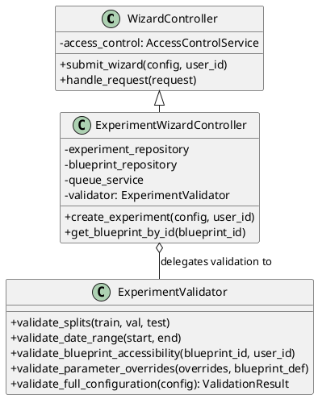

**Application 2: Isolating Session Management from Authentication Logic**

AuthenticationController mixes credential verification, password hashing, session creation, and user persistence, requiring modification when session storage changes.

To overcome this, session lifecycle management is extracted into SessionService with methods create(), destroy(), and validate(). Authentication controller now delegates session operations while retaining credential verification responsibility.

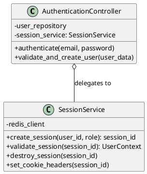

2. Open/Closed Principle (OCP)

The Open/Closed Principle mandates that software entities should be open for extension but closed for modification allowing new functionality through extension rather than altering existing code. For BEE, this enables adding new job types (e.g., portfolio optimization) without modifying core execution pipelines, critical for maintaining experiment reproducibility when extending platform capabilities.

**Application 1: Strategy Pattern for Job Execution**

The approach JobController.canceljob() includes conditional logic which analyses the nature of the hence requiring a change when new job types are introduced. This kind of design is in violation of reproducibility assurance, since the nature of job cancellation is shared among dissimilar conditional branches. A stronger solution is to have job type handlers, which is implemented using a polymorphic strategy pattern. Here the type of work has the interface of CancellableJob, and thus the type-specific cancellation logic is encapsulated here. JobController therefore forwards to a handler registry without conditional branching thus allowing the addition of new job types without any change to the underlying controller code.

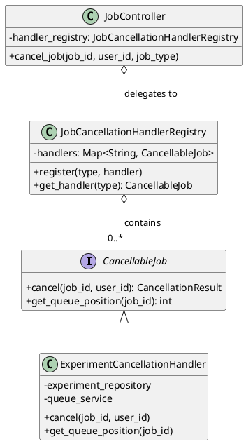

3. Liskov Substitution Principle (LSP)

The Liskov Substitution Principle requires that subclasses must be substitutable for their base classes without altering correctness. In BEE, this ensures wizard views and controllers can be safely extended (e.g., for admin-specific workflows) without breaking existing experiment creation flows or violating temporal integrity constraints in the universal experiment loop.

**Application 1: Strengthening WizardView Contract Enforcement**

WizardView subclasses could override submit() to skip validation steps, violating F3.7-F3.9 split ratio constraints when extended for specialized work-flows. Base class cannot guarantee preconditions are maintained in sub-classes.

To overcome this, restructure inheritance to use template method pattern with final validation hooks. Base WizardView defines final submit() that calls protected abstract validate_step() and persist_record() methods—ensuring validation always executes before persistence regardless of subclass implementation.

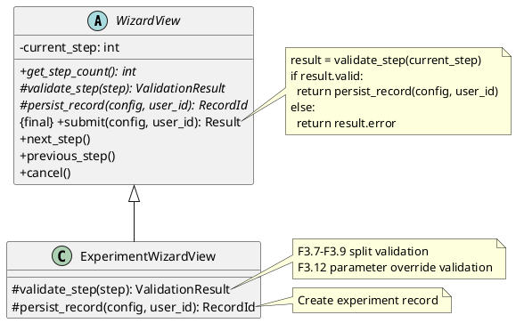

4. Interface Segregation Principle (ISP)

The Interface Segregation Principle mandates that clients should not depend on interfaces they don't use—preventing "fat" interfaces that force implementations to provide meaningless methods. For BEE, this prevents views from depending on full controller interfaces when they only need specific operations (e.g., experiment list view doesn't need export capabilities).

**Application 1: Segregating Controller Interfaces by View Responsibility**

ExperimentController exposes 10+ methods (get_detail, export_data, cancel_job, etc.), but ExperimentListView only needs get_list() while ExperimentDetailView only needs get_detail() and cancel_job(). Views depend on unnecessary methods, increasing coupling.

As an improvement to this, split controller into role-specific interfaces: ExperimentListingService (for list views), ExperimentDetailService (for detail views), ExperimentExportService (for exports). Controllers implement multiple interfaces; views depend only on required subset.

Figure 5.7 shows the ISP applied to ExperimentController class.

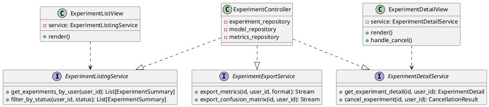

5. Dependency Inversion Principle (DIP)

The Dependency Inversion Principle requires high-level modules to depend on abstractions rather than low-level implementation details, with both depending on shared interfaces. For BEE, this decouples business logic from infrastructure concerns, enabling comprehensive unit testing without external dependencies and allowing infrastructure components to evolve independently without modifying core quant trading logic.

**Application 1: Abstracting Job Queue Infrastructure**

ExperimentWizardController depends directly on a concrete queue implementation with infrastructure-specific details. Testing experiment submission requires standing up the actual queue infrastructure; migrating to an alternative queue system would necessitate modifying all controller code that submits jobs, violating separation of concerns between business rules and
execution infrastructure.

To resolve this issue, define a JobQueue abstraction with essential operations (enqueue(), get_position(), cancel()). Controllers depend solely on this interface while concrete queue implementations reside in the infrastructure layer.

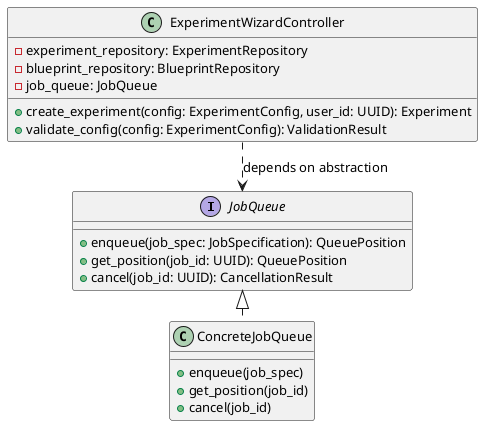

**Summary of SOLID Impact**

| Principle     | Key Improvement                                                      | Architectural Benefit                                                                                                                                                                                                           |
| ------------- | -------------------------------------------------------------------- | ------------------------------------------------------------------------------------------------------------------------------------------------------------------------------------------------------------------------------- |
| **SRP** | Separated validation, session management, and orchestration concerns | Changes to validation rules or session storage don't risk breaking core execution pipelines; enables independent testing of financial logic                                                                                     |
| **OCP** | Strategy pattern for job types                                       | New job types (e.g., portfolio optimization) added without modifying core controllers; preserves experiment reproducibility during platform evolution                                                                           |
| **LSP** | Template method pattern with final validation hooks                  | Guarantees temporal integrity constraints (F4.1) cannot be violated by subclasses; maintains split-first execution guarantees across all experiment types                                                                       |
| **ISP** | Segregated controller and repository interfaces by consumer needs    | Views depend only on required operations; reduces coupling and enables focused testing of UI components without mocking unused methods                                                                                          |
| **DIP** | Abstractions for queues, repositories, and session management        | Business logic completely decoupled from infrastructure concerns; enables comprehensive unit testing without external dependencies and permits infrastructure component substitution without modifying core quant trading logic |

#### 5.2.3 Design Patterns

> 1 introduction introducing what is Software architecture and how it helps
> Throughout the section, leverage the use of following references:
> Design Patterns: Elements of Reusable Object-Oriented Software: https://www.amazon.com/Design-Patterns-Elements-Reusable-Object-Oriented/dp/0201633612/ref=sr_1_2?s=books&sr=1-2
>
> Format:
>
> 1. {Design pattern}
>    Introduce the pattern, why we need to apply this pattern
>    {For each application}
>    In one paragraph, describe the problems and imporvement to be made
>
> * **Affected classes**:
>
> ```plantuml
>
> ```
>
> NOTE: Can be applied to more than one part of the design model, apply anywhere possible
> Use APA7 reference and citation
>
> **Summary of Design Patterns Impact (Table)**

Software architecture establishes the foundational structure of a system, while design patterns provide proven solutions to recurring design problems within that structure. As Gamma et al. (1994) established in their seminal work, design patterns represent "descriptions of communicating objects and classes that are customized to solve a general design problem in a particular context" (p. 3). In quantitative trading systems like BEE, where temporal integrity constraints and parametric exploration must coexist with evolving infrastructure requirements, design patterns enable architects to isolate volatility, enforce invariants, and extend functionality without compromising core guarantees. By applying patterns judiciously, the system achieves what the Gang of Four termed "flexibility that is not brittle"—allowing new job execution strategies to be incorporated while preserving the immutable split-first pipeline execution mandated by requirement F4.1.

1. Strategy Pattern

The Strategy pattern defines a family of algorithms, encapsulates each one, and makes them interchangeable, enabling the algorithm to vary independently from clients that use it (Gamma et al., 1994). In BEE's quant trading context, this pattern decouples volatile execution concerns—such as job cancellation mechanics—from stable domain logic, ensuring that infrastructure changes (e.g., migrating from Redis Queue to Celery) don't require modifications to core experiment orchestration.

**Application 1: Job Cancellation Strategies**

The JobController.cancel_job() method might contain conditional logic branching on job type, which may violate temporal integrity guarantees when new job types were introduced. Each new job type required modifying the controller, increasing regression risk during platform evolution and scattering cancellation logic across the codebase.

Implement type-specific cancellation handlers as Strategy implementations. Each handler encapsulates job-type-specific termination logic (e.g., SIGTERM signaling for running jobs vs. queue removal for queued jobs) while exposing a uniform cancel() interface. The controller delegates to a handler registry without conditional branching, preserving the closed-loop feedback requirement (F13.1) during job lifecycle transitions.

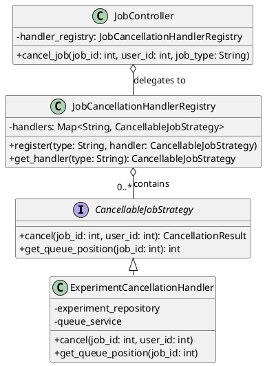

1. Factory Pattern

The Factory pattern provides an interface for creating objects without specifying their concrete classes, deferring instantiation decisions to subclasses or configuration (Gamma et al., 1994). For BEE's parametric exploration workflow, this pattern enables dynamic creation of pipeline components—such as Blueprint executors or metric calculators—based on declarative configuration rather than hardcoded instantiation, supporting exhaustive permutation generation (F3.13) without proliferating conditional logic.

**Application: Blueprint Executor Factory**

The `experiment_executor.py` module originally contained conditional logic to instantiate different executor types based on Blueprint architecture specifications (`if architecture == "logreg_binary"`), tightly coupling pipeline execution to specific model implementations. Adding new reference architectures (e.g., `xgboost_regressor.py`) required modifying core execution logic, violating temporal integrity constraints during pipeline sequencing.

Improvement: Implement a Factory that maps architecture identifiers to executor constructors. The factory reads the Blueprint's `architecture` field and returns an appropriate executor instance with preconfigured parameter validators. This Factory pattern is implemented to satisfy F3.13's requirement for exhaustive permutation generation across multiple reference architectures without modifying core execution logic.

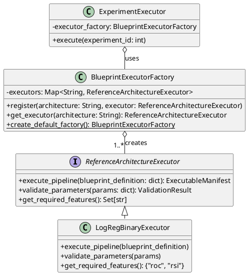

3. Template Method Pattern

The Template Method pattern defines the skeleton of an algorithm in an operation, deferring some steps to subclasses while preserving the algorithm's structure (Gamma et al., 1994). In BEE's experiment execution context, this pattern enforces the immutable split-first pipeline sequence by making the core workflow structure final while allowing controlled extension point for specialized transformations.

**Application: Experiment Execution Pipeline**

Subclasses of `Experiment` could override critical pipeline methods (e.g., `compute_indicators()`) to violate chronological ordering constraints, potentially introducing look-ahead bias when extending for specialized feature sets. The base class couldn't guarantee that temporal integrity constraints would be maintained across all experiment variants.

Implement the Experiment Execution Pipeline as a Template Method with final workflow structure. The base class defines a final `execute()` method that sequences mandatory stages (data loading, splitting, per-split indicator computation, target transformation, scaling, modeling, and evaluation) while providing protected hook for non-critical extensions. This guarantees that split-first execution cannot be violated by subclasses while supporting legitimate customization needs.

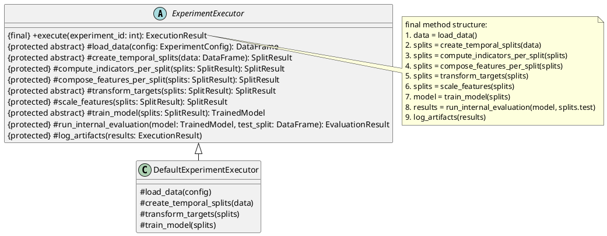

**Summary of Design Patterns Impact**

| Pattern         | Key Application                                             | Architectural Benefit                                                                                                                                                           | Requirement Alignment                                     |
| --------------- | ----------------------------------------------------------- | ------------------------------------------------------------------------------------------------------------------------------------------------------------------------------- | --------------------------------------------------------- |
| Strategy        | Job cancellation handlers                                   | Decouples volatile infrastructure concerns from stable domain logic; enables adding new job types without modifying core controllers                                            | F9.9–F9.12 (job cancellation)                            |
| Factory         | Blueprint executor instantiation based on architecture type | Defers component creation to configuration; satisfies F3.13 by enabling exhaustive permutation generation across reference architectures without modifying core execution logic | F3.13 (permutation generation)                            |
| Template Method | Experiment Execution Pipeline                               | Enforces immutable split-first sequencing while allowing controlled extension points; guarantees temporal integrity cannot be violated by subclasses                            | F4.1 (temporal integrity), F3.7–F3.9 (split constraints) |

#### 5.2.4 Cohesion and Coupling

> List all the objects we have so far, from chapter 0 to chapter 5.2.3
> Package them (leads to n-tier architecture but no explicit mention)
>
> Start with a paragraph introducing the concept, how it applies to our project, whats the benefit

**Package Structure Table**

> Summarizes the package, what objects included in that package, cohesion analysis, coupling analysis (all short and precise)

Cohesion and coupling represent fundamental structural quality attributes that directly impact system maintainability and evolution capacity in quantitative trading platforms. High cohesion ensures that components within a package share a single, well-defined responsibility—critical for isolating volatile concerns from stable domain logic such as temporal split integrity. Loose coupling minimizes interdependencies between packages through abstraction boundaries, enabling infrastructure components (e.g., job queues) to evolve independently without destabilizing core experiment execution logic. In BEE's parametric optimization context, these principles prevent "ripple effects" where changes to UI workflows inadvertently compromise financial calculation correctness or where infrastructure migrations require modifications to domain entities—preserving the immutable pipeline sequencing mandated by requirement F4.1 while supporting platform extensibility.

**Package Structure Table**

| Package                  | Objects Included                                                                                                                                                                                                                                                                                                                                                                                                                                                                                        | Cohesion Analysis                                                                                                                                                                                                                                                                                     | Coupling Analysis                                                                                                                                                                                                              |
| ------------------------ | ------------------------------------------------------------------------------------------------------------------------------------------------------------------------------------------------------------------------------------------------------------------------------------------------------------------------------------------------------------------------------------------------------------------------------------------------------------------------------------------------------- | ----------------------------------------------------------------------------------------------------------------------------------------------------------------------------------------------------------------------------------------------------------------------------------------------------- | ------------------------------------------------------------------------------------------------------------------------------------------------------------------------------------------------------------------------------ |
| `views`             | `BaseView`, `WizardView`, `LandingPageView`, `RegistrationView`, `LoginView`, `DashboardView`, `UserProfileView`, `ExperimentListView`, `ExperimentWizardView`, `ExperimentDetailView`, `ModelsRankingsView`, `ModelsLibraryView`, `ModelDetailView`, `BlueprintsLibraryView`, `BlueprintDetailView`, `BlueprintWizardView`, `BlueprintModerationView`, `DocumentationView`, `UserManagementView`, `SystemManagementView`, `JobDetailView`, `PublicHubView` | **High** – All objects exclusively handle presentation concerns: rendering UI components, managing navigation flows, and translating user interactions into controller invocations. No business logic or data persistence responsibilities leak into this package.                             | **Loose** – Depends only on controller/service interfaces (e.g., `ExperimentListingService`, `ExperimentDetailService` via ISP segregation). No direct dependencies on concrete implementations or domain entities. |
| `controllers`      | `AuthenticationController`, `UserController`, `DashboardController`, `WizardController`, `ExperimentWizardController`, `ExperimentController`, `ModelsRankingsController`, `ModelsLibraryController`, `ModelController`, `BlueprintsLibraryController`, `BlueprintWizardController`, `BlueprintController`, `BlueprintApprovalController`, `PublicHubController`, `DocumentationController`, `JobController`                                                            | **High** – Each controller exclusively handles HTTP request orchestration: authentication checks, input validation delegation, service invocation, and response formatting. SRP-refactored validators extracted to separate package prevent responsibility bloat.                              | **Medium** – Depends on service abstractions (`ExperimentValidator`, `SessionService`) and repository interfaces. DIP-compliant through interface dependencies rather than concrete implementations.                |
| `services`         | `AccessControlService`, `SessionService`, `JobQueue` (service-level protocol), `QueueService`, `VersioningService`                                                                                                                                                                                                                                                                                                                                                                              | **High** – Encapsulates cross-cutting application services: authentication/session lifecycle, queue abstraction, queue orchestration, access control, and Blueprint version lineage management. Responsibilities remain service-oriented and infrastructure-agnostic at the abstraction boundary.                                                                                   | **Loose** – Services expose abstractions consumed by controllers and are implemented by infrastructure components where needed (for example, queue broker adapters). This preserves strict layered flow without placing infrastructure contracts in the domain layer. |
| `validators`       | `ExperimentValidator`, `BlueprintValidator`                                                                                                                                                                                                                                                                                                                                                                                                                                                         | **High** – Pure validation logic with no side effects. Each validator exclusively enforces business rules for its domain (e.g., `ExperimentValidator` handles F3.7-F3.9 split constraints, F3.12 parameter override validation). Stateless and testable in isolation.                        | **Loose** – Zero dependencies on infrastructure or presentation layers. Accepts plain data structures (DTOs) and returns `ValidationResult` value objects.                                                            |
| `strategies`       | `CancellableJobStrategy`, `ExperimentCancellationHandler`, `JobCancellationHandlerRegistry`, `ReferenceArchitectureExecutor`, `LogRegBinaryExecutor`, `BlueprintExecutorFactory`                                                                                                                                                                                                                                                                                                            | **High** – Strategy implementations encapsulate interchangeable algorithms with identical interfaces. Each handler has single responsibility: `ExperimentCancellationHandler` terminates experiment jobs. Factory classes provide creation logic without violating SRP.                      | **Loose** – Strategies depend only on shared interfaces (`CancellableJobStrategy`). Registry classes use composition to manage strategy collections without tight coupling to concrete implementations.               |
| `models`        | `User`, `Blueprint`, `Experiment`, `Model`, `FavoriteModel`, `FavoriteBlueprint`, `ExperimentConfusionMetrics`, `BTCUSDTKline`                                                                                                                                                                                                                                                                                                                                                          | **High** – Pure domain entities containing business state and invariant enforcement logic. `Experiment` encapsulates temporal split constraints; `Blueprint` enforces versioning rules; `Model` contains parametric permutation data. No infrastructure concerns leak into domain layer. | **Loose** – Entities depend only on other domain objects and value types. No dependencies on controllers, services, or infrastructure components—preserving domain purity per layered architecture constraints.        |
| `executors`     | `ExperimentExecutor`, `DefaultExperimentExecutor`                                                                                                                                                                                                                                                                                                                                                                                                                                                   | **High** – Template Method pattern implementation enforcing immutable pipeline sequencing (F4.1). Base class defines final execution skeleton; concrete executors implement protected hooks without violating temporal integrity constraints.                                                  | **Medium** – Depends on domain entities (`Experiment`, `Model`) and executor abstractions (`ReferenceArchitectureExecutor`). All dependencies flow downward per layered architecture rules.                       |
| `value_objects` | `ValidationResult`, `CancellationResult`, `JobSpecification`, `QueuePosition`                                                                                                                                                                                                                                                                                                                                                                                                                   | **High** – Immutable data structures representing conceptual wholes: `ValidationResult` encapsulates validation outcome. No behavior beyond data representation.                                                                                                                             | **Loose** – Zero dependencies. Pure data carriers used across layer boundaries without introducing coupling.                                                                                                            |

#### 5.2.5 Final Design Model

> Final Design Model of all the concepts we applied so far to the desing, FULL plantuml diagram, with package, object, attributes, methods, and relationship fully shown

```plantuml
@startuml Final Design Model - Complete System Architecture
skinparam packageStyle rectangle
skinparam wrapWidth 200
skinparam nodesep 10
skinparam ranksep 15
skinparam defaultFontSize 11
skinparam shadowing false
skinparam classAttributeIconSize 0
skinparam classFontSize 11
skinparam classFontName "Courier New"
skinparam defaultFontName "Courier New"

package "views" {
  abstract class BaseView {
    -request_context: RequestContext
    +render(): Response
    +handle_user_input(data: dict): Response
    +show_message(message: str, type: str): None
    +navigate_to(route: str, params: dict): Response
  }
  
  abstract class WizardView extends BaseView {
    -current_step: int
    -config: dict
    +get_step_count(): int
    +validate_step(step: int): ValidationResult
    +next_step(): Response
    +previous_step(): Response
    +submit(): Response
    +cancel(): Response
  }
  
  class LandingPageView extends BaseView {
    +render_landing_page(): Response
    +navigate_to_login(): Response
    +navigate_to_register(): Response
  }
  
  class RegistrationView extends BaseView {
    +display_registration_form(): Response
    +submit_registration(user_data: dict): Response
    +display_validation_error(errors: list): Response
    +navigate_to_login(): Response
  }
  
  class LoginView extends BaseView {
    +display_login_form(): Response
    +submit_login(credentials: dict): Response
    +display_auth_error(message: str): Response
    +navigate_to_register(): Response
  }
  
  class DashboardView extends BaseView {
    +render_dashboard(data: dict): Response
    +navigate_to_experiment_wizard(): Response
    +navigate_to_experiment_detail(experiment_id: int): Response
  }
  
  class UserProfileView extends BaseView {
    +render_user_profile(data: dict): Response
    +navigate_to_detail(item_type: str, item_id: int): Response
  }
  
  class ExperimentListView extends BaseView {
    +render_experiment_list(experiments: list): Response
    +filter_by_status(status: str): Response
    +navigate_to_experiment_wizard(): Response
    +navigate_to_experiment_detail(experiment_id: int): Response
  }
  
  class ExperimentWizardView extends WizardView {
    +render_step1_basics(): Response
    +render_step2_data(): Response
    +render_step3_splits(): Response
    +render_step4_blueprint(): Response
    +render_step4_5_parameter_overrides(): Response
    +render_step5_review(): Response
    +render_step6_start(): Response
  }
  
  class ExperimentDetailView extends BaseView {
    +render_experiment_detail(data: dict): Response
    +download_metrics(export_type: str): Response
  }
  
  class ModelsRankingsView extends BaseView {
    +render_ranked_models(models: list): Response
    +sort_models_by(column: str): Response
    +filter_models(filters: dict): Response
    +navigate_to_model_detail(model_id: int): Response
  }
  
  class ModelsLibraryView extends BaseView {
    +render_library(owned: list, favorited: list): Response
    +switch_tab(tab: str): Response
    +remove_from_favorites(model_id: int): Response
    +navigate_to_model_detail(model_id: int): Response
  }
  
  class ModelDetailView extends BaseView {
    +render_model_detail(data: dict): Response
  }
  
  class BlueprintsLibraryView extends BaseView {
    +render_library(owned: list, favorited: list): Response
    +switch_tab(tab: str): Response
    +remove_from_favorites(blueprint_id: int): Response
    +navigate_to_blueprint_detail(blueprint_id: int): Response
  }
  
  class BlueprintDetailView extends BaseView {
    +render_blueprint_detail(data: dict): Response
    +request_approval(blueprint_id: int): Response
    +edit_blueprint(blueprint_id: int): Response
  }
  
  class BlueprintWizardView extends WizardView {
    +render_step1_basics(): Response
    +render_step2_indicators(): Response
    +render_step3_features(): Response
    +render_step4_reference_model(): Response
    +render_step5_review(): Response
  }
  
  class BlueprintModerationView extends BaseView {
    +render_moderation_queue(blueprints: list): Response
    +approve_blueprint(blueprint_id: int): Response
    +reject_blueprint(blueprint_id: int): Response
    +disapprove_blueprint(blueprint_id: int): Response
  }
  
  
  class DocumentationView extends BaseView {
    +render_documentation_list(docs: list): Response
    +render_documentation_content(content: dict): Response
    +export_documentation(slug: str): Response
  }
  
  class UserManagementView extends BaseView {
    +render_user_management(users: list): Response
    +search_users(query: str): Response
    +create_user(form_data: dict): Response
    +edit_user(user_id: int, updates: dict): Response
    +enable_disable_user(user_id: int, status: str): Response
    +reset_password(user_id: int): Response
    +remove_user(user_id: int): Response
  }
  
  class SystemManagementView extends BaseView {
    +render_system_dashboard(data: dict): Response
    +update_concurrency_limit(limit_type: str, limit: int): Response
    +update_session_timeout(minutes: int): Response
  }
  
  class JobDetailView extends BaseView {
    +render_job_detail(data: dict): Response
    +cancel_job(job_id: int): Response
    +confirm_cancellation(): Response
  }
  
  class PublicHubView extends BaseView {
    +render_public_hub(data: dict): Response
    +search_by_owner(query: str): Response
    +filter_by_owner(owner: str): Response
    +navigate_to_tab(tab: str): Response
  }
}

package "interfaces" {
  interface ExperimentListingService <<Protocol>> {
    +get_experiments_by_user(user_id: int): list
    +filter_by_status(user_id: int, status: str): list
  }

  interface ExperimentDetailService <<Protocol>> {
    +get_experiment_detail(experiment_id: int, user_id: int): Response
    +cancel_experiment(experiment_id: int, user_id: int): CancellationResult
  }

  interface ExperimentExportService <<Protocol>> {
    +export_experiment_data(experiment_id: int, export_type: str): Response
  }
}

package "controllers" {
  abstract class WizardController {
    -access_control: AccessControlService
    -validator: Validator
    +validate_configuration(config: dict): ValidationResult
    +create_record(config: dict, user_id: int): int
    +submit_wizard(config: dict, user_id: int): Response
    +handle_request(request: Request): Response
  }
  
  class AuthenticationController {
    -user_repository: UserRepository
    -session_service: SessionService
    -access_control: AccessControlService
    +validate_and_create_user(user_data: dict): Response
    +authenticate(email: str, password: str): Response
    +create_server_session(user_id: int, role: str): str
    +logout(session_id: str): Response
    +handle_request(request: Request): Response
  }
  
  class UserController {
    -user_repository: UserRepository
    -access_control: AccessControlService
    +get_user_profile(target_user_id: int, current_user_id: int): Response
    +get_current_user(session_id: str): Response
    +create_user(form_data: dict, role: str): Response
    +update_user(user_id: int, updates: dict): Response
    +enable_disable_user(user_id: int, status: str): Response
    +reset_password(user_id: int, new_password: str): Response
    +delete_user(user_id: int): Response
    +handle_request(request: Request): Response
  }
  
  class DashboardController {
    -experiment_repository: ExperimentRepository
    -access_control: AccessControlService
    +load_dashboard(user_id: int): Response
    +get_experiment_summary(user_id: int): Response
    +get_recent_experiments(user_id: int, limit: int): Response
    +handle_request(request: Request): Response
  }
  
  class ExperimentWizardController extends WizardController {
    -experiment_repository: ExperimentRepository
    -blueprint_repository: BlueprintRepository
    -job_queue: JobQueue
    -validator: ExperimentValidator
    +create_experiment(config: dict, user_id: int): Response
    +get_blueprint_by_id(blueprint_id: int): Response
    +validate_config(config: dict): ValidationResult
    +validate_configuration(config: dict): ValidationResult
    +create_record(config: dict, user_id: int): int
  }
  
  class ExperimentController {
    -experiment_repository: ExperimentRepository
    -model_repository: ModelRepository
    -metrics_repository: MetricsRepository
    -access_control: AccessControlService
    +get_experiment_detail(experiment_id: int, user_id: int): Response
    +export_experiment_data(experiment_id: int, export_type: str): Response
    +find_by_id_and_verify_access(experiment_id: int, user_id: int): Experiment
    +handle_request(request: Request): Response
  }
  
  
  class ModelsRankingsController {
    -model_repository: ModelRepository
    -access_control: AccessControlService
    +get_ranked_models(user_id: int, sort_by: str, filters: dict): Response
    +handle_request(request: Request): Response
  }
  
  class ModelController {
    -model_repository: ModelRepository
    -experiment_repository: ExperimentRepository
    -blueprint_repository: BlueprintRepository
    -favorite_model_repository: FavoriteModelRepository
    -access_control: AccessControlService
    +get_model_detail(model_id: int, user_id: int): Response
    +toggle_favorite_model(user_id: int, model_id: int): Response
    +find_by_id_and_verify_access(model_id: int, user_id: int): Model
    +handle_request(request: Request): Response
  }
  
  class ModelsLibraryController {
    -model_repository: ModelRepository
    -favorite_model_repository: FavoriteModelRepository
    -access_control: AccessControlService
    +get_models_library(user_id: int): Response
    +remove_favorite_model(user_id: int, model_id: int): Response
    +handle_request(request: Request): Response
  }
  
  class BlueprintWizardController extends WizardController {
    -blueprint_repository: BlueprintRepository
    -versioning_service: VersioningService
    -validator: BlueprintValidator
    +submit_blueprint_configuration(config: dict, user_id: int, blueprint_id: int): Response
    +validate_blueprint_configuration(config: dict): ValidationResult
    +validate_configuration(config: dict): ValidationResult
    +create_record(config: dict, user_id: int): int
  }
  
  class BlueprintController {
    -blueprint_repository: BlueprintRepository
    -favorite_blueprint_repository: FavoriteBlueprintRepository
    -access_control: AccessControlService
    +get_blueprint_detail(blueprint_id: int, user_id: int): Response
    +find_by_id_and_verify_access(blueprint_id: int, user_id: int): Blueprint
    +get_version_lineage(blueprint_id: int): Response
    +handle_request(request: Request): Response
  }
  
  class BlueprintsLibraryController {
    -blueprint_repository: BlueprintRepository
    -favorite_blueprint_repository: FavoriteBlueprintRepository
    -access_control: AccessControlService
    +get_blueprints_library(user_id: int): Response
    +remove_favorite_blueprint(user_id: int, blueprint_id: int): Response
    +handle_request(request: Request): Response
  }
  
  class BlueprintApprovalController {
    -blueprint_repository: BlueprintRepository
    -versioning_service: VersioningService
    -access_control: AccessControlService
    +request_approval(blueprint_id: int, user_id: int): Response
    +moderate_blueprint(blueprint_id: int, staff_id: int, action: str): Response
    +disapprove_blueprint(blueprint_id: int, staff_id: int): Response
    +handle_request(request: Request): Response
  }
  
  
  class PublicHubController {
    -user_repository: UserRepository
    -experiment_repository: ExperimentRepository
    -model_repository: ModelRepository
    -blueprint_repository: BlueprintRepository
    -access_control: AccessControlService
    +get_public_hub_data(user_id: int): Response
    +search_public_hub(user_id: int, query: str): Response
    +handle_request(request: Request): Response
  }
  
  class DocumentationController {
    -document_service: DocumentService
    -access_control: AccessControlService
    +get_documentation_list(user_id: int): Response
    +get_documentation_content(slug: str): Response
    +export_documentation(slug: str): Response
    +handle_request(request: Request): Response
  }
  
  class JobController {
    -experiment_repository: ExperimentRepository
    -queue_service: QueueService
    -handler_registry: JobCancellationHandlerRegistry
    -access_control: AccessControlService
    +get_job_detail(job_id: int, user_id: int, job_type: str): Response
    +cancel_job(job_id: int, user_id: int, job_type: str): Response
    +handle_request(request: Request): Response
  }
}

package "repositories" {
  interface UserRepository <<Protocol>>
  interface ExperimentRepository <<Protocol>>
  interface ModelRepository <<Protocol>>
  interface BlueprintRepository <<Protocol>>
  interface FavoriteModelRepository <<Protocol>>
  interface FavoriteBlueprintRepository <<Protocol>>
  interface MetricsRepository <<Protocol>>
}

package "validators" {
  class ExperimentValidator {
    +validate_splits(train_split: float, val_split: float, test_split: float): ValidationResult
    +validate_date_range(start_date: date, end_date: date): ValidationResult
    +validate_symbol_constraint(symbol: str): ValidationResult
    +validate_blueprint_accessibility(blueprint_id: int, user_id: int): ValidationResult
    +validate_parameter_overrides(overrides: dict, blueprint_definition: dict): ValidationResult
    +validate_full_configuration(config: dict): ValidationResult
  }
  
  class BlueprintValidator {
    +validate_indicator_parameters(indicators: list): ValidationResult
    +validate_feature_parameters(features: list): ValidationResult
    +validate_architecture_parameters(architecture: dict): ValidationResult
    +validate_blueprint_configuration(config: dict): ValidationResult
  }
}

package "services" {
  class AccessControlService {
    -session_store: SessionStore
    +check_authentication_status(session_id: str): bool
    +verify_session(session_id: str): UserContext
    +extract_user_id_from_session(session_id: str): int
    +check_permission(user: User, required_role: str): bool
  }
  
  class SessionService {
    -redis_client: RedisClient
    +create_session(user_id: int, role: str): str
    +validate_session(session_id: str): UserContext
    +destroy_session(session_id: str): bool
    +set_cookie_headers(session_id: str, response: Response): Response
  }

  interface JobQueue <<Protocol>> {
    +enqueue(job_spec: JobSpecification): QueuePosition
    +get_position(job_id: int): QueuePosition
    +cancel(job_id: int): CancellationResult
  }
  
  class QueueService {
    -broker: JobQueue
    -worker_pool: WorkerPool
    +enqueue_job(job_type: str, job_id: int, priority: int): QueuePosition
    +get_queue_position(job_id: int): QueuePosition
    +remove_job_from_queue(job_id: int): bool
    +get_active_jobs(): list
    +cancel_running_job(job_id: int): CancellationResult
  }
  
  class VersioningService {
    -blueprint_repository: BlueprintRepository
    +create_versioned_copy(blueprint_id: int, config: dict): Blueprint
    +increment_version_number(version: int): int
    +set_parent_reference(parent_id: int): int
  }
}

package "queues" {
  class RedisJobQueue {
    +enqueue(job_spec: JobSpecification): QueuePosition
    +get_position(job_id: int): QueuePosition
    +cancel(job_id: int): CancellationResult
  }
}

package "strategies" {
  interface CancellableJobStrategy {
    +cancel(job_id: int, user_id: int): CancellationResult
    +get_queue_position(job_id: int): QueuePosition
  }
  
  class ExperimentCancellationHandler implements CancellableJobStrategy {
    -experiment_repository: ExperimentRepository
    -queue_service: QueueService
    +cancel(job_id: int, user_id: int): CancellationResult
    +get_queue_position(job_id: int): QueuePosition
  }
  
  class JobCancellationHandlerRegistry {
    -handlers: dict
    +register(job_type: str, handler: CancellableJobStrategy): None
    +get_handler(job_type: str): CancellableJobStrategy
  }
  
  
  interface ReferenceArchitectureExecutor {
    +execute_pipeline(blueprint_definition: dict): ExecutableManifest
    +validate_parameters(params: dict): ValidationResult
    +get_required_features(): set
  }
  
  class LogRegBinaryExecutor implements ReferenceArchitectureExecutor {
    +execute_pipeline(blueprint_definition: dict): ExecutableManifest
    +validate_parameters(params: dict): ValidationResult
    +get_required_features(): set
  }
  
  class BlueprintExecutorFactory {
    -executors: dict
    +register(architecture: str, executor: ReferenceArchitectureExecutor): None
    +get_executor(architecture: str): ReferenceArchitectureExecutor
    +create_default_factory(): BlueprintExecutorFactory
  }
}

package "models" {  
  class User {
    -username: str
    -email: str
    -password_hash: str
    -name: str
    -role: str
    -status: str
    +get_owner_id(): int
    +set_owner_id(user_id: int): None
    +hash_password(password: str): str
    +verify_password(password: str): bool
  }
  
  class Blueprint {
    -user_id: int
    -name: str
    -description: str
    -indicators: list
    -features: list
    -architecture: dict
    -approval_state: str
    -submitted_at: datetime
    -version: int
    -parent_id: int
    +get_owner_id(): int
    +set_owner_id(user_id: int): None
    +get_version(): int
    +get_parent_id(): int
    +is_versioned(): bool
    +is_editable_by(user: User): bool
    +can_transition_to(new_state: str): bool
  }
  
  class Experiment {
    -user_id: int
    -blueprint_id: int
    -name: str
    -description: str
    -interval: str
    -start_date: date
    -end_date: date
    -train_split: float
    -val_split: float
    -test_split: float
    -parameter_overrides: dict
    -status: str
    -progress: float
    -success: bool
    -completed_at: datetime
    -models: list
    +get_owner_id(): int
    +set_owner_id(user_id: int): None
    +is_completed(): bool
    +is_accessible_by(user: User): bool
    +get_parameter_permutations(): list
  }
  
  class Model {
    -experiment_id: int
    -parameters: dict
    -sharpe: float
    -accuracy: float
    -precision: float
    -recall: float
    -fpr: float
    -auc: float
    -max_drawdown: float
    -win_rate: float
    +generate_trading_signal(features: dict): int
    +is_long_only(): bool
  }
  
  class FavoriteModel {
    -user_id: int
    -model_id: int
    +get_target_type(): str
  }
  
  class FavoriteBlueprint {
    -user_id: int
    -blueprint_id: int
    +get_target_type(): str
  }
  
  class ExperimentConfusionMetrics {
    -experiment_id: int
    -model_id: int
    -split: str
    -accuracy: float
    -precision: float
    -recall: float
    -fpr: float
    -auc: float
  }
  
  
  class BTCUSDTKline {
    -timestamp: datetime
    -open: float
    -high: float
    -low: float
    -close: float
    -volume: float
    +to_ohlcv(): dict
  }
}

package "value_objects" {
  class ValidationResult <<immutable>> {
    -valid: bool
    -errors: list
    -warnings: list
    +is_valid(): bool
    +get_errors(): list
  }
  
  class CancellationResult <<immutable>> {
    -success: bool
    -job_id: int
    -status: str
    -message: str
  }
  
  class JobSpecification <<immutable>> {
    -job_type: str
    -job_id: int
    -priority: int
    -user_id: int
    -created_at: datetime
  }
  
  class QueuePosition <<immutable>> {
    -position: int
    -estimated_wait_seconds: int
    -queue_length: int
  }
}

package "executors" {
  abstract class ExperimentExecutor {
    {final} +execute(experiment_id: int): ExecutionResult
    #load_data(config: ExperimentConfig): DataFrame
    #create_temporal_splits(data: DataFrame): SplitResult
    #compute_indicators_per_split(splits: SplitResult): SplitResult
    #compose_features_per_split(splits: SplitResult): SplitResult
    #transform_targets(splits: SplitResult): SplitResult
    #scale_features(splits: SplitResult): SplitResult
    #train_model(splits: SplitResult): TrainedModel
    #run_internal_evaluation(model: TrainedModel, test_split: DataFrame): EvaluationResult
    #log_artifacts(results: ExecutionResult): None
  }
  
  class DefaultExperimentExecutor extends ExperimentExecutor {
    #load_data(config: ExperimentConfig): DataFrame
    #create_temporal_splits(data: DataFrame): SplitResult
    #transform_targets(splits: SplitResult): SplitResult
    #train_model(splits: SplitResult): TrainedModel
  }
  
}

' ===== VIEW → CONTROLLER DEPENDENCIES =====
LandingPageView ..> AuthenticationController
RegistrationView ..> AuthenticationController
LoginView ..> AuthenticationController
DashboardView ..> DashboardController
UserProfileView ..> UserController
ExperimentListView ..> ExperimentListingService
ExperimentWizardView ..> ExperimentWizardController
ExperimentDetailView ..> ExperimentDetailService
ModelsRankingsView ..> ModelsRankingsController
ModelsLibraryView ..> ModelsLibraryController
ModelDetailView ..> ModelController
BlueprintsLibraryView ..> BlueprintsLibraryController
BlueprintDetailView ..> BlueprintController
BlueprintWizardView ..> BlueprintWizardController
BlueprintModerationView ..> BlueprintApprovalController
DocumentationView ..> DocumentationController
UserManagementView ..> UserController
SystemManagementView ..> UserController
SystemManagementView ..> QueueService
JobDetailView ..> JobController
PublicHubView ..> PublicHubController

' ===== INTERFACE REALIZATION (ISP) =====
ExperimentController ..|> ExperimentListingService
ExperimentController ..|> ExperimentDetailService
ExperimentController ..|> ExperimentExportService

' ===== CONTROLLER → SERVICE/VALIDATOR DEPENDENCIES =====
AuthenticationController ..> SessionService
AuthenticationController ..> AccessControlService
DashboardController ..> AccessControlService
WizardController ..> AccessControlService
ExperimentWizardController ..> ExperimentValidator
ExperimentWizardController ..> JobQueue
ExperimentController ..> AccessControlService
ModelsRankingsController ..> AccessControlService
ModelController ..> AccessControlService
ModelsLibraryController ..> AccessControlService
BlueprintWizardController ..> BlueprintValidator
BlueprintWizardController ..> VersioningService
BlueprintController ..> AccessControlService
BlueprintsLibraryController ..> AccessControlService
BlueprintApprovalController ..> AccessControlService
BlueprintApprovalController ..> VersioningService
PublicHubController ..> AccessControlService
DocumentationController ..> AccessControlService
UserController ..> AccessControlService
JobController ..> AccessControlService
JobController ..> QueueService
JobController ..> JobCancellationHandlerRegistry

' ===== SERVICE ABSTRACTION REALIZATION (DIP) =====
RedisJobQueue ..|> JobQueue
QueueService ..> JobQueue

' ===== STRATEGY PATTERN RELATIONSHIPS =====
JobCancellationHandlerRegistry o-- "0..*" CancellableJobStrategy
BlueprintExecutorFactory o-- "0..*" ReferenceArchitectureExecutor

' ===== DOMAIN ENTITY RELATIONSHIPS =====
User ||--o{ Blueprint : owns
User ||--o{ FavoriteModel : favorites
User ||--o{ FavoriteBlueprint : favorites

Blueprint }o--|| Blueprint : versions
Blueprint ||--o{ Experiment : used_in

Experiment ||--* Model : produces
Experiment ||--o{ ExperimentConfusionMetrics : generates

Model ||--o{ FavoriteModel : favorited_by
Blueprint ||--o{ FavoriteBlueprint : favorited_by

' ===== EXECUTOR → STRATEGY DEPENDENCIES =====
DefaultExperimentExecutor ..> BlueprintExecutorFactory

' ===== CONTROLLER → DOMAIN DEPENDENCIES (via repositories) =====
ExperimentWizardController ..> Blueprint
ExperimentController ..> Experiment
ExperimentController ..> Model
ModelController ..> Model
BlueprintController ..> Blueprint
JobController ..> Experiment

' ===== VALUE OBJECT USAGE =====
ExperimentValidator ..> ValidationResult
BlueprintValidator ..> ValidationResult
QueueService ..> QueuePosition
JobController ..> CancellationResult
JobCancellationHandlerRegistry ..> CancellableJobStrategy

@enduml
```

### 5.3 Software Architecture

> 1 introduction introducing what is Software architecture and how it helps
> Throughout the section, leverage the use of following references:
> Object-Oriented Software Engineering Using UML, Patterns, and Java: https://www.amazon.com/Object-Oriented-Software-Engineering-Using-Patterns-dp-1292024011/dp/1292024011/ref=dp_ob_title_bk
> Clean Architecture: https://www.amazon.com/dp/0134494164/ref=mes-dp?_encoding=UTF8
>
> Review 3 Architectures, and pick 1 as the final decision architecture. (Layered (N-Tier) Architecture)
> Use APA7 reference and citation

Software architecture establishes the foundational structure that defines component organization, interaction protocols, and critical constraints governing system evolution (Bruegge & Dutoit, 2010). For quantitative trading platforms like BEE—where temporal integrity constraints (F4.1) and parametric reproducibility are non-negotiable—architecture serves as the enforcement mechanism for domain invariants. A well-chosen architecture prevents "concern entanglement" where UI modifications inadvertently corrupt financial calculations or infrastructure migrations destabilize core experiment logic. As Martin (2017) emphasizes, architecture represents "the important stuff... that's hard to change later"; selecting an appropriate pattern upfront ensures the immutable split-first pipeline sequencing mandated by requirements remains protected throughout the system lifecycle while enabling independent evolution of job execution strategies and data persistence mechanisms.

#### 5.3.1 Layered (N-Tier) Architecture

> 1 paragraphs for the description, how it helps in our project
> A general Architecture diagram completely not related to this project, just a conceptual diagram.
> Pros:...
> Cons:...

Layered architecture organizes system components into discrete horizontal layers with strict unidirectional dependencies flowing downward (Presentation → Business Logic → Data Access). For BEE, this pattern enforces critical separation between Bitcoin-native quantitative logic (Business Layer) and infrastructure concerns (Data Layer), ensuring temporal integrity constraints (F4.1) cannot be violated by presentation-layer modifications. The architecture naturally aligns with the Chapter 1 scope statement that positions the system as a monolithic web application with tightly controlled layers for maintainability, while providing clear boundaries for testing: business rules validate against mock repositories without database dependencies, and UI components interact solely with controller interfaces. This structure directly supports requirement F13.1 (row-level security) by centralizing access checks within the Business Layer before any Data Layer interaction occurs.

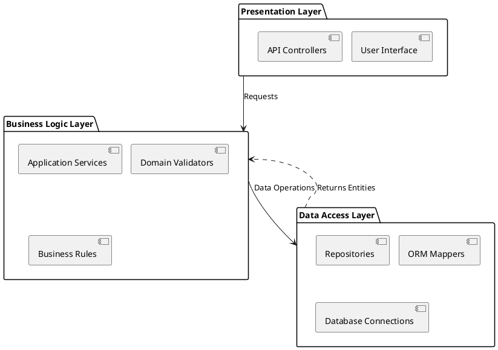

**Pros:**
✓ Enforces strict separation of concerns with unidirectional dependency flow
✓ Simplifies testing through clear layer boundaries (mock repositories for business logic)
✓ Aligns with the Chapter 1 scope statement for a single-deployment web application
✓ Reduces cognitive overhead for team onboarding compared to complex patterns
✓ Naturally supports transaction management at Data Layer boundaries

**Cons:**
✗ Potential performance overhead from layer traversal in high-frequency operations
✗ Risk of "anemic domain model" if business logic leaks into controllers
✗ Less flexible for microservices migration without significant refactoring

#### 5.3.2 Model–View–Controller (MVC) Architecture

> 1 paragraphs for the description, how it helps in our project
> A general Architecture diagram completely not related to this project, just a conceptual diagram.
> Pros:...
> Cons:...

MVC separates application concerns into three interconnected components: Model (domain data/business rules), View (presentation logic), and Controller (input handling/routing). While MVC excels in traditional web applications with heavy server-side rendering, BEE's hybrid architecture creates tension in MVC's responsibility boundaries. The pattern would force complex experiment pipeline logic (F4.1) into Controllers, violating Single Responsibility Principle (SRP) and scattering temporal integrity constraints across routing handlers. Additionally, MVC's tight coupling between Views and Models complicates the platform's requirement for specialized client interfaces, as presentation concerns would become entangled with domain entities.

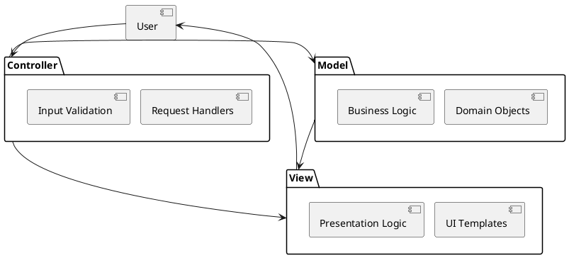

**Pros:**
✓ Clear separation between presentation and domain logic
✓ Well-supported by Flask framework conventions
✓ Simplifies server-side rendering workflows

**Cons:**
✗ Controllers become bloated with complex pipeline orchestration (violates SRP)
✗ Tight View-Model coupling complicates client-side specializations
✗ No explicit layer for cross-cutting concerns (authentication, validation)
✗ Difficult to enforce unidirectional dependencies (Views may inadvertently access Models)

#### 5.3.3 Hexagonal Architecture (Ports & Adapters)

> 1 paragraphs for the description, how it helps in our project
> A general Architecture diagram completely not related to this project, just a conceptual diagram.
> Pros:...
> Cons:...

Hexagonal architecture (Ports & Adapters) positions domain logic at the core, surrounded by inbound/outbound ports with adapter implementations for external systems (Martin, 2017). While theoretically ideal for isolating Bitcoin-native quant logic from infrastructure concerns, this pattern introduces significant overhead for BEE's Chapter 1 scope, which defines a monolithic deployment with cohesive layers. Defining explicit ports for every repository interface (e.g., `ExperimentRepositoryPort`, `BlueprintRepositoryPort`) creates excessive abstraction layers when the Data Access Layer already provides sufficient encapsulation via SQLAlchemy repositories. The pattern's inversion of control also complicates the Experiment Execution Pipeline's (F4.1) deterministic execution flow, requiring complex dependency injection configurations for components that naturally belong to a single deployment unit.

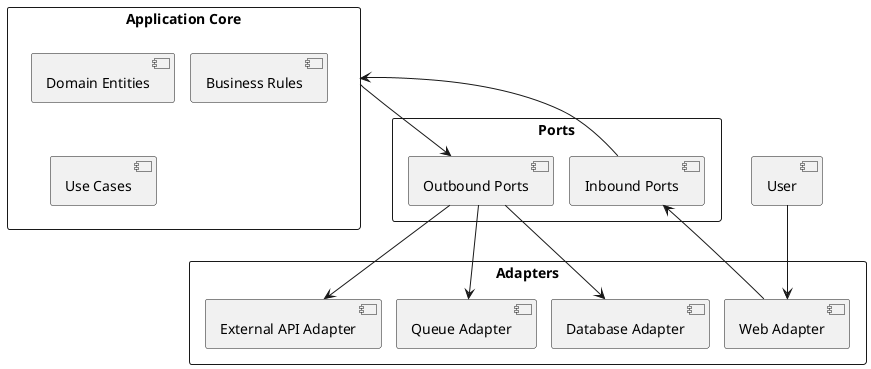

**Pros:**
✓ Maximum isolation of domain logic from infrastructure concerns
✓ Excellent testability through port mocking
✓ Framework-agnostic core business logic

**Cons:**
✗ Significant abstraction overhead for monolithic application scope
✗ Complex dependency injection requirements for deterministic pipeline execution
✗ Steep learning curve for quant-focused development team
✗ Over-engineering for requirements already satisfied by layered approach

#### 5.3.4 Selected Architecture

> Selected Layered (N-Tier) Architecture
> Reason, how is it the BEST?

The choice of Layered (N -Tier) Architecture as the basis of BEE architecture is unquestionably justified by three key reasons, which comply with the constraints and requirements of the project.

1. **Simplicity**:  The concept of hexagonal architecture creates unwarranted ports and adapters that do not fulfil the lower cognitive overhead requirement, and MVC does not offer clear Data Access Layer
boundaries needed to implement row-level security.
2. **Requirement Temporal Integrity Enforcement**: The universal experiment loop (experiment) is solely orchestrated by Business-Layers, with persistence tended by Data -Layers, which establishes natural transaction boundaries in critical processes like transitioning of the experiment stat.
3. **Practical Maintainability**: In a quant platform written in Bitcoin, where the technical skills of the teams are high, but the infrastructure limits their development, the balance of rigour and pragmatism is best achieved with a layered architecture. Layered architectures, as it is mentioned by Bruegge and Dutoit (2010), simplify the work by developers as they can concentrate on only one layer at the given moment.

The architecture's explicit layer boundaries directly enable critical platform capabilities: Business Layer validators enforce split constraints (F3.7–F3.9) before Data Layer persistence; Presentation Layer views depend solely on controller interfaces (ISP); and dependency inversion (DIP) allows mock repositories during unit testing of experiment orchestration logic—all while maintaining the strict unidirectional flow required to preserve temporal integrity across the entire parametric optimization cycle.

### 5.4 Deployment Diagram

> Deployment diagram of the selected Software Architecture applied to the Final Design Model
> 1 Paragraph explaining and describing the deployment diagram
> 1 paragraph Introduce the tools in the deployment diagram

The deployment diagram implements BEE's Layered (N-Tier) Architecture across five logical tiers enforcing strict unidirectional dependency flow (Presentation → Business → Data). Client-side presentation resides in the browser layer where Next.js 15 renders UI components alongside an embedded TradingView dashboard chart for market context. The Delivery Layer routes requests through an API gateway to the monolithic Flask application, which maintains separation between Presentation (controllers/views), Business Logic (validators/services/strategies), and Domain layers within a single deployment unit—aligning with the Chapter 1 scope statement that calls for a cohesive single-deployment architecture with minimal abstraction overhead (Pallets Projects, 2025). Asynchronous experiment execution occurs in a dedicated Worker Layer consuming jobs from the Redis-backed RQ queue, ensuring CPU-intensive pipeline operations (F4.1 split-first execution) never block HTTP request handling (Redis Labs, 2025; RQ Team, 2025). All infrastructure dependencies—PostgreSQL for persistent storage, Redis for sessions and queue management, and Binance Connector for market data—reside exclusively in the Data/Infrastructure Layer, with Business Layer components accessing them solely through repository abstractions to preserve temporal integrity guarantees during pipeline execution (Martin, 2017; PostgreSQL Global Development Group, 2025; Binance, 2025).

The deployment leverages purpose-selected tools aligned with Bitcoin-native quantitative research requirements. Next.js 15 with React provides server-side rendering for initial page loads while supporting a TradingView embedded chart on the dashboard and real-time job status updates (Vercel, 2025; React Team, 2025). Flask serves as the Presentation Layer framework with explicit middleware patterns simplifying server-side session validation (N3.5–N3.7) and role-based access control (Pallets Projects, 2025). PostgreSQL functions as the primary persistence layer, selected for its native JSONB support handling Blueprint definitions flexibly while relational constraints enforce integrity across experiments, models, and user artifacts—critical for row-level security implementation (F13.1) through parameterized WHERE clauses (Stonebraker, 2024; PostgreSQL Global Development Group, 2025). Redis provides dual functionality as both session store (enabling HttpOnly, Secure, SameSite=Strict cookies per N3.7) and job queue broker via RQ, supporting the configurable concurrency limits required for experiment execution (F9.5–F9.6) (Redis Labs, 2025; RQ Team, 2025). The Binance Connector retrieves BTCUSDT spot market data exclusively, maintaining the Bitcoin-only focus (F3.2) with PostgreSQL caching to minimize external API dependencies during experiment execution (Binance, 2025).

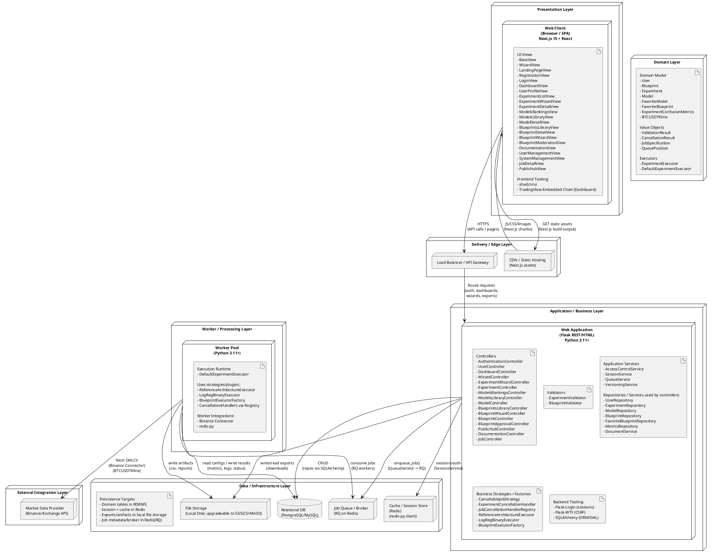

### 5.5 Prototype

This section presents the prototype of BEE, based on the analysis and design made in the previ1ous sections. Figure 5.18 though Figure 5.31 shows the prototype of each page in BEE system.

Refer src/screens

### 5.6 Summary

Chapter 5 established BEE's production-ready architecture through rigorous application of object-oriented principles and strategic pattern selection. The design transformed initial ECB models into a cohesive layered structure where SOLID principles enforce critical invariants: Single Responsibility separated validation from orchestration to protect temporal integrity constraints; Open/Closed enabled extensible job cancellation strategies without modifying core pipelines; and Dependency Inversion decoupled business logic from infrastructure through repository abstractions. Strategic application of Template Method guaranteed immutable split-first execution sequencing, while Strategy and Factory patterns provided controlled extension points for job cancellation and Blueprint executors—preserving pipeline determinism while supporting future Bitcoin-native research workflows.

The selected Layered (N-Tier) Architecture delivers optimal balance between rigor and pragmatism for this monolithic quant platform, with strict unidirectional dependencies structurally enforcing row-level security and temporal integrity. The deployment diagram operationalizes this architecture across five tiers: client-side dashboards with a TradingView embedded chart, Flask controllers with segregated interfaces, domain entities with parametric permutation logic, PostgreSQL-backed repositories with transaction boundaries, and isolated RQ workers executing the Experiment Execution Pipeline. This structure achieves the platform's just-enough philosophy—sufficient architectural rigor to guarantee split-first sequencing and parametric reproducibility without abstraction overhead that would distract quant researchers from Bitcoin-native strategy exploration. The completed prototype validates that all functional requirements can be implemented within this cohesive, testable foundation.
