# Bitcoin Experimental Engine (BEE): A Framework for Reproducible Quantitative Research on BTCUSDT Spot Markets

## Abstract

The Bitcoin Experimental Engine (BEE) is a reproducible experimentation framework designed to address workflow fragmentation in Bitcoin-pair quantitative research. Its aim is to consolidate data ingestion, feature engineering, model execution, and evaluation into a single governed environment for systematic strategy exploration on BTCUSDT spot data. The goal is to eliminate look-ahead bias through split-first execution sequencing, which partitions data chronologically before any transformations, while generating exhaustive parameter permutations with complete artifact provenance. This system enforces long-only, single-position evaluation constraints and maintains immutable Blueprint versioning to distinguish private experimentation from discoverable research artifacts within an authenticated web interface.

The project employed a requirements-driven Object-Oriented Analysis and Design methodology, progressing from implementation-agnostic behavioral models to a production-ready layered architecture grounded in SOLID principles and strategic design patterns. Template Method guarantees immutable pipeline sequencing across split-first execution stages, Factory enables extensible Blueprint compilation without modifying core logic, and Strategy decouples job cancellation mechanics from orchestration concerns. Layered Architecture was selected to enforce strict unidirectional dependency flow from Presentation to Business to Data Access layers, structurally preventing interface modifications from corrupting financial calculations while enabling comprehensive unit testing. A 14-week dependency-driven implementation plan delivers foundational components first, embedding validation within each delivery increment to yield a maintainable foundation for auditable Bitcoin-native experimentation without abstraction overhead that would distract researchers from core quantitative work.

## Chapter 1: Introduction

### 1.1 Overview

This project proposes the Bitcoin Experimental Engine (BEE), a framework informed by publicly available research practices for reproducible quantitative experimentation. BEE does not incorporate proprietary implementation code, internal APIs, or non-public architectural specifications. BEE extends these public concepts with software engineering and product-layer capabilities required for a modern research framework, such as object-oriented analysis and design (OOAD), a web user interface, user management, model ranking and comparison, and public discovery for sharing and reusing experiments.

Bitcoin markets demand specialized research infrastructure due to their continuous 24/7 trading cycle and exchange-specific microstructure phenomena—including liquidation cascades and asymmetric order-book depth—that make strategy validation especially sensitive to data handling choices. The Bitcoin Experimental Engine (BEE) addresses this through four core components: **Blueprints** define versioned pipeline specifications with parameter ranges for indicators; **Experiments** execute Blueprints using split-first sequencing to eliminate look-ahead bias while generating exhaustive parameter permutations; **Models** represent individual permutation artifacts with evaluation metrics under long-only, single-position constraints; and the **Public Hub** provides authenticated discovery of successful experiments and approved Blueprints through role-governed visibility controls.

Overall, BEE is positioned as both a technical contribution—an integrated architecture that unifies data→feature→model→evaluation into repeatable experiments—and a usability contribution—making experimentation accessible through an authenticated web experience with searchable catalogs and leaderboards. The remainder of this report presents the background study and system comparisons, derives functional and non-functional requirements, models the system using OOAD artifacts (use cases, dynamic/object models, ERD, wireframes), applying SOLID principles and design patterns, deciding on a software architecture and finalizes an implementable deployment plan leading to the prototype and conclusion.

### 1.2 Problem Statement

Bitcoin strategy research is difficult to execute rigorously because it combines noisy and heterogeneous market data (often inconsistent across providers and exchanges), an experimentation workflow that is typically fragmented across scripts and tools, and evaluation pitfalls (e.g., leakage and overstated performance) that are easy to introduce when configurations, datasets, and results are not tracked end-to-end. Recent evidence shows cryptocurrency datasets can suffer from mislabeling, identifier instability, and large cross-provider discrepancies in key fields such as prices, market caps, and volumes, undermining comparability and repeatability of results (Schwenkler et al., 2024). This fragmentation is compounded when researchers chase multiple assets or strategies simultaneously; focusing on a single pair with a single strategy avoids this greed-driven dispersion and instead concentrates effort on extracting consistent profit from one well-understood approach (Kotila, 2023). At the same time, reproducible computational experimentation requires packaging "everything necessary" to rerun an experiment consistently, something ad-hoc research stacks rarely enforce by design (Costa et al., 2024). There remains a gap for an OOAD-based, web-accessible framework that adds user management, model ranking/comparison, and public discovery while preserving reproducible execution and auditable experiment logs. Thus, the problem discussed motivated the development of the proposed Bitcoin Experimental Engine (BEE) framework.

### 1.3 Project Objectives

The primary objective of BEE (Bitcoin Experimental Engine) is to architect and prototype a reproducible, end-to-end Bitcoin-pair experimentation framework that consolidates data ingestion, feature engineering, model execution, and evaluation into a cohesive workflow, while extending it with OOAD-driven structure and a web application that supports authenticated usage, model comparison, and public discovery.

* **To independently implement reproducible experimentation concepts**, including split-first execution sequencing for temporal integrity enforcement, Blueprint-based pipeline specification with immutable versioning, and exhaustive parameter permutation generation, unifying data ingestion, feature engineering, model training, and evaluation into a single auditable workflow without incorporating proprietary code or non-public architectural specifications.
* **To enforce experiment reproducibility and provenance** by capturing complete run context (configuration, parameters, metrics, artifacts, and code/environment traceability) so experiments can be re-executed consistently and results can be verified over time (Costa, 2024).
* **To design BEE using OOAD principles** by producing analyzable domain models and a maintainable design structure (clear responsibilities, modular components, and stable interfaces) that supports extension of indicators, features, models, and execution strategies.
* **To deliver a secure web-based user experience** by implementing authentication and authorization controls aligned with established web security guidance, enabling user management and role-based access to experiment creation, execution, and publication.
* **To implement model ranking and comparison services** that aggregate standardized metrics across runs to support systematic selection, similar to how ML systems use tracked runs and UI comparisons to identify best-performing configurations (MLflow, 2024).
* **To enable public discovery and reuse of experiments** via a “hub” capability that publishes selected models/experiments with metadata and outcomes, supporting transparent comparison and community-facing catalogs analogous to leaderboard-style evaluation ecosystems.

### 1.4 Project Outcomes

BEE (Bitcoin Experimental Engine) is expected to materialize as a web-enabled experimentation framework that operationalizes quantitative research components within a maintainable software architecture. The outcomes focus on delivering a secure, role-governed access layer, reproducible and versioned strategy artifacts, discoverable public catalogs, and repeatable evaluation workflows that support consistent comparison of model snapshots across aligned test horizons.

* **An independently implemented experiment execution core** applying historical data access patterns, indicator/feature computation workflows, and split-first sequencing principles within a cohesive research workflow.
* **A Web UI interface** to provide access to BEE through a browser-based client so users can configure, execute, and review experiments independent of device and location.
* **A user account and role management system** to implement a three-tier authorization hierarchy (Normal User, Moderator, Administrator) with authenticated access and administrative account-state controls (enable/disable).
* **A Blueprint versioning mechanism** preserving artifact integrity through immutable lineage tracking by creating new editable versions upon owner modification while anchoring original submissions for auditability, adapted to the constraints of parametric Bitcoin-pair experimentation.
* **A public discovery interface** providing authenticated users access to a curated repository of validated research artifacts, with appropriate filtering by completion status and approval state, thereby establishing an explicit publication boundary between private experimentation and public discovery.
* **A model comparison capability** to enable users to compare standardized evaluation metrics across experiments, thereby providing an evaluation service that normalizes test conditions for fair model ranking and comparative analysis.

### 1.5 Project Scope

BEE defines a single, parametric experimentation framework whose scope is intentionally constrained to Bitcoin-pair quantitative research under historical and simulated evaluation conditions. This scope statement specifies the inclusions and explicit architectural boundaries necessary to preserve system cohesion, reproducibility, and a focused domain surface aligned with the project’s research objectives.

* **Bitcoin-pair asset coverage**: BEE shall restrict market-data ingestion to the BTCUSDT spot pair only. This constraint shall be enforced across all experiment configurations to maintain a Bitcoin-pair orientation and to prevent cross-asset confounding by excluding altcoins, equities, foreign exchange, and other asset classes. BEE explicitly excludes on-chain protocol data (e.g., mempool, blocks, UTXO sets) from scope.
* **Blueprint lifecycle management**: BEE shall implement a versioned artifact lifecycle for experimental pipeline specifications (Blueprints) with moderator review capabilities, addressing multi-tenant governance requirements through original mechanisms for artifact versioning and auditability.
* **Public model catalog**: BEE shall provide an authenticated catalog in which users can discover successful research artifacts by default, including completed experiments and derived model artifacts. BEE shall enforce access controls such that users may access artifacts they own and artifacts explicitly designated as publicly visible through approval and completion status, thereby establishing a publication boundary between private experimentation and discoverable outputs.
* **Timeframe and granularity limitations**: BEE shall support strategy experimentation over minute-to-daily bar intervals and shall not provide sub-second granularity operation or infrastructure intended for high-frequency trading (e.g., tick-level order routing, colocation-dependent latency optimization). BEE’s execution model shall remain research-oriented rather than ultra-low-latency deployment oriented.
* **Strategy constraint (long-only, single-position)**: BEE shall enforce long-only signal interpretation and single-position exposure during test set evaluation, rejecting short signals and overlapping long entries. This constraint keeps evaluation aligned with the project's research framing and is codified in the functional requirements.
* **No trading simulation capabilities**: Position management logic, P&L simulation with slippage modeling, and interactive backtesting interfaces are excluded. Evaluation is strictly limited to internal test set metrics (Sharpe ratio, maximum drawdown, win rate) computed during immutable pipeline execution.

### 1.6 Project Limitations

BEE incorporates deliberate technical and operational constraints to preserve architectural cohesion, ensure reproducibility, and maintain a Bitcoin-pair research focus. These limitations are intentional boundary conditions of the project scope rather than deficiencies of the underlying design; they define where BEE’s experimental results remain valid and where external systems or additional controls would be required to support production-grade decision-making.

* **Dependence on historical observations:** BEE shall generate performance estimates exclusively from historical BTCUSDT spot market data and shall not guarantee that observed results generalize to future market conditions. This limitation reflects the non-stationary nature of financial time series, where structural breaks and regime transitions can invalidate assumptions learned from prior data (Zhang et al., 2024).
* **Absence of backtest and live market interaction**: BEE shall not connect to live exchanges, execute real orders, or provide real-time performance feedback derived from live trading. BEE is restricted to research-time signal generation and internal evaluation, consistent with the project’s research positioning rather than an execution system.
* **Computational scale constraints**: BEE shall support server-side execution and queueing within single-server resource limits and shall not provide distributed computing infrastructure for large-scale parallel exploration across high-dimensional parameter spaces. As a result, exhaustive search depth may be bounded by available compute and configured concurrency limits.
* **User-defined performance thresholds**: BEE shall require users to specify their own sufficiency criteria (e.g., signal thresholds, evaluation cutoffs, acceptance metrics) rather than inferring optimal performance targets automatically. This limitation follows from the fact that acceptable trade-offs between risk and return depend on user-specific preferences and utility assumptions that are not objectively determined by the system.
* **No market regime prediction capability**: BEE shall support systematic evaluation of parameter sensitivity and comparative model performance under observed historical segments, but shall not predict regime transitions or incorporate macroeconomic event forecasting as part of its core functionality. This limitation is consistent with the broader challenge of regime-driven nonstationarity in financial modeling (Zhang et al., 2024).
* **Bitcoin-only microstructure coverage**: BEE shall not support multi-asset strategies that rely on cross-asset correlations, altcoin market structure, derivatives beyond the configured dataset, or traditional financial instruments. Research artifacts are constrained to BTCUSDT spot data as defined in the project scope.
* **Technical proficiency requirement**: BEE shall assume a technically literate user capable of configuring experiments, interpreting evaluation metrics, and understanding parameter tuning methodology. BEE does not aim to provide automated strategy generation or beginner-oriented tutorials as a primary design goal within the project constraints.

### 1.7 Methodology

This report will employ a systematic Object-Oriented Analysis and Design (OOAD) methodology to develop the Bitcoin Experimental Engine (BEE) as an independent academic prototype. The methodology follows a sequential, requirements-driven process that transforms domain understanding into an implementable software architecture while maintaining strict separation between public-domain inspiration and academic contributions.

The process will commence with comprehensive requirements elicitation, deriving atomic functional and non-functional specifications grounded exclusively in publicly available quantitative research challenges and Bitcoin market characteristics. These requirements will serve as the sole foundation for all subsequent modeling activities, ensuring implementation decisions emerge organically from observable system behaviors rather than predetermined architectural assumptions.

During the analysis phase, requirements will be translated into behavioral and structural artifacts without introducing design optimizations or implementation details. This includes: (1) a complete use case model capturing user goals and system boundaries across guest, researcher, moderator, and administrator roles; (2) dynamic models comprising sequence diagrams for component interactions, activity diagrams for workflow progression, and state diagrams for entity lifecycles; and (3) an object model establishing foundational class relationships and a normalized entity-relationship diagram with precise attribute specifications. All analysis artifacts will remain implementation-agnostic, strictly reflecting observable requirements without anticipating architectural solutions.

The design phase will then refactor analysis artifacts through principled software engineering techniques. SOLID design principles will be applied to improve modularity, reduce coupling, and increase cohesion across domain objects. Strategic design patterns will be introduced where they resolve specific architectural tensions—such as enforcing temporal integrity constraints or enabling extensible parameter exploration—while preserving core system invariants. Finally, a software architecture will be selected based on empirical evaluation of alternatives against BEE's primary constraints: strict unidirectional dependency flow to guarantee temporal integrity, sufficient abstraction to support multi-tenant governance, and minimal overhead to maintain accessibility for quantitative researchers.

Throughout this methodology, explicit boundaries will be maintained between concepts inspired by public documentation (e.g., split-first execution sequencing, Blueprint-based strategy specification) and academic contributions developed independently for this FYP (e.g., layered architecture enforcement mechanisms, web-native parameter override interfaces). This disciplined separation ensures all implementation decisions represent original academic work while ethically acknowledging public-domain inspiration sources.

### 1.8 Target Audience

BEE is intended for highly skilled quantitative researchers and software developers who design and evaluate systematic strategies specifically for Bitcoin-pair markets. BEE assumes proficiency in programming and quantitative finance, and is therefore not targeted at retail traders or non-technical users.

***Bitcoin-pair quantitative researchers**: Individuals developing alpha signals using exchange-derived data and Bitcoin market microstructure who require parametric control over the entire research-to-execution pipeline.

***Algorithmic trading engineers**: Developers building and maintaining production trading infrastructure who need transparent, open source components with consistent behavior between backtesting and live environments.

***Systematic trading teams focused on Bitcoin-pair research**: Small institutional teams managing capital allocated specifically to BTCUSDT strategies who require closed-loop feedback to adapt parameters without manual workflow reconciliation.

***Technical solo quants with programming proficiency**: Independent traders comfortable writing Python, managing infrastructure deployment, and interpreting parameter sensitivity results without guided UI workflows or automated strategy generation.

***All target users share common characteristics**: programming proficiency in Python or similar languages, understanding of quantitative finance concepts including backtesting methodology and performance metrics, comfort with infrastructure deployment and configuration, and ability to interpret parameter sensitivity results without guided workflows. The framework assumes technical self-sufficiency rather than catering to retail traders or non-technical users seeking automated strategy generation.

### 1.9 Interim Report Timeline

> Gantt chart

| Activity                                           | W1 | W2 | W3 | W4 | W5 | W6 | W7 | W8 | W9 | W10 | W11 | W12 | W13 | W14 | W15 | W16 |

|--------------------------------------------------|--|--|--|--|--|--|--|--|--|---|---|---|---|---|---|---|

| Introduction                                       ||| ✅ | ✅ |||||||||||||

| Background Study                                   |||| ✅ | ✅ | ✅ |||||||||||

| Requirements                                       ||||| ✅ | ✅ | ✅ | ✅ |||||||||

| Analysis                                           |||||||| ✅ | ✅ | ✅  |||||||

| Design                                             ||||||||| ✅ | ✅  | ✅  | ✅  |||||

| Implementation Plan                                ||||||||||| ✅  | ✅  | ✅  ||||

| Conclusion                                         |||||||||||| ✅  | ✅  ||||

| Interim Report Preparation (compile, edit, format) |||||||||||| ✅  | ✅  | ✅  |||

| Presentation Preparation and Report Submission     ||||||||||||| ✅  | ✅  | ✅  | ✅  |

### 1.10 Summary

This chapter established the motivation, direction, and boundaries for the Bitcoin Experimental Engine (BEE). Bitcoin's continuous, multi-venue trading environment exhibits distinctive microstructure behaviour at intraday horizons, which increases sensitivity to data handling choices and evaluation methodology in quantitative research. In parallel, quantitative research workflows are frequently fragmented across tools and ad-hoc scripts, which weakens reproducibility unless experiments are specified, executed, and packaged with sufficient context to support repeatable reruns. The chapter also highlighted a foundational risk for Bitcoin research: cryptocurrency market datasets may contain vendor-level inconsistencies that can undermine comparability and repeatability of results if not governed end-to-end.

BEE is proposed as an OOAD-driven, web-enabled experimentation framework that consolidates the data→feature→model→evaluation workflow into a single parametric execution cycle. BEE independently implements concepts such as split-first execution sequencing and Blueprint-based strategy specification, while extending these concepts into a multi-tenant research framework through academic contributions including authenticated access, artifact governance, model comparison, and public discovery capabilities.

The scope and limitations defined in this chapter deliberately constrain BEE to Bitcoin spot experimentation on BTCUSDT over minute-to-daily intervals, with explicit exclusion of live trading, brokerage connectivity, and production deployment. This narrow scope preserves architectural cohesion and ensures that outcomes remain interpretable as research evidence rather than execution assurance. In particular, the chapter emphasized that large-scale parameter exploration must be treated cautiously due to the known risk of backtest overfitting, where extensive search can produce statistically fragile results that fail out-of-sample. Finally, the methodology section defined a requirements-driven OOAD workflow that progresses from implementation-agnostic analysis artifacts to a justified architecture and design model, while maintaining an explicit boundary between publicly documented concepts and BEE's original academic contributions.

## Chapter 2: Background Study

### 2.1 Overview

This chapter establishes the conceptual foundation for the Bitcoin Experimental Engine (BEE), an independent academic framework grounded in reproducible quantitative research practices. BEE addresses workflow fragmentation by integrating data ingestion, feature engineering, model execution, and evaluation into a single parametric workflow. It extends these concepts with scoped implementation contributions required for multi-tenant research environments: authenticated web access, artifact governance, model comparison services, and public discovery catalogs.

### 2.2 Literature Review

This section reviews essential concepts for the required knowledge to plan the implementation of core BEE functionalities.

#### 2.2.1 Bitcoin Market Structure and Data Characteristics

Bitcoin is a decentralised digital asset whose market microstructure significantly differs from conventional equities or foreign exchange instruments. The dispersal of liquidity across exchanges and its 24/7 trading cycle create exchange-specific analytical challenges (Nakamoto, 2008). The BTCUSDT Bitcoin-to-Tether spot pair on Binance has grown into one of the most liquid venues among retail and institutional traders (CoinGecko, 2024). Such a concentration makes data acquisition easier, but also results in exchange-specific artifacts, such as liquidation cascades during increased volatility and asymmetries in order-book depth, which are not found in regulated markets.

Unlike equities, where clock skew is reduced by centralised exchanges where the timestamps are synchronised, cryptocurrency markets require multi-venue clock skew management and reconciliation of trade-level data with a contemporaneous snapshot of order-books. Data with a minute resolution is usually sufficient to develop a strategy to hold longer than a few seconds, avoiding the complexity of infrastructural support of tick processing on the sub-millisecond scale, although signal integrity is still available to support mean-reversion and trend-following strategies (Chan, 2017).

BEE adopts a Bitcoin-pair scope (BTCUSDT spot pair). This constraint simplifies data sourcing while maintaining focus on Bitcoin-specific dynamics. BEE explicitly excludes on-chain protocol metrics (e.g., mempool, blocks, UTXO sets) in alignment with the project scope.

#### 2.2.2 Quantitative Trading Workflow Fragmentation

The modern quantitative studies are fraught with toolchain fragmentation. Practitioners generally develop in Jupyter notebooks with pandas and scikit-learn, Backtrader and Zipline backtesting engines are used to test, exchange-specific API recap logic is recreated, and then executed in the live-trading gateway (Hull, 2022). This pipeline causes drift in the environment: small variations in the alignment of the data, the modelling of the fees or slippage assumptions make strategies that have been tested offline perform poorly in practice. The 2023 industry survey established that 68 per cent of quantitative teams dedicate greater than 30 per cent of development effort to determine inconsistencies between research and implementation settings (QuantInst, 2023).

Split-first sequencing patterns that chronologically separate data into training/validation/test sets before any transformations are applied help prevent look-ahead bias by ensuring indicators are computed only on temporally available data (López de Prado, 2020). BEE implements this pattern as a core pipeline constraint.

#### 2.2.3 Technical Indicators and Feature Engineering Practices

The bulk of the retail quantitative strategies is based on technical indicators. Atomic indicators like moving averages, Relative Strength Index (RSI), and the Moving Average Convergence/Divergence (MACD) are calculations of transformations on price series that incorporate explicit window parameters (Kirkpatrick and Dahlquist, 2010). Modern usage suggests more and more the use of compound features, which are combinations of many atomic indicators representing higher-order market conditions. Others include Ichimoku Cloud elements that combine short, medium and long term momentum, or breakout adjusting volatility-based breakouts that combine the Average True Range (ATR) and price extremes.

Most importantly, temporal integrity should be followed in computing indicators. The use of indicators over the full dataset then split into training, validation, and test makes the future information leak and performance estimates invalid (Lopez de Prado, 2020). A proper implementation uses only data available till that time and calculates indicators in each temporal split separately. The exploration should be guided by ranges of parameters: the simple moving average (SMA) period [10, 20, 50] should be tested on a set of permutations and it will show its robustness, which is not achieved by cherry–picking a single optimal value using historical data.

#### 2.2.4 Framework Selection Rationale

The framework selection is informed by the need to support reproducible experimentation, consistent data handling, and a user-facing research workflow. The review therefore prioritises systems that provide transparent execution, declarative configuration, and repeatable evaluation, rather than focusing on specific implementation stacks. Key evaluation criteria include: (1) temporal integrity enforcement through split-first sequencing, (2) exhaustive parameter permutation capabilities without manual scripting overhead, (3) immutable pipeline guarantees preventing data leakage between splits, and (4) artifact versioning with audit trails for reproducible research. These criteria align with reproducibility best practices documented in computational finance literature (López de Prado, 2020; Schwenkler et al., 2024).

+ for experiment workflow

### 2.3 Existing Systems Review

This section reviews some of the existing systems that shows some resemblance in BEE in terms of features they provide. The review conducts market survey to elicit requirements needed for BEE.

#### 2.3.1 Vaquum Limen

Vaquum Limen (Vaquum, 2024) is an open-source quantitative research framework that implements the Universal Experiment Loop (UEL) architecture for end-to-end experimentation workflows. The framework emphasizes temporal integrity through split-first execution sequencing—chronologically partitioning data before any transformations to prevent look-ahead bias—and provides declarative manifest specifications for reproducible pipeline definitions. Its core design centers on immutable pipeline enforcement where data flows strictly through temporal splits → indicator computation → feature composition → target transformation → modeling → evaluation without cross-contamination between stages. The publicly documented architecture demonstrates strong alignment with reproducible research principles for single-user quantitative experimentation.

Despite its robust execution architecture, Vaquum Limen exhibits significant limitations relative to BEE's multi-tenant research requirements. The framework operates exclusively as a command-line interface tool without web-based user management or role-based access controls, making it unsuitable for collaborative research environments requiring artifact governance. It lacks Blueprint lifecycle management with moderator approval workflows, immutable versioning with audit trails, and authenticated public discovery capabilities necessary for sharing validated research artifacts across users. Critically, BEE's execution architecture draws conceptual inspiration from publicly documented patterns such as Vaquum Limen's Universal Experiment Loop (UEL). However, BEE does not incorporate proprietary Vaquum Limen implementation code, internal APIs, or non-public architectural specifications. All pipeline enforcement mechanisms, temporal integrity constraints, permutation generation logic, and multi-tenant governance features are independently implemented for this academic prototype.

| Feature                           | Description                                                                                                                            |
| --------------------------------- | -------------------------------------------------------------------------------------------------------------------------------------- |
| Universal Experiment Loop (UEL)   | Immutable pipeline architecture enforcing split-first execution sequencing with chronological data partitioning before transformations |
| Declarative manifests             | Single-file pipeline specifications defining data sources, splits, indicators, features, and models                                    |
| Temporal integrity enforcement    | Strict per-split computation preventing look-ahead bias across training/validation/test boundaries                                     |
| Exhaustive permutation generation | Built-in combinatorial expansion of parameter ranges during execution                                                                  |
| Open-source transparency          | Public GitHub repository with inspectable pipeline implementation                                                                      |
| CLI-only interface                | Command-line execution without web UI, user accounts, or multi-tenant capabilities                                                     |

#### 2.3.2 QuantConnect

QuantConnect (QuantConnect, 2024) is a cloud-based algorithmic trading platform supporting equities, forex, futures and cryptocurrencies with a single C Sharp/Python Application Programming Interface. The LEAN engine performs backtests on high-resolution historical data which is based on transaction cost modelling and the cloud system coordinates parameter sweeps on distributed computational nodes. Specific focus is given in the platform on the continuity of production deployment so that a set of strategies, which have been validated by backtesting, can be deployed based on the same engine logic as in the real live trading.

The architecture of QuantConnect is, in essence, a departure from a Bitcoin-pair focus as it considers Bitcoin (BTC) as only one of many tickers in a multi-asset design that is predisposed to conventional investments. Such a design distorts the distinctive market microstructure of Bitcoin, including exchange-specific liquidity patterns that differ from regulated markets. Moreover, search of parameters is conducted as a post-hoc grid-based search instead of defining each pipeline component as a more tractable and definite, and pursued as a defining parameter, through definition to execution, thus breaking the parametric rules. More importantly, the closed-source core engine is a violation of the transparency principle of open-source which hides the assumptions behind the slippage modelling and places environmental drift between research purpose and behaviour-at-execution.

| Feature                  | Description                                                                                        |
| ------------------------ | -------------------------------------------------------------------------------------------------- |
| Cloud-based backtesting  | Distributed execution of historical simulations with minute-resolution data across multiple assets |
| Parameter optimization   | Grid search over user-defined ranges with parallel execution on cloud workers                      |
| Live trading integration | Direct deployment to brokerages with identical engine logic used in backtests                      |
| Strategy library         | Public repository of community-contributed algorithms with performance metrics                     |
| Multi-asset support      | Unified API for equities, options, forex, futures, and cryptocurrency markets                      |

#### 2.3.3 Backtrader

Backtrader (Vera, D., 2023) is an open-source Python framework that can be used as an event-driven backtester based on minimal abstractions. Strategies are defined by the users as Python classes based on bt.Strategy and containing methods including next() to perform per-bar logic. It uses only the pandas and matplotlib as the only external libraries to manage position accounting, simulate order execution, and calculate performance metrics. Its main strength is its transparency, when any constituent of the back -testing engine can be inspected and modified.

Despite satisfying the standards of open-source transparency, Backtrader has a significant weakness of excessive workflow fragmentation against the principle of closed-loop. The parameter space exploration requires the manual writing of scripts, which are out of the frame work, as it does not imply a permutation management feature. As a result, practitioners code in Jupyter notebooks and then re-engineer logic to be used in production, and thus, create environmental drift between research and production phases. This framework also does not have any long-term storage of configurations, output or model artefacts. Notably, it does not provide a Blueprint governance workflow to prevent shared resource consumption by unverified parameter combinations.

| Feature                    | Description                                                                  |
| -------------------------- | ---------------------------------------------------------------------------- |
| Event-driven architecture  | Per-bar strategy logic execution with explicit control over order management |
| Pure Python implementation | No compiled dependencies; full source visibility for engine behavior         |
| Flexible data ingestion    | Accepts pandas DataFrames or CSV files with customizable parsing             |
| Basic optimization         | Manual parameter sweeps via Python loops; no built-in permutation management |
| Visualization toolkit      | Integrated matplotlib plotting for equity curves and trade annotations       |

#### 2.3.4 Freqtrade

The Freqtrade (2024) platform is built to automate the work of cryptocurrency trading bots, and hyperparameter optimization is defined in the systemic workflow. The framework implements strategies expressed in Python against exchange API and supports both simulated, dry-run executions, and live trading as well as providing risk management settings which may be configured. It uses the Hyperopt module, which is a genetic algorithm based search in parameter space defined by the user, with the results being stored locally, which are to be analysed later. The fact that it has built-in support of common cryptocurrency indicators and exchange-specific features, including futures funding rates, adds more flexibility to its operations.

The platform described above prioritises live connectivity to exchanges, which introduces complexity beyond BEE's research-only scope focused on minute-to-daily strategy evaluation. In addition, the fact that optimization has been approached as a single calibration step instead of an adaptive procedure conflicts with the closed-loop principle that requires systematic adaptation of parameters based on performance feedback. The genetic-algorithm method also favors a single optimal value rather than searching exhaustively through neighbourhoods of parameter space to map out robust regions.

| Feature                 | Description                                                                 |
| ----------------------- | --------------------------------------------------------------------------- |
| Crypto-native execution | Direct integration with 20+ exchanges including Binance perpetuals          |
| Hyperopt optimization   | Genetic algorithm search over parameter spaces with result persistence      |
| Dry-run simulation      | Backtesting against historical OHLCV data with configurable slippage        |
| Strategy templates      | Prebuilt examples for common approaches (SMA crossover, RSI mean reversion) |
| Telegram integration    | Real-time trade notifications and manual override commands                  |

#### 2.3.5 VectorBT

NumPy is used to achieve massive performance improvements in backtesting using VectorBT (VectorBT, 2024), which is a framework that uses NumPy to exploit the idea of vectorization to avoid event-driven execution. It does not process signal array data one bar, or block, at a time, but instead pre-processes large arrays of signals before using vectorized operations to operate on them, to extend position size, profitandloss measures, and metrics. This method allows exploiting parameter grids of millions of combinations in a few seconds. The library is compatible with pandas and Jupyter thus allowing quick prototyping.

One aspect of the design that VectorBT avoids is workflow-management features - experiment tracking, model versioning and user interface features are all absent. This means that users are forced to build their own infrastructure to save configurations and results. The parameter exploration process is a manual programming step, whereby grids are defined as arrays in NumPy, and has no declarative specifications or governance procedures to distribute validated parameter sets. More importantly, the library does not provide any closed-loop connection between research and execution, the process of transferring optimised parameters to execution systems has to be done manually, which may introduce environmental drift and undermine live performance.

| Feature                     | Description                                                             |
| --------------------------- | ----------------------------------------------------------------------- |
| Vectorized computation      | Full-array signal generation and P&L calculation avoiding per-bar loops |
| Parameter grid acceleration | Exhaustive exploration of multi-dimensional parameter spaces in seconds |
| Pandas integration          | Native handling of DataFrame inputs and outputs for seamless workflow   |
| Custom metric support       | User-defined functions for Sharpe, drawdown, or domain-specific metrics |

#### 2.3.6 TradingView

The field of retail technical analysis is controlled by TradingView (TradingView, 2024) due to its charting interface, which is based on the browser, and the Pine Script language. The rules of entry and exit are developed by the user using visual notation or using scripting and then analysed against historical time series, using some of the built-in performance measures like profit factor and maximum drawdown. The platform also may be especially well suited to interactive visualisation, providing the ability to overlay indicators, draw trend lines, and compare several assets together. Its Strategy Tester will provide a primitive kind of walk-forward analysis, and it is limited in the amount of parameter manipulation one can perform but it is not as sophisticated as more advanced back-testing needs.

Nevertheless, the application of complex feature engineering, which is necessary to conduct systematic research on Bitcoin, is hindered by the inherent domain-specific limitations of Pine Script at TradingView. Parameter explorations are limited to the manual manipulation of sliders, limiting exhaustive combinatorial expansion and the ability to automate parametric sweeps. Additionally, lack of a dedicated experiment-tracking system other than session-specific results inhibits the comparability of experiments across research iterations. More importantly, crypto exchange-based backtested strategies cannot be easily applied to cryptocurrency exchanges without third-party bridge intervention, thus breaking the research-execution continuity of the closed-loop trading system. Lastly, the platform is characterised by a general attitude to Bitcoin and is capable of treating BTC as one of thousands of assets, limiting its ability to support focused Bitcoin-pair research.

| Feature                  | Description                                                                |
| ------------------------ | -------------------------------------------------------------------------- |
| Interactive charting     | Real-time price visualization with 100+ built-in technical indicators      |
| Pine Script language     | Domain-specific syntax for defining entry/exit rules with parameter inputs |
| Strategy Tester          | Backtesting engine with metrics calculation and equity curve rendering     |
| Social features          | Public script sharing with versioned forks and user comments               |
| Multi-timeframe analysis | Simultaneous chart views across intervals with synchronized cursors        |

#### 2.3.7 Comparison Table

|                                  Feature                                  | QuantConnect | Backtrader | Freqtrade | VectorBT | TradingView | Vaquum Limen | **BEE** |
| :------------------------------------------------------------------------: | :----------: | :--------: | :-------: | :------: | :---------: | :----------: | :-----------: |
| Split-first execution sequencing (temporal partitioning before transforms) |      ✗      |     ✗     |    ✗    |    ✗    |     ✗     |      ✓      | **✓** |
| Immutable pipeline enforcement (data→split→indicators→features→model) |      ✗      |     ✗     |    ✗    |    ✗    |     ✗     |      ✓      | **✓** |
|                  Bitcoin-pair focus (BTCUSDT spot only)*                  |      ✗      |     ✗     |   (✓)   |    ✗    |     ✗     |      ✗      | **✓** |
|           LONG-ONLY signal enforcement (rejects short positions)           |      ✗      |     ✗     |    ✗    |    ✗    |     ✗     |      ✗      | **✓** |
|                     Exhaustive permutation generation                     |     (✓)     |     ✗     |    ✗    |    ✓    |     ✗     |      ✓      | **✓** |
|                        Parametric experiment runner                        |     (✓)     |     ✗     |   (✓)   |    ✗    |     ✗     |      ✓      | **✓** |
|                 Pipeline specification governance workflow                 |      ✗      |     ✗     |    ✗    |    ✗    |     ✗     |      ✗      | **✓** |
|               Immutable pipeline versioning with audit trail               |      ✗      |     ✗     |    ✗    |    ✗    |     ✗     |      ✗      | **✓** |
|            Parameter overrides per experiment (non-destructive)            |      ✗      |     ✗     |    ✗    |    ✗    |     ✗     |      ✗      | **✓** |
|                   Authentication required for all access                   |      ✗      |     ✗     |    ✗    |    ✗    |     ✗     |      ✗      | **✓** |
|           All successful experiments publicly visible by default           |      ✗      |     ✗     |    ✗    |    ✗    |     ✗     |      ✗      | **✓** |
|                Role-based access control (4-tier hierarchy)                |      ✗      |     ✗     |    ✗    |    ✗    |     ✗     |      ✗      | **✓** |
|                     Authenticated public discovery hub                     |      ✗      |     ✗     |    ✗    |    ✗    |    (✓)    |      ✗      | **✓** |
|                               Web-based GUI                               |      ✓      |     ✗     |    ✗    |    ✗    |     ✓     |      ✓      | **✓** |
|                    Model ranking by performance metrics                    |     (✓)     |     ✗     |    ✗    |    ✗    |     ✗     |      ✓      | **✓** |
|                Public discovery with favoriting capability                |      ✗      |     ✗     |    ✗    |    ✗    |    (✓)    |      ✗      | **✓** |
|                      Multi-model backtest comparison                      |      ✗      |     ✗     |    ✗    |    ✗    |     ✗     |      ✗      | **✓** |
|                   On-demand log export (no stored files)                   |      ✗      |     ✗     |    ✗    |    ✗    |     ✗     |      ✗      | **✓** |
|                       Row-level security enforcement                       |      ✗      |     ✗     |    ✗    |    ✗    |     ✗     |      ✗      | **✓** |
|                    Server-managed concurrency controls                    |      ✗      |     ✗     |    ✗    |    ✗    |     ✗     |      ✗      | **✓** |

*✓ = fully supported, (✓) = partially supported with limitations, ✗ = not supported*

*Vaquum Limen supports BTC among a multi-asset universe but lacks BTCUSDT-spot exclusivity enforcement and on-chain data exclusion constraints required by BEE's scope (Section 1.5).*

**Key differentiators of BEE:**
BEE uniquely combines exhaustive parametric exploration with multi-tenant governance controls within a strictly bounded Bitcoin-pair scope. Unlike single-user research libraries or multi-asset cloud platforms, BEE enforces explicit BTCUSDT symbol validation at the data ingestion layer while providing authenticated collaboration features absent in many research-grade tools. Its Blueprint governance workflow—with moderator approval, immutable versioning, and non-destructive parameter overrides—addresses reproducibility gaps in fragmented toolchains without introducing live trading complexity. The framework's strict temporal integrity enforcement (split-first execution) aligns with reproducible research principles (López de Prado, 2020) while maintaining accessibility through a role-governed web interface with model ranking and personalized discovery via favoriting capabilities.

### 2.4 Theoretical Framework

BEE's execution pipeline implements a temporally strict architecture grounded in reproducible experimentation principles, where every aspect of trading becomes a machine-readable, versionable artifact rather than static documents. Its core principle—split-first execution—enforces chronological data partitioning before any transformation occurs, guaranteeing indicators and features compute exclusively on information available at each timestamp within their respective split. This prevents look-ahead bias by ensuring training sets never influence validation or test set computations, even for derived statistics like volatility normalization (López de Prado, 2020). The pipeline's immutability constraint further strengthens temporal integrity by eliminating hidden state mutations that commonly introduce subtle data leakage.

Parametric exploration operates as systematic topology mapping rather than opportunistic tuning—directly implementing the parametric tenet. Instead of searching for a single "optimal" parameter set (the "just-in-case" mindset), the framework treats every configurable value as a dimension in strategy space. Permutations generate exhaustive coverage across user-defined ranges, revealing regions of robustness versus fragility. This aligns with research showing strategies validated across parameter neighborhoods generalize better than those cherry-picked for peak historical performance. Blueprint specifications formalize this exploration by declaring parameters symbolically, then resolving concrete values during execution—enabling reproducible permutation generation without manual scripting loops.

Atomic/composite separation provides compositional clarity between foundational computations and derived signals, mirroring the indicator/feature layering. Indicators implement single mathematical transformations (SMA, RSI) with strict input/output contracts. Features combine multiple indicators into higher-order market state representations—Ichimoku clouds synthesizing short/medium/long momentum, or breakout detectors fusing price extremes with volume regime signals. Critically, both layers operate per-split to maintain temporal boundaries, ensuring a feature consuming SMA outputs never sees validation-set SMA values during training-phase computation.

Reproducibility emerges from three constraints derived from the project requirements: deterministic data sourcing, fixed random seeds across execution environments (NumPy, Python stdlib), and explicit dependency declaration in Blueprints. Every experiment run with identical manifest content and seed values produces consistent outputs. Artifact logging captures not just final metrics but intermediate states: raw splits, indicator outputs, fitted transformer parameters. This enables forensic validation when performance diverges, directly supporting the closed-loop tenet's requirement for full-system feedback awareness.

Blueprint governance introduces artifact lifecycle management absent in many research-grade tools. Draft Blueprints undergo moderator approval before execution against shared resources, preventing unvetted parameter combinations—such as extreme leverage values or lookback windows shorter than exchange tick intervals—from consuming compute resources. Blueprint modifications after submission create new versioned DRAFT artifacts while preserving original submissions for auditability, ensuring immutable lineage tracking throughout the approval lifecycle. Approved Blueprints become immutable references; subsequent runs with identical Blueprint content retrieve cached results rather than re-executing, establishing canonical performance baselines for strategy configurations.

### 2.5 Summary

As shown in this chapter, the fact that Bitcoin is a continuous market and the level of liquidity concentration in the BTCUSDT trading pair is high creates a need to address data handling habits that are not reflected in traditional quantitative analytics systems. At the same time, tooling ecosystem fragmentation creates high levels of inefficiency in the current workflows: researchers usually test their algorithms through interactive notebooks, then test them in the backtesting environment and then re-implement the logic to deploy it, which in most cases introduces environmental drift. An overview of existing platforms revealed the following salient shortcomings: TradingView lacks the ability to explore parameters comprehensively, QuantConnect obscures the internals of engines, Backtrader and VectorBT do not define the governance procedures required to make the scholarship reproducible, and Freqtrade prioritises direct connectivity to live feeds, outside BEE's research-only scope.

The design considerations above form the basis of the Bitcoin Experimental Engine (BEE) as an integrated framework, which integrates specification of strategies, validation and performance monitoring in one end-to-end pipeline. This framework enables technically skilled researchers to optimize Bitcoin-pair historical markets without unnecessary sophistication. Using strict temporal integrity and careful Blueprint versioning, working in simulated settings only, BEE achieves the main promise of keeping a strategy under test identical to the strategy that was originally defined.

## Chapter 3: Requirements

### 3.1 Overview

This chapter defines the complete set of functional, non-functional, and external interface requirements for the Bitcoin Experimental Engine (BEE) framework. Requirements are expressed as atomic, testable statements that specify system behavior, constraints, and integration points necessary to deliver a research framework for Bitcoin-pair quantitative experimentation.

#### 3.1.1 Requirements Traceability Matrix

The following matrix links the Chapter 1 objectives to the requirements sections that implement them.

| Objective (Section 1.3) | Summary                                 | Primary Requirement Sections |
| ----------------------- | --------------------------------------- | ---------------------------- |
| O1                      | Reproducible experimentation workflow   | F3, F4, F9, N4               |
| O2                      | Experiment provenance and repeatability | F4, F5, N4                   |
| O3                      | OOAD-aligned modular design             | F1–F13, N6                  |
| O4                      | Secure web-based user experience        | F1, F2, F10, N3, N5          |
| O5                      | Model ranking and comparison            | F7, F6                       |
| O6                      | Public discovery and reuse              | F6, F8, F13                  |

### 3.2 Functional Requirements

This section defines atomic, testable system behaviors necessary to deliver an academic prototype supporting reproducible Bitcoin-pair research workflows. Each requirement specifies a single verifiable capability without implementation details.

#### 3.2.1 User Authentication and Authorization

- **F1.1** The system shall allow users to register an account using a valid email address.
- **F1.2** The system shall store password credentials using cryptographic hashing before persistence.
- **F1.3** The system shall allow users to define a unique username for their account.
- **F1.4** The system shall prevent registration when a username already exists in the user registry.
- **F1.5** The system shall support a Normal User role with standard platform privileges.
- **F1.6** The system shall support a Moderator role with content moderation capabilities.
- **F1.7** The system shall support an Administrator role with full system management privileges.
- **F1.8** The system shall restrict staff-only operations to authenticated Administrator or Moderator accounts.
- **F1.9** The system shall authenticate users through email and password verification.
- **F1.10** The system shall terminate active sessions upon user logout request.
- **F1.11** The system shall normalize usernames by trimming whitespace and converting characters to lowercase prior to validation.
- **F1.12** The system shall restrict usernames to lowercase alphanumeric characters only.
- **F1.13** The system shall enforce a username length constraint between six and twelve characters inclusive.
- **F1.14** The system shall establish an authenticated session upon successful authentication.
- **F1.15** The system shall maintain authenticated sessions until explicit logout, system restart, or configured inactivity timeout duration.
- **F1.16** The system shall allow Administrators to configure session timeout duration between one minute and twenty-four hours, with zero representing indefinite session persistence.

#### 3.2.2 User Management

- **F2.1** The system shall allow staff accounts to view registered user profiles and status information.
- **F2.2** The system shall allow staff accounts to create new Normal User accounts.
- **F2.3** The system shall allow Administrators to permanently remove user accounts from the system.
- **F2.4** The system shall allow Administrators to modify user role assignments.
- **F2.5** The system shall allow Administrators to reset user passwords.
- **F2.6** The system shall allow Administrators to update usernames for existing accounts.
- **F2.7** The system shall allow staff accounts to enable or disable user account access.
- **F2.8** The system shall restrict Moderators to creating Normal users and managing their account status only.

#### 3.2.3 Experiment Configuration

- **F3.1** The system shall allow users to create persistent experiment records with metadata.
- **F3.2** The system shall fix the experiment dataset source to BTCUSDT spot market data only.
- **F3.3** The system shall allow users to select data intervals from the discrete set {1m, 5m, 15m, 30m, 1h, 2h, 4h, 1d}.
- **F3.4** The system shall allow users to specify a start date for experiment data retrieval.
- **F3.5** The system shall allow users to specify an end date for experiment data retrieval.
- **F3.6** The system shall allow users to define proportional allocations for train, validation, and test data splits.
- **F3.7** The system shall enforce that train, validation, and test splits sum to exactly one hundred percent.
- **F3.8** The system shall enforce a minimum allocation of ten percent for the validation split.
- **F3.9** The system shall enforce a minimum allocation of ten percent for the test split.
- **F3.10** The system shall enforce that the training split allocation is derived as the remainder.
- **F3.11** The system shall allow users to select an accessible Blueprint for experiment execution.
- **F3.12** The system shall allow users to configure temporal parameters including interval selection and date range specification.
- **F3.13** The system shall allow users to override parameter ranges defined in a selected Blueprint for the current experiment run only.
- **F3.14** The system shall generate exhaustive combinatorial permutations from all configurable parameter ranges within the selected Blueprint.
- **F3.15** The system shall produce exactly one trained model artifact per parameter permutation variant.
- **F3.16** The system shall maintain referential integrity between generated models and their parent experiment record.

#### 3.2.4 Experiment Execution

- **F4.1** The system shall enforce an immutable pipeline execution sequence with strict temporal integrity: raw data loading, chronological train/validation/test splitting, per-split indicator computation, per-split feature composition, target transformation, feature scaling, model training, and test set evaluation, thereby preventing look-ahead bias.
- **F4.2** The system shall initiate experiment execution upon user submission of a validated configuration.
- **F4.3** The system shall persist experiment execution state transitions in persistent storage.
- **F4.4** The system shall provide execution status updates to users during experiment execution.
- **F4.5** The system shall cancel pending experiment requests upon explicit user cancellation request.
- **F4.6** The system shall terminate running experiment jobs upon explicit user cancellation request.
- **F4.7** The system shall generate a permutation-level confusion metrics log for each completed experiment run.
- **F4.8** The system shall generate a test set evaluation metrics log for each completed experiment run.
- **F4.9** The system shall treat the relational database as the authoritative source for all experiment artifacts.
- **F4.10** The system shall ensure experiment artifacts remain accessible without requiring persistent intermediate file storage.
- **F4.11** The system shall provide user-initiated download capability for experiment artifacts in standard CSV format.
- **F4.12** The system shall provide user-initiated download capability for confusion metrics logs.
- **F4.13** The system shall provide user-initiated download capability for test set evaluation logs.
- **F4.14** The system shall display aggregated performance metrics across all models within an experiment.
- **F4.15** The system shall provide REST endpoints that return JSON representations of metric log tables.

#### 3.2.5 Model Output Processing

- **F5.1** The system shall persist raw prediction values produced by trained models.
- **F5.2** The system shall transform model outputs into binary trading signals using a configurable threshold parameter.
- **F5.3** The system shall interpret a binary signal value of one as an instruction to enter a long position.
- **F5.4** The system shall interpret a binary signal value of zero as an instruction to maintain a flat position.
- **F5.5** The system shall reject new long position signals while an existing position remains active during test set evaluation.
- **F5.6** The system shall enforce long-only position management during test set evaluation.
- **F5.7** The system shall reject short position signals during test set evaluation.
- **F5.8** The system shall validate position management constraints before test set evaluation.

#### 3.2.6 Experiment Discovery and Reuse

- **F6.1** The system shall associate each model artifact with the username of its originating user.
- **F6.2** The system shall display the owner's username alongside model listings.
- **F6.3** The system shall provide username-based search functionality for user discovery.
- **F6.4** The system shall provide filtering capability to display models by specific username.
- **F6.5** The system shall provide browsing interfaces for Blueprint repositories.
- **F6.6** The system shall provide detailed user profile views containing activity summaries.
- **F6.7** The system shall allow users to mark models as favorites for quick retrieval.
- **F6.8** The system shall allow users to mark Blueprints as favorites for quick retrieval.
- **F6.9** The system shall provide a dedicated interface for viewing a user's saved favorites.
- **F6.10** The system shall enable reuse of model snapshots from completed experiments within new experiment configurations.

#### 3.2.7 Model Catalog and Rankings

- **F7.1** The system shall display models ranked by configurable performance metrics.
- **F7.2** The system shall provide detailed views containing model metrics, parameters, and training configuration.
- **F7.3** The system shall provide direct initiation of new experiments from the model detail interface.

#### 3.2.8 Favorites Library

- **F8.1** The system shall provide a consolidated view of a user's favorited models and Blueprints.
- **F8.2** The system shall provide filtering capability to segment favorites by target type.
- **F8.3** The system shall allow users to remove items from their favorites collection.

#### 3.2.9 Server-Side Experiment Execution and Queueing

- **F9.1** The system shall accept experiment run requests from authenticated client devices.
- **F9.2** The system shall accept experiment requests for asynchronous server-side execution.
- **F9.3** The system shall execute experiment runs using dedicated server-side computational resources.
- **F9.4** The system shall execute test set evaluations using dedicated server-side computational resources.
- **F9.5** The system shall enforce configurable limits on concurrently executing jobs.
- **F9.6** The system shall allow Administrators to modify concurrency limits for job execution.
- **F9.7** The system shall display the relative position of submitted jobs awaiting execution.
- **F9.8** The system shall provide status updates for running jobs.
- **F9.9** The system shall allow users to cancel pending experiment requests before execution begins.
- **F9.10** The system shall allow users to cancel running experiment jobs with graceful termination.
- **F9.11** The system shall maintain job execution state with real-time updates.
- **F9.12** The system shall persist job results and artifacts upon successful completion.
- **F9.13** The system shall capture and log job execution errors with diagnostic information for failed jobs.
- **F9.14** The system shall support retry handling for transient job failures.
- **F9.15** The system shall support differentiated resource allocation for job execution.

#### 3.2.10 Administration & System Monitoring

- **F10.1** The system shall provide an administrative dashboard interface for system oversight.
- **F10.2** The system shall display indicators of system health and data availability status.
- **F10.3** The system shall display active job items with their current execution state.

#### 3.2.11 Blueprint Authoring and Approval

- **F11.1** The system shall allow users to create Blueprints containing indicator selections, feature definitions, and reference architecture parameters.
- **F11.2** The system shall allow users to define configurable parameter ranges for each selected indicator within a Blueprint.
- **F11.3** The system shall allow users to define configurable parameter ranges for each selected feature within a Blueprint.
- **F11.4** The system shall allow users to define configurable parameter ranges for reference architecture hyperparameters within a Blueprint.
- **F11.5** The system shall preserve original Blueprint records as immutable artifacts and create new versioned copies upon owner modification after first submission for approval, while allowing in-place mutation during initial DRAFT development prior to submission.
- **F11.6** The system shall require non-administrator users to submit Blueprints for approval prior to public visibility.
- **F11.7** The system shall transition user-owned Blueprints from DRAFT to PENDING state upon approval request submission.
- **F11.8** The system shall allow Moderators and Administrators to transition PENDING Blueprints to APPROVED state.
- **F11.9** The system shall allow Moderators and Administrators to transition PENDING Blueprints to REJECTED state.
- **F11.10** The system shall allow Moderators and Administrators to transition APPROVED Blueprints to REJECTED state and automatically generate a new editable DRAFT version for owner remediation.
- **F11.11** The system shall grant owners visibility to all their Blueprints regardless of approval state.
- **F11.12** The system shall grant staff accounts visibility to Blueprints in PENDING, APPROVED, or REJECTED states only.
- **F11.13** The system shall grant public visibility exclusively to APPROVED Blueprints.
- **F11.14** The system shall persist Blueprints as structured documents containing complete pipeline specifications.
- **F11.15** The system shall compile Blueprint definitions into executable experiment manifests during job submission.
- **F11.16** The system shall inject experiment-specific parameters including interval and split ratios into the compiled manifest.
- **F11.17** The system shall maintain version lineage for Blueprints through sequential version numbering, parent references, and original artifact anchoring.

#### 3.2.12 Documentation

- **F12.1** The system shall provide a documentation viewer capable of rendering Markdown-formatted content.

#### 3.2.13 Public Hub Visibility

- **F13.1** The system shall grant authenticated users visibility to all successfully completed experiments by default.
- **F13.2** The system shall restrict Public Hub access to authenticated users only.
- **F13.3** The system shall display only enabled user accounts within the Public Hub Users tab.
- **F13.4** The system shall display only successfully completed experiments within the Public Hub Experiments tab.
- **F13.5** The system shall display only models derived from successful experiments within the Public Hub Models tab.
- **F13.6** The system shall display only APPROVED Blueprints within the Public Hub Blueprints tab.

### 3.3 Non-Functional Requirements

This section defines quality attributes governing system behavior beyond core functionality. These requirements ensure the Bitcoin Experimental Engine (BEE) delivers robust performance, security, reliability, and usability essential for quantitative research workflows. All requirements are implementation-agnostic and verifiable through defined acceptance criteria.

#### 3.3.1 Performance Requirements

- **N1.1** The system SHALL provide a responsive user experience where configuration and navigation operations complete without perceptible delay (<1 second), and long-running experiment executions provide immediate acknowledgment with asynchronous status updates.
- **N1.2** The system shall ingest new market data within a bounded temporal window relative to source availability.
- **N1.3** The system shall process authentication requests with response times under five hundred milliseconds under normal load.
- **N1.4** The system shall acknowledge job requests within one hundred milliseconds of submission.
- **N1.5** The system shall provide job position feedback with response times under two hundred milliseconds.
- **N1.6** The system shall support concurrent execution of up to ten experiment jobs without performance degradation.

#### 3.3.2 Reliability and Availability Requirements

- **N2.1** The system shall recover from data ingestion failures without loss of previously ingested data.
- **N2.2** The system shall preserve experiment execution state across system restart events.
- **N2.3** The system shall ensure ninety-nine point five percent availability of the job processing subsystem during operational hours.
- **N2.4** The system shall preserve pending job requests across system restarts.
- **N2.5** The system shall recover from unexpected job execution interruptions without losing submitted requests.
- **N2.6** The system shall maintain job execution state consistency across system restarts.

#### 3.3.3 Security Requirements

- **N3.1** The system shall store user passwords using cryptographic hashing algorithms with salting.
- **N3.2** The system shall enforce role-based access control for all protected resources.
- **N3.3** The system shall construct all database queries using parameterized statements exclusively.
- **N3.4** The system shall prohibit string interpolation in query construction pathways.
- **N3.5** The system shall maintain authenticated session state with configurable lifetime ranging from one minute to twenty-four hours or indefinite persistence when timeout is disabled.
- **N3.6** The system shall enforce session expiration based on administrator-configured timeout settings.
- **N3.7** The system shall protect session identifiers using secure transmission and storage controls.
- **N3.8** The system shall enforce CSRF protection tokens for all state-changing operations.

#### 3.3.4 Data Integrity and Consistency Requirements

- **N4.1** The system shall prevent duplicate ingestion of identical market data records.
- **N4.2** The system shall produce identical outputs when presented with identical inputs and configuration.
- **N4.3** The system shall enforce transaction isolation for critical write operations including experiment creation and state transitions.
- **N4.4** The system shall produce bit-for-bit identical outputs when presented with identical inputs, configuration parameters, and execution environment, enforced through fixed random seeds for all stochastic operations.

#### 3.3.5 Usability and Accessibility Requirements

- **N5.1** The system shall support both light and dark theme presentation modes.
- **N5.2** The system shall provide functional user interfaces on desktop-class web browsers.
- **N5.3** The system shall provide functional user interfaces on tablet-class web browsers.
- **N5.4** The system shall adapt layout presentation appropriately across varying screen dimensions.

#### 3.3.6 Maintainability and Testability Requirements

- **N6.1** The system shall include automated test coverage for critical computational and security components.

### 3.4 Summary

This chapter has established a comprehensive requirements baseline comprising 144 atomic functional requirements, 29 non-functional requirements, and 10 external interface requirements. Each requirement is expressed as a single, testable statement that defines specific system behavior, constraints, or integration points. These requirements collectively form the foundation for subsequent analysis, design, and validation activities throughout the development lifecycle. The requirements specification provides unambiguous criteria against which system implementation and acceptance testing will be measured.

## Chapter 4: Analysis

### 4.1 Overview

This Chapter translates the requirements defined in Chapter 3 into concrete behavioral and structural models. It captures system interactions through use cases and sequence diagrams, traces workflow progression via activity diagrams, and maps state transitions for key entities like experiments and Blueprints. The analysis establishes foundational object relationships through class diagrams and a normalized ERD, defines precise data attributes in a dictionary, and sketches core interface layouts. All models remain grounded in observable requirements without introducing architectural optimizations or design patterns.

### 4.2 Use Case Analysis

#### 4.2.1 Use Case Diagram

This section models system functionality through actor-goal interactions derived directly from Chapter 3 requirements. The diagram identifies four actor roles with hierarchical privileges and captures primary user goals without introducing architectural abstractions. Relationships reflect shared authentication flows and conditional extensions like parameter overrides during experiment configuration.

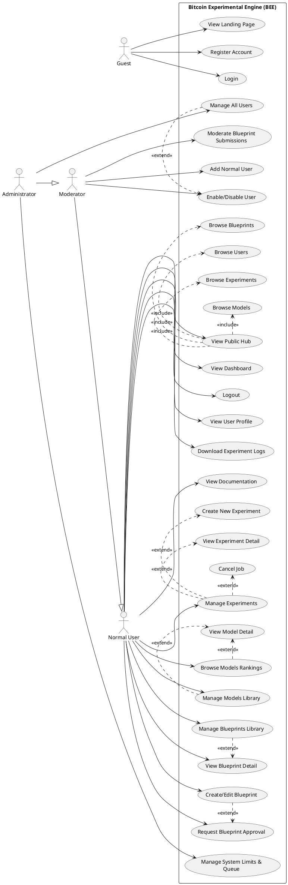
```plantuml
@startuml
left to right direction
skinparam packageStyle rectangle
skinparam wrapWidth 200

actor Guest
actor "Normal User" as User
actor Moderator
actor Administrator as Admin

rectangle "Bitcoin Experimental Engine (BEE)" {

  ' ===== GUEST USE CASES =====
  (View Landing Page)
  (Register Account)
  (Login)

  ' ===== AUTHENTICATED USER USE CASES =====
  (View Dashboard)
  (Logout)
  (View User Profile)
  
  ' ===== EXPERIMENT WORKFLOW =====
  (Manage Experiments)
  (Create New Experiment)
  (View Experiment Detail)
  (Cancel Job)
  
  ' ===== MODEL DISCOVERY =====
  (Browse Models Rankings)
  (View Model Detail)
  (Manage Models Library)
  
  ' ===== BLUEPRINT WORKFLOW =====
  (Manage Blueprints Library) 
  (Create/Edit Blueprint)
  (Request Blueprint Approval)
  (View Blueprint Detail)
  
  ' ===== ANALYSIS & DISCOVERY =====
  (Download Experiment Logs)
  (View Public Hub)
  (Browse Users)
  (Browse Experiments)
  (Browse Models)
  (Browse Blueprints)
  (View Documentation)
  
  ' ===== MODERATOR USE CASES =====
  (Moderate Blueprint Submissions)
  (Add Normal User)
  (Enable/Disable User)
  
  ' ===== ADMIN USE CASES =====
  (Manage All Users)
  (Manage System Limits & Queue)

  ' ===== RELATIONSHIPS =====
  ' Experiment workflow extensions
  (Manage Experiments) .> (Create New Experiment) : <<extend>>
  (Manage Experiments) .> (View Experiment Detail) : <<extend>>
  (Manage Experiments) .> (Cancel Job) : <<extend>>
  
  ' Model discovery extensions
  (Browse Models Rankings) .> (View Model Detail) : <<extend>>
  (Manage Models Library) .> (View Model Detail) : <<extend>>
  
  ' Blueprint workflow extensions
  (Manage Blueprints Library) .> (View Blueprint Detail) : <<extend>>
  (Create/Edit Blueprint) .> (Request Blueprint Approval) : <<extend>>
  
  ' Public Hub inclusions
  (View Public Hub) .> (Browse Users) : <<include>>
  (View Public Hub) .> (Browse Experiments) : <<include>>
  (View Public Hub) .> (Browse Models) : <<include>>
  (View Public Hub) .> (Browse Blueprints) : <<include>>
  
  ' User management extensions
  (Manage All Users) .> (Enable/Disable User) : <<extend>>
}

' ===== ACTOR INHERITANCE =====
Moderator --|> User
Admin --|> Moderator

' ===== ACTOR ASSOCIATIONS =====
Guest --> (View Landing Page)
Guest --> (Register Account)
Guest --> (Login)

User --> (View Dashboard)
User --> (Logout)
User --> (View User Profile)
User --> (Manage Experiments)
User --> (Browse Models Rankings)
User --> (Manage Models Library) 
User --> (Manage Blueprints Library) 
User --> (Create/Edit Blueprint)
User --> (Request Blueprint Approval)
User --> (View Blueprint Detail)
User --> (Download Experiment Logs)
User --> (View Public Hub)
User --> (View Documentation)

Moderator --> (Moderate Blueprint Submissions)
Moderator --> (Add Normal User)
Moderator --> (Enable/Disable User)

Admin --> (Manage All Users)
Admin --> (Manage System Limits & Queue)

@enduml
```

#### 4.2.2 Use Case Specification

##### 4.2.2.1 Guest Use Case Specifications

**UC001: View Landing Page**

- Use Case ID: UC001
- Name: View Landing Page
- Actors: Guest
- Preconditions: None
- Postconditions: Landing page is displayed with navigation options to authentication flows
- Main Flow:
  1. Guest accesses the application
  2. System displays the landing page containing:
     - Platform overview and value proposition
     - Login button
     - Get Started button
  3. System restricts access to internal pages for unauthenticated users
- Exceptions: None
- Alternatives: None

**UC002: Register Account**

- Use Case ID: UC002
- Name: Register Account
- Actors: Guest
- Preconditions: Guest is on the registration page and not authenticated
- Postconditions: New user account is created and user is authenticated
- Main Flow:
  1. Guest submits registration form with name, username, email, password, and password confirmation
  2. System validates input data against format and uniqueness constraints
  3. System creates user account with default role and status
  4. System hashes password using a secure one-way algorithm
  5. System creates a server-managed session containing user identity and role
  6. System sets session identifier in a secure, server-managed session cookie
  7. System redirects user to dashboard
- Exceptions:
  - E1: Username already exists. Display validation error
  - E2: Password mismatch. Display validation error
  - E3: Invalid format. Highlight field errors
- Alternatives:
  - A1: Click Sign In link. Navigate to login page

**UC003: Login**

- Use Case ID: UC003
- Name: Login
- Actors: Guest
- Preconditions: Guest is on the login page and not authenticated
- Postconditions: User is authenticated and session is established
- Main Flow:
  1. Guest submits email and password credentials
  2. System verifies account existence and status
  3. System validates credentials against hashed password
  4. System creates a server-managed session containing user identity and role
  5. System sets session identifier in a secure, server-managed session cookie
  6. System redirects user to dashboard
- Exceptions:
  - E1: Invalid credentials. Display authentication error, do not create session
  - E2: Account disabled. Display account status notification
- Alternatives:
  - A1: Click Create one link. Navigate to registration page

---

##### 4.2.2.2 User Use Case Specifications

**UC004: Logout**

- Use Case ID: UC004
- Name: Logout
- Actors: Authenticated User (Normal User, Moderator, Admin)
- Preconditions: User has an active authenticated session with server-managed session data
- Postconditions: Server-side session data is destroyed and user is redirected to landing page
- Main Flow:
  1. User initiates logout action
  2. Client sends POST request to auth logout endpoint
  3. System reads session identifier from the secure session cookie
  4. System destroys server-side session data
  5. System clears authentication cookie
  6. System returns OK response
  7. System redirects user to landing page
- Exceptions: None
- Alternatives: None

**UC005: View Dashboard**

- Use Case ID: UC005
- Name: View Dashboard
- Actors: Authenticated User
- Preconditions: User is authenticated
- Postconditions: Dashboard with personalized overview and navigation is displayed
- Main Flow:

  1. System loads user-specific dashboard content
  2. System displays:
     - Experiment summary statistics
     - Quick action to create new experiment
     - Recent experiments list

  - Recent experiments list

  3. System applies role-based interface rendering
- Exceptions: None
- Alternatives: None

**UC006: Manage Experiments**

- Use Case ID: UC006
- Name: Manage Experiments
- Actors: Authenticated User
- Preconditions: User is authenticated
- Postconditions: Experiment management interface is displayed with user's experiments
- Main Flow:
  1. User accesses experiments management page
  2. System displays list of user's experiments with status indicators
  3. System provides filtering options by experiment status
  4. System provides action to create new experiment
- Exceptions: None
- Alternatives:
  - A1: Apply status filter. Refresh experiment list with filtered results

**UC007: Create New Experiment**

- Use Case ID: UC007
- Name: Create New Experiment
- Actors: Authenticated User
- Preconditions: User is authenticated and has access to experiment creation interface
- Postconditions: New experiment record is created and queued for asynchronous execution
- Main Flow:
  1. User initiates new experiment creation
  2. User completes multi-step wizard:
     - Step 1: Enter experiment name and description
     - Step 2: Select data interval and date range from fixed BTCUSDT dataset
     - Step 3: Configure train, validation, test split ratios
     - Step 4: Select Blueprint (Owned or public approved Blueprints only)
     - Step 4.5: Override Blueprint parameter ranges for THIS experiment run only
       - Narrow existing ranges (for example, sma period from 10,20,50 to 20,50)
       - Fix specific values (for example, sma period equals 20)
       - Define new valid ranges within Loop API constraints
       - Critical constraint: Overrides apply ONLY to this experiment; Blueprint definition remains unchanged
     - Step 5: Review configuration summary including override summary
     - Step 6: Submit experiment
  3. System validates configuration against business rules
  4. System creates experiment record with queued status
  5. System enqueues experiment job to asynchronous task queue
  6. System displays confirmation with queue position
- Exceptions:
  - E1: Invalid configuration. Display validation errors
  - E2: Resource limits exceeded. Display system constraint notification
- Alternatives:
  - A1: Cancel during wizard. Return to experiment management page

**UC008: View Experiment Detail**

- Use Case ID: UC008
- Name: View Experiment Detail
- Actors: Authenticated User
- Preconditions: User is authenticated and has access to the experiment
- Postconditions: Experiment details and results are displayed
- Main Flow:
  1. User selects experiment from list
  2. System displays experiment configuration summary
  3. System displays current execution status and progress
  4. For completed experiments, system displays performance metrics and model results
  5. System provides options to download experiment artifacts
- Exceptions: None
- Alternatives:
  - A1: Download metrics. System provides CSV export of experiment data
  - A2: Download logs. System provides CSV export of experiment logs

**UC009: Browse Models Rankings**

- Use Case ID: UC009
- Name: Browse Models Rankings
- Actors: Authenticated User
- Preconditions: User is authenticated
- Postconditions: Ranked list of models from successful experiments is displayed
- Main Flow:
  1. User accesses models rankings page
  2. System displays models sorted by performance metrics
  3. System provides filtering and sorting options
  4. User can select a model to view detailed information
- Exceptions: None
- Alternatives:
  - A1: Apply filters. System refreshes rankings with filtered results
  - A2: Change sort order. System reorders models by selected metric

**UC010: View Model Detail**

- Use Case ID: UC010
- Name: View Model Detail
- Actors: Authenticated User
- Preconditions: User is authenticated and has access to the model
- Postconditions: Detailed model information and metrics are displayed
- Main Flow:
  1. User selects model from rankings or library
  2. System displays model performance metrics
  3. System displays model parameters and configuration
  4. System provides options to favorite the model
- Exceptions: None
- Alternatives:
  - A1: Favorite model. System adds model to user's favorites
  - A2: Download logs. System provides CSV export of experiment logs

**UC011: Manage Models Library**

- Use Case ID: UC011
- Name: Manage Models Library
- Actors: Authenticated User
- Preconditions: User is authenticated
- Postconditions: Models library interface is displayed with user's owned models and favorited models in separate tabs
  Main Flow:
- User accesses models library page
  1. System displays tabs: "Owned" and "Favorited"
  2. User can switch between tabs to view owned models or favorited models
  3. For "Favorited" tab, system displays only models with target_type = MODEL
  4. User can select a model to view detailed information
  5. User can remove models from favorites via trash icon (immediate UI update + API call)
- Exceptions: None
- Alternatives:
  - A1: Click model from library. Navigate to Model Detail page

**UC012: Manage Blueprints Library**

- Use Case ID: UC012
- Name: Manage Blueprints Library
- Actors: Authenticated User
- Preconditions: User is authenticated
- Postconditions: Blueprint library interface is displayed with user's owned Blueprints and favorited Blueprints in separate tabs
- Main Flow:
  - User accesses Blueprints library page
  - System displays tabs: "Owned" and "Favorited"
  - User can switch between tabs to view owned Blueprints or favorited Blueprints
  - For "Favorited" tab, system displays only Blueprints with target_type = Blueprint
  - User can select a Blueprint to view detailed information
  - For owned Blueprints in DRAFT/REJECTED state, user can edit or request approval
  - User can remove Blueprints from favorites via trash icon (immediate UI update + API call)
- Exceptions: None
- Alternatives:
  - A1: Click Blueprint from library. Navigate to Blueprint Detail page

**UC013: Create/Edit Blueprint**

- Use Case ID: UC013
- Name: Create/Edit Blueprint
- Actors: Authenticated User
- Preconditions: User is authenticated and has access to Blueprint creation/editing interface
- Postconditions: New or updated Blueprint record is saved with appropriate versioning
- Main Flow:
  1. User initiates Blueprint creation or selects owned Blueprint for editing
  2. User completes multi-step wizard:
     - Step 1: Enter Blueprint name and description
     - Step 2: Select atomic indicators and define parameter ranges
     - Step 3: Select compound features and define parameter ranges
     - Step 4: Select reference architecture and define hyperparameter ranges
     - Step 5: Review complete pipeline specification
  3. User submits Blueprint configuration
  4. System validates configuration
  5. IF creating NEW Blueprint OR editing DRAFT Blueprint with submitted at equals NULL (never submitted for approval):
     - System saves updates IN PLACE with status equals DRAFT
       ELSE (editing Blueprint with submitted at NOT NULL, previously submitted and immutable):
     - System creates NEW versioned copy with:
       - Parent reference to original Blueprint
       - Sequential version number increment
       - Status equals DRAFT
       - Original artifact anchoring preserved
  6. System redirects to Blueprint detail page
- Exceptions:
  - E1: Invalid configuration. Display validation errors
- Alternatives:
  - A1: Cancel during wizard. Return to Blueprint library page

**UC014: Request Blueprint Approval**

- Use Case ID: UC014
- Name: Request Blueprint Approval
- Actors: Authenticated User (Non-Admin)
- Preconditions: User owns a Blueprint in DRAFT or REJECTED state
- Postconditions: Blueprint status transitions to PENDING and versioning boundary is established
- Main Flow:
  1. User accesses owned Blueprint detail page
  2. User initiates approval request
  3. System validates Blueprint is in DRAFT or REJECTED state AND submitted at equals NULL
  4. System updates Blueprint status to PENDING
  5. System sets submitted at equals NOW timestamp
  6. System displays updated status
  7. System enforces: All future edits to this Blueprint will create NEW versioned copies (never in place mutation)
- Exceptions: None
- Alternatives: None

**UC015: View Blueprint Detail**

- Use Case ID: UC015
- Name: View Blueprint Detail
- Actors: Authenticated User
- Preconditions: User is authenticated and has access to the Blueprint
- Postconditions: Detailed Blueprint specification and status are displayed
- Main Flow:
  1. User selects Blueprint from library or public hub
  2. System displays complete pipeline specification
  3. System displays current approval status
  4. System displays version lineage information:
     - Version number and sequential identifier
     - Parent Blueprint reference (if applicable)
     - Navigation links to related versions
     - Original artifact anchor indicator
  5. For owned Blueprints, system provides edit and approval request options
  6. For approved Blueprints, system indicates public visibility
- Exceptions: None
- Alternatives: None

**UC016: Download Experiment Logs**

- Use Case ID: UC016
- Name: Download Experiment Logs
- Actors: Authenticated User
- Preconditions: User is authenticated and has access to completed experiment
- Postconditions: CSV log export is initiated for the selected experiment
- Main Flow:
  1. User accesses experiment detail page
  2. User selects a completed experiment
  3. User selects log type to download
  4. System generates a CSV export for the selected log type
  5. Browser downloads the CSV file
- Exceptions:
  - E1: No completed experiments. Display empty state
- Alternatives:
  - A1: Cancel download. Remain on experiment detail view

**UC017: View Public Hub**

- Use Case ID: UC017
- Name: View Public Hub
- Actors: Authenticated User
- Preconditions: User is authenticated
- Postconditions: Public hub interface is displayed with discovery tabs
- Main Flow:
  1. User accesses public hub page
  2. System displays tabbed interface with:
     - Users tab
     - Experiments tab
     - Models tab
     - Blueprints tab
  3. User can switch between tabs to browse public content
  4. System provides search and filter capabilities
- Exceptions: None
- Alternatives:
  - A1: Search by username. System filters results by owner
  - A2: Apply filters. System refreshes content with filtered results

**UC018: Browse Users**

- Use Case ID: UC018
- Name: Browse Users
- Actors: Authenticated User
- Preconditions: User is authenticated and accessing public hub users tab
- Postconditions: List of enabled users is displayed
- Main Flow:
  1. System displays list of enabled user accounts
  2. User can select a user to view profile
  3. System provides search functionality for user discovery
- Exceptions: None
- Alternatives:
  - A1: Search users. System filters user list by search criteria

**UC019: Browse Experiments**

- Use Case ID: UC019
- Name: Browse Experiments
- Actors: Authenticated User
- Preconditions: User is authenticated and accessing public hub experiments tab
- Postconditions: List of successful experiments is displayed
- Main Flow:
  1. System displays list of completed successful experiments
  2. User can select an experiment to view details
  3. System provides filtering options by owner or criteria
- Exceptions: None
- Alternatives:
  - A1: Filter by owner. System displays experiments by selected user

**UC020: Browse Models**

- Use Case ID: UC020
- Name: Browse Models
- Actors: Authenticated User
- Preconditions: User is authenticated and accessing public hub models tab
- Postconditions: List of models from successful experiments is displayed
- Main Flow:
  1. System displays list of models from successful experiments
  2. User can select a model to view details
  3. System provides filtering and sorting options
- Exceptions: None
- Alternatives:
  - A1: Filter models. System refreshes model list with filtered results

**UC021: Browse Blueprints**

- Use Case ID: UC021
- Name: Browse Blueprints
- Actors: Authenticated User
- Preconditions: User is authenticated and accessing public hub Blueprints tab
- Postconditions: List of approved Blueprints is displayed
- Main Flow:
  1. System displays list of approved Blueprints
  2. User can select a Blueprint to view details
  3. System provides filtering options by owner or criteria
- Exceptions: None
- Alternatives:
  - A1: Filter by owner. System displays Blueprints by selected user

**UC022: View Documentation**

- Use Case ID: UC022
- Name: View Documentation
- Actors: Authenticated User
- Preconditions: User is authenticated
- Postconditions: Documentation content is displayed
- Main Flow:
  1. User accesses documentation page
  2. System displays list of documentation entries
  3. User selects documentation entry
  4. System renders documentation content in viewer
- Exceptions: None
- Alternatives: None

**UC023: View User Profile**

- Use Case ID: UC023
- Name: View User Profile
- Actors: Authenticated User
- Preconditions: User is authenticated
- Postconditions: User profile details and activity summary are displayed
- Main Flow:
  1. User accesses profile via navbar dropdown or Public Hub
  2. System verifies target user account is ENABLED (status equals enabled)
  3. System displays profile containing:
     - User details (name, username, join date)
     - Status badge (enabled equals green, disabled equals red)
     - Successful experiments count (status equals completed AND success equals true)
     - Models count from successful experiments
     - Approved Blueprints count and list (approval state equals APPROVED)
  4. User can click any item to navigate to its detail page
- Exceptions: None
- Alternatives: None

**UC024: Cancel Job**

- Use Case ID: UC024
- Name: Cancel Job
- Actors: Authenticated User
- Preconditions: User owns a queued or running experiment job
- Postconditions: Job is terminated and status updated to cancelled
- Main Flow:
  1. User views job detail page (experiment)
  2. System displays cancel button IF status IN (queued, running)
  3. User clicks cancel button
  4. System prompts for confirmation
  5. User confirms cancellation
  6. IF job status equals queued:
     - System removes job from asynchronous job queue
     - System updates record status equals cancelled
       ELSE IF job status equals running:
     - System signals job termination
     - Worker performs graceful cleanup of partial artifacts
     - System updates record status equals cancelled
  7. System displays cancellation confirmation
- Exceptions: None
- Alternatives:
  - A1: Cancel confirmation. Return to detail page without action

---

##### 4.2.2.3 Moderator Use Case Specifications

**UC025: Moderate Blueprint Submissions**

- Use Case ID: UC025
- Name: Moderate Blueprint Submissions
- Actors: Moderator, Administrator
- Preconditions: User is authenticated with moderator or administrator role
- Postconditions: Blueprint approval status is updated
- Main Flow:
  1. Staff member accesses Blueprint moderation interface
  2. System displays queue of pending Blueprint submissions
  3. Staff reviews Blueprint specification
  4. Staff selects approval action (approve or reject)
  5. System updates Blueprint status
- Exceptions:
  - E1: Blueprint not in pending state. Display status error notification
- Alternatives:
  - A1: Disapprove approved Blueprint:
    1. Staff selects disapprove action on APPROVED Blueprint
    2. System transitions Blueprint status to REJECTED
    3. System automatically creates new editable DRAFT version:
       - Inherits parent reference to disapproved Blueprint
       - Preserves original artifact anchoring
       - Sets owner visibility for remediation
    4. System removes original Blueprint from Public Hub visibility

**UC026: Add Normal User**

- Use Case ID: UC026
- Name: Add Normal User
- Actors: Moderator, Administrator
- Preconditions: User is authenticated with moderator or administrator role
- Postconditions: New normal user account is created
- Main Flow:
  1. Staff member accesses user management interface
  2. Staff initiates new user creation
  3. Staff enters user details
  4. System validates input data
  5. System creates user account with normal user role
  6. System displays confirmation
- Exceptions:
  - E1: Invalid input. Display validation errors
  - E2: Username already exists. Display uniqueness error
- Alternatives: None

**UC027: Enable/Disable User**

- Use Case ID: UC027
- Name: Enable/Disable User
- Actors: Moderator, Administrator
- Preconditions: User is authenticated with appropriate role and accessing user management
- Postconditions: User account status is updated
- Main Flow:
  1. Staff member accesses user management interface
  2. Staff selects user account
  3. Staff initiates status change action
  4. System validates staff has permission to modify target user
  5. System updates user account status
- Exceptions: None
- Alternatives:
  - A1: Enable disabled account. System updates status to enabled
  - A2: Disable enabled account. System updates status to disabled

---

##### 4.2.2.4 Administrator Use Case Specifications

**UC028: Manage All Users**

- Use Case ID: UC028
- Name: Manage All Users
- Actors: Administrator
- Preconditions: User is authenticated with administrator role
- Postconditions: User management interface is displayed with full user list
- Main Flow:
  1. Administrator accesses user management page
  2. System displays list of all registered users
  3. Administrator can perform user management actions:
     - Create new users
     - Edit user details
     - Reset passwords
     - Modify user roles
     - Remove user accounts
  4. System provides search and filter capabilities
- Exceptions: None
- Alternatives:
  - A1: Search users. System filters user list by search criteria

**UC029: Manage System Limits and Queue**

- Use Case ID: UC029
- Name: Manage System Limits and Queue
- Actors: Administrator
- Preconditions: User is authenticated with administrator role
- Postconditions: System monitoring dashboard is displayed with queue and limits information
- Main Flow:
  1. Administrator accesses system management interface
  2. System displays:
     - Active job queue with execution status
     - System health indicators
     - Database connectivity status
     - Current concurrency limits
  3. Administrator can modify system concurrency settings
  4. System validates and applies configuration changes
- Exceptions: None
- Alternatives:
  - A1: Adjust concurrency limits. System updates job execution parameters
  - A2: Adjust session timeout.

### 4.3 Dynamic Model

This section models system behavior over time by detailing message flows, activity progressions, and state transitions for core workflows. Sequence diagrams capture stepwise interactions between Boundary, Control, and Entity layers for each use case, while activity diagrams summarize end-to-end process logic for experiments, the execution pipeline, and governance workflows. State diagrams then formalize lifecycle transitions for key entities, ensuring consistency with the constraints and invariants defined in Chapter 3.

#### 4.3.1 Sequence Diagrams

##### 4.3.1.1 Guest Sequence Diagrams

**UC001: View Landing Page**

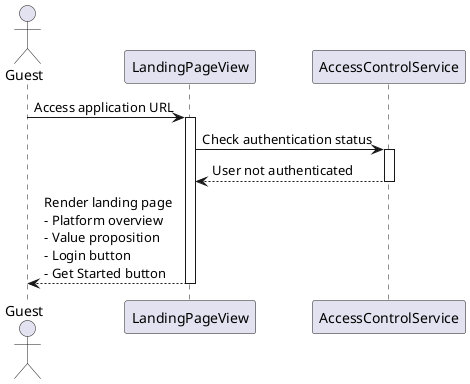
```plantuml
@startuml UC001_View_Landing_Page
actor Guest

participant "LandingPageView" as View
participant "AccessControlService" as AccessControl

Guest -> View: Access application URL
activate View

View -> AccessControl: Check authentication status
activate AccessControl

AccessControl --> View: User not authenticated
deactivate AccessControl

View --> Guest: Render landing page\n- Platform overview\n- Value proposition\n- Login button\n- Get Started button
deactivate View
@enduml
```

**UC002: Register Account**

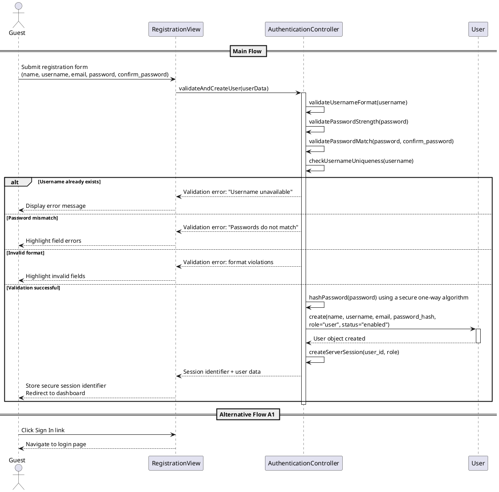
```plantuml
@startuml UC002_Register_Account
actor Guest

participant "RegistrationView" as View
participant "AuthenticationController" as AuthCtrl
participant "User" as UserEntity

== Main Flow ==
Guest -> View: Submit registration form\n(name, username, email, password, confirm_password)
View -> AuthCtrl: validateAndCreateUser(userData)
activate AuthCtrl

AuthCtrl -> AuthCtrl: validateUsernameFormat(username)
AuthCtrl -> AuthCtrl: validatePasswordStrength(password)
AuthCtrl -> AuthCtrl: validatePasswordMatch(password, confirm_password)
AuthCtrl -> AuthCtrl: checkUsernameUniqueness(username)

alt Username already exists
    AuthCtrl --> View: Validation error: "Username unavailable"
    View --> Guest: Display error message
else Password mismatch
    AuthCtrl --> View: Validation error: "Passwords do not match"
    View --> Guest: Highlight field errors
else Invalid format
    AuthCtrl --> View: Validation error: format violations
    View --> Guest: Highlight invalid fields
else Validation successful
    AuthCtrl -> AuthCtrl: hashPassword(password) using a secure one-way algorithm
    AuthCtrl -> UserEntity: create(name, username, email, password_hash,\nrole="user", status="enabled")
    activate UserEntity
    UserEntity --> AuthCtrl: User object created
    deactivate UserEntity
  
    AuthCtrl -> AuthCtrl: createServerSession(user_id, role)
    AuthCtrl --> View: Session identifier + user data
    View --> Guest: Store secure session identifier\nRedirect to dashboard

end

deactivate AuthCtrl

== Alternative Flow A1 ==
Guest -> View: Click Sign In link
View --> Guest: Navigate to login page
@enduml
```

**UC003: Login**

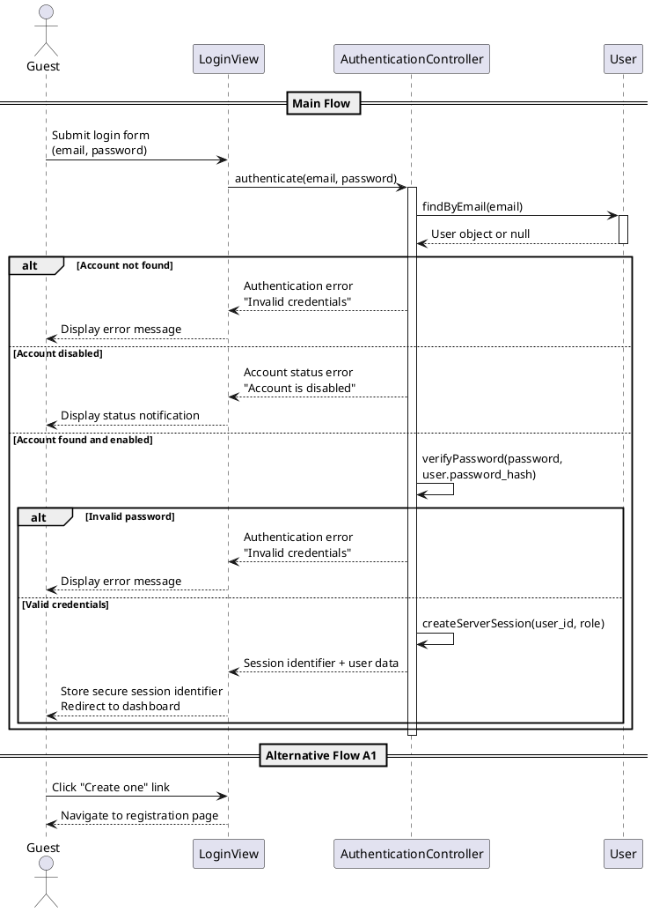
```plantuml
@startuml UC003_Login
actor Guest

participant "LoginView" as View
participant "AuthenticationController" as AuthCtrl
participant "User" as UserEntity

== Main Flow ==
Guest -> View: Submit login form\n(email, password)
View -> AuthCtrl: authenticate(email, password)
activate AuthCtrl

AuthCtrl -> UserEntity: findByEmail(email)
activate UserEntity
UserEntity --> AuthCtrl: User object or null
deactivate UserEntity

alt Account not found
    AuthCtrl --> View: Authentication error\n"Invalid credentials"
    View --> Guest: Display error message
else Account disabled
    AuthCtrl --> View: Account status error\n"Account is disabled"
    View --> Guest: Display status notification
else Account found and enabled
    AuthCtrl -> AuthCtrl: verifyPassword(password,\nuser.password_hash)
  
    alt Invalid password
        AuthCtrl --> View: Authentication error\n"Invalid credentials"
        View --> Guest: Display error message
    else Valid credentials
        AuthCtrl -> AuthCtrl: createServerSession(user_id, role)
              AuthCtrl --> View: Session identifier + user data
            View --> Guest: Store secure session identifier\nRedirect to dashboard
    end
end

deactivate AuthCtrl

== Alternative Flow A1 ==
Guest -> View: Click "Create one" link
View --> Guest: Navigate to registration page
@enduml

```

##### 4.3.1.2 User Sequence Diagrams

**UC004: Logout**

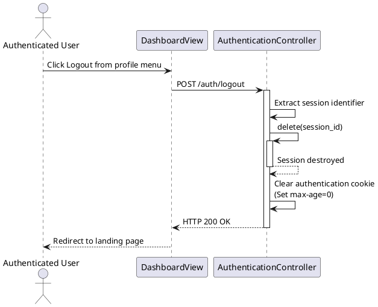
```plantuml
@startuml UC004_Logout
actor "Authenticated User" as User

participant "DashboardView" as View
participant "AuthenticationController" as AuthCtrl

User -> View: Click Logout from profile menu
View -> AuthCtrl: POST /auth/logout
activate AuthCtrl

AuthCtrl -> AuthCtrl: Extract session identifier
AuthCtrl -> AuthCtrl: delete(session_id)
activate AuthCtrl
AuthCtrl --> AuthCtrl: Session destroyed
deactivate AuthCtrl

AuthCtrl -> AuthCtrl: Clear authentication cookie\n(Set max-age=0)
AuthCtrl --> View: HTTP 200 OK
deactivate AuthCtrl

View --> User: Redirect to landing page

@enduml

```

**UC005: View Dashboard**

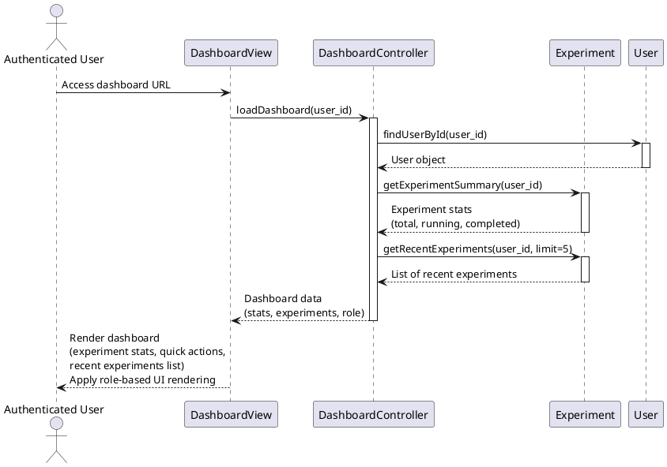
```plantuml
@startuml UC005_View_Dashboard
actor "Authenticated User" as User

participant "DashboardView" as View
participant "DashboardController" as Ctrl
participant "Experiment" as ExpEntity
participant "User" as UserEntity

User -> View: Access dashboard URL
View -> Ctrl: loadDashboard(user_id)
activate Ctrl

Ctrl -> UserEntity: findUserById(user_id)
activate UserEntity
UserEntity --> Ctrl: User object
deactivate UserEntity

Ctrl -> ExpEntity: getExperimentSummary(user_id)
activate ExpEntity
ExpEntity --> Ctrl: Experiment stats\n(total, running, completed)
deactivate ExpEntity

Ctrl -> ExpEntity: getRecentExperiments(user_id, limit=5)
activate ExpEntity
ExpEntity --> Ctrl: List of recent experiments
deactivate ExpEntity

Ctrl --> View: Dashboard data\n(stats, experiments, role)
deactivate Ctrl

View --> User: Render dashboard\n(experiment stats, quick actions,\nrecent experiments list)\nApply role-based UI rendering
@enduml

```

**UC006: Manage Experiments**

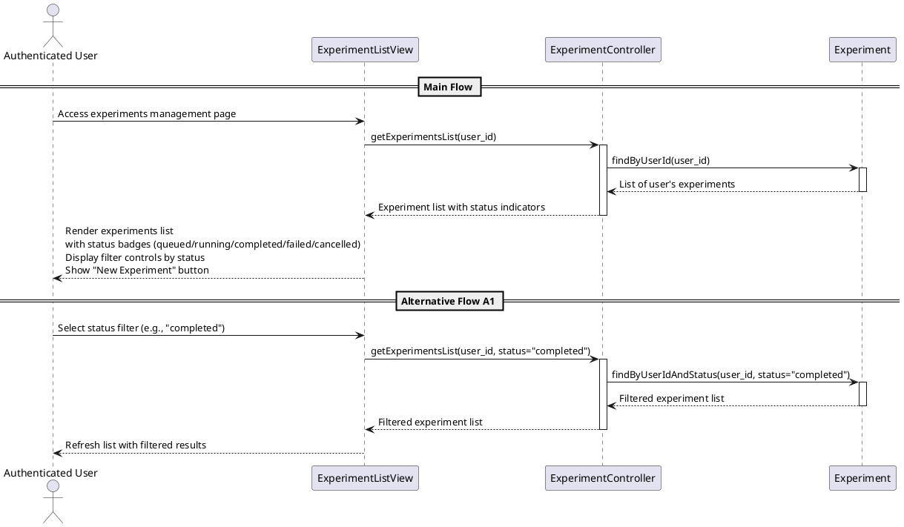
```plantuml
@startuml UC006_Manage_Experiments
actor "Authenticated User" as User

participant "ExperimentListView" as View
participant "ExperimentController" as Ctrl
participant "Experiment" as ExpEntity

== Main Flow ==
User -> View: Access experiments management page
View -> Ctrl: getExperimentsList(user_id)
activate Ctrl

Ctrl -> ExpEntity: findByUserId(user_id)
activate ExpEntity
ExpEntity --> Ctrl: List of user's experiments
deactivate ExpEntity

Ctrl --> View: Experiment list with status indicators
deactivate Ctrl

View --> User: Render experiments list\nwith status badges (queued/running/completed/failed/cancelled)\nDisplay filter controls by status\nShow "New Experiment" button

== Alternative Flow A1 ==
User -> View: Select status filter (e.g., "completed")
View -> Ctrl: getExperimentsList(user_id, status="completed")
activate Ctrl

Ctrl -> ExpEntity: findByUserIdAndStatus(user_id, status="completed")
activate ExpEntity
ExpEntity --> Ctrl: Filtered experiment list
deactivate ExpEntity

Ctrl --> View: Filtered experiment list
deactivate Ctrl

View --> User: Refresh list with filtered results
@enduml

```

**UC007: Create New Experiment**

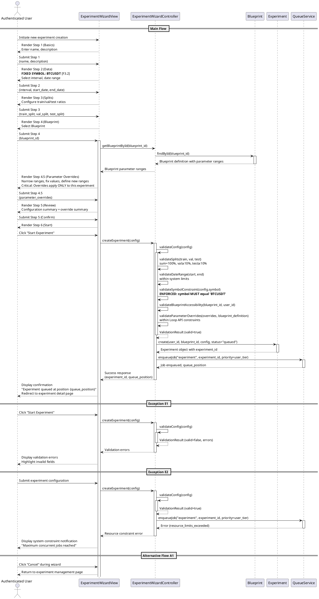
```plantuml
@startuml UC007_Create_New_Experiment
actor "Authenticated User" as User

participant "ExperimentWizardView" as View
participant "ExperimentWizardController" as Ctrl
participant "Blueprint" as BlueprintEntity
participant "Experiment" as ExpEntity
participant "QueueService" as Queue

== Main Flow ==
User -> View: Initiate new experiment creation
View --> User: Render Step 1 (Basics)\nEnter name, description

User -> View: Submit Step 1\n(name, description)
View --> User: Render Step 2 (Data)\n<B>FIXED SYMBOL: BTCUSDT</B> [F3.2]\nSelect interval, date range

User -> View: Submit Step 2\n(interval, start_date, end_date)
View --> User: Render Step 3 (Splits)\nConfigure train/val/test ratios

User -> View: Submit Step 3\n(train_split, val_split, test_split)
View --> User: Render Step 4 (Blueprint)\nSelect Blueprint

User -> View: Submit Step 4\n(blueprint_id)
activate View

View -> Ctrl: getBlueprintById(blueprint_id)
Ctrl -> BlueprintEntity: findById(blueprint_id)
activate BlueprintEntity
BlueprintEntity --> Ctrl: Blueprint definition with parameter ranges
deactivate BlueprintEntity
Ctrl --> View: Blueprint parameter ranges

View --> User: Render Step 4.5 (Parameter Overrides)\nNarrow ranges, fix values, define new ranges\nCritical: Overrides apply ONLY to this experiment

User -> View: Submit Step 4.5\n(parameter_overrides)
View --> User: Render Step 5 (Review)\nConfiguration summary + override summary

User -> View: Submit Step 5 (Confirm)
View --> User: Render Step 6 (Start)

User -> View: Click "Start Experiment"
View -> Ctrl: createExperiment(config)
activate Ctrl

Ctrl -> Ctrl: validateConfig(config)
activate Ctrl
Ctrl -> Ctrl: validateSplits(train, val, test)\nsum=100%, val≥10%, test≥10%
Ctrl -> Ctrl: validateDateRange(start, end)\nwithin system limits
Ctrl -> Ctrl: validateSymbolConstraint(config.symbol)\n<b>ENFORCED: symbol MUST equal 'BTCUSDT'</b>
Ctrl -> Ctrl: validateBlueprintAccessibility(blueprint_id, user_id)
Ctrl -> Ctrl: validateParameterOverrides(overrides, blueprint_definition)\nwithin Loop API constraints
Ctrl --> Ctrl: ValidationResult (valid=true)
deactivate Ctrl

Ctrl -> ExpEntity: create(user_id, blueprint_id, config, status="queued")
activate ExpEntity
ExpEntity --> Ctrl: Experiment object with experiment_id
deactivate ExpEntity

Ctrl -> Queue: enqueueJob("experiment", experiment_id, priority=user_tier)
activate Queue
Queue --> Ctrl: Job enqueued, queue_position
deactivate Queue

Ctrl --> View: Success response\n(experiment_id, queue_position)
deactivate Ctrl

View --> User: Display confirmation\n"Experiment queued at position {queue_position}"\nRedirect to experiment detail page

== Exception E1 ==
User -> View: Click "Start Experiment"
View -> Ctrl: createExperiment(config)
activate Ctrl

Ctrl -> Ctrl: validateConfig(config)
activate Ctrl
Ctrl --> Ctrl: ValidationResult (valid=false, errors)
deactivate Ctrl

Ctrl --> View: Validation errors
deactivate Ctrl

View --> User: Display validation errors\nHighlight invalid fields

== Exception E2 ==
User -> View: Submit experiment configuration
View -> Ctrl: createExperiment(config)
activate Ctrl

Ctrl -> Ctrl: validateConfig(config)
activate Ctrl
Ctrl --> Ctrl: ValidationResult (valid=true)
deactivate Ctrl

Ctrl -> Queue: enqueueJob("experiment", experiment_id, priority=user_tier)
activate Queue
Queue --> Ctrl: Error (resource_limits_exceeded)
deactivate Queue

Ctrl --> View: Resource constraint error
deactivate Ctrl

View --> User: Display system constraint notification\n"Maximum concurrent jobs reached"

== Alternative Flow A1 ==
User -> View: Click "Cancel" during wizard
View --> User: Return to experiment management page
@enduml


```

**UC008: View Experiment Detail**

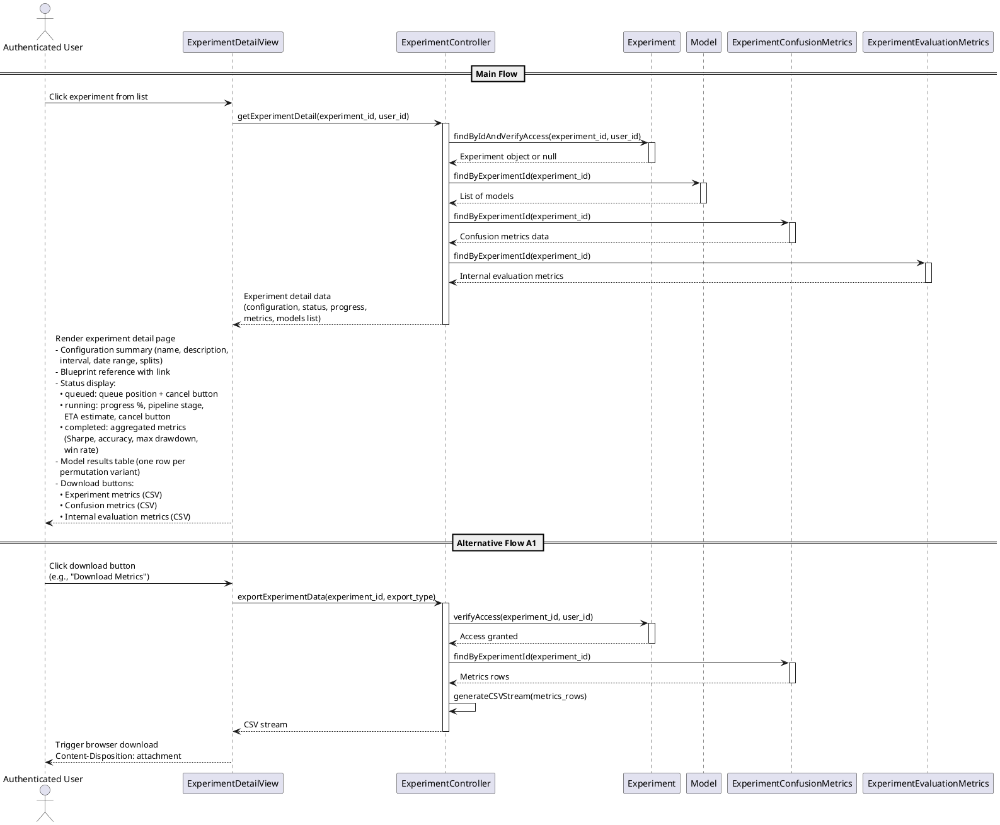
```plantuml
@startuml UC008_View_Experiment_Detail
actor "Authenticated User" as User

participant "ExperimentDetailView" as View
participant "ExperimentController" as Ctrl
participant "Experiment" as ExpEntity
participant "Model" as ModelEntity
participant "ExperimentConfusionMetrics" as ConfMetrics
participant "ExperimentEvaluationMetrics" as EvalMetrics

== Main Flow ==
User -> View: Click experiment from list
View -> Ctrl: getExperimentDetail(experiment_id, user_id)
activate Ctrl

Ctrl -> ExpEntity: findByIdAndVerifyAccess(experiment_id, user_id)
activate ExpEntity
ExpEntity --> Ctrl: Experiment object or null
deactivate ExpEntity

Ctrl -> ModelEntity: findByExperimentId(experiment_id)
activate ModelEntity
ModelEntity --> Ctrl: List of models
deactivate ModelEntity

Ctrl -> ConfMetrics: findByExperimentId(experiment_id)
activate ConfMetrics
ConfMetrics --> Ctrl: Confusion metrics data
deactivate ConfMetrics

Ctrl -> EvalMetrics: findByExperimentId(experiment_id)
activate EvalMetrics
EvalMetrics --> Ctrl: Internal evaluation metrics
deactivate EvalMetrics

Ctrl --> View: Experiment detail data\n(configuration, status, progress,\nmetrics, models list)
deactivate Ctrl

View --> User: Render experiment detail page\n- Configuration summary (name, description,\n  interval, date range, splits)\n- Blueprint reference with link\n- Status display:\n  • queued: queue position + cancel button\n  • running: progress %, pipeline stage,\n    ETA estimate, cancel button\n  • completed: aggregated metrics\n    (Sharpe, accuracy, max drawdown,\n    win rate)\n- Model results table (one row per\n  permutation variant)\n- Download buttons:\n  • Experiment metrics (CSV)\n  • Confusion metrics (CSV)\n  • Internal evaluation metrics (CSV)


== Alternative Flow A1 ==
User -> View: Click download button\n(e.g., "Download Metrics")
View -> Ctrl: exportExperimentData(experiment_id, export_type)
activate Ctrl

Ctrl -> ExpEntity: verifyAccess(experiment_id, user_id)
activate ExpEntity
ExpEntity --> Ctrl: Access granted
deactivate ExpEntity

Ctrl -> ConfMetrics: findByExperimentId(experiment_id)
activate ConfMetrics
ConfMetrics --> Ctrl: Metrics rows
deactivate ConfMetrics

Ctrl -> Ctrl: generateCSVStream(metrics_rows)
Ctrl --> View: CSV stream
deactivate Ctrl

View --> User: Trigger browser download\nContent-Disposition: attachment

@enduml

```

**UC009: Browse Models Rankings**

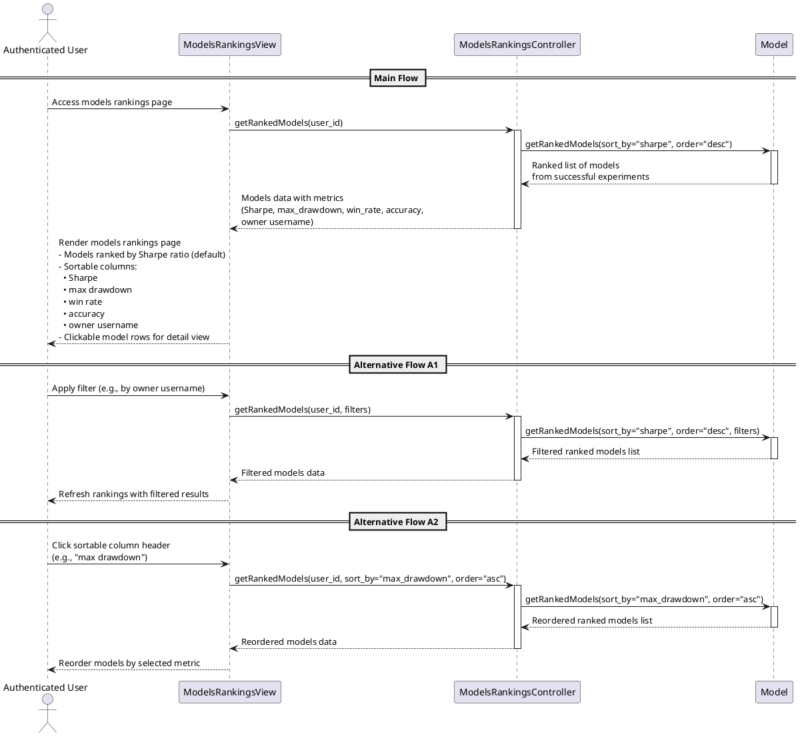
```plantuml
@startuml UC009_Browse_Models_Rankings
actor "Authenticated User" as User

participant "ModelsRankingsView" as View
participant "ModelsRankingsController" as Ctrl
participant "Model" as ModelEntity

== Main Flow ==
User -> View: Access models rankings page
View -> Ctrl: getRankedModels(user_id)
activate Ctrl

Ctrl -> ModelEntity: getRankedModels(sort_by="sharpe", order="desc")
activate ModelEntity
ModelEntity --> Ctrl: Ranked list of models\nfrom successful experiments
deactivate ModelEntity

Ctrl --> View: Models data with metrics\n(Sharpe, max_drawdown, win_rate, accuracy,\nowner username)
deactivate Ctrl

View --> User: Render models rankings page\n- Models ranked by Sharpe ratio (default)\n- Sortable columns:\n  • Sharpe\n  • max drawdown\n  • win rate\n  • accuracy\n  • owner username\n- Clickable model rows for detail view

== Alternative Flow A1 ==
User -> View: Apply filter (e.g., by owner username)
View -> Ctrl: getRankedModels(user_id, filters)
activate Ctrl

Ctrl -> ModelEntity: getRankedModels(sort_by="sharpe", order="desc", filters)
activate ModelEntity
ModelEntity --> Ctrl: Filtered ranked models list
deactivate ModelEntity

Ctrl --> View: Filtered models data
deactivate Ctrl

View --> User: Refresh rankings with filtered results

== Alternative Flow A2 ==
User -> View: Click sortable column header\n(e.g., "max drawdown")
View -> Ctrl: getRankedModels(user_id, sort_by="max_drawdown", order="asc")
activate Ctrl

Ctrl -> ModelEntity: getRankedModels(sort_by="max_drawdown", order="asc")
activate ModelEntity
ModelEntity --> Ctrl: Reordered ranked models list
deactivate ModelEntity

Ctrl --> View: Reordered models data
deactivate Ctrl

View --> User: Reorder models by selected metric
@enduml

```

**UC010: View Model Detail**

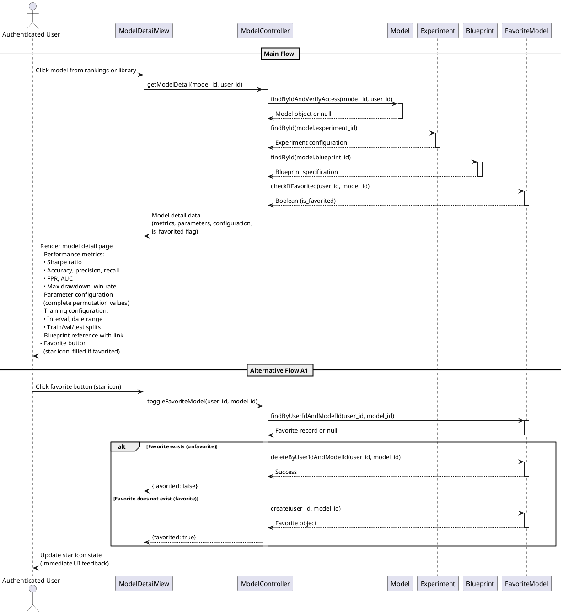
```plantuml
@startuml UC010_View_Model_Detail
actor "Authenticated User" as User

participant "ModelDetailView" as View
participant "ModelController" as Ctrl
participant "Model" as ModelEntity
participant "Experiment" as ExpEntity
participant "Blueprint" as BlueprintEntity
participant "FavoriteModel" as FavEntity

== Main Flow ==
User -> View: Click model from rankings or library
View -> Ctrl: getModelDetail(model_id, user_id)
activate Ctrl

Ctrl -> ModelEntity: findByIdAndVerifyAccess(model_id, user_id)
activate ModelEntity
ModelEntity --> Ctrl: Model object or null
deactivate ModelEntity

Ctrl -> ExpEntity: findById(model.experiment_id)
activate ExpEntity
ExpEntity --> Ctrl: Experiment configuration
deactivate ExpEntity

Ctrl -> BlueprintEntity: findById(model.blueprint_id)
activate BlueprintEntity
BlueprintEntity --> Ctrl: Blueprint specification
deactivate BlueprintEntity

Ctrl -> FavEntity: checkIfFavorited(user_id, model_id)
activate FavEntity
FavEntity --> Ctrl: Boolean (is_favorited)
deactivate FavEntity

Ctrl --> View: Model detail data\n(metrics, parameters, configuration,\nis_favorited flag)
deactivate Ctrl

View --> User: Render model detail page\n- Performance metrics:\n  • Sharpe ratio\n  • Accuracy, precision, recall\n  • FPR, AUC\n  • Max drawdown, win rate\n- Parameter configuration\n  (complete permutation values)\n- Training configuration:\n  • Interval, date range\n  • Train/val/test splits\n- Blueprint reference with link\n- Favorite button\n  (star icon, filled if favorited)

== Alternative Flow A1 ==
User -> View: Click favorite button (star icon)
View -> Ctrl: toggleFavoriteModel(user_id, model_id)
activate Ctrl

Ctrl -> FavEntity: findByUserIdAndModelId(user_id, model_id)
activate FavEntity
FavEntity --> Ctrl: Favorite record or null
deactivate FavEntity

alt Favorite exists (unfavorite)
    Ctrl -> FavEntity: deleteByUserIdAndModelId(user_id, model_id)
    activate FavEntity
    FavEntity --> Ctrl: Success
    deactivate FavEntity
    Ctrl --> View: {favorited: false}
else Favorite does not exist (favorite)
    Ctrl -> FavEntity: create(user_id, model_id)
    activate FavEntity
    FavEntity --> Ctrl: Favorite object
    deactivate FavEntity
    Ctrl --> View: {favorited: true}
end

deactivate Ctrl

View --> User: Update star icon state\n(immediate UI feedback)

@enduml
```

**UC011: Manage Models Library**

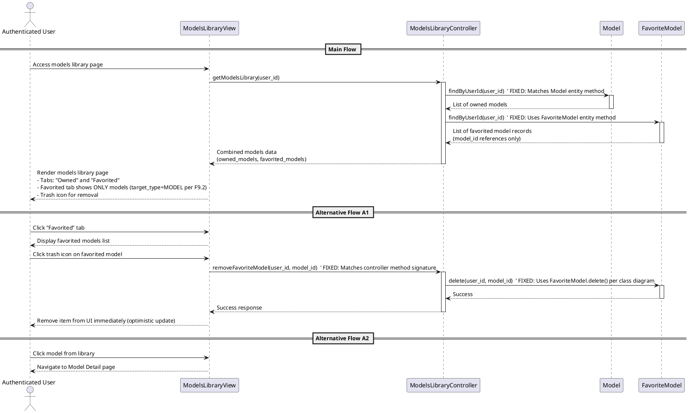
```plantuml
@startuml UC011_Manage_Models_Library
actor "Authenticated User" as User

participant "ModelsLibraryView" as View
participant "ModelsLibraryController" as Ctrl
participant "Model" as ModelEntity
participant "FavoriteModel" as FavModelEntity

== Main Flow ==
User -> View: Access models library page
View -> Ctrl: getModelsLibrary(user_id)
activate Ctrl

Ctrl -> ModelEntity: findByUserId(user_id)  ' FIXED: Matches Model entity method
activate ModelEntity
ModelEntity --> Ctrl: List of owned models
deactivate ModelEntity

Ctrl -> FavModelEntity: findByUserId(user_id)  ' FIXED: Uses FavoriteModel entity method
activate FavModelEntity
FavModelEntity --> Ctrl: List of favorited model records\n(model_id references only)
deactivate FavModelEntity

' Controller resolves model details internally
Ctrl --> View: Combined models data\n(owned_models, favorited_models)
deactivate Ctrl

View --> User: Render models library page\n- Tabs: "Owned" and "Favorited"\n- Favorited tab shows ONLY models (target_type=MODEL per F9.2)\n- Trash icon for removal

== Alternative Flow A1 ==
User -> View: Click "Favorited" tab
View --> User: Display favorited models list

User -> View: Click trash icon on favorited model
View -> Ctrl: removeFavoriteModel(user_id, model_id)  ' FIXED: Matches controller method signature
activate Ctrl

Ctrl -> FavModelEntity: delete(user_id, model_id)  ' FIXED: Uses FavoriteModel.delete() per class diagram
activate FavModelEntity
FavModelEntity --> Ctrl: Success
deactivate FavModelEntity

Ctrl --> View: Success response
deactivate Ctrl

View --> User: Remove item from UI immediately (optimistic update)

== Alternative Flow A2 ==
User -> View: Click model from library
View --> User: Navigate to Model Detail page
@enduml
```

**UC012: Manage Blueprints Library**

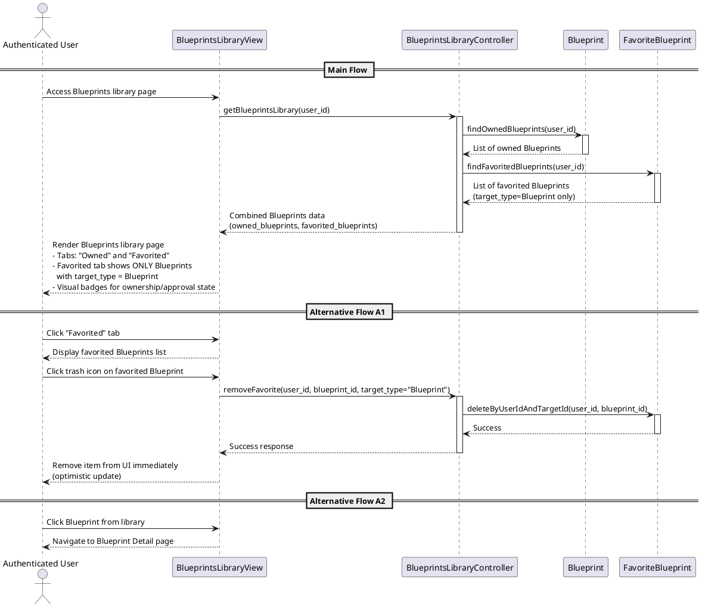
```plantuml
@startuml UC012_Manage_Blueprints_Library
actor "Authenticated User" as User

participant "BlueprintsLibraryView" as View
participant "BlueprintsLibraryController" as Ctrl
participant "Blueprint" as BlueprintEntity
participant "FavoriteBlueprint" as FavEntity

== Main Flow ==
User -> View: Access Blueprints library page
View -> Ctrl: getBlueprintsLibrary(user_id)
activate Ctrl

Ctrl -> BlueprintEntity: findOwnedBlueprints(user_id)
activate BlueprintEntity
BlueprintEntity --> Ctrl: List of owned Blueprints
deactivate BlueprintEntity

Ctrl -> FavEntity: findFavoritedBlueprints(user_id)
activate FavEntity
FavEntity --> Ctrl: List of favorited Blueprints\n(target_type=Blueprint only)
deactivate FavEntity

Ctrl --> View: Combined Blueprints data\n(owned_blueprints, favorited_blueprints)
deactivate Ctrl

View --> User: Render Blueprints library page\n- Tabs: "Owned" and "Favorited"\n- Favorited tab shows ONLY Blueprints\n  with target_type = Blueprint\n- Visual badges for ownership/approval state

== Alternative Flow A1 ==
User -> View: Click "Favorited" tab
View --> User: Display favorited Blueprints list

User -> View: Click trash icon on favorited Blueprint
View -> Ctrl: removeFavorite(user_id, blueprint_id, target_type="Blueprint")
activate Ctrl

Ctrl -> FavEntity: deleteByUserIdAndTargetId(user_id, blueprint_id)
activate FavEntity
FavEntity --> Ctrl: Success
deactivate FavEntity

Ctrl --> View: Success response
deactivate Ctrl

View --> User: Remove item from UI immediately\n(optimistic update)

== Alternative Flow A2 ==
User -> View: Click Blueprint from library
View --> User: Navigate to Blueprint Detail page

@enduml
```

**UC013: Create/Edit Blueprint**

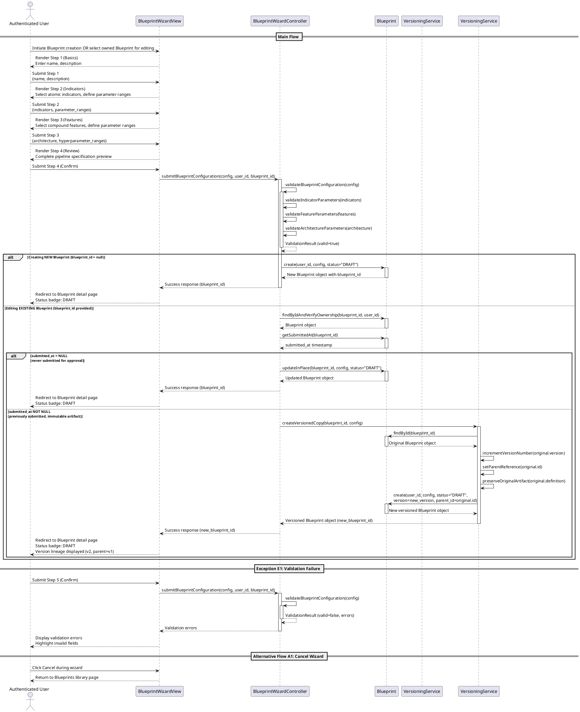
```plantuml
@startuml UC013_Create_Edit_Blueprint
actor "Authenticated User" as User

participant "BlueprintWizardView" as View
participant "BlueprintWizardController" as Ctrl
participant "Blueprint" as BlueprintEntity
participant "VersioningService" as Versioning

== Main Flow ==
User -> View: Initiate Blueprint creation OR select owned Blueprint for editing
View --> User: Render Step 1 (Basics)\nEnter name, description

User -> View: Submit Step 1\n(name, description)
View --> User: Render Step 2 (Indicators)\nSelect atomic indicators, define parameter ranges

User -> View: Submit Step 2\n(indicators, parameter_ranges)
View --> User: Render Step 3 (Features)\nSelect compound features, define parameter ranges

User -> View: Submit Step 3\n(architecture, hyperparameter_ranges)
View --> User: Render Step 4 (Review)\nComplete pipeline specification preview

User -> View: Submit Step 4 (Confirm)
View -> Ctrl: submitBlueprintConfiguration(config, user_id, blueprint_id)
activate Ctrl
' CORRECTION: Validation is INTERNAL to controller (no separate validator object)
Ctrl -> Ctrl: validateBlueprintConfiguration(config)
activate Ctrl
Ctrl -> Ctrl: validateIndicatorParameters(indicators)
Ctrl -> Ctrl: validateFeatureParameters(features)
Ctrl -> Ctrl: validateArchitectureParameters(architecture)
Ctrl --> Ctrl: ValidationResult (valid=true)
deactivate Ctrl

alt Creating NEW Blueprint (blueprint_id = null)
    Ctrl -> BlueprintEntity: create(user_id, config, status="DRAFT")
    activate BlueprintEntity
    BlueprintEntity --> Ctrl: New Blueprint object with blueprint_id
    deactivate BlueprintEntity
  
    Ctrl --> View: Success response (blueprint_id)
    deactivate Ctrl
  
    View --> User: Redirect to Blueprint detail page\nStatus badge: DRAFT

else Editing EXISTING Blueprint (blueprint_id provided)
    Ctrl -> BlueprintEntity: findByIdAndVerifyOwnership(blueprint_id, user_id)
    activate BlueprintEntity
    BlueprintEntity --> Ctrl: Blueprint object
    deactivate BlueprintEntity
  
    Ctrl -> BlueprintEntity: getSubmittedAt(blueprint_id)
    activate BlueprintEntity
    BlueprintEntity --> Ctrl: submitted_at timestamp
    deactivate BlueprintEntity
  
    alt submitted_at = NULL\n(never submitted for approval)
        Ctrl -> BlueprintEntity: updateInPlace(blueprint_id, config, status="DRAFT")
        activate BlueprintEntity
        BlueprintEntity --> Ctrl: Updated Blueprint object
        deactivate BlueprintEntity
  
        Ctrl --> View: Success response (blueprint_id)
        deactivate Ctrl
  
        View --> User: Redirect to Blueprint detail page\nStatus badge: DRAFT
  
    else submitted_at NOT NULL\n(previously submitted, immutable artifact)
        Ctrl -> VersioningService: createVersionedCopy(blueprint_id, config)
        activate VersioningService
  
        VersioningService -> BlueprintEntity: findById(blueprint_id)
        activate BlueprintEntity
        BlueprintEntity --> VersioningService: Original Blueprint object
        deactivate BlueprintEntity
  
        VersioningService -> VersioningService: incrementVersionNumber(original.version)
        VersioningService -> VersioningService: setParentReference(original.id)
        VersioningService -> VersioningService: preserveOriginalArtifact(original.definition)
  
        VersioningService -> BlueprintEntity: create(user_id, config, status="DRAFT",\nversion=new_version, parent_id=original.id)
        activate BlueprintEntity
        BlueprintEntity --> VersioningService: New versioned Blueprint object
        deactivate BlueprintEntity
  
        VersioningService --> Ctrl: Versioned Blueprint object (new_blueprint_id)
        deactivate VersioningService
  
        Ctrl --> View: Success response (new_blueprint_id)
        deactivate Ctrl
  
        View --> User: Redirect to Blueprint detail page\nStatus badge: DRAFT\nVersion lineage displayed (v2, parent=v1)
    end
end

== Exception E1: Validation Failure ==
User -> View: Submit Step 5 (Confirm)
View -> Ctrl: submitBlueprintConfiguration(config, user_id, blueprint_id)
activate Ctrl

Ctrl -> Ctrl: validateBlueprintConfiguration(config)
activate Ctrl
Ctrl --> Ctrl: ValidationResult (valid=false, errors)
deactivate Ctrl

Ctrl --> View: Validation errors
deactivate Ctrl

View --> User: Display validation errors\nHighlight invalid fields

== Alternative Flow A1: Cancel Wizard ==
User -> View: Click Cancel during wizard
View --> User: Return to Blueprints library page
@enduml
```

**UC014: Request Blueprint Approval**

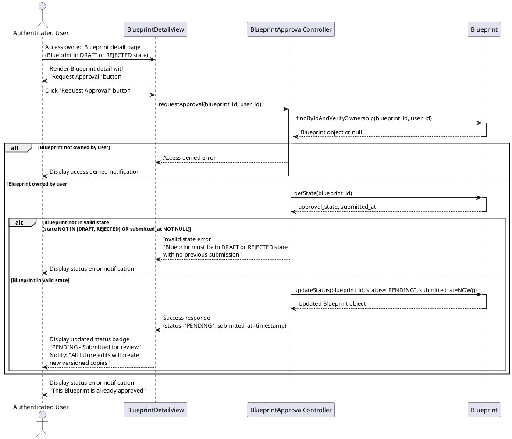
```plantuml
@startuml UC014_Request_Blueprint_Approval
actor "Authenticated User" as User

participant "BlueprintDetailView" as View
participant "BlueprintApprovalController" as Ctrl
participant "Blueprint" as BlueprintEntity

User -> View: Access owned Blueprint detail page\n(Blueprint in DRAFT or REJECTED state)
View --> User: Render Blueprint detail with\n"Request Approval" button

User -> View: Click "Request Approval" button
View -> Ctrl: requestApproval(blueprint_id, user_id)
activate Ctrl

Ctrl -> BlueprintEntity: findByIdAndVerifyOwnership(blueprint_id, user_id)
activate BlueprintEntity
BlueprintEntity --> Ctrl: Blueprint object or null
deactivate BlueprintEntity

alt Blueprint not owned by user
    Ctrl --> View: Access denied error
    View --> User: Display access denied notification
    deactivate Ctrl
else Blueprint owned by user
    Ctrl -> BlueprintEntity: getState(blueprint_id)
    activate BlueprintEntity
    BlueprintEntity --> Ctrl: approval_state, submitted_at
    deactivate BlueprintEntity
  
    alt Blueprint not in valid state\n(state NOT IN [DRAFT, REJECTED] OR submitted_at NOT NULL)
        Ctrl --> View: Invalid state error\n"Blueprint must be in DRAFT or REJECTED state\nwith no previous submission"
        View --> User: Display status error notification
        deactivate Ctrl
    else Blueprint in valid state
        Ctrl -> BlueprintEntity: updateStatus(blueprint_id, status="PENDING", submitted_at=NOW())
        activate BlueprintEntity
        BlueprintEntity --> Ctrl: Updated Blueprint object
        deactivate BlueprintEntity
  
        Ctrl --> View: Success response\n(status="PENDING", submitted_at=timestamp)
        deactivate Ctrl
  
        View --> User: Display updated status badge\n"PENDING - Submitted for review"\nNotify: "All future edits will create\nnew versioned copies"
    end
end

View --> User: Display status error notification\n"This Blueprint is already approved"
@enduml

```

**UC015: View Blueprint Detail**

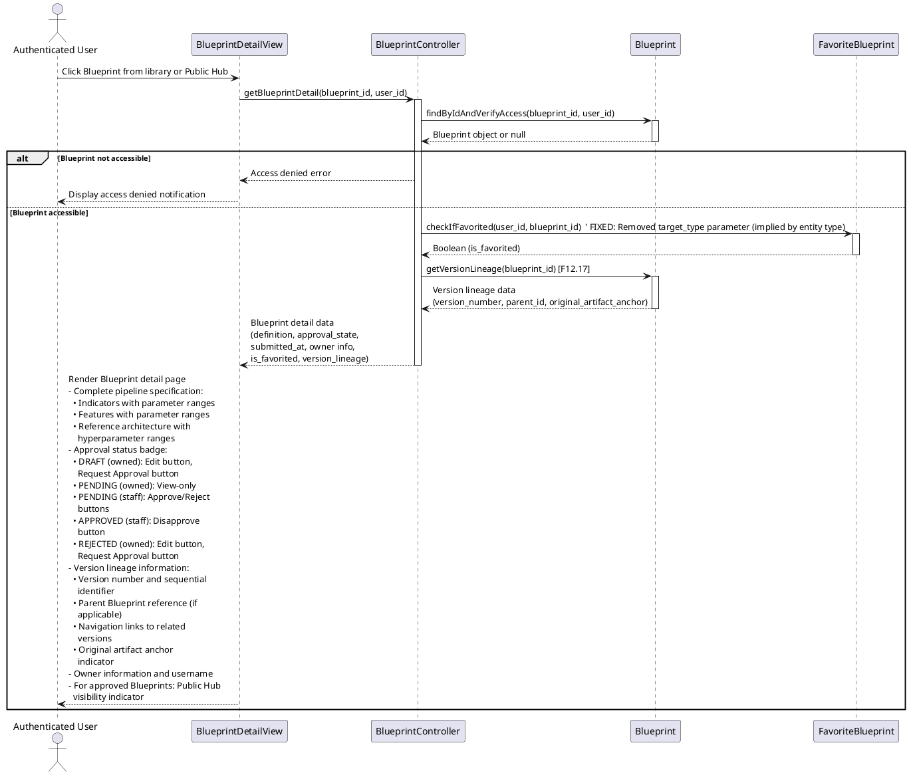
```plantuml
@startuml UC015_View_Blueprint_Detail
actor "Authenticated User" as User

participant "BlueprintDetailView" as View
participant "BlueprintController" as Ctrl
participant "Blueprint" as BlueprintEntity
participant "FavoriteBlueprint" as FavEntity

User -> View: Click Blueprint from library or Public Hub
View -> Ctrl: getBlueprintDetail(blueprint_id, user_id)
activate Ctrl

Ctrl -> BlueprintEntity: findByIdAndVerifyAccess(blueprint_id, user_id)
activate BlueprintEntity
BlueprintEntity --> Ctrl: Blueprint object or null
deactivate BlueprintEntity

alt Blueprint not accessible
    Ctrl --> View: Access denied error
    View --> User: Display access denied notification
else Blueprint accessible
    Ctrl -> FavEntity: checkIfFavorited(user_id, blueprint_id)  ' FIXED: Removed target_type parameter (implied by entity type)
    activate FavEntity
    FavEntity --> Ctrl: Boolean (is_favorited)
    deactivate FavEntity
  
    Ctrl -> BlueprintEntity: getVersionLineage(blueprint_id) [F12.17]
    activate BlueprintEntity
    BlueprintEntity --> Ctrl: Version lineage data\n(version_number, parent_id, original_artifact_anchor)
    deactivate BlueprintEntity
  
    Ctrl --> View: Blueprint detail data\n(definition, approval_state,\nsubmitted_at, owner info,\nis_favorited, version_lineage)
    deactivate Ctrl
  
    View --> User: Render Blueprint detail page\n- Complete pipeline specification:\n  • Indicators with parameter ranges\n  • Features with parameter ranges\n  • Reference architecture with\n    hyperparameter ranges\n- Approval status badge:\n  • DRAFT (owned): Edit button,\n    Request Approval button\n  • PENDING (owned): View-only\n  • PENDING (staff): Approve/Reject\n    buttons\n  • APPROVED (staff): Disapprove\n    button\n  • REJECTED (owned): Edit button,\n    Request Approval button\n- Version lineage information:\n  • Version number and sequential\n    identifier\n  • Parent Blueprint reference (if\n    applicable)\n  • Navigation links to related\n    versions\n  • Original artifact anchor\n    indicator\n- Owner information and username\n- For approved Blueprints: Public Hub\n  visibility indicator
end
@enduml
```

**UC016: Download Experiment Logs**

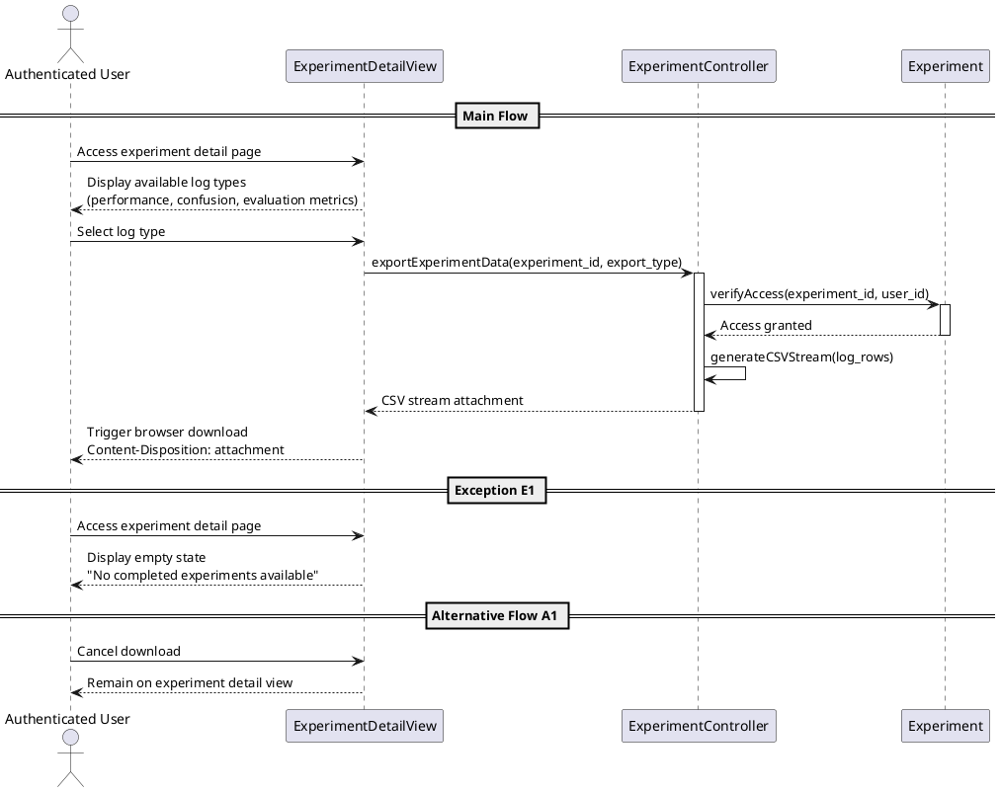
```plantuml
@startuml UC016_Download_Experiment_Logs
actor "Authenticated User" as User

participant "ExperimentDetailView" as View
participant "ExperimentController" as Ctrl
participant "Experiment" as ExpEntity

== Main Flow ==
User -> View: Access experiment detail page
View --> User: Display available log types\n(performance, confusion, evaluation metrics)

User -> View: Select log type
View -> Ctrl: exportExperimentData(experiment_id, export_type)
activate Ctrl

Ctrl -> ExpEntity: verifyAccess(experiment_id, user_id)
activate ExpEntity
ExpEntity --> Ctrl: Access granted
deactivate ExpEntity

Ctrl -> Ctrl: generateCSVStream(log_rows)
Ctrl --> View: CSV stream attachment
deactivate Ctrl

View --> User: Trigger browser download\nContent-Disposition: attachment

== Exception E1 ==
User -> View: Access experiment detail page
View --> User: Display empty state\n"No completed experiments available"

== Alternative Flow A1 ==
User -> View: Cancel download
View --> User: Remain on experiment detail view
@enduml

```

**UC017: View Public Hub**

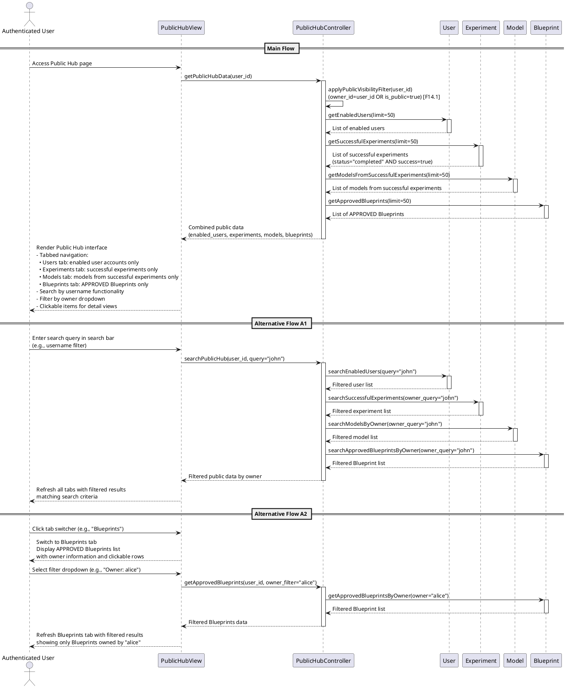
```plantuml
@startuml UC017_View_Public_Hub
actor "Authenticated User" as User

participant "PublicHubView" as View
participant "PublicHubController" as Ctrl
participant "User" as UserRepo
participant "Experiment" as ExpRepo
participant "Model" as ModelRepo
participant "Blueprint" as BlueprintRepo

== Main Flow ==
User -> View: Access Public Hub page
View -> Ctrl: getPublicHubData(user_id)
activate Ctrl

Ctrl -> Ctrl: applyPublicVisibilityFilter(user_id)\n(owner_id=user_id OR is_public=true) [F14.1]
Ctrl -> UserRepo: getEnabledUsers(limit=50)
activate UserRepo
UserRepo --> Ctrl: List of enabled users
deactivate UserRepo

Ctrl -> ExpRepo: getSuccessfulExperiments(limit=50)
activate ExpRepo
ExpRepo --> Ctrl: List of successful experiments\n(status="completed" AND success=true)
deactivate ExpRepo

Ctrl -> ModelRepo: getModelsFromSuccessfulExperiments(limit=50)
activate ModelRepo
ModelRepo --> Ctrl: List of models from successful experiments
deactivate ModelRepo

Ctrl -> BlueprintRepo: getApprovedBlueprints(limit=50)
activate BlueprintRepo
BlueprintRepo --> Ctrl: List of APPROVED Blueprints
deactivate BlueprintRepo

Ctrl --> View: Combined public data\n(enabled_users, experiments, models, blueprints)
deactivate Ctrl

View --> User: Render Public Hub interface\n- Tabbed navigation:\n  • Users tab: enabled user accounts only\n  • Experiments tab: successful experiments only\n  • Models tab: models from successful experiments only\n  • Blueprints tab: APPROVED Blueprints only\n- Search by username functionality\n- Filter by owner dropdown\n- Clickable items for detail views

== Alternative Flow A1 ==
User -> View: Enter search query in search bar\n(e.g., username filter)
View -> Ctrl: searchPublicHub(user_id, query="john")
activate Ctrl

Ctrl -> UserRepo: searchEnabledUsers(query="john")
activate UserRepo
UserRepo --> Ctrl: Filtered user list
deactivate UserRepo

Ctrl -> ExpRepo: searchSuccessfulExperiments(owner_query="john")
activate ExpRepo
ExpRepo --> Ctrl: Filtered experiment list
deactivate ExpRepo

Ctrl -> ModelRepo: searchModelsByOwner(owner_query="john")
activate ModelRepo
ModelRepo --> Ctrl: Filtered model list
deactivate ModelRepo

Ctrl -> BlueprintRepo: searchApprovedBlueprintsByOwner(owner_query="john")
activate BlueprintRepo
BlueprintRepo --> Ctrl: Filtered Blueprint list
deactivate BlueprintRepo

Ctrl --> View: Filtered public data by owner
deactivate Ctrl

View --> User: Refresh all tabs with filtered results\nmatching search criteria

== Alternative Flow A2 ==
User -> View: Click tab switcher (e.g., "Blueprints")
View --> User: Switch to Blueprints tab\nDisplay APPROVED Blueprints list\nwith owner information and clickable rows

User -> View: Select filter dropdown (e.g., "Owner: alice")
View -> Ctrl: getApprovedBlueprints(user_id, owner_filter="alice")
activate Ctrl

Ctrl -> BlueprintRepo: getApprovedBlueprintsByOwner(owner="alice")
activate BlueprintRepo
BlueprintRepo --> Ctrl: Filtered Blueprint list
deactivate BlueprintRepo

Ctrl --> View: Filtered Blueprints data
deactivate Ctrl

View --> User: Refresh Blueprints tab with filtered results\nshowing only Blueprints owned by "alice"
@enduml

```

**UC018: Browse Users**

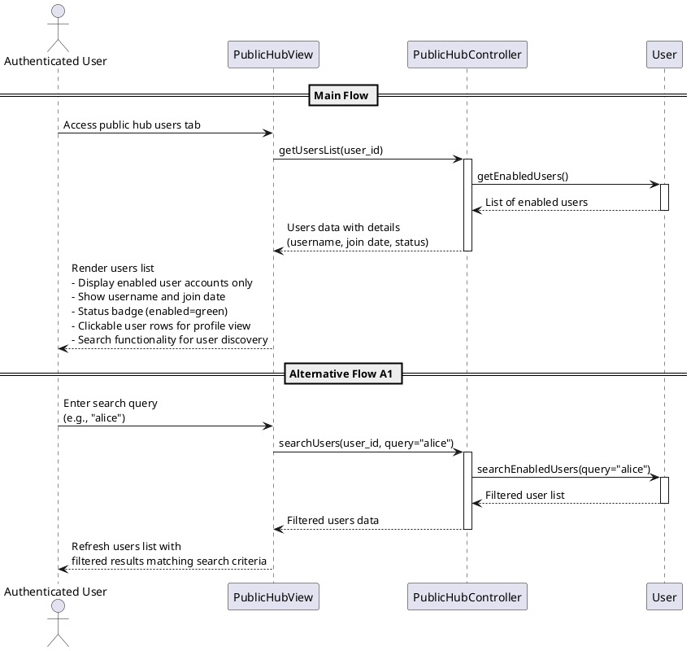
```plantuml
@startuml UC018_Browse_Users
actor "Authenticated User" as ActorUser

participant "PublicHubView" as View
participant "PublicHubController" as Ctrl
participant "User" as UserEntity

== Main Flow ==
ActorUser -> View: Access public hub users tab
View -> Ctrl: getUsersList(user_id)
activate Ctrl

Ctrl -> UserEntity: getEnabledUsers()
activate UserEntity
UserEntity --> Ctrl: List of enabled users
deactivate UserEntity

Ctrl --> View: Users data with details\n(username, join date, status)
deactivate Ctrl

View --> ActorUser: Render users list\n- Display enabled user accounts only\n- Show username and join date\n- Status badge (enabled=green)\n- Clickable user rows for profile view\n- Search functionality for user discovery

== Alternative Flow A1 ==
ActorUser -> View: Enter search query\n(e.g., "alice")
View -> Ctrl: searchUsers(user_id, query="alice")
activate Ctrl

Ctrl -> UserEntity: searchEnabledUsers(query="alice")
activate UserEntity
UserEntity --> Ctrl: Filtered user list
deactivate UserEntity

Ctrl --> View: Filtered users data
deactivate Ctrl

View --> ActorUser: Refresh users list with\nfiltered results matching search criteria
@enduml
```

**UC019: Browse Experiments**

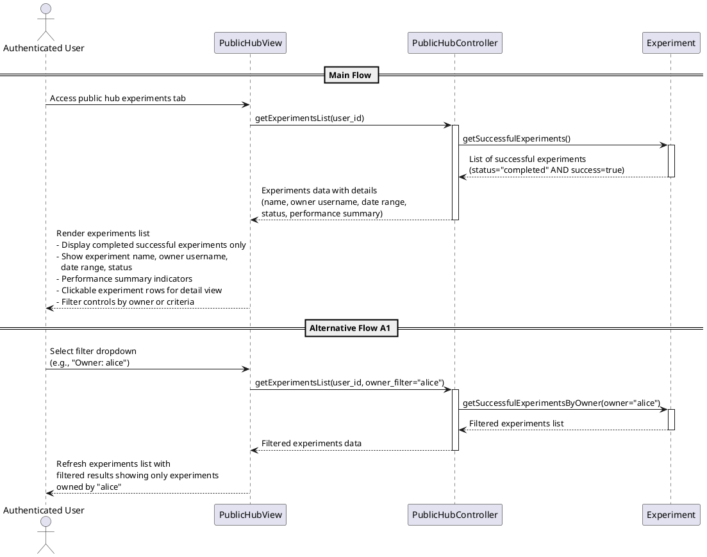
```plantuml
@startuml UC019_Browse_Experiments
actor "Authenticated User" as User

participant "PublicHubView" as View
participant "PublicHubController" as Ctrl
participant "Experiment" as ExpEntity

== Main Flow ==
User -> View: Access public hub experiments tab
View -> Ctrl: getExperimentsList(user_id)
activate Ctrl

Ctrl -> ExpEntity: getSuccessfulExperiments()
activate ExpEntity
ExpEntity --> Ctrl: List of successful experiments\n(status="completed" AND success=true)
deactivate ExpEntity

Ctrl --> View: Experiments data with details\n(name, owner username, date range,\nstatus, performance summary)
deactivate Ctrl

View --> User: Render experiments list\n- Display completed successful experiments only\n- Show experiment name, owner username,\n  date range, status\n- Performance summary indicators\n- Clickable experiment rows for detail view\n- Filter controls by owner or criteria

== Alternative Flow A1 ==
User -> View: Select filter dropdown\n(e.g., "Owner: alice")
View -> Ctrl: getExperimentsList(user_id, owner_filter="alice")
activate Ctrl

Ctrl -> ExpEntity: getSuccessfulExperimentsByOwner(owner="alice")
activate ExpEntity
ExpEntity --> Ctrl: Filtered experiments list
deactivate ExpEntity

Ctrl --> View: Filtered experiments data
deactivate Ctrl

View --> User: Refresh experiments list with\nfiltered results showing only experiments\nowned by "alice"
@enduml
```

**UC020: Browse Models**

```plantuml
@startuml UC020_Browse_Models
actor "Authenticated User" as User

participant "PublicHubView" as View
participant "PublicHubController" as Ctrl
participant "Model" as ModelEntity

== Main Flow ==
User -> View: Access public hub models tab
activate View

View -> Ctrl: getModelsList(user_id)
activate Ctrl

Ctrl -> ModelEntity: getModelsFromSuccessfulExperiments()
activate ModelEntity
ModelEntity --> Ctrl: List of models\n(from status="completed" AND success=true experiments)
deactivate ModelEntity

Ctrl --> View: Models data with details\n(Sharpe, max_drawdown, win_rate, accuracy,\nowner username, experiment reference)
deactivate Ctrl

View --> User: Render models list\n- Display models from successful experiments only\n- Show performance metrics:\n  • Sharpe ratio\n  • max drawdown\n  • win rate\n  • accuracy\n- Show owner username\n- Show experiment reference\n- Clickable model rows for detail view\n- Filter controls by owner or criteria\n- Sortable columns by metrics
deactivate View

== Alternative Flow A1 ==
User -> View: Apply filter\n(e.g., by owner username or metric range)
activate View

View -> Ctrl: getModelsList(user_id, filters)
activate Ctrl

Ctrl -> ModelEntity: getModelsFromSuccessfulExperiments(filters)
activate ModelEntity
ModelEntity --> Ctrl: Filtered models list
deactivate ModelEntity

Ctrl --> View: Filtered models data
deactivate Ctrl

View --> User: Refresh models list with\nfiltered results matching criteria
deactivate View
@enduml
```

**UC021: Browse Blueprints**

```plantuml
@startuml UC021_Browse_Blueprints
actor "Authenticated User" as User

participant "PublicHubView" as View
participant "PublicHubController" as Ctrl
participant "Blueprint" as BlueprintEntity

== Main Flow ==
User -> View: Access public hub Blueprints tab
View -> Ctrl: getBlueprintsList(user_id)
activate Ctrl

Ctrl -> BlueprintEntity: getApprovedBlueprints()
activate BlueprintEntity
BlueprintEntity --> Ctrl: List of APPROVED Blueprints\n(approval_state="APPROVED")
deactivate BlueprintEntity

Ctrl --> View: Blueprints data with details\n(name, owner username, description,\napproval status)
deactivate Ctrl

View --> User: Render Blueprints list\n- Display APPROVED Blueprints only\n- Show Blueprint name, owner username,\n  description\n- Approval status badge (APPROVED=green)\n- Clickable Blueprint rows for detail view\n- Filter controls by owner or criteria

== Alternative Flow A1 ==
User -> View: Select filter dropdown\n(e.g., "Owner: alice")
View -> Ctrl: getBlueprintsList(user_id, owner_filter="alice")
activate Ctrl

Ctrl -> BlueprintEntity: getApprovedBlueprintsByOwner(owner="alice")
activate BlueprintEntity
BlueprintEntity --> Ctrl: Filtered Blueprints list
deactivate BlueprintEntity

Ctrl --> View: Filtered Blueprints data
deactivate Ctrl

View --> User: Refresh Blueprints list with\nfiltered results showing only Blueprints\nowned by "alice"
@enduml
```

**UC022: View Documentation**

```plantuml
@startuml UC022_View_Documentation_Fixed
actor "Authenticated User" as User

participant "DocumentationView" as View
participant "DocumentationController" as Ctrl

User -> View: Access documentation page
View -> Ctrl: getDocumentationList(user_id)
activate Ctrl

Ctrl -> Ctrl: scanDocumentationDirectory()
Ctrl -> Ctrl: List files in loop/docs/*.md
Ctrl -> Ctrl: Extract metadata\n(filename, last_modified)
Ctrl --> View: Documentation entries\n(title, slug, last_modified)
deactivate Ctrl

View --> User: Render documentation list\n- Display available documentation entries\n- Show last modified timestamps\n- Clickable entry rows

User -> View: Click documentation entry\n(e.g., "Data Flow")
View -> Ctrl: getDocumentationContent(slug="data-flow")
activate Ctrl

Ctrl -> Ctrl: loadDocumentationFile(slug="data-flow")
Ctrl -> Ctrl: Read file loop/docs/data-flow.md
Ctrl -> Ctrl: sanitizeContent(raw_markdown)\n(remove <script>, on* handlers)
Ctrl --> View: {title, content, last_modified}
deactivate Ctrl

View --> User: Render documentation viewer\n- Display title and content\n- Render formatted documentation content\n- Apply syntax highlighting\n- Show last modified timestamp

@enduml
```

**UC023: View User Profile**

```plantuml
@startuml UC023_View_User_Profile
actor "Authenticated User" as User

participant "UserProfileView" as View
participant "UserController" as Ctrl
participant "User" as UserEntity
participant "Experiment" as ExpRepo
participant "Model" as ModelRepo
participant "Blueprint" as BlueprintRepo

User -> View: Access profile via navbar dropdown or Public Hub
View -> Ctrl: getUserProfile(target_user_id, current_user_id)
activate Ctrl

Ctrl -> UserEntity: findByIdAndVerifyStatus(target_user_id)
activate UserEntity
UserEntity --> Ctrl: User object or null
deactivate UserEntity

alt Target user account is disabled or not found
    Ctrl --> View: Access denied error
    View --> User: Display access denied notification
else Target user account is enabled
    Ctrl -> ExpRepo: getSuccessfulExperimentsCount(target_user_id)
    activate ExpRepo
    ExpRepo --> Ctrl: Count of successful experiments\n(status="completed" AND success=true)
    deactivate ExpRepo
  
    Ctrl -> ModelRepo: getModelsCountFromSuccessfulExperiments(target_user_id)
    activate ModelRepo
    ModelRepo --> Ctrl: Count of models from successful experiments
    deactivate ModelRepo
  
    Ctrl -> BlueprintRepo: getApprovedBlueprints(target_user_id)
    activate BlueprintRepo
    BlueprintRepo --> Ctrl: List of approved Blueprints\n(approval_state="APPROVED")
    deactivate BlueprintRepo
  
    Ctrl --> View: Profile data\n(user details, status badge,\nexperiments count, models count,\napproved Blueprints list)
    deactivate Ctrl
  
    View --> User: Render user profile page\n- User details:\n  • name\n  • username\n  • join date\n- Status badge (enabled=green)\n- Successful experiments count\n  (status="completed" AND success=true)\n- Models count from successful experiments\n- Approved Blueprints count and list\n  (approval_state="APPROVED")\n- Clickable items for detail navigation
end

@enduml

```

**UC024: Cancel Job**

```plantuml
@startuml UC024_Cancel_Job
actor "Authenticated User" as User

participant "JobDetailView" as View
participant "JobController" as Ctrl
participant "Experiment" as ExpEntity
participant "QueueService" as Queue

== Main Flow ==
User -> View: View experiment detail page
View -> Ctrl: getJobDetail(job_id, user_id, job_type="experiment")
activate Ctrl

Ctrl -> ExpEntity: findByIdAndVerifyOwnership(job_id, user_id)
activate ExpEntity
ExpEntity --> Ctrl: Experiment object
deactivate ExpEntity

Ctrl --> View: Experiment detail with status="queued"
deactivate Ctrl

View --> User: Render detail page with cancel button

User -> View: Click cancel button
View -> View: Show confirmation dialog
View --> User: Confirm cancellation?

User -> View: Confirm cancellation
View -> Ctrl: cancelJob(job_id, user_id, job_type="experiment")
activate Ctrl

Ctrl -> Queue: removeQueuedJob(job_id, job_type="experiment")
activate Queue
Queue --> Ctrl: Job removed from queue
deactivate Queue

Ctrl -> ExpEntity: updateStatus(job_id, status="cancelled")
activate ExpEntity
ExpEntity --> Ctrl: Status updated
deactivate ExpEntity

Ctrl --> View: Success response
deactivate Ctrl

View --> User: Display cancellation confirmation\nStatus badge updated to "cancelled"

== Alternative Flow A1 (Cancel Confirmation) ==
User -> View: Click cancel button in dialog
View --> User: Return to detail page\nwithout action
@enduml
```

##### 4.3.1.3 Moderator Sequence Diagrams

**UC025: Moderate Blueprint Submissions**

```plantuml
@startuml UC025_Moderate_Blueprint_Submissions
actor "Staff (Moderator/Admin)" as Staff

participant "BlueprintModerationView" as View
participant "BlueprintApprovalController" as Ctrl
participant "Blueprint" as BlueprintEntity

== Main Flow (Approve/Reject PENDING Blueprint) ==
Staff -> View: Access Blueprint moderation interface
View -> Ctrl: getPendingBlueprints(staff_id)
activate Ctrl

Ctrl -> BlueprintEntity: findByApprovalState("PENDING")
activate BlueprintEntity
BlueprintEntity --> Ctrl: List of pending Blueprints
deactivate BlueprintEntity

Ctrl --> View: Pending Blueprints queue
deactivate Ctrl

View --> Staff: Render moderation queue\n- Display Blueprint specifications\n- Show owner information\n- Approval actions (Approve/Reject buttons)

Staff -> View: Click Blueprint to review details
View -> Ctrl: getBlueprintDetail(blueprint_id, staff_id)
activate Ctrl

Ctrl -> BlueprintEntity: findByIdAndVerifyAccess(blueprint_id, staff_id)
activate BlueprintEntity
BlueprintEntity --> Ctrl: Blueprint object with definition
deactivate BlueprintEntity

Ctrl --> View: Blueprint detail data
deactivate Ctrl

View --> Staff: Render Blueprint detail page\n- Complete pipeline specification\n- Parameter ranges\n- Owner information\n- Approval state badge (PENDING)\n- Approve button\n- Reject button

Staff -> View: Click "Approve" or "Reject" button
View -> Ctrl: moderateBlueprint(blueprint_id, staff_id, action)
activate Ctrl

Ctrl -> BlueprintEntity: getState(blueprint_id)
activate BlueprintEntity
BlueprintEntity --> Ctrl: approval_state="PENDING"
deactivate BlueprintEntity

alt Blueprint not in pending state (E1)
    Ctrl --> View: Status error\n"Blueprint must be in PENDING state"
    View --> Staff: Display status error notification
    deactivate Ctrl
else Blueprint in pending state
    alt Approve action
        Ctrl -> BlueprintEntity: updateStatus(blueprint_id, status="APPROVED")
        activate BlueprintEntity
        BlueprintEntity --> Ctrl: Updated Blueprint object
        deactivate BlueprintEntity

    else Reject action
        Ctrl -> BlueprintEntity: updateStatus(blueprint_id, status="REJECTED")
        activate BlueprintEntity
        BlueprintEntity --> Ctrl: Updated Blueprint object
        deactivate BlueprintEntity

    end
  
    Ctrl --> View: Success response
    deactivate Ctrl
  
    View --> Staff: Display success notification\nStatus badge updated\nBlueprint removed from moderation queue
end

== Alternative Flow A1 (Disapprove APPROVED Blueprint) ==
Staff -> View: Access Public Hub Blueprints tab\nor Blueprint moderation interface
View -> Ctrl: getApprovedBlueprints(staff_id)
activate Ctrl

Ctrl -> BlueprintEntity: findByApprovalState("APPROVED")
activate BlueprintEntity
BlueprintEntity --> Ctrl: List of approved Blueprints
deactivate BlueprintEntity

Ctrl --> View: Approved Blueprints list
deactivate Ctrl

View --> Staff: Render Blueprints list\nwith "Disapprove" button for staff

Staff -> View: Click "Disapprove" button on APPROVED Blueprint
View -> Ctrl: disapproveBlueprint(blueprint_id, staff_id)
activate Ctrl

Ctrl -> BlueprintEntity: getState(blueprint_id)
activate BlueprintEntity
BlueprintEntity --> Ctrl: approval_state="APPROVED"
deactivate BlueprintEntity

Ctrl -> BlueprintEntity: updateStatus(blueprint_id, status="REJECTED")
activate BlueprintEntity
BlueprintEntity --> Ctrl: Blueprint status updated to REJECTED
deactivate BlueprintEntity

Ctrl -> BlueprintEntity: createNewDraftVersion(blueprint_id, staff_id)
activate BlueprintEntity

BlueprintEntity -> BlueprintEntity: Retrieve original Blueprint definition
BlueprintEntity -> BlueprintEntity: Set parent_id = original_blueprint_id
BlueprintEntity -> BlueprintEntity: Increment version number
BlueprintEntity -> BlueprintEntity: Preserve original artifact anchoring
BlueprintEntity -> BlueprintEntity: Set owner_id = original.owner_id
BlueprintEntity -> BlueprintEntity: Set status = "DRAFT"

BlueprintEntity --> Ctrl: New editable DRAFT version created
deactivate BlueprintEntity

Ctrl --> View: Success response
deactivate Ctrl

View --> Staff: Display success notification\n- Original Blueprint removed from Public Hub\n- New DRAFT version created for owner remediation
@enduml
```

**UC026: Add Normal User**

```plantuml
@startuml UC026_Add_Normal_User_Fixed
actor "Staff (Moderator/Admin)" as Staff

participant "UserManagementView" as View
participant "UserController" as Ctrl
participant "User" as UserEntity

== Main Flow ==
Staff -> View: Access user management interface
View -> Ctrl: getCurrentUser(session_id)
activate Ctrl

Ctrl -> UserEntity: findById(session_user_id)
activate UserEntity
UserEntity --> Ctrl: User object (role, status)
deactivate UserEntity

Ctrl --> View: User data with role
deactivate Ctrl

View --> Staff: Render user management page\n- Display user list\n- Show "Add User" button\n(Role-based rendering)

Staff -> View: Click "Add User" button
View --> Staff: Render add user form\n(Username, Name, Email, Password)

Staff -> View: Submit user creation form\n(username, name, email, password)
View -> Ctrl: createUser(formData, current_user_role)
activate Ctrl

' VALIDATION INTEGRATED INTO USERCONTROLLER (NO SEPARATE VALIDATOR)
Ctrl -> Ctrl: validateUserData(formData)

' Uniqueness check now DIRECTLY from UserController
Ctrl -> UserEntity: findByUsername(username)
activate UserEntity
UserEntity --> Ctrl: null (available)
deactivate UserEntity

Ctrl -> UserEntity: create(name, username, email, password_hash,\nrole="user", status="enabled")
activate UserEntity
UserEntity --> Ctrl: New user object (user_id)
deactivate UserEntity

Ctrl --> View: Success response (user_id, username)
deactivate Ctrl

View --> Staff: Display success notification\n"User {username} created successfully"\nClear form and refresh user list

== Exception E1 (Invalid Format) ==
Staff -> View: Submit form with invalid data
View -> Ctrl: createUser(formData, current_user_role)
activate Ctrl

Ctrl -> Ctrl: validateUserData(formData)
Ctrl --> View: Validation errors\n(e.g., "Username must be 6-12 lowercase alnum")
deactivate Ctrl

View --> Staff: Highlight invalid fields

== Exception E2 (Duplicate Username) ==
Staff -> View: Submit form with duplicate username
View -> Ctrl: createUser(formData, current_user_role)
activate Ctrl

Ctrl -> UserEntity: findByUsername(username)
activate UserEntity
UserEntity --> Ctrl: Existing user record
deactivate UserEntity

Ctrl -> Ctrl: validateUserData(formData)
Ctrl --> View: ValidationResult (error="Username unavailable")
deactivate Ctrl

View --> Staff: Display uniqueness error\n"Username {username} already exists"
@enduml
```

**UC027: Enable/Disable User**

```plantuml
@startuml UC027_Enable_Disable_User
actor "Staff (Moderator/Admin)" as Staff

participant "UserManagementView" as View
participant "UserController" as Ctrl
participant "User" as UserEntity

== Main Flow (Disable User) ==
Staff -> View: Access user management interface
View -> Ctrl: getCurrentUser(session_id)
activate Ctrl

Ctrl -> UserEntity: findById(session_user_id)
activate UserEntity
UserEntity --> Ctrl: Staff user object (role, status)
deactivate UserEntity

Ctrl --> View: Staff data with role
deactivate Ctrl

View --> Staff: Render user management page\n- Display user list with status badges\n- Show enable/disable toggles\n(Role-based rendering: Moderator/Admin view)

Staff -> View: Select user account to disable\n(target_user_id, current_status="enabled")
View -> Ctrl: validateUserModificationPermission(staff_id, target_user_id)
activate Ctrl

Ctrl -> UserEntity: findById(target_user_id)
activate UserEntity
UserEntity --> Ctrl: Target user object (role, status)
deactivate UserEntity

Ctrl -> UserEntity: findById(staff_id)
activate UserEntity
UserEntity --> Ctrl: Staff user object (role)
deactivate UserEntity

Ctrl -> Ctrl: checkPermission(staff_role, target_user_role)

Ctrl -> UserEntity: updateStatus(target_user_id, status="disabled")
activate UserEntity
UserEntity --> Ctrl: Updated user object
deactivate UserEntity

Ctrl --> View: Success response
deactivate Ctrl

View --> Staff: Display success notification\nStatus badge updated to red (disabled)\nUser removed from active listings

== Alternative Flow A1 (Enable User) ==
Staff -> View: Select user account to enable\n(target_user_id, current_status="disabled")
View -> Ctrl: validateUserModificationPermission(staff_id, target_user_id)
activate Ctrl

Ctrl -> UserEntity: findById(target_user_id)
activate UserEntity
UserEntity --> Ctrl: Target user object (role, status)
deactivate UserEntity

Ctrl -> UserEntity: findById(staff_id)
activate UserEntity
UserEntity --> Ctrl: Staff user object (role)
deactivate UserEntity

Ctrl -> Ctrl: checkPermission(staff_role, target_user_role)
Ctrl --> View: Permission granted
deactivate Ctrl

View -> Ctrl: enableUser(target_user_id, staff_id)
activate Ctrl

Ctrl -> UserEntity: updateStatus(target_user_id, status="enabled")
activate UserEntity
UserEntity --> Ctrl: Updated user object
deactivate UserEntity

Ctrl --> View: Success response
deactivate Ctrl

View --> Staff: Display success notification\nStatus badge updated to green (enabled)\nUser visible in Public Hub

== Alternative Flow A2 (Disable User) ==
Staff -> View: Select user account to disable\n(target_user_id, current_status="disabled")
View -> Ctrl: validateUserModificationPermission(staff_id, target_user_id)
activate Ctrl

Ctrl -> UserEntity: findById(target_user_id)
activate UserEntity
UserEntity --> Ctrl: Target user object (role, status)
deactivate UserEntity

Ctrl -> UserEntity: findById(staff_id)
activate UserEntity
UserEntity --> Ctrl: Staff user object (role)
deactivate UserEntity

Ctrl -> Ctrl: checkPermission(staff_role, target_user_role)
Ctrl --> View: Permission granted
deactivate Ctrl

View -> Ctrl: disableUser(target_user_id, staff_id)
activate Ctrl

Ctrl -> UserEntity: updateStatus(target_user_id, status="disabled")
activate UserEntity
UserEntity --> Ctrl: Updated user object
deactivate UserEntity

Ctrl --> View: Success response
deactivate Ctrl

View --> Staff: Display success notification\nStatus badge updated to green (enabled)\nUser visible in Public Hub

@enduml

```

##### 4.3.1.4 Administrator Sequence Diagrams

**UC028: Manage All Users**

```plantuml
@startuml UC028_Manage_All_Users
actor "Administrator" as Admin

participant "UserManagementView" as View
participant "UserController" as Ctrl
participant "User" as UserEntity

== Main Flow ==
Admin -> View: Access user management page
View -> Ctrl: getAllUsers(admin_id, page=1, limit=50)
activate Ctrl

Ctrl -> UserEntity: findById(admin_id)
activate UserEntity
UserEntity --> Ctrl: Admin user object (role="admin")
deactivate UserEntity

Ctrl -> UserEntity: findAllWithPagination(page=1, limit=50)
activate UserEntity
UserEntity --> Ctrl: Paginated user list\n(all roles: user/moderator/admin)
deactivate UserEntity

Ctrl --> View: User management data\n(user list, role badges, status indicators)
deactivate Ctrl

View --> Admin: Render user management interface\n- Table of all registered users\n- Columns: username, name, email, role badge,\n  status badge (enabled/disabled), created_at\n- Role badges color-coded:\n  • user = gray\n  • moderator = yellow\n  • admin = red\n- Status badges:\n  • enabled = green\n  • disabled = red\n- Action buttons per row:\n  • Edit (pencil icon)\n  • Reset password (key icon)\n  • Remove (trash icon)\n- Search bar (username/email)\n- Create New User button (primary action)

== Alternative Flow A1 ==
Admin -> View: Enter search query\n(e.g., "john" or "john@example.com")
View -> Ctrl: searchUsers(admin_id, query="john", page=1, limit=50)
activate Ctrl

Ctrl -> UserEntity: searchByUsernameOrEmail(query="john", page=1, limit=50)
activate UserEntity
UserEntity --> Ctrl: Filtered user list\nmatching search criteria
deactivate UserEntity

Ctrl --> View: Filtered user data
deactivate Ctrl

View --> Admin: Refresh table with filtered results\nshowing only users matching "john"

== Alternative Flow A2 (Create New User) ==
Admin -> View: Click "Create New User" button
View --> Admin: Render user creation modal/form\n(Username, Name, Email, Password, Role dropdown)

Admin -> View: Submit user creation form\n(username, name, email, password, role="user")
View -> Ctrl: createUser(formData, admin_id)
activate Ctrl

Ctrl -> Ctrl: validateUserData(formData)
activate Ctrl

Ctrl -> Ctrl: validateUsernameFormat(username)
Ctrl -> Ctrl: validatePasswordStrength(password)
Ctrl -> Ctrl: checkUsernameUniqueness(username)
Ctrl -> Ctrl: checkEmailUniqueness(email)

Ctrl --> Ctrl: ValidationResult (valid=true)
deactivate Ctrl

Ctrl -> UserEntity: create(name, username, email, password_hash,\nrole=formData.role, status="enabled")
activate UserEntity
UserEntity --> Ctrl: New user object with user_id
deactivate UserEntity

Ctrl --> View: Success response (user_id, username)
deactivate Ctrl

View --> Admin: Close modal\nDisplay success notification\n"User {username} created successfully"\nRefresh user table

== Alternative Flow A3 (Edit User Details) ==
Admin -> View: Click Edit button on user row\n(target_user_id)
View --> Admin: Render edit user modal\n(prefilled with current details)

Admin -> View: Modify fields (e.g., username, name, email)
View -> Ctrl: updateUser(target_user_id, updates, admin_id)
activate Ctrl

Ctrl -> UserEntity: findById(target_user_id)
activate UserEntity
UserEntity --> Ctrl: Target user object
deactivate UserEntity

Ctrl -> Ctrl: validateUpdateData(updates, target_user_id)
activate Ctrl
Ctrl --> Ctrl: ValidationResult (valid=true)
deactivate Ctrl

Ctrl -> UserEntity: update(target_user_id, updates)
activate UserEntity
UserEntity --> Ctrl: Updated user object
deactivate UserEntity

Ctrl --> View: Success response
deactivate Ctrl

View --> Admin: Close modal\nDisplay success notification\n"User updated successfully"\nRefresh user table

== Alternative Flow A4 (Reset Password) ==
Admin -> View: Click Reset Password button\n(target_user_id)
View --> Admin: Render password reset modal

Admin -> View: Enter new password
View -> Ctrl: resetPassword(target_user_id, new_password, admin_id)
activate Ctrl

Ctrl -> Ctrl: validatePasswordStrength(new_password)
activate Ctrl
Ctrl --> Ctrl: ValidationResult (valid=true)
deactivate Ctrl

Ctrl -> UserEntity: updatePassword(target_user_id, password_hash)
activate UserEntity
UserEntity --> Ctrl: Password updated
deactivate UserEntity

Ctrl --> View: Success response
deactivate Ctrl

View --> Admin: Close modal\nDisplay success notification\n"Password reset successfully"

== Alternative Flow A5 (Modify Role) ==
Admin -> View: Click role badge dropdown\n(target_user_id, current_role="user")
View --> Admin: Show role options (user/moderator/admin)

Admin -> View: Select new role (e.g., "moderator")
View -> Ctrl: changeUserRole(target_user_id, new_role="moderator", admin_id)
activate Ctrl

Ctrl -> UserEntity: findById(target_user_id)
activate UserEntity
UserEntity --> Ctrl: Target user object
deactivate UserEntity

Ctrl -> UserEntity: updateRole(target_user_id, role="moderator")
activate UserEntity
UserEntity --> Ctrl: Role updated
deactivate UserEntity

Ctrl --> View: Success response
deactivate Ctrl

View --> Admin: Display success notification\n"Role changed to moderator"\nUpdate role badge color (yellow)

== Alternative Flow A6 (Remove User) ==
Admin -> View: Click Remove button (trash icon)\n(target_user_id)
View -> View: Show confirmation dialog\n"Permanently delete user {username}?"

Admin -> View: Confirm deletion
View -> Ctrl: deleteUser(target_user_id, admin_id)
activate Ctrl

Ctrl -> UserEntity: findById(target_user_id)
activate UserEntity
UserEntity --> Ctrl: Target user object
deactivate UserEntity

Ctrl -> UserEntity: delete(target_user_id)
activate UserEntity
UserEntity --> Ctrl: User permanently removed
deactivate UserEntity

Ctrl --> View: Success response
deactivate Ctrl

View --> Admin: Display success notification\n"User deleted successfully"\nRemove row from table
@enduml
```

**UC029: Manage System Limits and Queue**

```plantuml
@startuml UC029_Manage_System_Limits_and_Queue
actor Administrator as Admin

participant "SystemManagementView" as View
participant "UserController" as Ctrl
participant "QueueService" as Queue

== Main Flow ==
Admin -> View: Access system management interface
View -> Ctrl: getSystemStatus(admin_id)
activate Ctrl

Ctrl -> Queue: getActiveJobs()
activate Queue
Queue --> Ctrl: Active job queue items\n(job_id, type, status, progress, eta)
deactivate Queue

Ctrl -> Ctrl: checkDatabaseHealth()
activate Ctrl
Ctrl --> Ctrl: Database health status\n(connected=true/false, latency_ms)
deactivate Ctrl

Ctrl -> Ctrl: getConcurrencyLimits()
Ctrl --> Ctrl: Concurrency settings\n(experiment_limit)
deactivate Ctrl

Ctrl -> Ctrl: getSessionTimeoutConfig()
activate Ctrl
Ctrl --> Ctrl: Session timeout settings\n(timeout_minutes: 0-1440, 0=indefinite)
deactivate Ctrl

Ctrl --> View: System dashboard data\n(active_jobs, health_status, limits, session_timeout)
deactivate Ctrl

View --> Admin: Render system monitoring dashboard\n- Active job queue table\n- System health indicators\n- Current concurrency limits\n- Session timeout configuration:\n  • Slider/input: 1 min – 1440 min (24h)\n  • Toggle: "Indefinite" (0 minutes)\n- Controls to modify both concurrency limits\n  AND session timeout (Admin-only)

== Alternative Flow A1 (Concurrency Limits) ==
Admin -> View: Adjust concurrency limit\n(e.g., experiment_limit = 15)
View -> Ctrl: updateConcurrencyLimit(limit_type="experiment", new_limit=15, admin_id)
activate Ctrl

Ctrl -> Ctrl: validateLimit(new_limit, limit_type)
activate Ctrl
Ctrl --> Ctrl: ValidationResult (valid=true)
deactivate Ctrl

Ctrl -> Ctrl: updateConcurrencySetting(limit_type, new_limit)
activate Ctrl
Ctrl --> Ctrl: Settings updated
deactivate Ctrl

Ctrl -> Queue: applyConcurrencyLimits()
activate Queue
Queue --> Ctrl: Limits applied to scheduler
deactivate Queue

Ctrl --> View: Success response\n{limit_type, new_limit}
deactivate Ctrl

View --> Admin: Display success notification\n"Concurrency limit updated"\nUpdate displayed limit value\nApply changes to job scheduler

== Alternative Flow A2 (Session Timeout) ==
Admin -> View: Adjust session timeout\n(e.g., timeout_minutes = 30)
View -> Ctrl: updateSessionTimeout(timeout_minutes=30, admin_id)
activate Ctrl

Ctrl -> Ctrl: validateTimeoutRange(timeout_minutes)
activate Ctrl
alt Timeout out of range (<1 or >1440) AND not 0
    Ctrl --> Ctrl: ValidationResult (valid=false)
    deactivate Ctrl
  
    Ctrl --> View: Validation error\n"Timeout must be 1-1440 minutes or 0 for indefinite"
    deactivate Ctrl
  
    View --> Admin: Display validation error
else Valid timeout value
    Ctrl --> Ctrl: ValidationResult (valid=true)
    deactivate Ctrl
  
    Ctrl -> Ctrl: applyTimeoutConfiguration(timeout_minutes)
    activate Ctrl
    Ctrl --> Ctrl: Configuration applied
    deactivate Ctrl
  
    Ctrl --> View: Success response\n{timeout_minutes: 30}
    deactivate Ctrl
  
    View --> Admin: Display success notification\n"Session timeout updated to 30 minutes"\nApply changes to all new sessions immediately\nExisting sessions retain original timeout
end
@enduml
```

#### 4.3.2 Activity Diagram

**Experiment Creation Wizard Flow**

```plantuml
@startuml Experiment Creation Wizard Flow
title Experiment Creation Wizard Flow

start
:User initiates new experiment;
:Render Step 1 - Basics\n(name, description);
:Submit Step 1;
:Render Step 2 - Data\n(interval, date range)\nFIXED SYMBOL: BTCUSDT [F3.2];
:Submit Step 2;
:Render Step 3 - Splits\n(train/val/test ratios);
:Validate splits:\nsum=100%, val≥10%, test≥10%;
if (Validation passes?) then (yes)
  :Render Step 4 - Blueprint Selection;
  :Submit Blueprint selection;
  :Render Step 4.5 - Parameter Overrides\n(narrow ranges, fix values,\ndefine new ranges);

  :Render Step 5 - Review\n(configuration + override summary);
  :Submit for validation;
  :Validate full configuration\n(date ranges, splits,\nBlueprint accessibility,\nparameter constraints);
  if (Validation passes?) then (yes)
    :Create experiment record\nstatus="queued";
    :Enqueue job to asynchronous job queue;
    :Display queue position;
    :Redirect to experiment detail;
    stop
  else (no)
    :Display validation errors;
    :Highlight invalid fields;
    :Allow correction;
  endif
else (no)
  :Display split validation error;
  :Allow correction;
endif
@enduml
```

**Experiment Execution Pipeline**

```plantuml
@startuml Experiment Execution Pipeline
title Experiment Execution Pipeline

start
:Load experiment configuration\nfrom database;
:Set fixed random seeds\n(numpy, python stdlib) [N4.4];
:Resolve parameter permutation\nfrom Blueprint definition;
:Fetch historical data\n(cache-aware Binance fetch, BTCUSDT only) [F3.2];
:Create temporal splits\n(train/val/test)\npreserving chronological order;
fork
  :Compute indicators on train split;
  :Compute indicators on val split;
  :Compute indicators on test split;
fork again
  :Compose features from\nindicator outputs per split;
end fork
:Fit target transformer\non train split only;
:Apply target transformation\nto val/test splits;
:Fit feature scaler\non train split only;
:Apply scaling to val/test splits;
:Train model on train split;
:Enforce long-only, single-position constraint\nduring evaluation [F5.5/F5.6/F5.7];
:Evaluate on validation split;
:Evaluate on test split;
:Compute internal evaluation metrics\n(Sharpe ratio, max drawdown,\nwin rate, accuracy);
  :Log artifacts to tables:\n- _experiment_confusion_metrics\n- _experiment_evaluation_metrics;
:Update experiment status="completed";
:Send status update;
stop
@enduml
```

**Blueprint Lifecycle with Versioning Rules**

```plantuml
@startuml Blueprint Lifecycle with Versioning
title Blueprint Lifecycle with Versioning Rules

start
:Create new Blueprint;
:Set status="DRAFT"\nsubmitted_at=NULL;
:Owner edits in-place\n(mutations allowed);
if (Request approval?) then (yes)
  :Validate state=DRAFT/REJECTED\nAND submitted_at=NULL;
  if (Valid?) then (yes)
    :Update status="PENDING";
    :Set submitted_at=NOW();
    :Freeze artifact\n(no in-place mutations);
    if (Staff action?) then (approve)
      :Update status="APPROVED";
      :Visible in Public Hub;
      if (Staff disapproves later?) then (yes)
        :Update status="REJECTED";
        :Auto-create new DRAFT version\n(parent_id=original,\nversion=incremented);
        :Original artifact preserved;
        :Owner can edit new DRAFT;
      else (no)
        :Remain APPROVED;
      endif
    else (reject)
      :Update status="REJECTED";
      :Owner-only visibility;
      :Owner can edit\n(creates new DRAFT version);
    endif
  else (no)
    :Display invalid state error;
  endif
else (no)
  :Continue editing DRAFT;
endif
@enduml
```

**Job Cancellation Flow**

```plantuml
@startuml Job Cancellation Flow
title Job Cancellation Flow

start
:User clicks Cancel button;
:Confirm cancellation intent;
if (Confirmed?) then (yes)
  :Get job status;
  if (status == "queued"?) then (yes)
    :Remove job from asynchronous job queue;
    :Update record status="cancelled";
    :Display confirmation;
    stop
  else (no)
    if (status == "running"?) then (yes)
      :Signal worker to terminate job;
      :Worker performs graceful cleanup\nof partial artifacts;
      :Update record status="cancelled";
      :Display confirmation;
      stop
    else (no)
      :Display status error\n("Job already completed/failed");
      stop
    endif
  endif
else (no)
  :Return to detail page\nwithout action;
  stop
endif
@enduml
```

#### 4.3.3 State Diagram

> in chapter 4, list objects that require state modeling

> Format:
> {plantuml diagrm snippet}

**Experiment**

```plantuml
@startuml Experiment State Diagram
title Experiment State Transitions

[*] --> queued : Create experiment\n(validation passes)

queued --> running : Worker dequeues\nexecution begins

running --> completed : Pipeline finishes\nsuccess=true
running --> failed : Exception raised\nor validation error
running --> cancelled : User cancels\n(SIGTERM sent)

queued --> cancelled : User cancels\n(removed from queue)

completed --> [*] : Artifacts persisted
failed --> [*] : Error logged
cancelled --> [*] : Partial cleanup

@enduml
```

**Blueprint**

```plantuml
@startuml Blueprint State Diagram
title Blueprint Lifecycle with Versioning

state "DRAFT" as draft {
  [*] --> Editing
  Editing : In-place mutation allowed\nsubmitted_at = NULL
  
  Editing --> PENDING : Request Approval\n(submitted_at = NOW())
}

state "PENDING" as pending {
  [*] --> UnderReview
  UnderReview : Immutable artifact\nsubmitted_at ≠ NULL\nEdits create new version
  
  UnderReview --> APPROVED : Staff approves
  UnderReview --> REJECTED : Staff rejects
  UnderReview --> DRAFT_V2 : Owner edits\n(creates new version)
}

state "APPROVED" as approved {
  [*] --> Public
  Public : Visible in Public Hub
  
  Public --> REJECTED : Staff disapproves\n(auto-creates DRAFT remediation)
}

state "REJECTED" as rejected {
  [*] --> OwnerOnly
  OwnerOnly : Owner-only visibility
  
  OwnerOnly --> DRAFT_V3 : Owner edits\n(creates new version)
  OwnerOnly --> PENDING : Request Approval\n(submitted_at = NOW())
}

state "DRAFT\n(v2, parent=v1)" as DRAFT_V2
state "DRAFT\n(v3, parent=v1)" as DRAFT_V3

DRAFT_V2 --> pending : Request Approval
DRAFT_V3 --> pending : Request Approval

@enduml
```

**User Account**

```plantuml
@startuml User Account State Diagram

[*] --> enabled : Registration completes\nor Admin creates account

enabled --> disabled : Staff action\n(disable account)
disabled --> enabled : Staff action\n(enable account)

enabled --> [*] : Admin deletes\n(permanent removal)
disabled --> [*] : Admin deletes\n(permanent removal)

@enduml
```

### 4.4 Object Model

#### 4.4.1 Class Diagram

```plantuml
@startuml Updated ECB Class Diagram (Aligned with 3NF ERD)
hide attributes
hide methods

left to right direction
skinparam packageStyle rectangle
skinparam wrapWidth 200
skinparam nodesep 10
skinparam ranksep 30

package "Boundary" as Boundary {
  class LandingPageView {
    +renderLandingPage()
    +navigateToLogin()
    +navigateToRegister()
  }
  
  class RegistrationView {
    +displayRegistrationForm()
    +submitRegistration(userData)
    +displayValidationError(errors)
    +navigateToLogin()
  }
  
  class LoginView {
    +displayLoginForm()
    +submitLogin(credentials)
    +displayAuthError(message)
    +navigateToRegister()
  }
  
class DashboardView {
    +renderDashboard(data)
    +navigateToExperimentWizard()
    +navigateToExperimentDetail(id)
    +navigateToModelDetail(id)
  }
  
  class ExperimentListView {
    +renderExperimentList(experiments)
    +filterByStatus(status)
    +navigateToExperimentWizard()
    +navigateToExperimentDetail(id)
  }
  
class ExperimentWizardView {
    +renderStep1Basics()
    +renderStep2Data()
    +renderStep3Splits()
    +renderStep4Blueprint()
    +renderStep4_5ParameterOverrides()
    +renderStep5Review()
    +renderStep6Start()
    +submitExperiment(config)
    +cancelWizard()
  }
  
class ExperimentDetailView {
    +renderExperimentDetail(data)
    +cancelJob(jobId)
    +downloadMetrics(type)
    +downloadLogs(experimentId)
  }
  
  class ExperimentLogsView {
    +renderLogOptions(experimentId)
    +downloadLogs(type)
  }
  
  class ModelsRankingsView {
    +renderRankedModels(models)
    +sortModelsBy(column)
    +filterModels(filters)
    +navigateToModelDetail(id)
  }
  
  class ModelsLibraryView {
    +renderLibrary(owned, favorited)
    +switchTab(tab)
    +removeFromFavorites(modelId)
    +navigateToModelDetail(id)
  }
  
class ModelDetailView {
    +renderModelDetail(data)
    +toggleFavoriteModel(modelId)
    +downloadModelArtifacts(modelId)
  }
  
  class BlueprintsLibraryView {
    +renderLibrary(owned, favorited)
    +switchTab(tab)
    +removeFromFavorites(blueprintId)
    +navigateToBlueprintDetail(id)
  }
  
  class BlueprintDetailView {
    +renderBlueprintDetail(data)
    +requestApproval(blueprintId)
    +editBlueprint(blueprintId)
  }
  
  class BlueprintWizardView {
    +renderStep1Basics()
    +renderStep2Indicators()
    +renderStep3Features()
    +renderStep4ReferenceModel()
    +renderStep5Review()
    +submitBlueprint(config)
    +cancelWizard()
  }
  
  class LogsDownloadView {
    +renderLogsDownload(experimentId)
    +selectLogType(type)
    +downloadCSV()
  }
  
  class PublicHubView {
    +renderPublicHub(data)
    +searchByOwner(query)
    +filterByOwner(owner)
    +navigateToTab(tab)
  }
  
  class DocumentationView {
    +renderDocumentationList(docs)
    +renderDocumentationContent(content)
    +exportDocumentation(slug)
  }
  
  class UserProfileView {
    +renderUserProfile(data)
    +navigateToDetail(item)
  }
  
  class UserManagementView {
    +renderUserManagement(users)
    +searchUsers(query)
    +createUser(formData)
    +editUser(userId, updates)
    +enableDisableUser(userId, status)
    +resetPassword(userId)
    +removeUser(userId)
  }
  
  class SystemManagementView {
    +renderSystemDashboard(data)
    +updateConcurrencyLimit(type, limit)
    +updateSessionTimeout(minutes)
  }
  
  class BlueprintModerationView {
    +renderModerationQueue(blueprints)
    +approveBlueprint(blueprintId)
    +rejectBlueprint(blueprintId)
    +disapproveBlueprint(blueprintId)
  }
  
  class JobDetailView {
    +renderJobDetail(data)
    +cancelJob(jobId)
    +confirmCancellation()
  }
}

package "Control" as Control {
  class AccessControlService {
    +checkAuthenticationStatus(sessionId)
    +verifySession(sessionId)
    +extractUserIdFromSession(sessionId)
  }
  
  class AuthenticationController {
    +validateAndCreateUser(userData)
    +authenticate(email, password)
    +createServerSession(userId, role)
    +logout(sessionId)
  }
  
  class DashboardController {
    +loadDashboard(userId)
    +getExperimentSummary(userId)
    +getRecentExperiments(userId, limit)
  }
  
  class ExperimentController {
    +getExperimentDetail(experimentId, userId)
    +exportExperimentData(experimentId, type)
    +findByIdAndVerifyAccess(id, userId)
  }
  
  class ExperimentWizardController {
    +createExperiment(config)
    +getBlueprintById(blueprintId)
    +validateConfig(config)
  }
  
  class ExperimentLogsController {
    +exportExperimentLogs(experimentId, type)
    +findByIdAndVerifyAccess(id, userId)
  }
  
  class ModelsRankingsController {
    +getRankedModels(userId, sort, filters)
  }
  
  class ModelController {
    +getModelDetail(modelId, userId)
    +toggleFavoriteModel(userId, modelId)
    +findByIdAndVerifyAccess(id, userId)
  }
  
  class ModelsLibraryController {
    +getModelsLibrary(userId)
    +removeFavoriteModel(userId, modelId)
  }
  
  class BlueprintsLibraryController {
    +getBlueprintsLibrary(userId)
    +removeFavoriteBlueprint(userId, blueprintId)
  }
  
  class BlueprintWizardController {
    +submitBlueprintConfiguration(config, userId, blueprintId)
    +validateBlueprintConfiguration(config)
  }
  
  class BlueprintApprovalController {
    +requestApproval(blueprintId, userId)
    +moderateBlueprint(blueprintId, staffId, action)
    +disapproveBlueprint(blueprintId, staffId)
  }
  
  class BlueprintController {
    +getBlueprintDetail(blueprintId, userId)
    +findByIdAndVerifyAccess(id, userId)
    +getVersionLineage(blueprintId)
  }
  
  class LogsDownloadController {
    +getCompletedExperiments(userId)
    +exportLogData(experimentId, type)
  }
  
  class PublicHubController {
    +getPublicHubData(userId)
    +searchPublicHub(userId, query)
  }
  
  class DocumentationController {
    +getDocumentationList(userId)
    +getDocumentationContent(slug)
    +exportDocumentation(slug)
  }
  
  class UserController {
    +getUserProfile(targetUserId, currentUserId)
    +getCurrentUser(sessionId)
    +createUser(formData, role)
    +updateUser(userId, updates)
    +enableDisableUser(userId, status)
    +resetPassword(userId, newPassword)
    +deleteUser(userId)
  }
  
  class JobController {
    +getJobDetail(jobId, userId)
    +cancelJob(jobId, userId)
    +findByIdAndVerifyOwnership(id, userId)
  }
  
  class QueueService {
    +enqueueJob(type, id, priority)
    +getQueuePosition(jobId)
    +removeJobFromQueue(jobId)
    +getActiveJobs()
  }
  
  class VersioningService {
    +createVersionedCopy(blueprintId, config)
    +incrementVersionNumber(version)
    +setParentReference(parentId)
  }
}

package "Entity" as Entity {
  class User {
    -id: int
    -username: string
    -email: string
    -passwordHash: string
    -name: string
    -role: string
    -status: string
    -createdAt: datetime
    -updatedAt: datetime
  
    +findById(id)
    +findByEmail(email)
    +findByUsername(username)
    +create(userData)
    +update(userId, updates)
    +delete(userId)
    +searchByUsernameOrEmail(query)
  }
  
  class Experiment {
    -id: int
    -userId: int
    -name: string
    -description: string
    -interval: string
    -startDate: date
    -endDate: date
    -trainSplit: numeric
    -valSplit: numeric
    -testSplit: numeric
    -blueprintId: int
    -parameterOverrides: jsonb
    -status: string
    -progress: numeric
    -success: boolean
    -createdAt: datetime
    -completedAt: datetime
  
    +create(userId, config)
    +findById(id)
    +findByUserId(userId)
    +findByUserIdAndStatus(userId, status)
    +updateStatus(id, status)
    +findCompletedByUserOrPublic(userId)
  }
  
  class Model {
    -id: int
    -experimentId: int
    -parameters: jsonb
    -sharpe: numeric
    -accuracy: numeric
    -precision: numeric
    -recall: numeric
    -fpr: numeric
    -auc: numeric
    -maxDrawdown: numeric
    -winRate: numeric
    -createdAt: datetime
  
    +create(experimentId, data)
    +findById(id)
    +findByExperimentId(experimentId)
    +findByUserId(userId)
    +getRankedModels(sort, filters)
  }
  
  class Blueprint {
    -id: int
    -userId: int
    -name: string
    -description: text
    -indicators: jsonb
    -features: jsonb
    -architecture: jsonb
    -approvalState: string
    -submittedAt: timestamptz
    -version: int
    -parentId: int
    -createdAt: datetime
    -updatedAt: datetime
  
    +create(userId, config)
    +findById(id)
    +findByUserId(userId)
    +findByApprovalState(state)
    +updateInPlace(id, config)
    +updateStatus(id, status)
    +createNewVersion(userId, config, parent)
  }
  
  class ExperimentLog {
    -id: bigserial
    -experimentId: int
    -modelId: int
    -timestamp: timestamptz
    -signal: smallint
    -prediction: numeric
    -metrics: jsonb
  
    +create(experimentId, modelId, entry)
    +findByExperimentId(experimentId)
    +getRecentLogs(experimentId, limit)
  }
  
  ' ===== CRITICAL ERD ALIGNMENT: SPLIT POLYMORPHIC FAVORITES =====
  ' ERD 4.4.2 uses separate tables: favorite_models and favorite_blueprints
  
  class FavoriteModel {
    -userId: int
    -modelId: int
    -createdAt: datetime
  
    +create(userId, modelId)
    +delete(userId, modelId)
    +findByUserId(userId)
    +findByModelId(modelId)
  }
  
  class FavoriteBlueprint {
    -userId: int
    -blueprintId: int
    -createdAt: datetime
  
    +create(userId, blueprintId)
    +delete(userId, blueprintId)
    +findByUserId(userId)
    +findByBlueprintId(blueprintId)
  }
  
  ' ===== CRITICAL ERD ALIGNMENT: MARKET DATA CACHE =====
  class BTCUSDTKline {
    -timestamp: timestamptz
    -open: numeric
    -high: numeric
    -low: numeric
    -close: numeric
    -volume: numeric
    -createdAt: datetime
  
    +create(data)
    +findByTimestamp(timestamp)
    +findByRange(start, end)
  }
  
  class ExperimentConfusionMetrics {
    -id: int
    -experimentId: int
    -modelId: int
    -split: string
    -accuracy: numeric
    -precision: numeric
    -recall: numeric
    -fpr: numeric
    -auc: numeric
  
    +create(experimentId, data)
    +findByExperimentId(experimentId)
  }
  
  class ExperimentEvaluationMetrics {
    -id: int
    -experimentId: int
    -modelId: int
    -split: string
    -sharpe: numeric
    -maxDrawdown: numeric
    -winRate: numeric
  
    +create(experimentId, data)
    +findByExperimentId(experimentId)
  }
}

' ===== RELATIONSHIPS (Valid PlantUML Syntax) =====
Boundary -[hidden]d-> Control
Control  -[hidden]d-> Entity

' Boundary → Control dependencies
LandingPageView      ..[#1E88E5]> AccessControlService
RegistrationView     ..[#1E88E5]> AuthenticationController
LoginView            ..[#1E88E5]> AuthenticationController
DashboardView        ..[#1E88E5]> DashboardController
ExperimentListView   ..[#1E88E5]> ExperimentController
ExperimentWizardView ..[#1E88E5]> ExperimentWizardController
ExperimentDetailView ..[#1E88E5]> ExperimentController
ExperimentLogsView   ..[#1E88E5]> ExperimentLogsController
ModelsRankingsView   ..[#1E88E5]> ModelsRankingsController
ModelsLibraryView    ..[#1E88E5]> ModelsLibraryController
ModelDetailView      ..[#1E88E5]> ModelController
BlueprintsLibraryView ..[#1E88E5]> BlueprintsLibraryController
BlueprintDetailView   ..[#1E88E5]> BlueprintController
BlueprintWizardView   ..[#1E88E5]> BlueprintWizardController
LogsDownloadView      ..[#1E88E5]> LogsDownloadController
PublicHubView        ..[#1E88E5]> PublicHubController
DocumentationView    ..[#1E88E5]> DocumentationController
UserProfileView      ..[#1E88E5]> UserController
UserManagementView   ..[#1E88E5]> UserController
SystemManagementView ..[#1E88E5]> UserController
SystemManagementView ..[#1E88E5]> QueueService
BlueprintModerationView ..[#1E88E5]> BlueprintApprovalController
JobDetailView        ..[#1E88E5]> JobController

' Control → Entity dependencies (UPDATED FOR NEW ENTITIES)
AuthenticationController     ..[#43A047]> User

DashboardController          ..[#43A047]> Experiment

ExperimentController         ..[#43A047]> Experiment
ExperimentController         ..[#43A047]> Model
ExperimentController         ..[#43A047]> ExperimentConfusionMetrics
ExperimentController         ..[#43A047]> ExperimentEvaluationMetrics

ExperimentWizardController   ..[#43A047]> Experiment
ExperimentWizardController   ..[#43A047]> Blueprint
ExperimentWizardController   ..[#43A047]> QueueService

ExperimentLogsController     ..[#43A047]> ExperimentLog

ModelsRankingsController     ..[#43A047]> Model

ModelController              ..[#43A047]> Model
ModelController              ..[#43A047]> Experiment
ModelController              ..[#43A047]> Blueprint
ModelController              ..[#43A047]> FavoriteModel

ModelsLibraryController      ..[#43A047]> Model
ModelsLibraryController      ..[#43A047]> FavoriteModel

BlueprintsLibraryController  ..[#43A047]> Blueprint
BlueprintsLibraryController  ..[#43A047]> FavoriteBlueprint

BlueprintWizardController    ..[#43A047]> Blueprint
BlueprintWizardController    ..[#43A047]> VersioningService

BlueprintApprovalController  ..[#43A047]> Blueprint
BlueprintApprovalController  ..[#43A047]> VersioningService

BlueprintController          ..[#43A047]> Blueprint
BlueprintController          ..[#43A047]> FavoriteBlueprint

LogsDownloadController       ..[#43A047]> Experiment
LogsDownloadController       ..[#43A047]> ExperimentConfusionMetrics
LogsDownloadController       ..[#43A047]> ExperimentEvaluationMetrics

PublicHubController          ..[#43A047]> User
PublicHubController          ..[#43A047]> Experiment
PublicHubController          ..[#43A047]> Model
PublicHubController          ..[#43A047]> Blueprint

DocumentationController      ..[#43A047]> User

UserController               ..[#43A047]> User

JobController                ..[#43A047]> Experiment
JobController                ..[#43A047]> QueueService

VersioningService            ..[#43A047]> Blueprint

' ===== ENTITY RELATIONSHIPS (Strict 3NF Alignment) =====
' User relationships
User "1" *-[#FF80FF]-> "0..*" Blueprint : owns
User "1" *-[#FF80FF]-> "0..*" Experiment : creates
User "1" *-[#FF80FF]-> "0..*" FavoriteModel : favorites
User "1" *-[#FF80FF]-> "0..*" FavoriteBlueprint : favorites

' Experiment relationships
Experiment "1" *-[#FF80FF]-> "0..*" Model : produces
Experiment "1" *-[#FF80FF]-> "0..*" ExperimentConfusionMetrics
Experiment "1" *-[#FF80FF]-> "0..*" ExperimentEvaluationMetrics

' Model relationships
Model "0..*" -[#FF80FF]-> "1" Experiment
Model "0..*" -[#FF80FF]-> "1" Blueprint
Model "1" *-[#FF80FF]-> "0..*" FavoriteModel : favorited_by
Model "1" *-[#FF80FF]-> "0..*" ExperimentLog : generates

' Blueprint relationships
Blueprint }o--|| Blueprint : versions\n(parent_id)
Blueprint "1" *-[#FF80FF]-> "0..*" FavoriteBlueprint : favorited_by
Blueprint "1" *-[#FF80FF]-> "0..*" Experiment : used_in

' Market data (standalone cache)
' BTCUSDTKline has no direct domain relationships per ERD

@enduml
```

```plantuml

```

#### 4.4.2 Entity-Relationship Diagram (ERD)

```plantuml
@startuml 3NF_ERD_Strict_Renamed
skinparam wrapWidth 200
skinparam linetype ortho
skinparam nodesep 15
skinparam ranksep 25

' =========================================================
' NAMING STYLE (matching your screenshots)
' - Entity/table names: Singular, PascalCase
' - Primary keys: <EntityName>ID (e.g., UserID, ExperimentID)
' - Foreign keys: ReferencedEntityID (e.g., UserID, BlueprintID)
' - Columns: PascalCase (no underscores)
' =========================================================

entity "User" as User {
  *UserID : INT <<PK, Auto Increment>>
  --
  Username : VARCHAR(12) <<UNIQUE, Not Null>>
  Email : VARCHAR(255) <<UNIQUE, Not Null>>
  PasswordHash : VARCHAR(60) <<Not Null>>
  Name : VARCHAR(100) <<Not Null>>
  Role : ENUM('User','Moderator','Admin') <<Not Null>>
  Status : ENUM('Enabled','Disabled','Pending') <<Not Null>>
  CreatedAt : DATETIME <<Not Null>>
  UpdatedAt : DATETIME <<Not Null>>
}

entity "Blueprint" as Blueprint {
  *BlueprintID : INT <<PK, Auto Increment>>
  --
  UserID : INT <<FK>>
  Name : VARCHAR(100) <<Not Null>>
  Description : TEXT <<NULLABLE>>
  Indicators : JSON     ' Atomic pipeline spec (F12.14)
  Features : JSON       ' Immutable artifact
  Architecture : JSON   ' Versioned snapshot
  ApprovalState : ENUM('Draft','Pending','Approved','Rejected') <<Not Null>>
  SubmittedAt : DATETIME <<NULLABLE>>
  Version : INT <<Not Null>>              ' Monotonic version number
  ParentID : INT <<FK, NULLABLE>>         ' Version lineage
  CreatedAt : DATETIME <<Not Null>>
  UpdatedAt : DATETIME <<Not Null>>
  --
  ' CONSTRAINT: UNIQUE(UserID, Name, Version)
  ' CONSTRAINT: CHECK (ParentID IS NULL OR ParentID <> BlueprintID)
}

entity "Experiment" as Experiment {
  *ExperimentID : INT <<PK, Auto Increment>>
  --
  UserID : INT <<FK>>
  BlueprintID : INT <<FK>>
  Name : VARCHAR(100) <<Not Null>>
  Description : TEXT <<NULLABLE>>
  Interval : ENUM('1m','5m','15m','1h','4h','1d') <<Not Null>>
  StartDate : DATE <<Not Null>>
  EndDate : DATE <<Not Null>>
  TrainSplit : NUMERIC(3,2) <<CHECK, Not Null>>
  ValSplit : NUMERIC(3,2) <<CHECK, Not Null>>
  TestSplit : NUMERIC(3,2) <<CHECK, Not Null>>
  ParameterOverrides : JSON <<NULLABLE>>   ' Experiment-specific config (F3.12)
  Status : ENUM('Queued','Running','Completed','Failed','Cancelled') <<Not Null>>
  Progress : NUMERIC(5,2) <<NULLABLE>>
  CurrentStage : VARCHAR(50) <<NULLABLE>>  ' e.g., "TrainingModel_3/27"
  EtaSeconds : INT <<NULLABLE>>
  Success : BOOLEAN <<NULLABLE>>
  CreatedAt : DATETIME <<Not Null>>
  CompletedAt : DATETIME <<NULLABLE>>
  --
  ' CONSTRAINT: CHECK(TrainSplit + ValSplit + TestSplit = 1.00)
  ' CONSTRAINT: CHECK(ValSplit >= 0.10 AND TestSplit >= 0.10)
}

entity "Model" as Model {
  *ModelID : INT <<PK, Auto Increment>>
  --
  ExperimentID : INT <<FK>>
  Parameters : JSON <<Not Null>>           ' Permutation values (e.g., {"SmaPeriod": 20})
  Sharpe : NUMERIC(10,4) <<NULLABLE>>
  Accuracy : NUMERIC(5,4) <<NULLABLE>>
  Precision : NUMERIC(5,4) <<NULLABLE>>
  Recall : NUMERIC(5,4) <<NULLABLE>>
  CreatedAt : DATETIME <<NULLABLE>>
}

entity "ExperimentLog" as ExperimentLog {
  *ExperimentLogID : INT <<PK, Auto Increment>>
  --
  ExperimentID : INT <<FK>>
  ModelID : INT <<FK>>
  Timestamp : DATETIME <<Not Null>>
  Signal : SMALLINT <<Not Null>>
  Prediction : NUMERIC(10,4) <<NULLABLE>>
  Metrics : JSON <<NULLABLE>>
  CreatedAt : DATETIME <<Not Null>>
}

entity "FavoriteModel" as FavoriteModel {
  *UserID : INT <<PK, FK>>
  *ModelID : INT <<PK, FK>>
  --
  CreatedAt : DATETIME <<Not Null>>
  --
}

entity "FavoriteBlueprint" as FavoriteBlueprint {
  *UserID : INT <<PK, FK>>
  *BlueprintID : INT <<PK, FK>>
  --
  CreatedAt : DATETIME <<Not Null>>
  --
}

' --------------------
' MARKET DATA CACHE
' --------------------
entity "BTCUSDTKline" as BTCUSDTKline {
  *Timestamp : DATETIME <<PK>>
  --
  Open : NUMERIC(15,8) <<Not Null>>
  High : NUMERIC(15,8) <<Not Null>>
  Low : NUMERIC(15,8) <<Not Null>>
  Close : NUMERIC(15,8) <<Not Null>>
  Volume : NUMERIC(20,8) <<Not Null>>
  CreatedAt : DATETIME <<Not Null>>
  --
  ' Fixed symbol cache (BTCUSDT only) [F3.2]
  --
}

' ===== RELATIONSHIPS =====
User ||--o{ Blueprint : "Owns"
User ||--o{ Experiment : "Creates"
User ||--o{ FavoriteModel : "Favorites"
User ||--o{ FavoriteBlueprint : "Favorites"

Blueprint }o--|| Blueprint : "Versions\n(ParentID)"
Blueprint ||--o{ Experiment : "UsedIn"

Experiment ||--o{ Model : "Produces"
Experiment ||--o{ ExperimentLog : "Logs"
Model ||--o{ ExperimentLog : "Generates"

Model ||--o{ FavoriteModel : "FavoritedBy"
Blueprint ||--o{ FavoriteBlueprint : "FavoritedBy"

@enduml
```

**Data Dictionary**

Table 4.4.2.1: User entity

| Attribute Name | Data Type | Size | Description                         | Constraints                                                 |
| -------------- | --------- | ---- | ----------------------------------- | ----------------------------------------------------------- |
| UserID         | INT       | -    | Unique user identifier              | PRIMARY KEY, AUTO_INCREMENT                                 |
| Username       | VARCHAR   | 12   | User's public identifier            | UNIQUE, NOT NULL, CHECK (6-12 lowercase alphanumeric chars) |
| Email          | VARCHAR   | 255  | User's email address                | UNIQUE, NOT NULL                                            |
| PasswordHash   | VARCHAR   | 60   | Secure password hash                | NOT NULL                                                    |
| Name           | VARCHAR   | 100  | User's display name                 | NOT NULL                                                    |
| Role           | ENUM      | -    | Account privilege level             | ENUM('User','Moderator','Admin'), NOT NULL                  |
| Status         | ENUM      | -    | Account activation state            | ENUM('Enabled','Disabled','Pending'), NOT NULL              |
| CreatedAt      | DATETIME  | -    | Account creation timestamp          | NOT NULL, DEFAULT CURRENT_TIMESTAMP                         |
| UpdatedAt      | DATETIME  | -    | Last account modification timestamp | NOT NULL, DEFAULT CURRENT_TIMESTAMP                         |

Table 4.4.2.2: Blueprint entity

| Attribute Name  | Data Type | Size | Description                                             | Constraints                                                                        |
| --------------- | --------- | ---- | ------------------------------------------------------- | ---------------------------------------------------------------------------------- |
| BlueprintID     | INT       | -    | Unique Blueprint identifier                             | PRIMARY KEY, AUTO_INCREMENT                                                        |
| UserID          | INT       | -    | Owner user identifier                                   | FOREIGN KEY REFERENCES User(UserID), NOT NULL                                      |
| Name            | VARCHAR   | 100  | Blueprint display name                                  | NOT NULL                                                                           |
| Description     | TEXT      | -    | Human-readable Blueprint description                    | NULLABLE                                                                           |
| Indicators      | JSON      | -    | Atomic indicator specifications with parameter ranges   | NOT NULL                                                                           |
| Features        | JSON      | -    | Compound feature specifications with parameter ranges   | NOT NULL                                                                           |
| Architecture    | JSON      | -    | Reference model architecture with hyperparameter ranges | NOT NULL                                                                           |
| ApprovalState   | ENUM      | -    | Governance workflow state                               | ENUM('Draft','Pending','Approved','Rejected'), NOT NULL                            |
| SubmittedAt     | DATETIME  | -    | Timestamp when Blueprint entered moderation queue       | NULLABLE (NULL in Draft state)                                                     |
| Version         | INT       | -    | Monotonic version number for lineage tracking           | NOT NULL, DEFAULT 1                                                                |
| ParentID        | INT       | -    | Reference to previous version in lineage chain          | FOREIGN KEY REFERENCES Blueprint(BlueprintID), NULLABLE                            |
| CreatedAt       | DATETIME  | -    | Blueprint creation timestamp                            | NOT NULL, DEFAULT CURRENT_TIMESTAMP                                                |
| UpdatedAt       | DATETIME  | -    | Last Blueprint modification timestamp                   | NOT NULL, DEFAULT CURRENT_TIMESTAMP                                                |
| *Constraints* |           |      |                                                         | UNIQUE(UserID, Name, Version); CHECK (ParentID IS NULL OR ParentID <> BlueprintID) |

Table 4.4.2.3: Experiment entity

| Attribute Name     | Data Type | Size  | Description                                            | Constraints                                                                         |
| ------------------ | --------- | ----- | ------------------------------------------------------ | ----------------------------------------------------------------------------------- |
| ExperimentID       | INT       | -     | Unique experiment identifier                           | PRIMARY KEY, AUTO_INCREMENT                                                         |
| UserID             | INT       | -     | Experiment owner identifier                            | FOREIGN KEY REFERENCES User(UserID), NOT NULL                                       |
| BlueprintID        | INT       | -     | Source Blueprint definition identifier                 | FOREIGN KEY REFERENCES Blueprint(BlueprintID), NOT NULL                             |
| Name               | VARCHAR   | 100   | Experiment display name                                | NOT NULL                                                                            |
| Description        | TEXT      | -     | Experiment purpose description                         | NULLABLE                                                                            |
| Interval           | ENUM      | -     | BTCUSDT data sampling resolution                       | ENUM('1m','5m','15m','1h','4h','1d'), NOT NULL*(simplified per system constraints)* |
| StartDate          | DATE      | -     | Historical data start date                             | NOT NULL, ≥ system minimum date                                                    |
| EndDate            | DATE      | -     | Historical data end date                               | NOT NULL, ≤ system maximum date, > StartDate                                       |
| TrainSplit         | NUMERIC   | (3,2) | Training set allocation ratio                          | CHECK (≥ 0.40 AND ≤ 0.80), NOT NULL                                               |
| ValSplit           | NUMERIC   | (3,2) | Validation set allocation ratio                        | CHECK (≥ 0.10), NOT NULL                                                           |
| TestSplit          | NUMERIC   | (3,2) | Test set allocation ratio                              | CHECK (≥ 0.10), NOT NULL                                                           |
| ParameterOverrides | JSON      | -     | Experiment-specific parameter range modifications      | NULLABLE (applies ONLY to this run)                                                 |
| Status             | ENUM      | -     | Execution lifecycle state                              | ENUM('Queued','Running','Completed','Failed','Cancelled'), NOT NULL                 |
| Progress           | NUMERIC   | (5,2) | Completion percentage (0.00-100.00)                    | NULLABLE (only populated during execution)                                          |
| CurrentStage       | VARCHAR   | 50    | Pipeline stage identifier (e.g., "TrainingModel_3/27") | NULLABLE                                                                            |
| EtaSeconds         | INT       | -     | Estimated remaining execution time in seconds          | NULLABLE                                                                            |
| Success            | BOOLEAN   | -     | Overall experiment outcome flag                        | NULLABLE (populated on completion)                                                  |
| CreatedAt          | DATETIME  | -     | Experiment creation timestamp                          | NOT NULL, DEFAULT CURRENT_TIMESTAMP                                                 |
| CompletedAt        | DATETIME  | -     | Experiment completion timestamp                        | NULLABLE                                                                            |
| *Constraints*    |           |       |                                                        | CHECK (TrainSplit + ValSplit + TestSplit = 1.00)                                    |

Table 4.4.2.4: Model entity

| Attribute Name  | Data Type | Size   | Description                                    | Constraints                                               |
| --------------- | --------- | ------ | ---------------------------------------------- | --------------------------------------------------------- |
| ModelID         | INT       | -      | Unique model identifier                        | PRIMARY KEY, AUTO_INCREMENT                               |
| ExperimentID    | INT       | -      | Parent experiment identifier                   | FOREIGN KEY REFERENCES Experiment(ExperimentID), NOT NULL |
| Parameters      | JSON      | -      | Concrete parameter values for this permutation | NOT NULL (e.g., {"SmaPeriod": 20, "RsiPeriod": 14})       |
| Sharpe          | NUMERIC   | (10,4) | Risk-adjusted return metric                    | NULLABLE (populated during evaluation)                    |
| Accuracy        | NUMERIC   | (5,4)  | Classification accuracy                        | NULLABLE                                                  |
| Precision       | NUMERIC   | (5,4)  | Positive predictive value                      | NULLABLE                                                  |
| Recall          | NUMERIC   | (5,4)  | True positive rate                             | NULLABLE                                                  |
| Fpr             | NUMERIC   | (5,4)  | False positive rate                            | NULLABLE                                                  |
| Auc             | NUMERIC   | (5,4)  | Area under ROC curve                           | NULLABLE                                                  |
| MaxDrawdown     | NUMERIC   | (10,4) | Maximum peak-to-trough decline                 | NULLABLE                                                  |
| WinRate         | NUMERIC   | (5,4)  | Percentage of profitable trades                | NULLABLE                                                  |
| CreatedAt       | DATETIME  | -      | Model creation timestamp                       | NOT NULL, DEFAULT CURRENT_TIMESTAMP                       |
| *Constraints* |           |        |                                                | UNIQUE(ExperimentID, MD5 hash of Parameters)              |

Table 4.4.2.5: ExperimentLog entity

| Attribute Name  | Data Type | Size   | Description                             | Constraints                                               |
| --------------- | --------- | ------ | --------------------------------------- | --------------------------------------------------------- |
| ExperimentLogID | INT       | -      | Unique experiment log identifier        | PRIMARY KEY, AUTO_INCREMENT                               |
| ExperimentID    | INT       | -      | Parent experiment identifier            | FOREIGN KEY REFERENCES Experiment(ExperimentID), NOT NULL |
| ModelID         | INT       | -      | Associated model permutation identifier | FOREIGN KEY REFERENCES Model(ModelID), NOT NULL           |
| Timestamp       | DATETIME  | -      | Log event timestamp                     | NOT NULL                                                  |
| Signal          | SMALLINT  | -      | Discrete signal/label emitted           | NOT NULL                                                  |
| Prediction      | NUMERIC   | (10,4) | Model prediction output                 | NULLABLE                                                  |
| Metrics         | JSON      | -      | Additional log metrics payload          | NULLABLE                                                  |
| CreatedAt       | DATETIME  | -      | Log creation timestamp                  | NOT NULL, DEFAULT CURRENT_TIMESTAMP                       |

Table 4.4.2.6: FavoriteModel entity

| Attribute Name | Data Type | Size | Description                 | Constraints                                        |
| -------------- | --------- | ---- | --------------------------- | -------------------------------------------------- |
| UserID         | INT       | -    | Favoriting user identifier  | FOREIGN KEY REFERENCES User(UserID), PRIMARY KEY   |
| ModelID        | INT       | -    | Favorited model identifier  | FOREIGN KEY REFERENCES Model(ModelID), PRIMARY KEY |
| CreatedAt      | DATETIME  | -    | Favorite creation timestamp | NOT NULL, DEFAULT CURRENT_TIMESTAMP                |

Table 4.4.2.7: FavoriteBlueprint entity

| Attribute Name | Data Type | Size | Description                    | Constraints                                                |
| -------------- | --------- | ---- | ------------------------------ | ---------------------------------------------------------- |
| UserID         | INT       | -    | Favoriting user identifier     | FOREIGN KEY REFERENCES User(UserID), PRIMARY KEY           |
| BlueprintID    | INT       | -    | Favorited Blueprint identifier | FOREIGN KEY REFERENCES Blueprint(BlueprintID), PRIMARY KEY |
| CreatedAt      | DATETIME  | -    | Favorite creation timestamp    | NOT NULL, DEFAULT CURRENT_TIMESTAMP                        |

Table 4.4.2.8: BTCUSDTKline entity (BTCUSDT-only cache) [F3.2]

| Attribute Name | Data Type | Size   | Description                  | Constraints                         |
| -------------- | --------- | ------ | ---------------------------- | ----------------------------------- |
| Timestamp      | DATETIME  | -      | OHLCV candle start timestamp | PRIMARY KEY                         |
| Open           | NUMERIC   | (15,8) | Opening price in USDT        | NOT NULL                            |
| High           | NUMERIC   | (15,8) | Highest price in USDT        | NOT NULL                            |
| Low            | NUMERIC   | (15,8) | Lowest price in USDT         | NOT NULL                            |
| Close          | NUMERIC   | (15,8) | Closing price in USDT        | NOT NULL                            |
| Volume         | NUMERIC   | (20,8) | Base asset volume (BTC)      | NOT NULL                            |
| CreatedAt      | DATETIME  | -      | Cache insertion timestamp    | NOT NULL, DEFAULT CURRENT_TIMESTAMP |

### 4.5 Wireframe

Landing Page

Login Page

Register Page

Dashboard Page

Experiments Page

New Blueprint Page

Model Ranking Page

Public Hub Page

Documentation Page

Profile Page

My Experiments Page

Models Library Page

Blueprint Library Page

Moderator Tools Page

Admin Tools Page

### 4.6 Summary

Chapter 4 translated functional requirements into concrete behavioral and structural models without introducing architectural optimizations or design patterns. The analysis established system interactions through comprehensive use case specifications and sequence diagrams, traced workflow progression via activity diagrams, and mapped state transitions for key entities like Experiments and Blueprints. Structural foundations were solidified through an Entity-Control-Boundary class diagram and a normalized 3NF entity-relationship diagram with precise attribute specifications, complemented by wireframe mockups visualizing interface layouts and user flows. Collectively, these artifacts provide an implementation-agnostic blueprint capturing system behavior and structure purely from observable requirements.

## Chapter 5: Design

### 5.1 Overview

### 5.2 Design Model

#### 5.2.1 Design Model Diagram

> List objects from Chapter 4 Object Models by ECB
>
> Provide a Design Model Diagram that uses all the 5 OOP principles to redesign the Object Models, using the objects available in the Object Models
>
> Start with a small paragraph introducing the why OOP could help imporve in this project
> Then the plantuml diagram
> Then a table sumarizes all the OOP concepts applied

Object-Oriented Programming principles provide essential mechanisms to manage complexity in BEE's quant trading domain. Encapsulation protects sensitive financial data and experiment state; abstraction isolates volatile implementation details (like queue brokers); inheritance establishes natural hierarchies among related components (wizard controllers); polymorphism enables uniform handling of diverse job types; and composition models the rich relationships between experiments, models, and Blueprints without tight coupling. Together, these principles transform the flat ECB structure into a maintainable, extensible architecture capable of evolving with Bitcoin market dynamics.

```plantuml
@startuml Design Model - Pythonic OOP Implementation
hide methods
hide attributes

skinparam packageStyle rectangle
skinparam wrapWidth 200
skinparam nodesep 15
skinparam ranksep 25
skinparam defaultFontSize 13
skinparam shadowing false
skinparam classAttributeIconSize 0


package "Boundary Layer" {
  abstract class BaseView {
    #{abstract} render()
    #{abstract} handle_user_input()
    +show_message(message: str)
    +navigate_to(route: str)
  }
  
  class LandingPageView extends BaseView {
    +render_landing_page()
    +navigate_to_login()
    +navigate_to_register()
  }
  
  class RegistrationView extends BaseView {
    +display_registration_form()
    +submit_registration(user_data)
    +display_validation_error(errors)
  }
  
  class LoginView extends BaseView {
    +display_login_form()
    +submit_login(credentials)
    +display_auth_error(message)
  }
  
  abstract class WizardView extends BaseView {
    -current_step: int
    #{abstract} get_step_count()
    #{abstract} validate_step(step)
    +next_step()
    +previous_step()
    #{abstract} submit()
    +cancel()
  }
  
  class ExperimentWizardView extends WizardView {
    +render_step1_basics()
    +render_step2_data()
    +render_step3_splits()
    +render_step4_blueprint()
    +render_step4_5_parameter_overrides()
    +render_step5_review()
    +render_step6_start()
  }
  
  class BlueprintWizardView extends WizardView {
    +render_step1_basics()
    +render_step2_indicators()
    +render_step3_features()
    +render_step4_reference_model()
    +render_step5_review()
  }
  
  class DashboardView extends BaseView {
    +render_dashboard(data)
    +navigate_to_experiment_wizard()
    +navigate_to_experiment_detail(id)
  }
  
  class ExperimentListView extends BaseView {
    +render_experiment_list(experiments)
    +filter_by_status(status)
    +navigate_to_experiment_wizard()
    +navigate_to_experiment_detail(id)
  }
  
  class ExperimentDetailView extends BaseView {
    +render_experiment_detail(data)
    +cancel_job(job_id)
    +download_metrics(type)
  }
  
  class ModelsRankingsView extends BaseView {
    +render_ranked_models(models)
    +sort_models_by(column)
    +filter_models(filters)
    +navigate_to_model_detail(id)
  }
  
  class ModelsLibraryView extends BaseView {
    +render_library(owned, favorited)
    +switch_tab(tab)
    +remove_from_favorites(model_id)
    +navigate_to_model_detail(id)
  }
  
  class ModelDetailView extends BaseView {
    +render_model_detail(data)
    +toggle_favorite_model(model_id)
  }
  
  class BlueprintsLibraryView extends BaseView {
    +render_library(owned, favorited)
    +switch_tab(tab)
    +remove_from_favorites(blueprint_id)
    +navigate_to_blueprint_detail(id)
  }
  
  class BlueprintDetailView extends BaseView {
    +render_blueprint_detail(data)
    +request_approval(blueprint_id)
    +edit_blueprint(blueprint_id)
  }
  
  
  class PublicHubView extends BaseView {
    +render_public_hub(data)
    +search_by_owner(query)
    +filter_by_owner(owner)
    +navigate_to_tab(tab)
  }
  
  class DocumentationView extends BaseView {
    +render_documentation_list(docs)
    +render_documentation_content(content)
    +export_documentation(slug)
  }
  
  class UserProfileView extends BaseView {
    +render_user_profile(data)
    +navigate_to_detail(item)
  }
  
  class UserManagementView extends BaseView {
    +render_user_management(users)
    +search_users(query)
    +create_user(form_data)
    +edit_user(user_id, updates)
    +enable_disable_user(user_id, status)
    +reset_password(user_id)
    +remove_user(user_id)
  }
  
  class SystemManagementView extends BaseView {
    +render_system_dashboard(data)
    +update_concurrency_limit(type, limit)
    +update_session_timeout(minutes)
  }
  
  class BlueprintModerationView extends BaseView {
    +render_moderation_queue(blueprints)
    +approve_blueprint(blueprint_id)
    +reject_blueprint(blueprint_id)
    +disapprove_blueprint(blueprint_id)
  }
  
  class JobDetailView extends BaseView {
    +render_job_detail(data)
    +cancel_job(job_id)
    +confirm_cancellation()
  }
}

package "Control Layer" {
  ' Pythonic approach: NO explicit interfaces - duck typing via composition
  ' QueueService provides enqueue/dequeue methods without interface contract
  
  class AccessControlService {
    -session_store
    +check_authentication_status(session_id)
    +verify_session(session_id)
    +extract_user_id_from_session(session_id)
  }
  
  class AuthenticationController {
    -user_repository
    -access_control: AccessControlService
    +validate_and_create_user(user_data)
    +authenticate(email, password)
    +create_server_session(user_id, role)
    +logout(session_id)
    +handle_request(request)
  }
  
  class DashboardController {
    -experiment_repository
    -access_control: AccessControlService
    +load_dashboard(user_id)
    +get_experiment_summary(user_id)
    +get_recent_experiments(user_id, limit)
    +handle_request(request)
  }
  
  class WizardController {
    -access_control: AccessControlService
    #{abstract} validate_configuration(config)
    #{abstract} create_record(config, user_id)
    +submit_wizard(config, user_id)
    +handle_request(request)
  }
  
  class ExperimentWizardController extends WizardController {
    -experiment_repository
    -blueprint_repository
    -queue_service  ' Composition over interface implementation
    +create_experiment(config, user_id)
    +get_blueprint_by_id(blueprint_id)
    +validate_config(config)
    +validate_configuration(config)
    +create_record(config, user_id)
  }
  
  class BlueprintWizardController extends WizardController {
    -blueprint_repository
    -versioning_service
    +submit_blueprint_configuration(config, user_id, blueprint_id)
    +validate_blueprint_configuration(config)
    +validate_configuration(config)
    +create_record(config, user_id)
  }
  
  class ExperimentController {
    -experiment_repository
    -model_repository
    -metrics_repository
    -access_control: AccessControlService
    +get_experiment_detail(experiment_id, user_id)
    +export_experiment_data(experiment_id, type)
    +find_by_id_and_verify_access(id, user_id)
    +handle_request(request)
  }
  
  class ModelsRankingsController {
    -model_repository
    -access_control: AccessControlService
    +get_ranked_models(user_id, sort, filters)
    +handle_request(request)
  }
  
  class ModelController {
    -model_repository
    -experiment_repository
    -blueprint_repository
    -favorite_model_repository
    -access_control: AccessControlService
    +get_model_detail(model_id, user_id)
    +toggle_favorite_model(user_id, model_id)
    +find_by_id_and_verify_access(id, user_id)
    +handle_request(request)
  }
  
  class ModelsLibraryController {
    -model_repository
    -favorite_model_repository
    -access_control: AccessControlService
    +get_models_library(user_id)
    +remove_favorite_model(user_id, model_id)
    +handle_request(request)
  }
  
  class BlueprintsLibraryController {
    -blueprint_repository
    -favorite_blueprint_repository
    -access_control: AccessControlService
    +get_blueprints_library(user_id)
    +remove_favorite_blueprint(user_id, blueprint_id)
    +handle_request(request)
  }
  
  class BlueprintApprovalController {
    -blueprint_repository
    -versioning_service
    -access_control: AccessControlService
    +request_approval(blueprint_id, user_id)
    +moderate_blueprint(blueprint_id, staff_id, action)
    +disapprove_blueprint(blueprint_id, staff_id)
    +handle_request(request)
  }
  
  class BlueprintController {
    -blueprint_repository
    -favorite_blueprint_repository
    -access_control: AccessControlService
    +get_blueprint_detail(blueprint_id, user_id)
    +find_by_id_and_verify_access(id, user_id)
    +get_version_lineage(blueprint_id)
    +handle_request(request)
  }
  
  
  class PublicHubController {
    -user_repository
    -experiment_repository
    -model_repository
    -blueprint_repository
    -access_control: AccessControlService
    +get_public_hub_data(user_id)
    +search_public_hub(user_id, query)
    +handle_request(request)
  }
  
  class DocumentationController {
    -document_service
    -access_control: AccessControlService
    +get_documentation_list(user_id)
    +get_documentation_content(slug)
    +export_documentation(slug)
    +handle_request(request)
  }
  
  class UserController {
    -user_repository
    -access_control: AccessControlService
    +get_user_profile(target_user_id, current_user_id)
    +get_current_user(session_id)
    +create_user(form_data, role)
    +update_user(user_id, updates)
    +enable_disable_user(user_id, status)
    +reset_password(user_id, new_password)
    +delete_user(user_id)
    +handle_request(request)
  }
  
  class JobController {
    -experiment_repository
    -queue_service
    -access_control: AccessControlService
    +get_job_detail(job_id, user_id, job_type)
    +cancel_job(job_id, user_id, job_type)
    +find_by_id_and_verify_ownership(id, user_id, job_type)
    +handle_request(request)
  }
  
  class QueueService {
    -broker
    -worker_pool
    +enqueue_job(type, id, priority)
    +get_queue_position(job_id)
    +remove_job_from_queue(job_id)
    +get_active_jobs()
    +cancel_running_job(job_id)
  }
  
  class VersioningService {
    -blueprint_repository
    +create_versioned_copy(blueprint_id, config)
    +increment_version_number(version)
    +set_parent_reference(parent_id)
  }
}

package "Entity Layer" {
  class User {
    -username: str
    -email: str
    -password_hash: str
    -name: str
    -role: str
    -status: str
  }
  
  class Blueprint {
    -user_id: int
    -name: str
    -description: str
    -indicators: list
    -features: list
    -architecture: dict
    -approval_state: str
    -submitted_at: datetime
    -version: int
    -parent_id: int
  }
  
  class Experiment {
    -user_id: int
    -blueprint_id: int
    -name: str
    -description: str
    -interval: str
    -start_date: date
    -end_date: date
    -train_split: float
    -val_split: float
    -test_split: float
    -parameter_overrides: dict
    -status: str
    -progress: float
    -success: bool
    -completed_at: datetime
    -models: list  ' Composition
  }
  
  class Model {
    -experiment_id: int
    -parameters: dict
    -sharpe: float
    -accuracy: float
    -precision: float
    -recall: float
    -fpr: float
    -auc: float
    -max_drawdown: float
    -win_rate: float
  }
  
  class FavoriteModel {
    -user_id: int
    -model_id: int
  }
  
  class FavoriteBlueprint {
    -user_id: int
    -blueprint_id: int
  }
  
  class BTCUSDTKline {
    -timestamp: datetime
    -open: float
    -high: float
    -low: float
    -close: float
    -volume: float
  }
  
  class ExperimentConfusionMetrics {
    -experiment_id: int
    -model_id: int
    -split: str
    -accuracy: float
    -precision: float
    -recall: float
    -fpr: float
    -auc: float
  }
  
}

' ===== PYTHONIC DEPENDENCIES (Composition over Interface Implementation) =====
LandingPageView ..> AccessControlService : uses
RegistrationView ..> AuthenticationController : delegates to
LoginView ..> AuthenticationController : delegates to
DashboardView ..> DashboardController : delegates to
ExperimentListView ..> ExperimentController : delegates to
ExperimentWizardView ..> ExperimentWizardController : delegates to
ExperimentDetailView ..> ExperimentController : delegates to
ModelsRankingsView ..> ModelsRankingsController : delegates to
ModelsLibraryView ..> ModelsLibraryController : delegates to
ModelDetailView ..> ModelController : delegates to
BlueprintsLibraryView ..> BlueprintsLibraryController : delegates to
BlueprintDetailView ..> BlueprintController : delegates to
BlueprintWizardView ..> BlueprintWizardController : delegates to
PublicHubView ..> PublicHubController : delegates to
DocumentationView ..> DocumentationController : delegates to
UserProfileView ..> UserController : delegates to
UserManagementView ..> UserController : delegates to
SystemManagementView ..> UserController : delegates to
SystemManagementView ..> QueueService : configures via composition
BlueprintModerationView ..> BlueprintApprovalController : delegates to
JobDetailView ..> JobController : delegates to

' Control Layer dependencies (composition-based, no interface contracts)
AuthenticationController ..> User : operates on
AuthenticationController o-- AccessControlService : composed with

DashboardController ..> Experiment : queries
DashboardController o-- AccessControlService : composed with

ExperimentWizardController ..> Experiment : creates
ExperimentWizardController ..> Blueprint : references
ExperimentWizardController o-- QueueService : composed with (duck typing)

' Entity relationships preserved
User ||--o{ Blueprint : owns
User ||--o{ Experiment : creates
User ||--o{ FavoriteModel : favorites
User ||--o{ FavoriteBlueprint : favorites

Blueprint }o--|| Blueprint : versions\n(parent reference)
Blueprint ||--o{ Experiment : used_in

Experiment ||--* Model : contains\n(composition)
Experiment ||--o{ ExperimentConfusionMetrics : produces

Model ||--o{ FavoriteModel : favorited_by

Blueprint ||--o{ FavoriteBlueprint : favorited_by

@enduml
```

```plantuml
@startuml Design Model - Pythonic OOP Implementation
skinparam packageStyle rectangle
skinparam wrapWidth 200
skinparam nodesep 15
skinparam ranksep 25
skinparam defaultFontSize 13
skinparam shadowing false
skinparam classAttributeIconSize 0


package "Boundary Layer" {
  abstract class BaseView {
    #{abstract} render()
    #{abstract} handle_user_input()
    +show_message(message: str)
    +navigate_to(route: str)
  }
  
  class LandingPageView extends BaseView {
    +render_landing_page()
    +navigate_to_login()
    +navigate_to_register()
  }
  
  class RegistrationView extends BaseView {
    +display_registration_form()
    +submit_registration(user_data)
    +display_validation_error(errors)
  }
  
  class LoginView extends BaseView {
    +display_login_form()
    +submit_login(credentials)
    +display_auth_error(message)
  }
  
  abstract class WizardView extends BaseView {
    -current_step: int
    #{abstract} get_step_count()
    #{abstract} validate_step(step)
    +next_step()
    +previous_step()
    #{abstract} submit()
    +cancel()
  }
  
  class ExperimentWizardView extends WizardView {
    +render_step1_basics()
    +render_step2_data()
    +render_step3_splits()
    +render_step4_blueprint()
    +render_step4_5_parameter_overrides()
    +render_step5_review()
    +render_step6_start()
  }
  
  class BlueprintWizardView extends WizardView {
    +render_step1_basics()
    +render_step2_indicators()
    +render_step3_features()
    +render_step4_reference_model()
    +render_step5_review()
  }
  
  class DashboardView extends BaseView {
    +render_dashboard(data)
    +navigate_to_experiment_detail(id)
  }
  
  class ExperimentListView extends BaseView {
    +render_experiment_list(experiments)
    +filter_by_status(status)
    +navigate_to_experiment_wizard()
    +navigate_to_experiment_detail(id)
  }
  
  class ExperimentDetailView extends BaseView {
    +render_experiment_detail(data)
    +cancel_job(job_id)
    +download_metrics(type)
  }
  
  class ModelsRankingsView extends BaseView {
    +render_ranked_models(models)
    +sort_models_by(column)
    +filter_models(filters)
    +navigate_to_model_detail(id)
  }
  
  class ModelsLibraryView extends BaseView {
    +render_library(owned, favorited)
    +switch_tab(tab)
    +remove_from_favorites(model_id)
    +navigate_to_model_detail(id)
  }
  
  class ModelDetailView extends BaseView {
    +render_model_detail(data)
    +toggle_favorite_model(model_id)
  }
  
  class BlueprintsLibraryView extends BaseView {
    +render_library(owned, favorited)
    +switch_tab(tab)
    +remove_from_favorites(blueprint_id)
    +navigate_to_blueprint_detail(id)
  }
  
  class BlueprintDetailView extends BaseView {
    +render_blueprint_detail(data)
    +request_approval(blueprint_id)
    +edit_blueprint(blueprint_id)
  }
  
  
  class PublicHubView extends BaseView {
    +render_public_hub(data)
    +search_by_owner(query)
    +filter_by_owner(owner)
    +navigate_to_tab(tab)
  }
  
  class DocumentationView extends BaseView {
    +render_documentation_list(docs)
    +render_documentation_content(content)
    +export_documentation(slug)
  }
  
  class UserProfileView extends BaseView {
    +render_user_profile(data)
    +navigate_to_detail(item)
  }
  
  class UserManagementView extends BaseView {
    +render_user_management(users)
    +search_users(query)
    +create_user(form_data)
    +edit_user(user_id, updates)
    +enable_disable_user(user_id, status)
    +reset_password(user_id)
    +remove_user(user_id)
  }
  
  class SystemManagementView extends BaseView {
    +render_system_dashboard(data)
    +update_concurrency_limit(type, limit)
    +update_session_timeout(minutes)
  }
  
  class BlueprintModerationView extends BaseView {
    +render_moderation_queue(blueprints)
    +approve_blueprint(blueprint_id)
    +reject_blueprint(blueprint_id)
    +disapprove_blueprint(blueprint_id)
  }
  
  class JobDetailView extends BaseView {
    +render_job_detail(data)
    +cancel_job(job_id)
    +confirm_cancellation()
  }
}

package "Control Layer" {
  ' Pythonic approach: NO explicit interfaces - duck typing via composition
  ' QueueService provides enqueue/dequeue methods without interface contract
  
  class AccessControlService {
    -session_store
    +check_authentication_status(session_id)
    +verify_session(session_id)
    +extract_user_id_from_session(session_id)
  }
  
  class AuthenticationController {
    -user_repository
    -access_control: AccessControlService
    +validate_and_create_user(user_data)
    +authenticate(email, password)
    +create_server_session(user_id, role)
    +logout(session_id)
    +handle_request(request)
  }
  
  class DashboardController {
    -experiment_repository
    -access_control: AccessControlService
    +load_dashboard(user_id)
    +get_experiment_summary(user_id)
    +get_recent_experiments(user_id, limit)
    +handle_request(request)
  }
  
  class WizardController {
    -access_control: AccessControlService
    #{abstract} validate_configuration(config)
    #{abstract} create_record(config, user_id)
    +submit_wizard(config, user_id)
    +handle_request(request)
  }
  
  class ExperimentWizardController extends WizardController {
    -experiment_repository
    -blueprint_repository
    -queue_service  ' Composition over interface implementation
    +create_experiment(config, user_id)
    +get_blueprint_by_id(blueprint_id)
    +validate_config(config)
    +validate_configuration(config)
    +create_record(config, user_id)
  }
  
  class BlueprintWizardController extends WizardController {
    -blueprint_repository
    -versioning_service
    +submit_blueprint_configuration(config, user_id, blueprint_id)
    +validate_blueprint_configuration(config)
    +validate_configuration(config)
    +create_record(config, user_id)
  }
  
  class ExperimentController {
    -experiment_repository
    -model_repository
    -metrics_repository
    -access_control: AccessControlService
    +get_experiment_detail(experiment_id, user_id)
    +export_experiment_data(experiment_id, type)
    +find_by_id_and_verify_access(id, user_id)
    +handle_request(request)
  }
  
  class ModelsRankingsController {
    -model_repository
    -access_control: AccessControlService
    +get_ranked_models(user_id, sort, filters)
    +handle_request(request)
  }
  
  class ModelController {
    -model_repository
    -experiment_repository
    -blueprint_repository
    -favorite_model_repository
    -access_control: AccessControlService
    +get_model_detail(model_id, user_id)
    +toggle_favorite_model(user_id, model_id)
    +find_by_id_and_verify_access(id, user_id)
    +handle_request(request)
  }
  
  class ModelsLibraryController {
    -model_repository
    -favorite_model_repository
    -access_control: AccessControlService
    +get_models_library(user_id)
    +remove_favorite_model(user_id, model_id)
    +handle_request(request)
  }
  
  class BlueprintsLibraryController {
    -blueprint_repository
    -favorite_blueprint_repository
    -access_control: AccessControlService
    +get_blueprints_library(user_id)
    +remove_favorite_blueprint(user_id, blueprint_id)
    +handle_request(request)
  }
  
  class BlueprintApprovalController {
    -blueprint_repository
    -versioning_service
    -access_control: AccessControlService
    +request_approval(blueprint_id, user_id)
    +moderate_blueprint(blueprint_id, staff_id, action)
    +disapprove_blueprint(blueprint_id, staff_id)
    +handle_request(request)
  }
  
  class BlueprintController {
    -blueprint_repository
    -favorite_blueprint_repository
    -access_control: AccessControlService
    +get_blueprint_detail(blueprint_id, user_id)
    +find_by_id_and_verify_access(id, user_id)
    +get_version_lineage(blueprint_id)
    +handle_request(request)
  }
  
  
  class PublicHubController {
    -user_repository
    -experiment_repository
    -model_repository
    -blueprint_repository
    -access_control: AccessControlService
    +get_public_hub_data(user_id)
    +search_public_hub(user_id, query)
    +handle_request(request)
  }
  
  class DocumentationController {
    -document_service
    -access_control: AccessControlService
    +get_documentation_list(user_id)
    +get_documentation_content(slug)
    +export_documentation(slug)
    +handle_request(request)
  }
  
  class UserController {
    -user_repository
    -access_control: AccessControlService
    +get_user_profile(target_user_id, current_user_id)
    +get_current_user(session_id)
    +create_user(form_data, role)
    +update_user(user_id, updates)
    +enable_disable_user(user_id, status)
    +reset_password(user_id, new_password)
    +delete_user(user_id)
    +handle_request(request)
  }
  
  class JobController {
  -experiment_repository
  -queue_service
  -access_control: AccessControlService
    +get_job_detail(job_id, user_id, job_type)
    +cancel_job(job_id, user_id, job_type)
    +find_by_id_and_verify_ownership(id, user_id, job_type)
    +handle_request(request)
  }
  
  class QueueService {
    -broker
    -worker_pool
    +enqueue_job(type, id, priority)
    +get_queue_position(job_id)
    +remove_job_from_queue(job_id)
    +get_active_jobs()
    +cancel_running_job(job_id)
  }
  
  class VersioningService {
    -blueprint_repository
    +create_versioned_copy(blueprint_id, config)
    +increment_version_number(version)
    +set_parent_reference(parent_id)
  }
}

package "Entity Layer" {
  class User {
    -username: str
    -email: str
    -password_hash: str
    -name: str
    -role: str
    -status: str
  }
  
  class Blueprint {
    -user_id: int
    -name: str
    -description: str
    -indicators: list
    -features: list
    -architecture: dict
    -approval_state: str
    -submitted_at: datetime
    -version: int
    -parent_id: int
  }
  
  class Experiment {
    -user_id: int
    -blueprint_id: int
    -name: str
    -description: str
    -interval: str
    -start_date: date
    -end_date: date
    -train_split: float
    -val_split: float
    -test_split: float
    -parameter_overrides: dict
    -status: str
    -progress: float
    -success: bool
    -completed_at: datetime
    -models: list  ' Composition
  }
  
  class Model {
    -experiment_id: int
    -parameters: dict
    -sharpe: float
    -accuracy: float
    -precision: float
    -recall: float
    -fpr: float
    -auc: float
    -max_drawdown: float
    -win_rate: float
  }
  
  class FavoriteModel {
    -user_id: int
    -model_id: int
  }
  
  class FavoriteBlueprint {
    -user_id: int
    -blueprint_id: int
  }
  
  class BTCUSDTKline {
    -timestamp: datetime
    -open: float
    -high: float
    -low: float
    -close: float
    -volume: float
  }
  
  class ExperimentConfusionMetrics {
    -experiment_id: int
    -model_id: int
    -split: str
    -accuracy: float
    -precision: float
    -recall: float
    -fpr: float
    -auc: float
  }
  
}
@enduml
```

#### 5.2.2 Apply SOLID

> Format:
>
> 1. {Principle}
>    Introduce the principle, why we need to apply this principle
>    {For each application}
>    In one paragraph, describe the problems and imporvement to be made
>
> * **Affected classes**:
>
> ```plantuml
>
> ```
>
> NOTE: Can be applied to more than one part of the design model, apply anywhere possible

**Summary of SOLID Impact (Table)**

| Principle     | Key Improvement | Architectural Benefit |
| ------------- | --------------- | --------------------- |
| **SRP** |                 |                       |
| **OCP** |                 |                       |
| **LSP** |                 |                       |
| **ISP** |                 |                       |
| **DIP** |                 |                       |

1. Single Responsibility Principle (SRP)

The Single Responsibility Principle states that a class should have only one reason to change—encapsulating a single responsibility or concern. In BEE's quant trading domain, SRP prevents critical financial logic from becoming entangled with presentation concerns or infrastructure details, ensuring that changes to UI workflows don't risk introducing bugs in experiment execution or Blueprint validation.

**Application 1: Separating Validation from Orchestration in Wizard Controllers**

*Problem:* `WizardController` currently combines configuration validation, record persistence, and workflow orchestration in a single class. When validation rules change (e.g., new split ratio constraints per F3.7-F3.9), the entire wizard submission flow must be modified, increasing regression risk during regulatory compliance updates.*Improvement:* Extract validation logic into dedicated validator classes that operate solely on configuration data without side effects. Controllers then delegate validation while retaining orchestration responsibility—ensuring validation rule changes don't require modifying job submission logic.*Affected classes:*

- `WizardController` → Split into `WizardController` (orchestration) + `ExperimentValidator`, `BlueprintValidator` (pure validation)
- `ExperimentWizardController.validate_config()` → Delegated to `ExperimentValidator.validate_full_configuration()`

```plantuml
@startuml SRP_Validation_Separation
skinparam nodesep 15
skinparam ranksep 25
skinparam classAttributeIconSize 0

class WizardController {
  -access_control: AccessControlService
  +submit_wizard(config, user_id)
  +handle_request(request)
}

class ExperimentWizardController {
  -experiment_repository
  -blueprint_repository
  -queue_service
  -validator: ExperimentValidator
  +create_experiment(config, user_id)
  +get_blueprint_by_id(blueprint_id)
}

class ExperimentValidator {
  +validate_splits(train, val, test)
  +validate_date_range(start, end)
  +validate_blueprint_accessibility(blueprint_id, user_id)
  +validate_parameter_overrides(overrides, blueprint_def)
  +validate_full_configuration(config): ValidationResult
}

WizardController <|-- ExperimentWizardController
ExperimentWizardController o-- ExperimentValidator : delegates validation to
@enduml
```

**Application 2: Isolating Session Management from Authentication Logic***Problem:* `AuthenticationController` mixes credential verification, password hashing, session creation, and user persistence—requiring modification when session storage changes (e.g., migrating from Redis to database-backed sessions per N3.5-N3.7).*Improvement:* Extract session lifecycle management into `SessionService` with methods `create()`, `destroy()`, and `validate()`. Authentication controller now delegates session operations while retaining credential verification responsibility.*Affected classes:*

- `AuthenticationController` → Delegates session operations to `SessionService`
- New `SessionService` handles Redis interactions exclusively

```plantuml
@startuml SRP_Session_Management
skinparam classAttributeIconSize 0

class AuthenticationController {
  -user_repository
  -session_service: SessionService
  +authenticate(email, password)
  +validate_and_create_user(user_data)
}

class SessionService {
  -redis_client
  +create_session(user_id, role): session_id
  +validate_session(session_id): UserContext
  +destroy_session(session_id)
  +set_cookie_headers(session_id)
}

AuthenticationController o-- SessionService : delegates to
@enduml
```

2. Open/Closed Principle (OCP)

The Open/Closed Principle mandates that software entities should be open for extension but closed for modification—allowing new functionality through extension rather than altering existing code. For BEE, this enables adding new job types (e.g., portfolio optimization) without modifying core execution pipelines, critical for maintaining experiment reproducibility when extending platform capabilities.

**Application 1: Strategy Pattern for Job Execution***Problem:* `JobController.cancel_job()` contains conditional logic checking job type (`if job_type == "experiment"` vs `"analysis"`), requiring modification when new job types are introduced. This violates reproducibility guarantees since job cancellation behavior becomes scattered across conditional branches.*Improvement:* Implement job type handlers via polymorphic strategy pattern. Each job type implements `CancellableJob` interface with type-specific cancellation logic. `JobController` delegates to handler registry without conditional branching—new job types register handlers without modifying core controller.*Affected classes:*

- `JobController` → Delegates to `JobCancellationHandlerRegistry`
- New `ExperimentCancellationHandler` implementing `CancellableJob`
- Registry maps job types to handlers at startup

```plantuml
@startuml OCP_Job_Cancellation
skinparam classAttributeIconSize 0

interface CancellableJob {
  +cancel(job_id, user_id): CancellationResult
  +get_queue_position(job_id): int
}

class ExperimentCancellationHandler {
  -experiment_repository
  -queue_service
  +cancel(job_id, user_id)
  +get_queue_position(job_id)
}

class JobCancellationHandlerRegistry {
  -handlers: Map<String, CancellableJob>
  +register(type, handler)
  +get_handler(type): CancellableJob
}

class JobController {
  -handler_registry: JobCancellationHandlerRegistry
  +cancel_job(job_id, user_id, job_type)
}

CancellableJob <|.. ExperimentCancellationHandler
JobController o-- JobCancellationHandlerRegistry : delegates to
JobCancellationHandlerRegistry o-- "0..*" CancellableJob : contains
@enduml
```

3. Liskov Substitution Principle (LSP)

The Liskov Substitution Principle requires that subclasses must be substitutable for their base classes without altering correctness. In BEE, this ensures wizard views and controllers can be safely extended (e.g., for admin-specific workflows) without breaking existing experiment creation flows or violating temporal integrity constraints in the Experiment Execution Pipeline.

**Application 1: Strengthening WizardView Contract Enforcement***Problem:* `WizardView` subclasses could override `submit()` to skip validation steps, violating F3.7-F3.9 split ratio constraints when extended for specialized workflows. Base class cannot guarantee preconditions are maintained in subclasses.*Improvement:* Restructure inheritance to use template method pattern with final validation hooks. Base `WizardView` defines final `submit()` that calls protected abstract `validate_step()` and `persist_record()` methods—ensuring validation always executes before persistence regardless of subclass implementation.*Affected classes:*

- `WizardView.submit()` → Made final with template method structure
- Subclasses implement `validate_step()` and `persist_record()` without ability to bypass validation

```plantuml
@startuml LSP_Wizard_Template_Method

skinparam classAttributeIconSize 0

abstract class WizardView {
  -current_step: int
  {abstract} +get_step_count(): int
  {abstract} #validate_step(step): ValidationResult
  {abstract} #persist_record(config, user_id): RecordId
  {final} +submit(config, user_id): Result
  +next_step()
  +previous_step()
  +cancel()
}

note right of WizardView::submit
result = validate_step(current_step)
if result.valid:
  return persist_record(config, user_id)
else:
  return result.error
end note

class ExperimentWizardView {
  #validate_step(step): ValidationResult
  #persist_record(config, user_id): RecordId
}

note right of ExperimentWizardView::validate_step
F3.7–F3.9 split validation
F3.12 parameter override validation
end note

note right of ExperimentWizardView::persist_record
Create experiment record
end note

WizardView <|-- ExperimentWizardView

@enduml

```

**Application 2: Ensuring Temporal Integrity in Pipeline Extensions**
*Problem:* Subclasses of `Experiment` could override data splitting methods to violate chronological ordering (F4.1 split-first execution), introducing look-ahead bias when extending for specialized asset classes.
*Improvement:* Make critical pipeline methods (`create_temporal_splits()`, `compute_indicators_per_split()`) final in base `Experiment` class. Extension points provided via strategy pattern for non-critical operations (e.g., custom metrics calculation) while preserving temporal integrity guarantees.

4. Interface Segregation Principle (ISP)

The Interface Segregation Principle mandates that clients should not depend on interfaces they don't use—preventing "fat" interfaces that force implementations to provide meaningless methods. For BEE, this prevents views from depending on full controller interfaces when they only need specific operations (e.g., experiment list view doesn't need export capabilities).

**Application 1: Segregating Controller Interfaces by View Responsibility***Problem:* `ExperimentController` exposes 10+ methods (`get_detail`, `export_data`, `cancel_job`, etc.), but `ExperimentListView` only needs `get_list()` while `ExperimentDetailView` only needs `get_detail()` and `cancel_job()`. Views depend on unnecessary methods, increasing coupling.*Improvement:* Split controller into role-specific interfaces: `ExperimentListingService` (for list views), `ExperimentDetailService` (for detail views), `ExperimentExportService` (for exports). Controllers implement multiple interfaces; views depend only on required subset.*Affected classes:*

- `ExperimentController` → Implements `ExperimentListingService`, `ExperimentDetailService`, `ExperimentExportService`
- `ExperimentListView` → Depends on `ExperimentListingService` only
- `ExperimentDetailView` → Depends on `ExperimentDetailService` only

```plantuml
@startuml ISP_Controller_Segregation
interface ExperimentListingService {
  +get_experiments_by_user(user_id): List[ExperimentSummary]
  +filter_by_status(user_id, status): List[ExperimentSummary]
}

interface ExperimentDetailService {
  +get_experiment_detail(id, user_id): ExperimentDetail
  +cancel_experiment(id, user_id): CancellationResult
}

interface ExperimentExportService {
  +export_metrics(id, user_id, format): Stream
  +export_confusion_matrix(id, user_id): Stream
}

class ExperimentController {
  -experiment_repository
  -model_repository
  -metrics_repository
}

ExperimentController ..|> ExperimentListingService
ExperimentController ..|> ExperimentDetailService
ExperimentController ..|> ExperimentExportService

class ExperimentListView {
  -service: ExperimentListingService
  +render()
}

class ExperimentDetailView {
  -service: ExperimentDetailService
  +render()
  +handle_cancel()
}

ExperimentListView ..> ExperimentListingService
ExperimentDetailView ..> ExperimentDetailService
@enduml
```

**Application 2: Repository Interface Segmentation**
*Problem:* Controllers depend on full `ExperimentRepository` interface with 15+ methods when they only use 2-3 operations (e.g., `ExperimentWizardController` only needs `create()` and `get_by_id()`).
*Improvement:* Define minimal repository interfaces per consumer: `ExperimentWriteRepository` (create/update), `ExperimentReadRepository` (query), `ExperimentAccessRepository` (ownership checks). Concrete repository implements all interfaces; controllers depend only on required subset.

5. Dependency Inversion Principle (DIP)

The Dependency Inversion Principle requires high-level modules to depend on abstractions rather than low-level implementation details, with both depending on shared interfaces. For BEE, this decouples business logic from infrastructure concerns, enabling comprehensive unit testing without external dependencies and allowing infrastructure components to evolve independently without modifying core quant trading logic.

**Application 1: Abstracting Job Queue Infrastructure**

*Problem:* `ExperimentWizardController` depends directly on a concrete queue implementation with infrastructure-specific details. Testing experiment submission requires standing up the actual queue infrastructure; migrating to an alternative queue system would necessitate modifying all controller code that submits jobs, violating separation of concerns between business rules and execution infrastructure.

*Improvement:* Define a `JobQueue` abstraction with essential operations (`enqueue()`, `get_position()`, `cancel()`). Controllers depend solely on this interface while concrete queue implementations reside in the infrastructure layer. This inversion enables:

- Unit testing controllers with mock queue implementations
- Swapping queue infrastructure without touching business logic
- Clear boundary between domain concerns (experiment configuration) and execution concerns (job scheduling)

*Affected classes:*

- `ExperimentWizardController` → Depend on `JobQueue` abstraction
- New `JobQueue` interface defining queue operations
- Concrete queue implementation hidden behind abstraction

```plantuml
@startuml DIP_JobQueue_Abstraction
skinparam nodesep 20
skinparam ranksep 30
skinparam defaultFontSize 13

interface JobQueue {
  +enqueue(job_spec: JobSpecification): QueuePosition
  +get_position(job_id: UUID): QueuePosition
  +cancel(job_id: UUID): CancellationResult
}

class ExperimentWizardController {
  -experiment_repository: ExperimentRepository
  -blueprint_repository: BlueprintRepository
  -job_queue: JobQueue
  +create_experiment(config: ExperimentConfig, user_id: UUID): Experiment
  +validate_config(config: ExperimentConfig): ValidationResult
}

class ConcreteJobQueue {
  +enqueue(job_spec)
  +get_position(job_id)
  +cancel(job_id)
}

JobQueue <|.. ConcreteJobQueue
ExperimentWizardController ..> JobQueue : depends on abstraction

@enduml
```

**Summary of SOLID Impact**

| Principle     | Key Improvement                                                      | Architectural Benefit                                                                                                                                                                                                           |
| ------------- | -------------------------------------------------------------------- | ------------------------------------------------------------------------------------------------------------------------------------------------------------------------------------------------------------------------------- |
| **SRP** | Separated validation, session management, and orchestration concerns | Changes to validation rules or session storage don't risk breaking core execution pipelines; enables independent testing of financial logic                                                                                     |
| **OCP** | Strategy pattern for job types                                       | New job types (e.g., portfolio optimization) added without modifying core controllers; preserves experiment reproducibility during platform evolution                                                                           |
| **LSP** | Template method pattern with final validation hooks                  | Guarantees temporal integrity constraints (F4.1) cannot be violated by subclasses; maintains split-first execution guarantees across all experiment types                                                                       |
| **ISP** | Segregated controller and repository interfaces by consumer needs    | Views depend only on required operations; reduces coupling and enables focused testing of UI components without mocking unused methods                                                                                          |
| **DIP** | Abstractions for queues, repositories, and session management        | Business logic completely decoupled from infrastructure concerns; enables comprehensive unit testing without external dependencies and permits infrastructure component substitution without modifying core quant trading logic |

#### 5.2.3 Design Patterns

> 1 introduction introducing what is Software architecture and how it helps
> Throughout the section, leverage the use of following references:
> Design Patterns: Elements of Reusable Object-Oriented Software: https://www.amazon.com/Design-Patterns-Elements-Reusable-Object-Oriented/dp/0201633612/ref=sr_1_2?s=books&sr=1-2
>
> Format:
>
> 1. {Design pattern}
>    Introduce the pattern, why we need to apply this pattern
>    {For each application}
>    In one paragraph, describe the problems and imporvement to be made
>
> * **Affected classes**:
>
> ```plantuml
>
> ```
>
> NOTE: Can be applied to more than one part of the design model, apply anywhere possible
> Use APA7 reference and citation

**Summary of Design Patterns Impact (Table)**

Software architecture establishes the foundational structure of a system, while design patterns provide proven solutions to recurring design problems within that structure. As Gamma et al. (1994) established in their seminal work, design patterns represent "descriptions of communicating objects and classes that are customized to solve a general design problem in a particular context" (p. 3). In quantitative trading systems like BEE, where temporal integrity constraints and parametric exploration must coexist with evolving infrastructure requirements, design patterns enable architects to isolate volatility, enforce invariants, and extend functionality without compromising core guarantees. By applying patterns judiciously, the system achieves what the Gang of Four termed "flexibility that is not brittle"—allowing new job execution strategies to be incorporated while preserving the immutable split-first pipeline execution mandated by requirement F4.1.

1. Strategy Pattern

The Strategy pattern defines a family of algorithms, encapsulates each one, and makes them interchangeable, enabling the algorithm to vary independently from clients that use it (Gamma et al., 1994). In BEE's quant trading context, this pattern decouples volatile execution concerns—such as job cancellation mechanics—from stable domain logic, ensuring that infrastructure changes (e.g., migrating from Redis Queue to Celery) don't require modifications to core experiment orchestration.

**Application 1: Job Cancellation Strategies**
*Problem:* The `JobController.cancel_job()` method originally contained conditional logic branching on job type (`if job_type == "experiment"` vs. `"analysis"`), violating temporal integrity guarantees when new job types were introduced. Each new job type required modifying the controller, increasing regression risk during platform evolution and scattering cancellation logic across the codebase.
*Improvement:* Implement type-specific cancellation handlers as Strategy implementations. Each handler encapsulates job-type-specific termination logic (e.g., SIGTERM signaling for running jobs vs. queue removal for queued jobs) while exposing a uniform `cancel()` interface. The controller delegates to a handler registry without conditional branching, preserving the closed-loop feedback requirement (F13.1) during job lifecycle transitions.
*Affected classes:* `JobController`, `JobCancellationHandlerRegistry`, `ExperimentCancellationHandler`, `CancellableJobStrategy` (interface)

```plantuml
@startuml Strategy_Job_Cancellation
skinparam classAttributeIconSize 0
skinparam nodesep 15
skinparam ranksep 25

interface CancellableJobStrategy {
  +cancel(job_id: int, user_id: int): CancellationResult
  +get_queue_position(job_id: int): int
}

class ExperimentCancellationHandler {
  -experiment_repository
  -queue_service
  +cancel(job_id: int, user_id: int)
  +get_queue_position(job_id: int)
}

class JobCancellationHandlerRegistry {
  -handlers: Map<String, CancellableJobStrategy>
  +register(type: String, handler: CancellableJobStrategy)
  +get_handler(type: String): CancellableJobStrategy
}

class JobController {
  -handler_registry: JobCancellationHandlerRegistry
  +cancel_job(job_id: int, user_id: int, job_type: String)
}

CancellableJobStrategy <|.. ExperimentCancellationHandler
JobController o-- JobCancellationHandlerRegistry : delegates to
JobCancellationHandlerRegistry o-- "0..*" CancellableJobStrategy : contains
@enduml
```

2. Factory Pattern

The Factory pattern provides an interface for creating objects without specifying their concrete classes, deferring instantiation decisions to subclasses or configuration (Gamma et al., 1994). For BEE's parametric exploration workflow, this pattern enables dynamic creation of pipeline components—such as Blueprint executors or metric calculators—based on declarative configuration rather than hardcoded instantiation, supporting exhaustive permutation generation (F3.13) without proliferating conditional logic.

**Application: Blueprint Executor Factory**
*Problem:* The `experiment_executor.py` module originally contained conditional logic to instantiate different executor types based on Blueprint architecture specifications (`if architecture == "logreg_binary"`), tightly coupling pipeline execution to specific model implementations. Adding new reference architectures (e.g., `xgboost_regressor.py`) required modifying core execution logic, violating temporal integrity constraints during pipeline sequencing.
*Improvement:* Implement a Factory that maps architecture identifiers to executor constructors. The factory reads the Blueprint's `architecture` field and returns an appropriate executor instance with preconfigured parameter validators. This Factory pattern is implemented to satisfy F3.13's requirement for exhaustive permutation generation across multiple reference architectures without modifying core execution logic.
*Affected classes:* `BlueprintExecutorFactory`, `LogRegBinaryExecutor`, `ReferenceArchitectureExecutor` (interface), `ExperimentExecutor`

```plantuml
@startuml Factory_Blueprint_Executor
skinparam classAttributeIconSize 0
skinparam nodesep 15
skinparam ranksep 25

interface ReferenceArchitectureExecutor {
  +execute_pipeline(blueprint_definition: dict): ExecutableManifest
  +validate_parameters(params: dict): ValidationResult
  +get_required_features(): Set[str]
}

class LogRegBinaryExecutor {
  +execute_pipeline(blueprint_definition)
  +validate_parameters(params)
  +get_required_features(): {"roc", "rsi"}
}

class BlueprintExecutorFactory {
  -executors: Map<String, ReferenceArchitectureExecutor>
  +register(architecture: String, executor: ReferenceArchitectureExecutor)
  +get_executor(architecture: String): ReferenceArchitectureExecutor
  +{static} create_default_factory(): BlueprintExecutorFactory
}

class ExperimentExecutor {
  -executor_factory: BlueprintExecutorFactory
  +execute(experiment_id: int)
}

BlueprintExecutorFactory o-- "1..*" ReferenceArchitectureExecutor : creates
ReferenceArchitectureExecutor <|.. LogRegBinaryExecutor
ExperimentExecutor o-- BlueprintExecutorFactory : uses
@enduml
```

3. Template Method Pattern

The Template Method pattern defines the skeleton of an algorithm in an operation, deferring some steps to subclasses while preserving the algorithm's structure (Gamma et al., 1994). In BEE's experiment execution context, this pattern enforces the immutable split-first pipeline sequence (F4.1) by making the core workflow structure final while allowing controlled extension points for specialized transformations.

**Application: Experiment Execution Pipeline**
*Problem:* Subclasses of `Experiment` could override critical pipeline methods (e.g., `compute_indicators()`) to violate chronological ordering constraints, potentially introducing look-ahead bias when extending for specialized feature sets. The base class couldn't guarantee that temporal integrity constraints would be maintained across all experiment variants.
*Improvement:* Implement the Experiment Execution Pipeline as a Template Method with final workflow structure. The base class defines a final `execute()` method that sequences mandatory stages (data loading → splitting → per-split indicator computation → feature composition → target transformation → scaling → modeling → evaluation) while providing protected hook methods (`customize_feature_composition()`, `apply_custom_metrics()`) for non-critical extensions. This guarantees that split-first execution (F4.1) cannot be violated by subclasses while supporting legitimate customization needs.
*Affected classes:* `ExperimentExecutor` (abstract base), `DefaultExperimentExecutor`, `PipelineStage` (enum)

```plantuml
@startuml TemplateMethod_Experiment_Pipeline
skinparam classAttributeIconSize 0
skinparam nodesep 15
skinparam ranksep 30

abstract class ExperimentExecutor {
  {final} +execute(experiment_id: int): ExecutionResult
  {protected abstract} #load_data(config: ExperimentConfig): DataFrame
  {protected abstract} #create_temporal_splits(data: DataFrame): SplitResult
  {protected} #compute_indicators_per_split(splits: SplitResult): SplitResult
  {protected} #compose_features_per_split(splits: SplitResult): SplitResult
  {protected abstract} #transform_targets(splits: SplitResult): SplitResult
  {protected} #scale_features(splits: SplitResult): SplitResult
  {protected abstract} #train_model(splits: SplitResult): TrainedModel
  {protected} #run_internal_evaluation(model: TrainedModel, test_split: DataFrame): EvaluationResult
  {protected} #log_artifacts(results: ExecutionResult)
}

class DefaultExperimentExecutor {
  #load_data(config)
  #create_temporal_splits(data)
  #transform_targets(splits)
  #train_model(splits)
}

ExperimentExecutor <|-- DefaultExperimentExecutor

note right of ExperimentExecutor::execute
final method structure:
1. data = load_data()
2. splits = create_temporal_splits(data)
3. splits = compute_indicators_per_split(splits)
4. splits = compose_features_per_split(splits)
5. splits = transform_targets(splits)
6. splits = scale_features(splits)
7. model = train_model(splits)
8. results = run_internal_evaluation(model, splits.test)
9. log_artifacts(results)
end note
@enduml
```

**Summary of Design Patterns Impact**

| Pattern         | Key Application                                             | Architectural Benefit                                                                                                                                                           | Requirement Alignment                                     |
| --------------- | ----------------------------------------------------------- | ------------------------------------------------------------------------------------------------------------------------------------------------------------------------------- | --------------------------------------------------------- |
| Strategy        | Job cancellation handlers                                   | Decouples volatile infrastructure concerns from stable domain logic; enables adding new job types without modifying core controllers                                            | F9.9–F9.12 (job cancellation)                            |
| Factory         | Blueprint executor instantiation based on architecture type | Defers component creation to configuration; satisfies F3.13 by enabling exhaustive permutation generation across reference architectures without modifying core execution logic | F3.13 (permutation generation)                            |
| Template Method | Experiment Execution Pipeline                               | Enforces immutable split-first sequencing while allowing controlled extension points; guarantees temporal integrity cannot be violated by subclasses                            | F4.1 (temporal integrity), F3.7–F3.9 (split constraints) |

#### 5.2.4 Cohesion and Coupling

> List all the objects we have so far, from chapter 0 to chapter 5.2.3
> Package them (leads to n-tier architecture but no explicit mention)
>
> Start with a paragraph introducing the concept, how it applies to our project, whats the benefit

**Package Structure Table**

> Summarizes the package, what objects included in that package, cohesion analysis, coupling analysis (all short and precise)

Cohesion and coupling represent fundamental structural quality attributes that directly impact system maintainability and evolution capacity in quantitative trading platforms. High cohesion ensures that components within a package share a single, well-defined responsibility—critical for isolating volatile concerns from stable domain logic such as temporal split integrity. Loose coupling minimizes interdependencies between packages through abstraction boundaries, enabling infrastructure components (e.g., job queues) to evolve independently without destabilizing core experiment execution logic. In BEE's parametric optimization context, these principles prevent "ripple effects" where changes to UI workflows inadvertently compromise financial calculation correctness or where infrastructure migrations require modifications to domain entities—preserving the immutable pipeline sequencing mandated by requirement F4.1 while supporting platform extensibility.

**Package Structure Table**

| Package                  | Objects Included                                                                                                                                                                                                                                                                                                                                                                                                                                                                                        | Cohesion Analysis                                                                                                                                                                                                                                                                                     | Coupling Analysis                                                                                                                                                                                                              |
| ------------------------ | ------------------------------------------------------------------------------------------------------------------------------------------------------------------------------------------------------------------------------------------------------------------------------------------------------------------------------------------------------------------------------------------------------------------------------------------------------------------------------------------------------- | ----------------------------------------------------------------------------------------------------------------------------------------------------------------------------------------------------------------------------------------------------------------------------------------------------- | ------------------------------------------------------------------------------------------------------------------------------------------------------------------------------------------------------------------------------ |
| `ui.views`             | `BaseView`, `WizardView`, `LandingPageView`, `RegistrationView`, `LoginView`, `DashboardView`, `UserProfileView`, `ExperimentListView`, `ExperimentWizardView`, `ExperimentDetailView`, `ModelsRankingsView`, `ModelsLibraryView`, `ModelDetailView`, `BlueprintsLibraryView`, `BlueprintDetailView`, `BlueprintWizardView`, `BlueprintModerationView`, `DocumentationView`, `UserManagementView`, `SystemManagementView`, `JobDetailView`, `PublicHubView` | **High** – All objects exclusively handle presentation concerns: rendering UI components, managing navigation flows, and translating user interactions into controller invocations. No business logic or data persistence responsibilities leak into this package.                             | **Loose** – Depends only on controller/service interfaces (e.g., `ExperimentListingService`, `ExperimentDetailService` via ISP segregation). No direct dependencies on concrete implementations or domain entities. |
| `app.controllers`      | `AuthenticationController`, `UserController`, `DashboardController`, `WizardController`, `ExperimentWizardController`, `ExperimentController`, `ModelsRankingsController`, `ModelsLibraryController`, `ModelController`, `BlueprintsLibraryController`, `BlueprintWizardController`, `BlueprintController`, `BlueprintApprovalController`, `PublicHubController`, `DocumentationController`, `JobController`                                                            | **High** – Each controller exclusively handles HTTP request orchestration: authentication checks, input validation delegation, service invocation, and response formatting. SRP-refactored validators extracted to separate package prevent responsibility bloat.                              | **Medium** – Depends on service abstractions (`ExperimentValidator`, `SessionService`) and repository interfaces. DIP-compliant through interface dependencies rather than concrete implementations.                |
| `app.services`         | `AccessControlService`, `SessionService`, `JobQueue` (service-level protocol), `QueueService`, `VersioningService`                                                                                                                                                                                                                                                                                                                                                                              | **High** – Encapsulates cross-cutting application services: authentication/session lifecycle, queue abstraction, queue orchestration, access control, and Blueprint version lineage management. Responsibilities remain service-oriented and infrastructure-agnostic at the abstraction boundary.                                                                                   | **Loose** – Services expose abstractions consumed by controllers and are implemented by infrastructure components where needed (for example, queue broker adapters). This preserves strict layered flow without placing infrastructure contracts in the domain layer. |
| `app.validators`       | `ExperimentValidator`, `BlueprintValidator`                                                                                                                                                                                                                                                                                                                                                                                                                                                         | **High** – Pure validation logic with no side effects. Each validator exclusively enforces business rules for its domain (e.g., `ExperimentValidator` handles F3.7-F3.9 split constraints, F3.12 parameter override validation). Stateless and testable in isolation.                        | **Loose** – Zero dependencies on infrastructure or presentation layers. Accepts plain data structures (DTOs) and returns `ValidationResult` value objects.                                                            |
| `app.strategies`       | `CancellableJobStrategy`, `ExperimentCancellationHandler`, `JobCancellationHandlerRegistry`, `ReferenceArchitectureExecutor`, `LogRegBinaryExecutor`, `BlueprintExecutorFactory`                                                                                                                                                                                                                                                                                                            | **High** – Strategy implementations encapsulate interchangeable algorithms with identical interfaces. Each handler has single responsibility: `ExperimentCancellationHandler` terminates experiment jobs. Factory classes provide creation logic without violating SRP.                      | **Loose** – Strategies depend only on shared interfaces (`CancellableJobStrategy`). Registry classes use composition to manage strategy collections without tight coupling to concrete implementations.               |
| `domain.models`        | `User`, `Blueprint`, `Experiment`, `Model`, `FavoriteModel`, `FavoriteBlueprint`, `ExperimentConfusionMetrics`, `BTCUSDTKline`                                                                                                                                                                                                                                                                                                                                                          | **High** – Pure domain entities containing business state and invariant enforcement logic. `Experiment` encapsulates temporal split constraints; `Blueprint` enforces versioning rules; `Model` contains parametric permutation data. No infrastructure concerns leak into domain layer. | **Loose** – Entities depend only on other domain objects and value types. No dependencies on controllers, services, or infrastructure components—preserving domain purity per layered architecture constraints.        |
| `domain.executors`     | `ExperimentExecutor`, `DefaultExperimentExecutor`                                                                                                                                                                                                                                                                                                                                                                                                                                                   | **High** – Template Method pattern implementation enforcing immutable pipeline sequencing (F4.1). Base class defines final execution skeleton; concrete executors implement protected hooks without violating temporal integrity constraints.                                                  | **Medium** – Depends on domain entities (`Experiment`, `Model`) and executor abstractions (`ReferenceArchitectureExecutor`). All dependencies flow downward per layered architecture rules.                       |
| `domain.value_objects` | `ValidationResult`, `CancellationResult`, `JobSpecification`, `QueuePosition`                                                                                                                                                                                                                                                                                                                                                                                                                   | **High** – Immutable data structures representing conceptual wholes: `ValidationResult` encapsulates validation outcome. No behavior beyond data representation.                                                                                                                             | **Loose** – Zero dependencies. Pure data carriers used across layer boundaries without introducing coupling.                                                                                                            |

This package structure achieves **high functional cohesion** within each package by grouping objects with singular, aligned responsibilities while maintaining **loose coupling** between packages through strategic use of interfaces (ISP), dependency inversion (DIP), and strict unidirectional dependency flow (Presentation → Business → Data). The architecture prevents common quant platform failure modes: UI changes cannot corrupt financial calculations, infrastructure migrations don't require domain model modifications, and new job types can be added without touching core experiment execution logic—directly supporting BEE's requirement for immutable pipeline integrity (F4.1) alongside extensibility.

#### 5.2.5 Final Design Model

> Final Design Model of all the concepts we applied so far to the desing, FULL plantuml diagram, with package, object, attributes, methods, and relationship fully shown

```plantuml
@startuml Final Design Model - Complete System Architecture
skinparam packageStyle rectangle
skinparam wrapWidth 200
skinparam nodesep 10
skinparam ranksep 15
skinparam defaultFontSize 11
skinparam shadowing false
skinparam classAttributeIconSize 0
skinparam classFontSize 11
skinparam classFontName "Courier New"
skinparam defaultFontName "Courier New"

package "ui.views" {
  abstract class BaseView {
    -request_context: RequestContext
    +render(): Response
    +handle_user_input(data: dict): Response
    +show_message(message: str, type: str): None
    +navigate_to(route: str, params: dict): Response
  }
  
  abstract class WizardView extends BaseView {
    -current_step: int
    -config: dict
    +get_step_count(): int
    +validate_step(step: int): ValidationResult
    +next_step(): Response
    +previous_step(): Response
    +submit(): Response
    +cancel(): Response
  }
  
  class LandingPageView extends BaseView {
    +render_landing_page(): Response
    +navigate_to_login(): Response
    +navigate_to_register(): Response
  }
  
  class RegistrationView extends BaseView {
    +display_registration_form(): Response
    +submit_registration(user_data: dict): Response
    +display_validation_error(errors: list): Response
    +navigate_to_login(): Response
  }
  
  class LoginView extends BaseView {
    +display_login_form(): Response
    +submit_login(credentials: dict): Response
    +display_auth_error(message: str): Response
    +navigate_to_register(): Response
  }
  
  class DashboardView extends BaseView {
    +render_dashboard(data: dict): Response
    +navigate_to_experiment_wizard(): Response
    +navigate_to_experiment_detail(experiment_id: int): Response
  }
  
  class UserProfileView extends BaseView {
    +render_user_profile(data: dict): Response
    +navigate_to_detail(item_type: str, item_id: int): Response
  }
  
  class ExperimentListView extends BaseView {
    +render_experiment_list(experiments: list): Response
    +filter_by_status(status: str): Response
    +navigate_to_experiment_wizard(): Response
    +navigate_to_experiment_detail(experiment_id: int): Response
  }
  
  class ExperimentWizardView extends WizardView {
    +render_step1_basics(): Response
    +render_step2_data(): Response
    +render_step3_splits(): Response
    +render_step4_blueprint(): Response
    +render_step4_5_parameter_overrides(): Response
    +render_step5_review(): Response
    +render_step6_start(): Response
  }
  
  class ExperimentDetailView extends BaseView {
    +render_experiment_detail(data: dict): Response
    +download_metrics(export_type: str): Response
  }
  
  class ModelsRankingsView extends BaseView {
    +render_ranked_models(models: list): Response
    +sort_models_by(column: str): Response
    +filter_models(filters: dict): Response
    +navigate_to_model_detail(model_id: int): Response
  }
  
  class ModelsLibraryView extends BaseView {
    +render_library(owned: list, favorited: list): Response
    +switch_tab(tab: str): Response
    +remove_from_favorites(model_id: int): Response
    +navigate_to_model_detail(model_id: int): Response
  }
  
  class ModelDetailView extends BaseView {
    +render_model_detail(data: dict): Response
  }
  
  class BlueprintsLibraryView extends BaseView {
    +render_library(owned: list, favorited: list): Response
    +switch_tab(tab: str): Response
    +remove_from_favorites(blueprint_id: int): Response
    +navigate_to_blueprint_detail(blueprint_id: int): Response
  }
  
  class BlueprintDetailView extends BaseView {
    +render_blueprint_detail(data: dict): Response
    +request_approval(blueprint_id: int): Response
    +edit_blueprint(blueprint_id: int): Response
  }
  
  class BlueprintWizardView extends WizardView {
    +render_step1_basics(): Response
    +render_step2_indicators(): Response
    +render_step3_features(): Response
    +render_step4_reference_model(): Response
    +render_step5_review(): Response
  }
  
  class BlueprintModerationView extends BaseView {
    +render_moderation_queue(blueprints: list): Response
    +approve_blueprint(blueprint_id: int): Response
    +reject_blueprint(blueprint_id: int): Response
    +disapprove_blueprint(blueprint_id: int): Response
  }
  
  
  class DocumentationView extends BaseView {
    +render_documentation_list(docs: list): Response
    +render_documentation_content(content: dict): Response
    +export_documentation(slug: str): Response
  }
  
  class UserManagementView extends BaseView {
    +render_user_management(users: list): Response
    +search_users(query: str): Response
    +create_user(form_data: dict): Response
    +edit_user(user_id: int, updates: dict): Response
    +enable_disable_user(user_id: int, status: str): Response
    +reset_password(user_id: int): Response
    +remove_user(user_id: int): Response
  }
  
  class SystemManagementView extends BaseView {
    +render_system_dashboard(data: dict): Response
    +update_concurrency_limit(limit_type: str, limit: int): Response
    +update_session_timeout(minutes: int): Response
  }
  
  class JobDetailView extends BaseView {
    +render_job_detail(data: dict): Response
    +cancel_job(job_id: int): Response
    +confirm_cancellation(): Response
  }
  
  class PublicHubView extends BaseView {
    +render_public_hub(data: dict): Response
    +search_by_owner(query: str): Response
    +filter_by_owner(owner: str): Response
    +navigate_to_tab(tab: str): Response
  }
}

package "app.interfaces" {
  interface ExperimentListingService <<Protocol>> {
    +get_experiments_by_user(user_id: int): list
    +filter_by_status(user_id: int, status: str): list
  }

  interface ExperimentDetailService <<Protocol>> {
    +get_experiment_detail(experiment_id: int, user_id: int): Response
    +cancel_experiment(experiment_id: int, user_id: int): CancellationResult
  }

  interface ExperimentExportService <<Protocol>> {
    +export_experiment_data(experiment_id: int, export_type: str): Response
  }
}

package "app.controllers" {
  abstract class WizardController {
    -access_control: AccessControlService
    -validator: Validator
    +validate_configuration(config: dict): ValidationResult
    +create_record(config: dict, user_id: int): int
    +submit_wizard(config: dict, user_id: int): Response
    +handle_request(request: Request): Response
  }
  
  class AuthenticationController {
    -user_repository: UserRepository
    -session_service: SessionService
    -access_control: AccessControlService
    +validate_and_create_user(user_data: dict): Response
    +authenticate(email: str, password: str): Response
    +create_server_session(user_id: int, role: str): str
    +logout(session_id: str): Response
    +handle_request(request: Request): Response
  }
  
  class UserController {
    -user_repository: UserRepository
    -access_control: AccessControlService
    +get_user_profile(target_user_id: int, current_user_id: int): Response
    +get_current_user(session_id: str): Response
    +create_user(form_data: dict, role: str): Response
    +update_user(user_id: int, updates: dict): Response
    +enable_disable_user(user_id: int, status: str): Response
    +reset_password(user_id: int, new_password: str): Response
    +delete_user(user_id: int): Response
    +handle_request(request: Request): Response
  }
  
  class DashboardController {
    -experiment_repository: ExperimentRepository
    -access_control: AccessControlService
    +load_dashboard(user_id: int): Response
    +get_experiment_summary(user_id: int): Response
    +get_recent_experiments(user_id: int, limit: int): Response
    +handle_request(request: Request): Response
  }
  
  class ExperimentWizardController extends WizardController {
    -experiment_repository: ExperimentRepository
    -blueprint_repository: BlueprintRepository
    -job_queue: JobQueue
    -validator: ExperimentValidator
    +create_experiment(config: dict, user_id: int): Response
    +get_blueprint_by_id(blueprint_id: int): Response
    +validate_config(config: dict): ValidationResult
    +validate_configuration(config: dict): ValidationResult
    +create_record(config: dict, user_id: int): int
  }
  
  class ExperimentController {
    -experiment_repository: ExperimentRepository
    -model_repository: ModelRepository
    -metrics_repository: MetricsRepository
    -access_control: AccessControlService
    +get_experiment_detail(experiment_id: int, user_id: int): Response
    +export_experiment_data(experiment_id: int, export_type: str): Response
    +find_by_id_and_verify_access(experiment_id: int, user_id: int): Experiment
    +handle_request(request: Request): Response
  }
  
  
  class ModelsRankingsController {
    -model_repository: ModelRepository
    -access_control: AccessControlService
    +get_ranked_models(user_id: int, sort_by: str, filters: dict): Response
    +handle_request(request: Request): Response
  }
  
  class ModelController {
    -model_repository: ModelRepository
    -experiment_repository: ExperimentRepository
    -blueprint_repository: BlueprintRepository
    -favorite_model_repository: FavoriteModelRepository
    -access_control: AccessControlService
    +get_model_detail(model_id: int, user_id: int): Response
    +toggle_favorite_model(user_id: int, model_id: int): Response
    +find_by_id_and_verify_access(model_id: int, user_id: int): Model
    +handle_request(request: Request): Response
  }
  
  class ModelsLibraryController {
    -model_repository: ModelRepository
    -favorite_model_repository: FavoriteModelRepository
    -access_control: AccessControlService
    +get_models_library(user_id: int): Response
    +remove_favorite_model(user_id: int, model_id: int): Response
    +handle_request(request: Request): Response
  }
  
  class BlueprintWizardController extends WizardController {
    -blueprint_repository: BlueprintRepository
    -versioning_service: VersioningService
    -validator: BlueprintValidator
    +submit_blueprint_configuration(config: dict, user_id: int, blueprint_id: int): Response
    +validate_blueprint_configuration(config: dict): ValidationResult
    +validate_configuration(config: dict): ValidationResult
    +create_record(config: dict, user_id: int): int
  }
  
  class BlueprintController {
    -blueprint_repository: BlueprintRepository
    -favorite_blueprint_repository: FavoriteBlueprintRepository
    -access_control: AccessControlService
    +get_blueprint_detail(blueprint_id: int, user_id: int): Response
    +find_by_id_and_verify_access(blueprint_id: int, user_id: int): Blueprint
    +get_version_lineage(blueprint_id: int): Response
    +handle_request(request: Request): Response
  }
  
  class BlueprintsLibraryController {
    -blueprint_repository: BlueprintRepository
    -favorite_blueprint_repository: FavoriteBlueprintRepository
    -access_control: AccessControlService
    +get_blueprints_library(user_id: int): Response
    +remove_favorite_blueprint(user_id: int, blueprint_id: int): Response
    +handle_request(request: Request): Response
  }
  
  class BlueprintApprovalController {
    -blueprint_repository: BlueprintRepository
    -versioning_service: VersioningService
    -access_control: AccessControlService
    +request_approval(blueprint_id: int, user_id: int): Response
    +moderate_blueprint(blueprint_id: int, staff_id: int, action: str): Response
    +disapprove_blueprint(blueprint_id: int, staff_id: int): Response
    +handle_request(request: Request): Response
  }
  
  
  class PublicHubController {
    -user_repository: UserRepository
    -experiment_repository: ExperimentRepository
    -model_repository: ModelRepository
    -blueprint_repository: BlueprintRepository
    -access_control: AccessControlService
    +get_public_hub_data(user_id: int): Response
    +search_public_hub(user_id: int, query: str): Response
    +handle_request(request: Request): Response
  }
  
  class DocumentationController {
    -document_service: DocumentService
    -access_control: AccessControlService
    +get_documentation_list(user_id: int): Response
    +get_documentation_content(slug: str): Response
    +export_documentation(slug: str): Response
    +handle_request(request: Request): Response
  }
  
  class JobController {
    -experiment_repository: ExperimentRepository
    -queue_service: QueueService
    -handler_registry: JobCancellationHandlerRegistry
    -access_control: AccessControlService
    +get_job_detail(job_id: int, user_id: int, job_type: str): Response
    +cancel_job(job_id: int, user_id: int, job_type: str): Response
    +handle_request(request: Request): Response
  }
}

package "app.repositories" {
  interface UserRepository <<Protocol>>
  interface ExperimentRepository <<Protocol>>
  interface ModelRepository <<Protocol>>
  interface BlueprintRepository <<Protocol>>
  interface FavoriteModelRepository <<Protocol>>
  interface FavoriteBlueprintRepository <<Protocol>>
  interface MetricsRepository <<Protocol>>
}

package "app.validators" {
  class ExperimentValidator {
    +validate_splits(train_split: float, val_split: float, test_split: float): ValidationResult
    +validate_date_range(start_date: date, end_date: date): ValidationResult
    +validate_symbol_constraint(symbol: str): ValidationResult
    +validate_blueprint_accessibility(blueprint_id: int, user_id: int): ValidationResult
    +validate_parameter_overrides(overrides: dict, blueprint_definition: dict): ValidationResult
    +validate_full_configuration(config: dict): ValidationResult
  }
  
  class BlueprintValidator {
    +validate_indicator_parameters(indicators: list): ValidationResult
    +validate_feature_parameters(features: list): ValidationResult
    +validate_architecture_parameters(architecture: dict): ValidationResult
    +validate_blueprint_configuration(config: dict): ValidationResult
  }
}

package "app.services" {
  class AccessControlService {
    -session_store: SessionStore
    +check_authentication_status(session_id: str): bool
    +verify_session(session_id: str): UserContext
    +extract_user_id_from_session(session_id: str): int
    +check_permission(user: User, required_role: str): bool
  }
  
  class SessionService {
    -redis_client: RedisClient
    +create_session(user_id: int, role: str): str
    +validate_session(session_id: str): UserContext
    +destroy_session(session_id: str): bool
    +set_cookie_headers(session_id: str, response: Response): Response
  }

  interface JobQueue <<Protocol>> {
    +enqueue(job_spec: JobSpecification): QueuePosition
    +get_position(job_id: int): QueuePosition
    +cancel(job_id: int): CancellationResult
  }
  
  class QueueService {
    -broker: JobQueue
    -worker_pool: WorkerPool
    +enqueue_job(job_type: str, job_id: int, priority: int): QueuePosition
    +get_queue_position(job_id: int): QueuePosition
    +remove_job_from_queue(job_id: int): bool
    +get_active_jobs(): list
    +cancel_running_job(job_id: int): CancellationResult
  }
  
  class VersioningService {
    -blueprint_repository: BlueprintRepository
    +create_versioned_copy(blueprint_id: int, config: dict): Blueprint
    +increment_version_number(version: int): int
    +set_parent_reference(parent_id: int): int
  }
}

package "infra.queues" {
  class RedisJobQueue {
    +enqueue(job_spec: JobSpecification): QueuePosition
    +get_position(job_id: int): QueuePosition
    +cancel(job_id: int): CancellationResult
  }
}

package "app.strategies" {
  interface CancellableJobStrategy {
    +cancel(job_id: int, user_id: int): CancellationResult
    +get_queue_position(job_id: int): QueuePosition
  }
  
  class ExperimentCancellationHandler implements CancellableJobStrategy {
    -experiment_repository: ExperimentRepository
    -queue_service: QueueService
    +cancel(job_id: int, user_id: int): CancellationResult
    +get_queue_position(job_id: int): QueuePosition
  }
  
  class JobCancellationHandlerRegistry {
    -handlers: dict
    +register(job_type: str, handler: CancellableJobStrategy): None
    +get_handler(job_type: str): CancellableJobStrategy
  }
  
  
  interface ReferenceArchitectureExecutor {
    +execute_pipeline(blueprint_definition: dict): ExecutableManifest
    +validate_parameters(params: dict): ValidationResult
    +get_required_features(): set
  }
  
  class LogRegBinaryExecutor implements ReferenceArchitectureExecutor {
    +execute_pipeline(blueprint_definition: dict): ExecutableManifest
    +validate_parameters(params: dict): ValidationResult
    +get_required_features(): set
  }
  
  class BlueprintExecutorFactory {
    -executors: dict
    +register(architecture: str, executor: ReferenceArchitectureExecutor): None
    +get_executor(architecture: str): ReferenceArchitectureExecutor
    +create_default_factory(): BlueprintExecutorFactory
  }
}

package "domain.models" {  
  class User {
    -username: str
    -email: str
    -password_hash: str
    -name: str
    -role: str
    -status: str
    +get_owner_id(): int
    +set_owner_id(user_id: int): None
    +hash_password(password: str): str
    +verify_password(password: str): bool
  }
  
  class Blueprint {
    -user_id: int
    -name: str
    -description: str
    -indicators: list
    -features: list
    -architecture: dict
    -approval_state: str
    -submitted_at: datetime
    -version: int
    -parent_id: int
    +get_owner_id(): int
    +set_owner_id(user_id: int): None
    +get_version(): int
    +get_parent_id(): int
    +is_versioned(): bool
    +is_editable_by(user: User): bool
    +can_transition_to(new_state: str): bool
  }
  
  class Experiment {
    -user_id: int
    -blueprint_id: int
    -name: str
    -description: str
    -interval: str
    -start_date: date
    -end_date: date
    -train_split: float
    -val_split: float
    -test_split: float
    -parameter_overrides: dict
    -status: str
    -progress: float
    -success: bool
    -completed_at: datetime
    -models: list
    +get_owner_id(): int
    +set_owner_id(user_id: int): None
    +is_completed(): bool
    +is_accessible_by(user: User): bool
    +get_parameter_permutations(): list
  }
  
  class Model {
    -experiment_id: int
    -parameters: dict
    -sharpe: float
    -accuracy: float
    -precision: float
    -recall: float
    -fpr: float
    -auc: float
    -max_drawdown: float
    -win_rate: float
    +generate_trading_signal(features: dict): int
    +is_long_only(): bool
  }
  
  class FavoriteModel {
    -user_id: int
    -model_id: int
    +get_target_type(): str
  }
  
  class FavoriteBlueprint {
    -user_id: int
    -blueprint_id: int
    +get_target_type(): str
  }
  
  class ExperimentConfusionMetrics {
    -experiment_id: int
    -model_id: int
    -split: str
    -accuracy: float
    -precision: float
    -recall: float
    -fpr: float
    -auc: float
  }
  
  
  class BTCUSDTKline {
    -timestamp: datetime
    -open: float
    -high: float
    -low: float
    -close: float
    -volume: float
    +to_ohlcv(): dict
  }
}

package "domain.value_objects" {
  class ValidationResult <<immutable>> {
    -valid: bool
    -errors: list
    -warnings: list
    +is_valid(): bool
    +get_errors(): list
  }
  
  class CancellationResult <<immutable>> {
    -success: bool
    -job_id: int
    -status: str
    -message: str
  }
  
  class JobSpecification <<immutable>> {
    -job_type: str
    -job_id: int
    -priority: int
    -user_id: int
    -created_at: datetime
  }
  
  class QueuePosition <<immutable>> {
    -position: int
    -estimated_wait_seconds: int
    -queue_length: int
  }
}

package "domain.executors" {
  abstract class ExperimentExecutor {
    {final} +execute(experiment_id: int): ExecutionResult
    #load_data(config: ExperimentConfig): DataFrame
    #create_temporal_splits(data: DataFrame): SplitResult
    #compute_indicators_per_split(splits: SplitResult): SplitResult
    #compose_features_per_split(splits: SplitResult): SplitResult
    #transform_targets(splits: SplitResult): SplitResult
    #scale_features(splits: SplitResult): SplitResult
    #train_model(splits: SplitResult): TrainedModel
    #run_internal_evaluation(model: TrainedModel, test_split: DataFrame): EvaluationResult
    #log_artifacts(results: ExecutionResult): None
  }
  
  class DefaultExperimentExecutor extends ExperimentExecutor {
    #load_data(config: ExperimentConfig): DataFrame
    #create_temporal_splits(data: DataFrame): SplitResult
    #transform_targets(splits: SplitResult): SplitResult
    #train_model(splits: SplitResult): TrainedModel
  }
  
}

' ===== VIEW → CONTROLLER DEPENDENCIES =====
LandingPageView ..> AuthenticationController
RegistrationView ..> AuthenticationController
LoginView ..> AuthenticationController
DashboardView ..> DashboardController
UserProfileView ..> UserController
ExperimentListView ..> ExperimentListingService
ExperimentWizardView ..> ExperimentWizardController
ExperimentDetailView ..> ExperimentDetailService
ModelsRankingsView ..> ModelsRankingsController
ModelsLibraryView ..> ModelsLibraryController
ModelDetailView ..> ModelController
BlueprintsLibraryView ..> BlueprintsLibraryController
BlueprintDetailView ..> BlueprintController
BlueprintWizardView ..> BlueprintWizardController
BlueprintModerationView ..> BlueprintApprovalController
DocumentationView ..> DocumentationController
UserManagementView ..> UserController
SystemManagementView ..> UserController
SystemManagementView ..> QueueService
JobDetailView ..> JobController
PublicHubView ..> PublicHubController

' ===== INTERFACE REALIZATION (ISP) =====
ExperimentController ..|> ExperimentListingService
ExperimentController ..|> ExperimentDetailService
ExperimentController ..|> ExperimentExportService

' ===== CONTROLLER → SERVICE/VALIDATOR DEPENDENCIES =====
AuthenticationController ..> SessionService
AuthenticationController ..> AccessControlService
DashboardController ..> AccessControlService
WizardController ..> AccessControlService
ExperimentWizardController ..> ExperimentValidator
ExperimentWizardController ..> JobQueue
ExperimentController ..> AccessControlService
ModelsRankingsController ..> AccessControlService
ModelController ..> AccessControlService
ModelsLibraryController ..> AccessControlService
BlueprintWizardController ..> BlueprintValidator
BlueprintWizardController ..> VersioningService
BlueprintController ..> AccessControlService
BlueprintsLibraryController ..> AccessControlService
BlueprintApprovalController ..> AccessControlService
BlueprintApprovalController ..> VersioningService
PublicHubController ..> AccessControlService
DocumentationController ..> AccessControlService
UserController ..> AccessControlService
JobController ..> AccessControlService
JobController ..> QueueService
JobController ..> JobCancellationHandlerRegistry

' ===== SERVICE ABSTRACTION REALIZATION (DIP) =====
RedisJobQueue ..|> JobQueue
QueueService ..> JobQueue

' ===== STRATEGY PATTERN RELATIONSHIPS =====
JobCancellationHandlerRegistry o-- "0..*" CancellableJobStrategy
BlueprintExecutorFactory o-- "0..*" ReferenceArchitectureExecutor

' ===== DOMAIN ENTITY RELATIONSHIPS =====
User ||--o{ Blueprint : owns
User ||--o{ FavoriteModel : favorites
User ||--o{ FavoriteBlueprint : favorites

Blueprint }o--|| Blueprint : versions
Blueprint ||--o{ Experiment : used_in

Experiment ||--* Model : produces
Experiment ||--o{ ExperimentConfusionMetrics : generates

Model ||--o{ FavoriteModel : favorited_by
Blueprint ||--o{ FavoriteBlueprint : favorited_by

' ===== EXECUTOR → STRATEGY DEPENDENCIES =====
DefaultExperimentExecutor ..> BlueprintExecutorFactory

' ===== CONTROLLER → DOMAIN DEPENDENCIES (via repositories) =====
ExperimentWizardController ..> Blueprint
ExperimentController ..> Experiment
ExperimentController ..> Model
ModelController ..> Model
BlueprintController ..> Blueprint
JobController ..> Experiment

' ===== VALUE OBJECT USAGE =====
ExperimentValidator ..> ValidationResult
BlueprintValidator ..> ValidationResult
QueueService ..> QueuePosition
JobController ..> CancellationResult
JobCancellationHandlerRegistry ..> CancellableJobStrategy

@enduml
```

### 5.3 Software Architecture

> 1 introduction introducing what is Software architecture and how it helps
> Throughout the section, leverage the use of following references:
> Object-Oriented Software Engineering Using UML, Patterns, and Java: https://www.amazon.com/Object-Oriented-Software-Engineering-Using-Patterns-dp-1292024011/dp/1292024011/ref=dp_ob_title_bk
> Clean Architecture: https://www.amazon.com/dp/0134494164/ref=mes-dp?_encoding=UTF8
>
> Review 3 Architectures, and pick 1 as the final decision architecture. (Layered (N-Tier) Architecture)
> Use APA7 reference and citation

Software architecture establishes the foundational structure that defines component organization, interaction protocols, and critical constraints governing system evolution (Bruegge & Dutoit, 2010). For quantitative trading platforms like BEE—where temporal integrity constraints (F4.1) and parametric reproducibility are non-negotiable—architecture serves as the enforcement mechanism for domain invariants. A well-chosen architecture prevents "concern entanglement" where UI modifications inadvertently corrupt financial calculations or infrastructure migrations destabilize core experiment logic. As Martin (2017) emphasizes, architecture represents "the important stuff... that's hard to change later"; selecting an appropriate pattern upfront ensures the immutable split-first pipeline sequencing mandated by requirements remains protected throughout the system lifecycle while enabling independent evolution of job execution strategies and data persistence mechanisms.

#### 5.3.1 Layered (N-Tier) Architecture

> 1 paragraphs for the description, how it helps in our project
> A general Architecture diagram completely not related to this project, just a conceptual diagram.
> Pros:...
> Cons:...

Layered architecture organizes system components into discrete horizontal layers with strict unidirectional dependencies flowing downward (Presentation → Business Logic → Data Access). For BEE, this pattern enforces critical separation between Bitcoin-native quantitative logic (Business Layer) and infrastructure concerns (Data Layer), ensuring temporal integrity constraints (F4.1) cannot be violated by presentation-layer modifications. The architecture naturally aligns with the Chapter 1 scope statement that positions the system as a monolithic web application with tightly controlled layers for maintainability, while providing clear boundaries for testing: business rules validate against mock repositories without database dependencies, and UI components interact solely with controller interfaces. This structure directly supports requirement F13.1 (row-level security) by centralizing access checks within the Business Layer before any Data Layer interaction occurs.

```plantuml
@startuml Layered_Architecture_Conceptual
skinparam shadowing false
skinparam nodesep 15
skinparam ranksep 25

package "Presentation Layer" as PL {
  [User Interface]
  [API Controllers]
}

package "Business Logic Layer" as BL {
  [Application Services]
  [Domain Validators]
  [Business Rules]
}

package "Data Access Layer" as DAL {
  [Repositories]
  [ORM Mappers]
  [Database Connections]
}

PL --> BL : Requests
BL --> DAL : Data Operations
DAL ..> BL : Returns Entities
@enduml

```

**Pros:**
✓ Enforces strict separation of concerns with unidirectional dependency flow
✓ Simplifies testing through clear layer boundaries (mock repositories for business logic)
✓ Aligns with the Chapter 1 scope statement for a single-deployment web application
✓ Reduces cognitive overhead for team onboarding compared to complex patterns
✓ Naturally supports transaction management at Data Layer boundaries

**Cons:**
✗ Potential performance overhead from layer traversal in high-frequency operations
✗ Risk of "anemic domain model" if business logic leaks into controllers
✗ Less flexible for microservices migration without significant refactoring

#### 5.3.2 Model–View–Controller (MVC) Architecture

> 1 paragraphs for the description, how it helps in our project
> A general Architecture diagram completely not related to this project, just a conceptual diagram.
> Pros:...
> Cons:...

MVC separates application concerns into three interconnected components: Model (domain data/business rules), View (presentation logic), and Controller (input handling/routing). While MVC excels in traditional web applications with heavy server-side rendering, BEE's hybrid architecture creates tension in MVC's responsibility boundaries. The pattern would force complex experiment pipeline logic (F4.1) into Controllers, violating Single Responsibility Principle (SRP) and scattering temporal integrity constraints across routing handlers. Additionally, MVC's tight coupling between Views and Models complicates the platform's requirement for specialized client interfaces, as presentation concerns would become entangled with domain entities.

```plantuml
@startuml MVC_Architecture_Conceptual
skinparam shadowing false
skinparam nodesep 15
skinparam ranksep 25

[User] --> [Controller]
[Controller] --> [Model]
[Controller] --> [View]
[Model] --> [View]
[View] --> [User]

package "Model" {
  [Domain Objects]
  [Business Logic]
}

package "View" {
  [UI Templates]
  [Presentation Logic]
}

package "Controller" {
  [Request Handlers]
  [Input Validation]
}
@enduml
```

**Pros:**
✓ Clear separation between presentation and domain logic
✓ Well-supported by Flask framework conventions
✓ Simplifies server-side rendering workflows

**Cons:**
✗ Controllers become bloated with complex pipeline orchestration (violates SRP)
✗ Tight View-Model coupling complicates client-side specializations
✗ No explicit layer for cross-cutting concerns (authentication, validation)
✗ Difficult to enforce unidirectional dependencies (Views may inadvertently access Models)
✗ Poor alignment with BEE's strict temporal integrity requirements (F4.1)

#### 5.3.3 Hexagonal Architecture (Ports & Adapters)

> 1 paragraphs for the description, how it helps in our project
> A general Architecture diagram completely not related to this project, just a conceptual diagram.
> Pros:...
> Cons:...

Hexagonal architecture (Ports & Adapters) positions domain logic at the core, surrounded by inbound/outbound ports with adapter implementations for external systems (Martin, 2017). While theoretically ideal for isolating Bitcoin-native quant logic from infrastructure concerns, this pattern introduces significant overhead for BEE's Chapter 1 scope, which defines a monolithic deployment with cohesive layers. Defining explicit ports for every repository interface (e.g., `ExperimentRepositoryPort`, `BlueprintRepositoryPort`) creates excessive abstraction layers when the Data Access Layer already provides sufficient encapsulation via SQLAlchemy repositories. The pattern's inversion of control also complicates the Experiment Execution Pipeline's (F4.1) deterministic execution flow, requiring complex dependency injection configurations for components that naturally belong to a single deployment unit.

```plantuml
@startuml Hexagonal_Architecture_Conceptual
skinparam shadowing false
skinparam nodesep 15
skinparam ranksep 25

rectangle "Application Core" {
  [Domain Entities]
  [Business Rules]
  [Use Cases]
}

rectangle "Ports" {
  [Inbound Ports]
  [Outbound Ports]
}

rectangle "Adapters" {
  [Web Adapter]
  [Database Adapter]
  [Queue Adapter]
  [External API Adapter]
}

[User] --> [Web Adapter]
[Web Adapter] --> [Inbound Ports]
[Inbound Ports] --> [Application Core]
[Application Core] --> [Outbound Ports]
[Outbound Ports] --> [Database Adapter]
[Outbound Ports] --> [Queue Adapter]
[Outbound Ports] --> [External API Adapter]
@enduml
```

**Pros:**
✓ Maximum isolation of domain logic from infrastructure concerns
✓ Excellent testability through port mocking
✓ Framework-agnostic core business logic

**Cons:**
✗ Significant abstraction overhead for monolithic application scope
✗ Complex dependency injection requirements for deterministic pipeline execution
✗ Steep learning curve for quant-focused development team
✗ Over-engineering for requirements already satisfied by layered approach
✗ Contradicts the Chapter 1 scope statement favoring a layered, monolithic deployment for lower cognitive overhead

#### 5.3.4 Selected Architecture

> Selected Layered (N-Tier) Architecture
> Reason, how is it the BEST?

**Layered (N-Tier) Architecture** is definitively selected as BEE's foundational architecture for three critical reasons aligned with project constraints and requirements:

1. **Scope Alignment**: Chapter 1 defines the project scope as a single-deployment web application that prioritizes maintainability and minimal abstraction overhead. Layered (N-tier) Architecture meets this scope by enforcing clear separation of concerns (Presentation → Business → Data) without introducing additional ports/adapters, while MVC lacks explicit Data Access Layer boundaries needed for row-level security enforcement (F13.1).
2. **Temporal Integrity Enforcement**: Requirement F4.1 mandates "immutable pipeline execution sequence with strict temporal integrity." Layered architecture's unidirectional dependency flow (Presentation → Business → Data) provides structural enforcement that prevents accidental violations of split-first sequencing. Business Layer services exclusively orchestrate the Experiment Execution Pipeline, with Data Layer repositories handling persistence—creating natural transaction boundaries for critical operations like experiment state transitions (N4.3).
3. **Practical Maintainability**: For a Bitcoin-native quant platform developed by technically proficient but infrastructure-constrained teams (Chapter 1.8), layered architecture delivers optimal balance between rigor and pragmatism. As Bruegge and Dutoit (2010) note, "Layered architectures reduce system complexity by allowing developers to focus on one layer at a time" (p. 187). This directly supports BEE's "just-enough" philosophy: sufficient structure to guarantee pipeline integrity without architectural complexity that distracts from core quant research workflows. The pattern enables immediate implementation of all SOLID principles and design patterns documented in Chapter 5.2 while remaining comprehensible to quant developers who prioritize domain logic over infrastructure abstractions.

The architecture's explicit layer boundaries directly enable critical platform capabilities: Business Layer validators enforce split constraints (F3.7–F3.9) before Data Layer persistence; Presentation Layer views depend solely on controller interfaces (ISP); and dependency inversion (DIP) allows mock repositories during unit testing of experiment orchestration logic—all while maintaining the strict unidirectional flow required to preserve temporal integrity across the entire parametric optimization cycle.

### 5.4 Deployment Diagram

> Deployment diagram of the selected Software Architecture applied to the Final Design Model
> 1 Paragraph explaining and describing the deployment diagram
> 1 paragraph Introduce the tools in the deployment diagram

The deployment diagram implements BEE's Layered (N-Tier) Architecture across five logical tiers enforcing strict unidirectional dependency flow (Presentation → Business → Data). Client-side presentation resides in the browser layer where Next.js 15 renders UI components alongside an embedded TradingView dashboard chart for market context. The Delivery Layer routes requests through an API gateway to the monolithic Flask application, which maintains separation between Presentation (controllers/views), Business Logic (validators/services/strategies), and Domain layers within a single deployment unit—aligning with the Chapter 1 scope statement that calls for a cohesive single-deployment architecture with minimal abstraction overhead (Pallets Projects, 2025). Asynchronous experiment execution occurs in a dedicated Worker Layer consuming jobs from the Redis-backed RQ queue, ensuring CPU-intensive pipeline operations (F4.1 split-first execution) never block HTTP request handling (Redis Labs, 2025; RQ Team, 2025). All infrastructure dependencies—PostgreSQL for persistent storage, Redis for sessions and queue management, and Binance Connector for market data—reside exclusively in the Data/Infrastructure Layer, with Business Layer components accessing them solely through repository abstractions to preserve temporal integrity guarantees during pipeline execution (Martin, 2017; PostgreSQL Global Development Group, 2025; Binance, 2025).

The deployment leverages purpose-selected tools aligned with Bitcoin-native quantitative research requirements. Next.js 15 with React provides server-side rendering for initial page loads while supporting a TradingView embedded chart on the dashboard and real-time job status updates (Vercel, 2025; React Team, 2025). Flask serves as the Presentation Layer framework with explicit middleware patterns simplifying server-side session validation (N3.5–N3.7) and role-based access control (Pallets Projects, 2025). PostgreSQL functions as the primary persistence layer, selected for its native JSONB support handling Blueprint definitions flexibly while relational constraints enforce integrity across experiments, models, and user artifacts—critical for row-level security implementation (F13.1) through parameterized WHERE clauses (Stonebraker, 2024; PostgreSQL Global Development Group, 2025). Redis provides dual functionality as both session store (enabling HttpOnly, Secure, SameSite=Strict cookies per N3.7) and job queue broker via RQ, supporting the configurable concurrency limits required for experiment execution (F9.5–F9.6) (Redis Labs, 2025; RQ Team, 2025). The Binance Connector retrieves BTCUSDT spot market data exclusively, maintaining the Bitcoin-only focus (F3.2) with PostgreSQL caching to minimize external API dependencies during experiment execution (Binance, 2025).

```plantuml
@startuml Deployment_NTier_Architecture
skinparam shadowing false
skinparam nodesep 20
skinparam ranksep 25
skinparam defaultFontName "Courier New"
skinparam defaultFontSize 11

' =============================
' PRESENTATION LAYER (CLIENT)
' =============================
node "Presentation Layer" as presentationLayer {
  node "Web Client\n(Browser / SPA)\nNext.js 15 + React" as browser {
    artifact "UI Views (ui.views)\n- BaseView\n- WizardView\n- LandingPageView\n- RegistrationView\n- LoginView\n- DashboardView\n- UserProfileView\n- ExperimentListView\n- ExperimentWizardView\n- ExperimentDetailView\n- ModelsRankingsView\n- ModelsLibraryView\n- ModelDetailView\n- BlueprintsLibraryView\n- BlueprintDetailView\n- BlueprintWizardView\n- BlueprintModerationView\n- DocumentationView\n- UserManagementView\n- SystemManagementView\n- JobDetailView\n- PublicHubView\n\nFrontend Tooling:\n- shadcn/ui\n- TradingView Embedded Chart (Dashboard)" as uiArtifact
  }
}

' =============================
' DELIVERY / EDGE LAYER
' =============================
node "Delivery / Edge Layer" as edgeLayer {
  node "CDN / Static Hosting\n(Next.js assets)" as cdn
  node "Load Balancer / API Gateway" as lb
}

' =============================
' APPLICATION / BUSINESS LAYER
' =============================
node "Application / Business Layer" as appLayer {
  node "Web Application\n(Flask REST/HTML)\nPython 3.11+" as web {

    artifact "Controllers (app.controllers)\n- AuthenticationController\n- UserController\n- DashboardController\n- WizardController\n- ExperimentWizardController\n- ExperimentController\n- ModelsRankingsController\n- ModelsLibraryController\n- ModelController\n- BlueprintsLibraryController\n- BlueprintWizardController\n- BlueprintController\n- BlueprintApprovalController\n- PublicHubController\n- DocumentationController\n- JobController" as ctrlArtifact

    artifact "Validators (app.validators)\n- ExperimentValidator\n- BlueprintValidator" as valArtifact

    artifact "Application Services (app.services)\n- AccessControlService\n- SessionService\n- QueueService\n- VersioningService\n\nRepositories / Services used by controllers:\n- UserRepository\n- ExperimentRepository\n- ModelRepository\n- BlueprintRepository\n- FavoriteBlueprintRepository\n- MetricsRepository\n- DocumentService" as svcArtifact

    artifact "Business Strategies / Factories (app.strategies)\n- CancellableJobStrategy\n- ExperimentCancellationHandler\n- JobCancellationHandlerRegistry\n- ReferenceArchitectureExecutor\n- LogRegBinaryExecutor\n- BlueprintExecutorFactory" as stratArtifact

    artifact "Backend Tooling:\n- Flask-Login (sessions)\n- Flask-WTF (CSRF)\n- SQLAlchemy (ORM/DAL)" as backendTools
  }
}

' =============================
' DOMAIN LAYER
' =============================
node "Domain Layer" as domainLayer {

  artifact "Domain Model (domain.models)\n- User\n- Blueprint\n- Experiment\n- Model\n- FavoriteModel\n- FavoriteBlueprint\n- ExperimentConfusionMetrics\n- BTCUSDTKline\n\nValue Objects (domain.value_objects)\n- ValidationResult\n- CancellationResult\n- JobSpecification\n- QueuePosition\n\nExecutors (domain.executors)\n- ExperimentExecutor\n- DefaultExperimentExecutor" as domainArtifact

}

' =============================
' DATA / INFRASTRUCTURE LAYER
' =============================
node "Data / Infrastructure Layer" as dataLayer {
  database "Relational DB\n(PostgreSQL/MySQL)" as rdb
  node "Cache / Session Store\n(Redis)\n(redis-py client)" as redis
  node "Object Storage\n(S3/GCS/MinIO)" as obj
  node "Job Queue / Broker\n(RQ on Redis)" as broker

  artifact "Persistence Targets\n- Domain tables in RDBMS\n- Session + cache in Redis\n- Exports/artifacts in object storage\n- Job metadata/broker in Redis(RQ)" as infraArtifact
}

' =============================
' WORKER / PROCESSING LAYER
' =============================
node "Worker / Processing Layer" as workerLayer {
  node "Worker Pool\n(Python 3.11+)" as workers {

    artifact "Execution Runtime\n- DefaultExperimentExecutor\n\nUses strategies/plugins:\n- ReferenceArchitectureExecutor\n- LogRegBinaryExecutor\n- BlueprintExecutorFactory\n- CancellationHandlers via Registry\n\nWorker Integrations:\n- Binance Connector\n- redis-py" as workerArtifact
  }
}

' =============================
' EXTERNAL INTEGRATION LAYER
' =============================
node "External Integration Layer" as extLayer {
  node "Market Data Provider\n(Binance/Exchange API)" as market
}

' =============================
' CONNECTIONS
' =============================
browser --> cdn : GET static assets\n(Next.js build output)
browser --> lb  : HTTPS\n(API calls / pages)
cdn --> browser : JS/CSS/Images\n(Next.js chunks)

lb --> web : Route requests\n(auth, dashboards,\nwizards, exports)

web --> rdb   : CRUD\n(repos via SQLAlchemy)
web --> redis : sessions/auth\n(SessionService)
web --> broker: enqueue_job()\n(QueueService -> RQ)
web --> obj   : write/read exports\n(downloads)

workers --> broker : consume jobs\n(RQ workers)
workers --> rdb    : read configs / write results\n(metrics, logs, status)
workers --> obj    : write artifacts\n(csv, reports)
workers --> market : fetch OHLCV\n(Binance Connector)\n(BTCUSDTKline)

@enduml

```

### 5.5 Prototype

Landing Page

Login Page

Register Page

Dashboard Page

Experiments Page

New Blueprint Page

Model Ranking Page

Public Hub Page

Documentation Page

Profile Page

My Experiments Page

Models Library Page

Blueprint Library Page

Moderator Tools Page

Admin Tools Page

### 5.6 Summary

Chapter 5 established BEE's production-ready architecture through rigorous application of object-oriented principles and strategic pattern selection. The design transformed initial ECB models into a cohesive layered structure where SOLID principles enforce critical invariants: Single Responsibility separated validation from orchestration to protect temporal integrity constraints; Open/Closed enabled extensible job cancellation strategies without modifying core pipelines; and Dependency Inversion decoupled business logic from infrastructure through repository abstractions. Strategic application of Template Method guaranteed immutable split-first execution sequencing, while Strategy and Factory patterns provided controlled extension points for job cancellation and Blueprint executors—preserving pipeline determinism while supporting future Bitcoin-native research workflows.
The selected Layered (N-Tier) Architecture delivers optimal balance between rigor and pragmatism for this monolithic quant platform, with strict unidirectional dependencies structurally enforcing row-level security and temporal integrity. The deployment diagram operationalizes this architecture across five tiers: client-side dashboards with a TradingView embedded chart, Flask controllers with segregated interfaces, domain entities with parametric permutation logic, PostgreSQL-backed repositories with transaction boundaries, and isolated RQ workers executing the Experiment Execution Pipeline. This structure achieves the platform's just-enough philosophy—sufficient architectural rigor to guarantee split-first sequencing and parametric reproducibility without abstraction overhead that would distract quant researchers from Bitcoin-native strategy exploration. The completed prototype validates that all functional requirements can be implemented within this cohesive, testable foundation.

## Chapter 6: Implementation Plan

### 6.1 Overview

The implementation plan executes BEE's independently selected Layered (N-Tier) Architecture (justified in Chapter 5.3.4) through a dependency-driven, incremental delivery approach that prioritizes foundational components before building upward through architectural tiers. Development follows strict unidirectional flow—establishing data models and infrastructure first, then implementing business logic with temporal integrity guarantees, followed by presentation layers and worker processes—ensuring each layer can be validated in isolation before integration. The 14-week timeline balances parallel development of frontend (Next.js) and backend (Flask/PostgreSQL) components where architectural boundaries permit independent progress, while maintaining sequential progression through critical path items: PostgreSQL schema implementation must precede repository development, which must precede business service implementation, which must precede controller development. This approach directly supports requirement F4.1 (immutable pipeline sequencing) by implementing the `ExperimentExecutor` abstract base class early in the schedule with Template Method pattern enforcement, enabling immediate validation of split-first execution constraints before UI integration. Testing is embedded within each phase rather than treated as a separate activity—unit tests for domain entities accompany entity implementation, integration tests for repositories accompany repository development—ensuring the platform's "just-enough" philosophy extends to quality assurance without introducing waterfall-style testing bottlenecks.

### 6.2 Implementation Phases

| Activity                                            | W1 | W2 | W3 | W4 | W5 | W6 | W7 | W8 | W9 | W10 | W11 | W12 | W13 | W14 |
| --------------------------------------------------- | -- | -- | -- | -- | -- | -- | -- | -- | -- | --- | --- | --- | --- | --- |
| Infrastructure & Domain Foundation                  | ✅ | ✅ |    |    |    |    |    |    |    |     |     |     |     |     |
| Data Access Layer (Repositories & ORM)              |    | ✅ | ✅ | ✅ |    |    |    |    |    |     |     |     |     |     |
| Business Logic Core (Validators & Services)         |    |    |    | ✅ | ✅ | ✅ |    |    |    |     |     |     |     |     |
| Backend Controllers & API Endpoints                 |    |    |    |    |    | ✅ | ✅ | ✅ |    |     |     |     |     |     |
| Frontend Foundation (Next.js Shell & Routing)       |    |    |    |    | ✅ | ✅ |    |    |    |     |     |     |     |     |
| UI Components & Experiment Wizard                   |    |    |    |    |    |    | ✅ | ✅ | ✅ |     |     |     |     |     |
| Worker Layer (RQ Configuration & Executors)         |    |    |    |    |    |    |    | ✅ | ✅ | ✅  |     |     |     |     |
| **Experiment Execution Pipeline**             |    |    |    |    |    |    |    |    |    | ✅  | ✅  |     |     |     |
| **Blueprint Executor Factory Implementation** |    |    |    |    |    |    |    |    |    |     | ✅  | ✅  |     |     |
| End-to-End Integration Testing                      |    |    |    |    |    |    |    |    |    |     |     | ✅  | ✅  |     |
| Security Hardening & Performance Optimization       |    |    |    |    |    |    |    |    |    |     |     |     | ✅  | ✅  |
| Documentation & Production Deployment               |    |    |    |    |    |    |    |    |    |     |     |     |     | ✅  |

**Infrastructure & Domain Foundation (Weeks 1-2):** Establish PostgreSQL schema with 3NF-compliant tables for all domain entities (`User`, `Blueprint`, `Experiment`, `Model`, `FavoriteModel`, `FavoriteBlueprint`, `ExperimentConfusionMetrics`, `BTCUSDTKline`), configure Redis for session storage and RQ broker, and implement core domain entities in the `domain.models` package with parametric constraint enforcement (e.g., `Experiment` entity enforcing F3.7-F3.9 split ratio rules). Implement immutable value objects in `domain.value_objects` (`ValidationResult`, `CancellationResult`, `JobSpecification`, `QueuePosition`). This phase delivers the immutable foundation upon which all subsequent layers depend.

**Data Access Layer (Weeks 2-4):** Implement SQLAlchemy ORM mappings for all domain entities, develop ISP-segregated repository interfaces (`ExperimentReadRepository`, `ExperimentWriteRepository`, `ExperimentAccessRepository`), and create concrete repository implementations with transaction boundaries using UnitOfWork pattern. Critical path item: repositories must be functional before business service development can proceed.

**Business Logic Core (Weeks 4-6):** Develop validators (`ExperimentValidator`, `BlueprintValidator`) in `app.validators` enforcing all business rules including split constraints (F3.7-F3.9), parameter override validation (F3.12), and blueprint accessibility checks. Implement core services in `app.services` (`AccessControlService`, `SessionService`, `QueueService`, `VersioningService`) with dependency inversion to infrastructure components. Implement strategy pattern components in `app.strategies` (`CancellableJobStrategy`, `ExperimentCancellationHandler`, `JobCancellationHandlerRegistry`, `ReferenceArchitectureExecutor`, `LogRegBinaryExecutor`, `BlueprintExecutorFactory`).

**Backend Controllers & API Endpoints (Weeks 6-8):** Build Flask controllers in `app.controllers` for all user workflows (authentication, experiment management, blueprint governance, explorer) with strict layer boundary enforcement. Implement role-based access control middleware using `AccessControlService` and develop comprehensive API endpoint tests validating row-level security (F14.1) and temporal integrity constraints. Controllers depend exclusively on service abstractions and repository interfaces—not concrete implementations—preserving DIP compliance.

**Frontend Foundation & UI Components (Weeks 5-9):** Parallel track development of Next.js application shell with routing structure matching the `ui.views` package organization (`BaseView`, `WizardView`, `LandingPageView`, `RegistrationView`, `LoginView`, `DashboardView`, etc.). Implement experiment wizard (6-step flow with client-side validation) and blueprint wizard (5-step pipeline specification) with real-time feedback on parameter constraints. All views depend solely on segregated controller interfaces (`ExperimentListingService`, `ExperimentDetailService`) per ISP principles.

**Worker Layer Implementation (Weeks 8-10):** Configure RQ worker pool with health checks and graceful shutdown handling. Implement `ExperimentExecutor` abstract base class in `domain.executors` with Template Method pattern enforcing immutable pipeline sequence (F4.1), followed by `DefaultExperimentExecutor` concrete implementation. Workers consume jobs exclusively through the `QueueService` abstraction to maintain layer boundaries.

**Experiment Execution Pipeline (Weeks 10-11):** Implement split-first execution pipeline within `DefaultExperimentExecutor` with strict temporal integrity enforced by the Template Method pattern (Chapter 5.2.3): data loading → chronological splitting → per-split indicator computation → feature composition → target transformation → scaling → modeling → internal evaluation metrics. All pipeline stages execute as protected hook methods (`load_data()`, `create_temporal_splits()`, `compute_indicators_per_split()`, etc.) within the final `execute()` template method to structurally guarantee temporal integrity constraints (F4.1) cannot be violated by subclasses. Integrate with Binance Connector for BTCUSDT data retrieval and PostgreSQL caching layer while maintaining strict separation between domain logic (`domain.executors`) and infrastructure concerns.

**Blueprint Executor Factory Implementation (Weeks 11-12):** Develop `BlueprintExecutorFactory` in `app.strategies` with Strategy pattern for architecture-specific executors (`LogRegBinaryExecutor` implementing `ReferenceArchitectureExecutor` interface per Chapter 5.2.3). Implement exhaustive permutation generator resolving symbolic parameter placeholders into concrete values per F3.13, producing exactly one model artifact per permutation variant (F3.14). Validation occurs through `BlueprintValidator` before any execution begins, ensuring parameter constraints are enforced prior to pipeline invocation.

**End-to-End Integration Testing (Weeks 12-13):** Validate complete experiment workflow from wizard submission through queueing, execution, and results display. Test blueprint versioning workflow (DRAFT → PENDING → APPROVED/REJECTED), parameter override mechanics (F3.12), and row-level security enforcement across all public endpoints (F14.1-F14.6). Verify temporal integrity constraints cannot be violated through any UI path or API endpoint using mutation testing on pipeline stage sequencing.

**Security Hardening & Performance Optimization (Weeks 13-14):** Conduct penetration testing on authentication flows, validate CSRF protection on all state-changing operations via Flask-WTF, optimize PostgreSQL query performance for log pagination, and tune RQ concurrency limits for experiment/test set evaluation job execution. Verify all cookies use HttpOnly, Secure, SameSite=Strict attributes per N3.7 requirements.

**Documentation & Production Deployment (Week 14):** Generate API documentation matching the layered architecture boundaries, prepare deployment manifests for production environment (SSL termination, CORS configuration), conduct smoke tests on staging environment, and perform final security audit before production release. All documentation explicitly references the unidirectional dependency flow (Presentation → Business → Data) as the architectural invariant preserving temporal integrity.

### 6.3 Architectural Validation Criteria

Each implementation phase includes explicit validation criteria ensuring adherence to the Layered (N-Tier) Architecture established in Chapter 5:

| Phase                         | Validation Criteria                                                                                                                                                                 |
| ----------------------------- | ----------------------------------------------------------------------------------------------------------------------------------------------------------------------------------- |
| Domain Foundation             | All entities in `domain.models` contain zero infrastructure dependencies; no imports from Flask, SQLAlchemy, or Redis libraries permitted                                         |
| Data Access Layer             | Repositories implement segregated interfaces per ISP; all SQL operations encapsulated within Data Layer with no business logic leakage                                              |
| Business Logic Core           | Validators in `app.validators` accept only plain data structures (DTOs) and return `ValidationResult` value objects; zero side effects permitted                                |
| Controllers                   | All controllers depend exclusively on service abstractions—not concrete implementations—validating DIP compliance through dependency injection                                    |
| Frontend                      | UI components in `ui.views` depend only on segregated controller interfaces (`ExperimentListingService` not full `ExperimentController`)                                      |
| Worker Layer                  | `ExperimentExecutor` implementations contain zero infrastructure dependencies; all data access occurs through repository abstractions                                             |
| Experiment Execution Pipeline | Verify `execute()` method in `ExperimentExecutor` is final with immutable sequencing; confirm all pipeline stages execute as protected hooks without public override capability |
| Integration Testing           | Verify no upward dependencies exist (e.g., Data Layer never imports from Business Layer); validate all temporal integrity constraints through mutation testing                      |

This implementation plan delivers BEE as a cohesive, testable framework where architectural boundaries structurally enforce critical invariants—particularly the immutable split-first execution sequence mandated by requirement F4.1 through the Template Method pattern in `ExperimentExecutor`. By implementing layers sequentially with embedded validation criteria, the plan ensures temporal integrity guarantees cannot be compromised during development while maintaining sufficient pragmatism for a 14-week academic prototype delivery. All terminology and artifacts strictly reference BEE's independently designed architecture from Chapter 5 with zero incorporation of external framework branding or implementation concepts.

## Chapter 7: Conclusion

This project, Bitcoin Experimental Engine (BEE), established a cohesive framework for reproducible Bitcoin-pair quantitative experimentation by addressing critical gaps in existing research tooling. The work began with rigorous problem analysis revealing how fragmented workflows, inconsistent data handling, and absent governance mechanisms undermine strategy validation in continuous cryptocurrency markets. Through systematic requirements elicitation grounded in Bitcoin's distinctive microstructure and reproducible research principles, the project defined a bounded scope focused exclusively on BTCUSDT spot data with strict temporal integrity constraints—ensuring chronological data partitioning before any transformations to eliminate look-ahead bias while enforcing long-only, single-position evaluation constraints.

The analytical phase transformed requirements into precise behavioral and structural models without premature optimization, capturing user workflows through sequence and activity diagrams while formalizing entity lifecycles with state machines. Design refinement then applied SOLID principles and strategic patterns to elevate these models into a production-ready architecture: Template Method guaranteed immutable pipeline sequencing across split-first execution stages; Factory enabled extensible Blueprint compilation without modifying core logic; and Strategy decoupled job cancellation mechanics from orchestration concerns. Layered (N-Tier) Architecture was selected to enforce strict unidirectional dependency flow—Presentation to Business to Data Access—structurally preventing UI modifications from corrupting financial calculations while enabling comprehensive unit testing through dependency inversion.

Implementation follows a dependency-driven 14-week progression that prioritizes foundational components before upward layer integration, beginning with PostgreSQL schema and domain entities, advancing through repository abstractions and business validators, then controllers and frontend components, culminating in worker-layer execution of the Experiment Execution Pipeline. This phased approach embeds testing within each delivery increment rather than treating validation as a separate phase, ensuring temporal integrity constraints and permutation generation mechanics are verified before UI integration. The plan maintains parallel frontend-backend development where architectural boundaries permit while preserving sequential critical-path progression through data access, business logic, and pipeline execution layers—delivering a maintainable, testable foundation for Bitcoin-native parametric exploration without abstraction overhead that would distract researchers from core quantitative work.
